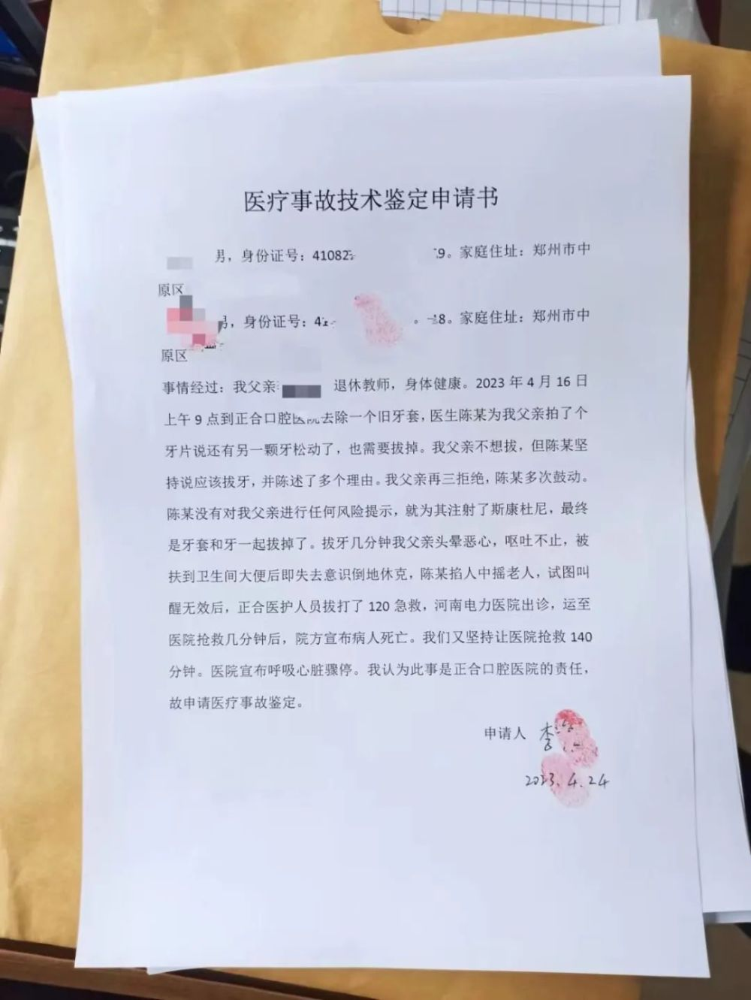

# 郑州一老人拔牙后死亡？中原区卫健委介入调查

4月23日，郑州市民来女士向大河报“邻妹妹帮个忙”求助称， **其父在郑州一口腔医院拔牙后死亡，但院方认为老人存在基础疾病，否认存在过错**
，这令家属难以接受，已向当地卫健委申请医疗事故鉴定。

记者查询发现，涉事医院于2015年曾因使用非卫生技术人员从事医疗卫生技术工作被行政处罚。

拔牙后60岁老人死亡

死者家属来女士介绍，4月16日，其父亲在老伴儿陪同下前往中原区正合口腔医院取牙套，在此过程中医生告知父亲，他牙套旁边的一颗牙齿有松动，建议拔掉。

在院方劝说下，来女士的父亲同意了拔牙，可在术后不到10分钟时间，老人出现呕吐、晕厥等症状，送医抢救无效身亡。

“他拔牙后脸色煞白，当时要下楼缴费，下电梯时抱着垃圾桶就吐了”。来女士告诉记者，当时父亲先被工作人员搀扶到了收费处，随后又前往了厕所。没想到父亲在厕所里直接晕倒，在拨打120后，老人被送医抢救，但因错失最佳急救时间离世。

“我爸就是去取个牙套，没想到竟会天人两隔……”

来女士告诉记者， **其父亲在进行拔牙手术前，医生未告知医疗风险，未填写手术知情同意书，甚至未进行术前抽血检查，稀里糊涂地就进行了手术，存在违规行为** 。

“术后我父亲发生晕厥，口腔医院的工作人员仅采取掐人中方式救助，也没采取有效的急救措施，错失了最佳抢救时间”。来女士认为，
**正合口腔医院作为一家专科医院，医护不懂急救** ，没有应对突发风险的方案也令人匪夷所思。

记者查询发现，根据《医疗纠纷预防和处理条例》，医务人员在诊疗活动中应当向患者说明病情和医疗措施。需要实施手术，或者开展临床试验等存在一定危险性、可能产生不良后果的特殊检查、特殊治疗的，医务人员应当及时向患者说明医疗风险、替代医疗方案等情况，并取得其书面同意。

同时，开展手术、特殊检查、特殊治疗等具有较高医疗风险的诊疗活动，医疗机构应当提前预备应对方案，主动防范突发风险。

4月23日，记者来到正合口腔医院表明来意后， **前台工作人员称“负责人不在”拒绝接受采访**
。在记录记者联系方式后，表示会告知领导。截至发稿，正合口腔医院未作回应。

公开报道显示，正合口腔医院接受其他媒体采访时曾称， **“老人肯定有基础疾病，不可能拔个牙人就没了”。**

但来女士对此说法并不认可，她表示父亲今年60岁，是一名退休教师，每年都有体检，身体健康，最近一次体检是在春节前夕。

中原区卫健委介入

4月23日，记者从中原区了解到，中原区卫健委已对此事开展调查，双方正在进行调解。

但当事家属表示，虽进行了多次调解，但结果仍令人难以接受。

“第一次调解时，院方否认其存在过错，称出于人道主义可以赔偿家属2万元，后来调解改为赔偿15万元，但依然否认他们存在的责任”。

来女士告诉记者，院方否认其存在过错，并提出了申请尸检，家属已同意并签字，但院方拖延，迟迟没有找机构进行鉴定，直到超过尸检有效时间。

记者了解到，尸检最长期限是患者死亡后7日内。参照《医疗事故处理条例》第十八条，患者死亡，医患双方当事人不能确定死因或者对死因有异议的，应当在患者死亡后48小时内进行尸检;具备尸体冻存条件的，可以延长至7日。尸检应当经死者近亲属同意并签字。

医疗事故争议双方当事人可以请法医病理学人员参加尸检，也可以委派代表观察尸检过程。拒绝或者拖延尸检，超过规定时间，影响对死因判定的，由拒绝或者拖延的一方承担责任。

医疗尸检可以由病人家属提出，也可以由医疗机构提出。由医疗机构提出尸体检验要求的，必须取得病人家属的同意。在签订《尸体检验协议书》后，医患双方共同选择由卫生行政部门指定具有尸检资格的鉴定机构。

“因为错过了尸检时间，我们现在向中原区卫健委申请了医疗事故鉴定。”来女士说道。

天眼查APP显示，正合口腔医院工商登记信息为郑州正合口腔门诊部，2015年，曾因使用非卫生技术人员从事医疗卫生技术工作被行政处罚。

律师解读

关于医疗纠纷的处理，河南中豫律师事务所孔健律师认为：“当发生医疗纠纷时，建议医患双方进行协商调解，调解不成的，医患任何一方均可向主管卫生行政部门提出处理请求。卫生行政部门受理后会指派专人妥善保管原始资料，封存有关医疗物品，组织工作人员展开调查，并形成文字材料。调查研究后，卫生部门会给出处理意见，一般会再次协商调解。协商不成的，会建议患者或家属诉诸医疗事故鉴定委员会，进行鉴定。如对鉴定结论不服，可申请复议或鉴定。如仍不服，则申请复议和鉴定。卫生行政管理部门和医疗单位根据鉴定结论和有关法规及制度作出相应处理。如对处理结果仍不服的，可以向当地基层人民法院提起诉讼。当然，双方自行协商、请求卫生行政部门处理都不是必经程序，也可直接向法院提起诉讼。”

本次事件中责任该怎么划分呢？河南中豫律师事务所孔健律师认为，首先要看涉事的口腔医院以及医生有没有相应的资质，如果资质不全，可能会承担行政责任，以及非法行医的刑事责任。其次，对于民事纠纷的责任承担，主要还是依据我国的《民法典》中关于医疗损害责任的相关规定来加以区分。依据第1219条的规定，医务人员在诊疗活动中应当向患者说明病情和医疗措施。需要实施手术、特殊检查、特殊治疗的，医务人员应当及时向患者具体说明医疗风险、替代医疗方案等情况，并取得其明确同意；不能或者不宜向患者说明的，应当向患者的近亲属说明，并取得其明确同意。医务人员未尽到前款义务，造成患者损害的，医疗机构应当承担赔偿责任。“本次医疗事故的责任划分，根据目前的情况可以确定的是医疗机构是要承担一定的民事赔偿责任，但是具体的承担比例，还需要结合医疗行为是否违反诊疗规范、医疗事故与患者死亡结果之间的因果关系程度来综合判定具体的责任承担比例。”

孔健律师表示，依据最高人民法院《关于审理人身损害赔偿案件适用法律若干问题的解释》的相关规定，死者家属可以获得的赔偿项目为：

1.医疗费，2.误工费，3.住院伙食补助费，4.陪护费，5.死亡赔偿金，6.丧葬费，7.被扶养人生活费（如有），8.交通费，9.住宿费，10.精神损害抚慰金。最后，结合医疗机构承担责任的比例来计算应当赔偿的具体数额。

**拔牙存在哪些风险？**

拔牙在很多人眼中虽然是一件不值一提的“小事儿”，但如果操作不慎也会有较大风险。

媒体公开报道显示，2021年5月，广西南宁市，一名5岁半的女孩，一颗大牙因碰撞出现松动。于是家长就带她到医院治疗，没想到拔牙后流血不止，甚至被送进ICU病房，最终被鉴定为脑死亡，不幸离开了人世……

据介绍，拔牙后容易出现并发症，如出血、疼痛、肿胀和感染等，其中造成出血的原因有很多，其中一种情况非常凶险，就是牙槽血管瘤、颌骨中心性血管瘤。患者一般无明显症状，有的患者，尤其是青少年，在牙龈上长了一个松软的、暗红色的肿物，一碰就出血，尤其是搏动性出血，并且邻近的牙齿松动，就要小心颌骨中心性血管瘤。

据九派新闻引新京报报道，首都医科大学附属北京世纪坛医院口腔科主治医师曹佳介绍，拔牙风险大致来源于三方面，一是牙齿周围的组织情况，二是患者全身情况，三是拔牙本身。“术前一定要拍牙片，了解牙齿和神经的相对位置、骨板薄厚，邻近有无重要的解剖学组织等。”

“松动牙牙根处如果存在肿瘤，倘若拔牙前未了解局部情况，可能加重肿瘤问题；患者全身情况包括血压、血糖情况，以及心血管患者的疾病控制情况。”曹佳解释，拔牙本身的风险主要来源于拔除阻生牙、复杂牙，拔牙过程中需要打麻药、去骨，将牙冠、牙根分开拔出，该过程可能存在术中牙槽骨骨折或牙根骨折、牙根进入上颌窦（该情况相对少见）、拔牙后邻牙松动、面部肿胀、开口受限、出血、感染等风险。

**什么情况下不能拔牙？**

**高血压患者**

血压高的人，血压较高的人建议通过药物和改变生活方式的方法将血压控制平稳后再拔牙。

**女性生理期**

生理期的人，处在经期的女性建议月经结束后再拔牙，以免引发大出血或感染问题，孕妇同理。

**糖尿病患者**

糖尿病患者，由于伤口不容易愈合，如果血糖不稳定建议不要拔牙，以免出现感染使病情加重。

**心脏病患者**

心脏病患者，如果半年内出现过心绞痛发作或心肌梗死的人需要注意，很多人在拔牙时会出现恐惧、恐慌心理，容易导致意外发生。

**血液疾病患者**

血液疾病患者，有血液方面疾病，如白血病、恶性贫血等出现凝血障碍或凝血因子缺乏的疾病，也不要拔牙，可能会出现大出血而危及生命。

来源：大河报·豫视频记者 杨光

