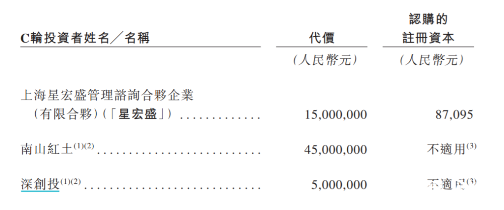
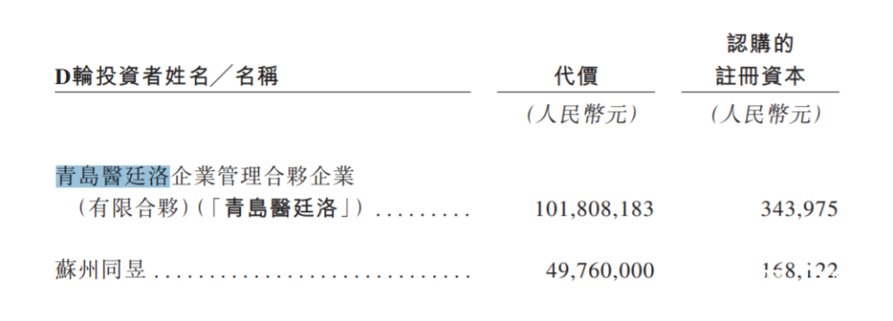

# 靠核酸检测三年大赚近20亿，如今冲刺港股，能成功吗

2023年了，仍有核酸检测概念企业冲刺IPO，不过这一次是港股。

近日，海普洛斯生物科技有限公司(下称“海普洛斯”) 递表港交所，IPO联席保荐人为招银国际融资有限公司及中信证券（香港）有限公司。

此前，在上交所、深交所同时发声强调高度关注涉核酸检测企业的上市申请，坚持从严审核后，翌圣生物、雅睿生物、中翰盛泰等多家新冠检测相关公司IPO被取消审核。

那么，核酸检测收益占比一度高达九成、但在一级市场一直颇受青睐的海普洛斯能否顺利登上港股的舞台？
在3年大赚了近20个亿（人民币，下同）的核酸检测业务如潮水般退去后，投资逻辑是否会生变？

收益依赖核酸检测

公开资料显示，海普洛斯是一家基因检测解决方案供应商，专注于使用分子诊断技术实现精准健康。

海普洛斯的历史可追溯至2014年9月。彼时，深圳市海普洛斯生物科技有限公司（下称“深圳海普洛斯”）成立。继深圳海普洛斯成立及天使轮融资完成后，海普洛斯于2015年10月建立首个独立临床实验室
--深圳医检所，并主要专注于研发。

两年后，即2017年11月，海普洛斯开展基因检测业务。经过数年发展，该司业务快速增长，服务范围扩展至遗传病及病原微生物基因检测。目前，海普洛斯在广东省、江西省及天津市合共运营5个独立临床实验室，提供基因检测服务。

从业务细分领域来说，海普洛斯主要包括3大板块：提供全周期基因检测解决方案、病原微生物基因检测解决方案及研发基因检测解决方案。其中，病原微生物基因检测解决方案主要包括COVID-19检测服务。

而这也是海普洛斯过去3年大部分收益的源头。招股书显示，“于2020年、2021年及2022
年，海普洛斯自COVID-19检测服务产生的收益分别为人民币34.1百万元、人民币359.4百万元及人民币1,533.8百万元，分别占该司于有关年度总收益的34.1%、73.8%及
91.5%。”

海普洛斯也在招股书中坦承，“我们于2020年产生亏损净额人民币66.0百万元。尽管我们于2021年及2022年分录得纯利人民币66.8百万元及人民币157.8百万元，但此主要归因于源自COVID19检测服务的收益。”

这意味着，三年间，核酸检测为海普洛斯带来的收益不仅自三千多万元暴增到15个亿，总和接近20个亿，而且令该司扭亏为盈，公司净利润从2020年的亏损6600万元，到2022年大赚1.58亿元，财务数据增色不少。

此外，2020年—2022年，海普洛斯的核酸检测收益不仅大幅增长，而且占其年度总收益的比例也在持续走高，甚至一度呈倍数增长：从2020年的34.1%，一路攀升到2022年的91.5%。可见，海普洛斯虽有其他两大业务，但目前业务结构的单一性突出。

寻找新的支柱业务

事实上，虽然新冠检测概念公司此前业绩亮眼，但收入的可持续性遭到广泛质疑。

一方面，近两年来，随着行业竞争的加剧，核酸检测的利润空间持续被压缩。海普洛斯招股书显示，“于2020年、2021年及2022年，海普洛斯COVID-19检测服务的毛利分别为人民币20.6百万元、人民币171.3百万元及人民币502.5百万元，以及同期COVID-19检测服务的毛利率分别为60.4%、47.7%及32.8%。”
显然，2022年，该司核酸检测服务的毛利率已近腰斩。

另一方面，随着COVID-19形势的不断发展及转变为地方性流行病，作为公众传染病控制的一部分，检测需求不能与此前相提并论。

据招股书，海普洛斯平均月COVID-19检测量（按管数计）下降至截至2023年2月28日止两个月的754,800管，较截至2022年2月28日止两个月的2,341,600管减少67.8%。这意味着，一年间，核酸检测量暴降近7成。

虽然预期日后将继续为若干政府机构及企业提供有关检测服务，但海普洛斯也坦承，预期2023
年COVID-19检测的收益贡献将大幅下降，将会对公司整体收益及溢利造成重大影响。

监管机构对相关企业冲刺资本市场也持审慎态度。2022年11月，上交所、深交所几乎同时发声，强调高度关注涉核酸检测企业的上市申请，坚持从严审核，尤其是企业的可持续经营能力，并表示重点关注了其核酸检测相关业务与主营业务的关联性、相关收入的可持续性，以及剔除该等业务收入后公司是否仍满足发行上市条件等。

随后，翌圣生物、雅睿生物、中翰盛泰等多家新冠检测相关公司IPO被取消审核。

在新冠检测退场后，海普洛斯正着手改变之前用于COVID-19检测服务的若干设施及检测设备的用途，试图回到曾经的主营业务轨道上—基因检测。

事实上，受对疾病的警觉性提升以及精准医学所带动等多方面因素的影响，中国基因检测市场发展兴旺。根据灼识咨询资料，中国基因检测市场预期由2021年起以复合年增长率22.2%增长至2030年的人民币1,481亿元。

特别是，海普洛斯参与的各主要基因检测市场分部有巨大增长潜力。根据灼识咨询资料，中国整体肿瘤学管理基因检测市场预期自2021年以复合年增长率36.2%增长以达至2030年的人民币707亿元。

市场空间颇具想象，但现实有点“骨感”，至少在目前是如此。以海普洛斯引以为傲的全周期基因检测解决方案为例，该板块收益由“2020年的人民币44.6百万元增加96.5%至2021年的人民币87.7百万元，再大幅增至2022年的人民币93.0百万元。”

虽然该业务收益大幅增长，但三年加起来总金额才两个多亿，要成为海普洛斯业绩新的支柱，尚需时日。

未来投资逻辑是否生变

不过此前，在一级市场上，海普洛斯颇受青睐，几乎每年均能募集到资金。但早年募资金额并不大，一般在数千万元上下，不超过一个亿。

具体来看，2015年，海普洛斯建立首个独立临床实验室－深圳医检所，并与医院携手启动中国癌症测序项目，对万人进行早期癌症筛查，是中国首个大型早期癌症筛查项目。这一年，该司完成天使轮融资，募集1000万元。

2016年，深圳海普洛斯获深圳市科技创新委员会认定为高新技术企业。海普洛斯完成A轮融资，募集5000万元。

2017年， 海普洛斯在江西省建立独立临床实验室，开始运营海普洛斯基因组中心。完成A+轮融资，募集7750万元。

2018年，海普洛斯基因检测业务开始商业化。完成B轮融资，募集1亿元。

2020年，海普洛斯开始提供病原微生物基因检测解决方案，主要为COVID-19 检测服务，并完成B+轮融资，募集1500万元。

但在商业化加速后，海普洛斯募集资金数额走高。2021年与2022年，海普洛斯募资金额均超过了一个亿：2021年，海普洛斯首个IVD产品获批，同年完成C轮融资，募集约1.8亿元。2022年，完成在岸D轮融资，募集约1.5亿元。

数轮融资主体中，不乏深创投、软银等知名投资机构，并分别于C轮、D轮进入。

如今，在核酸检测业务“横空出世”又匆匆退场后，海普洛斯原来的投资逻辑是否生变，是个未知数。不过，据招股书，2023年海普洛斯已完成离岸D轮融资，“募集2百万美元”。

采写：南都湾财社 记者王玉凤 实习生郭可儿

