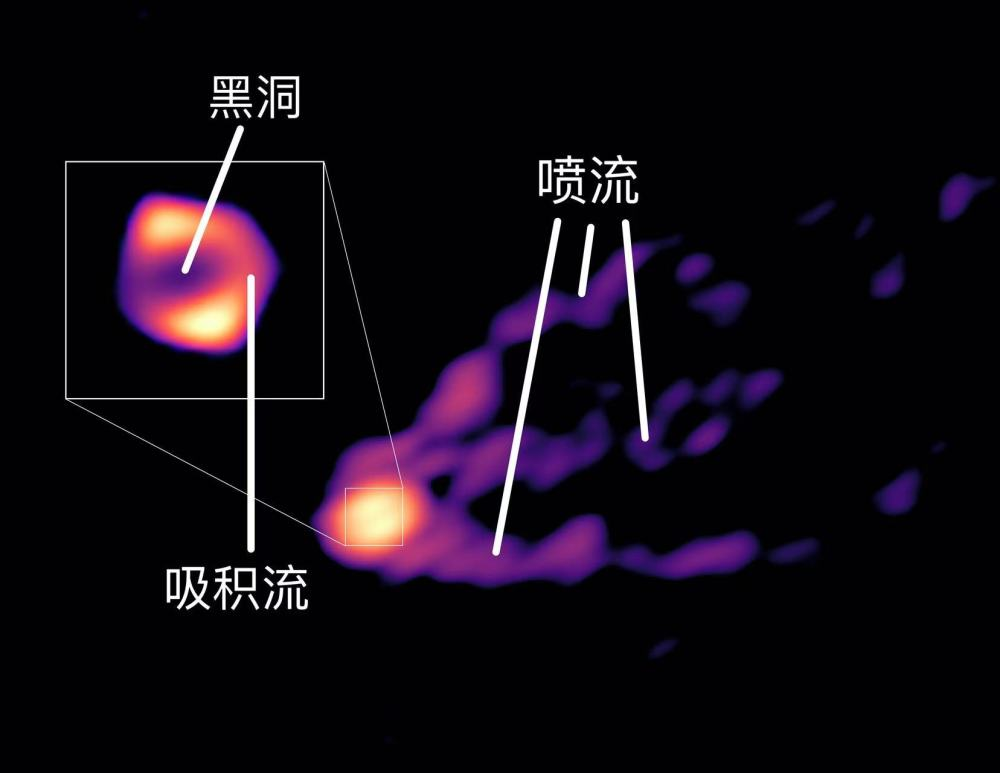
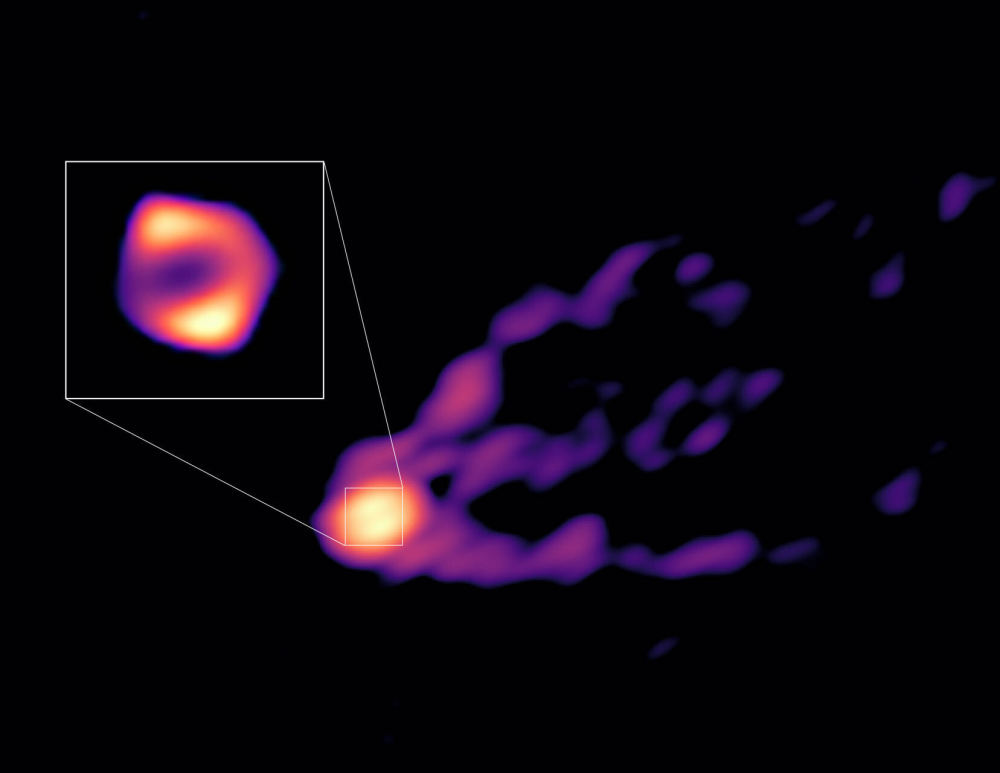
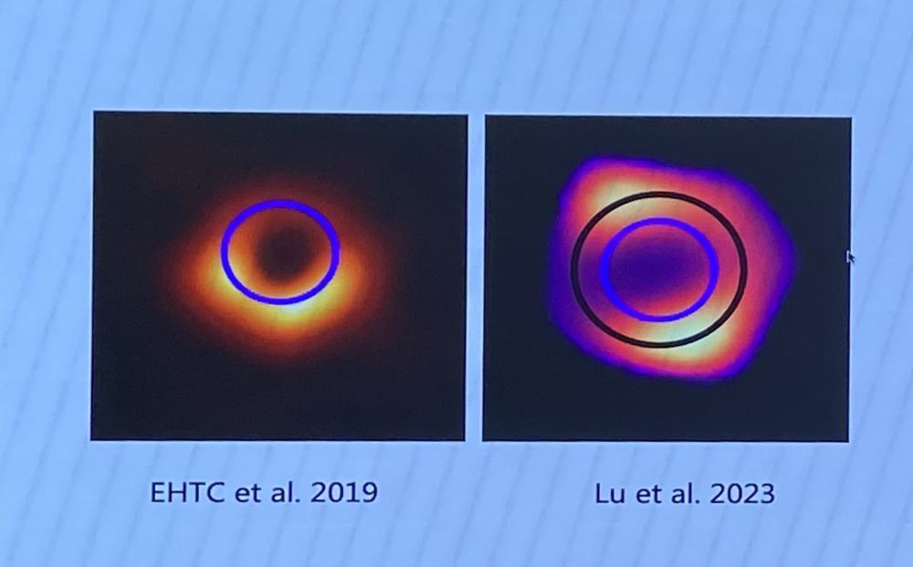

# 黑洞“全景”照诞生：阴影和强大喷流首次合影，“甜甜圈”看着更大

研究人员首次在3.5毫米波长对M87星系中心超大质量黑洞（M87*）周围的环状结构进行成像，观测到这一黑洞在3.5毫米的图像也呈现“甜甜圈”形态，比此前“事件视界望远镜”在1.3毫米观测到的“甜甜圈”大了近50%，并且看到从“甜甜圈”向远处延展的“尾巴”，它是黑洞的喷流。

截至目前人类已有两个颜色的黑洞照片，研究人员希望未来从颜色和时间维度上得到更多黑洞图像。相比于“单色黑洞”，在不同观测波长上拍摄“彩色黑洞”照片有助于理解黑洞本身以及它和周围环境的关系。拍摄“动态黑洞”将在空间维度上解锁时间维度，让人类能够全方位观测和理解黑洞。

研究人员首次在3.5毫米波长对M87星系中心超大质量黑洞（M87*）周围的环状结构进行成像。在这张照片中有黑洞、黑洞周围的吸积流、从吸积盘附近延伸向远处的喷流。

由中国科学院上海天文台研究员路如森领导的国际研究团队利用毫米波段开展的新观测，首次将著名射电星系Messier
87（M87星系）的黑洞阴影以及其周围吸积流和喷流呈现在同一张照片之中。相关成果4月26日发表在国际顶级学术期刊《自然》杂志上。

此前，人们认为用地球上的望远镜在3.5毫米观测波长上不会看到“甜甜圈”形态的黑洞。但此次研究人员首次在3.5毫米波长对M87星系中心超大质量黑洞（M87*）周围的环状结构进行了成像，观测到这一黑洞在3.5毫米的图像也呈现“甜甜圈”形态，比此前“事件视界望远镜”（Event
Horizon Telescope,
EHT）在1.3毫米观测到的“甜甜圈”大了近50%，它来自于黑洞周围的吸积流。并且看到从“甜甜圈”向远处延展的“尾巴”，它是黑洞的喷流。

如果说EHT拍摄的照片是黑洞的“特写”，能看到亮环围绕着中间的阴影。此次拍摄到的是黑洞的“全景”，在这张照片中有黑洞、黑洞周围的吸积流、从吸积盘附近延伸向远处的喷流。这张新照片作为EHT照片的拓展，充分展现了黑洞和它周围环境的关系。

黑洞不再“孤单”：新波段下的黑洞和喷流全景图

在引力极强的时空区域，任何东西甚至是光（电磁波）都无法逃逸。因为光无法逃逸，所以称之为“黑”，因为物质无法逃逸，所以称之为“洞”。黑洞没有表面，一般用事件视界面作为边界，区分黑洞内部和外部。它标识出“无返回区”，即一切穿过事件视界的东西永远不可能逃逸。

喷流是一种天文现象，看上去像一条火焰柱。人们将具有定向、狭长、高速的电离物质外流称为喷流。理论学家认为，黑洞不仅在“吃”（吸积物质），同时也在“吐”（外流）。如果“吐”出的物质速度快、方向性好，自然就形成了所观测到的喷流。但理论学家至今也没能非常明确地解释黑洞与喷流的关系，观测工作也在一步步试图解开这个谜团。

M87*黑洞是目前宇宙中所知质量最大的黑洞之一，约65亿倍太阳质量，它位于M87星系——室女座星系团中央巨椭圆星系的中心，距离地球约5500万光年。M87星系有着长达5000光年的明亮喷流，而M87*正是喷流的源头。给M87*拍照可以帮助我们理解黑洞附近的环境，观察黑洞周围的物质是如何绕转、掉进黑洞或被喷出的，进而研究黑洞和喷流的关系。

由中国科学院上海天文台研究员路如森领导的一个国际研究团队利用毫米波段开展新观测，目标是研究喷流的形成，对黑洞的吸积盘（一种由弥散物质组成的围绕中心体转动的结构，它是包围黑洞或中子星的气体盘）内区成像探测。研究人员首次对著名的射电星系M87的黑洞阴影，以及其周围显示落入中央黑洞的物质的环状结构和强大的相对论性喷流一同进行了成像。

在3.5毫米波长所观测到的M87*黑洞图像，其致密的核心首次在该波段被分解并在高分辨率条件下呈现为环状结构。

这张新照片于2018年4月14日至15日拍摄，经复杂的数据处理和成图过程，及反复验证和确认结果，最终在五年后呈现。这张照片中，黑洞不再“孤单”，研究人员探测到了黑洞、黑洞周围的吸积流、从吸积盘附近延伸向远处的喷流，图像首次表明中央超大质量黑洞附近的吸积流与喷流起源之间的联系。

上海天文台天文学家、中德马普伙伴小组组长、论文第一作者路如森说，“以前我们曾在单独的图像中分别看到过黑洞和喷流，但现在我们在一个新的波段拍摄了黑洞和喷流的全景图。”黑洞周围的物质在吸积过程中落入黑洞，但从来没有人直接对它成像。“我们之前看到的环状结构现在在3.5毫米波长下变得更大、更厚。这表明在新的图像中可以看到落入黑洞的物质产生了额外的辐射。这使得我们能够更全面地了解黑洞周围的物理过程。”路如森表示。

此次观测和人类首张黑洞照片中的黑洞为同一个黑洞，均为M87*。为何本次拍摄到的喷流在“事件视界望远镜”拍摄的人类首张黑洞照片中没有看到？路如森表示，一方面“事件视界望远镜”的视场比较小，只能拍摄到黑洞的“特写”照片，离黑洞稍远一些的喷流没能进入镜头。而本次拍摄用的望远镜比“事件视界望远镜”的视场大很多，既能看到黑洞周围的发光物质，也能看到喷流。另一方面，喷流的亮度随着观测波长变化。喷流在本次观测采取的3.5毫米观测波长上比较明亮，而在“事件视界望远镜”采取的1.3毫米观测波长上稍微暗一些，这也可能是“事件视界望远镜”没有拍到喷流的原因。

16台射电望远镜观测，测得环状结构直径大50%

此次观测结果来自于中国学者领衔的国际合作项目，成员来自17个国家和地区、64家研究单位，共计121位。相比于拍摄人类首张黑洞照片的“事件视界望远镜”联合了8台望远镜，本次拍摄是将16台射电望远镜连起来，组成一台口径等效于地球直径的望远镜。

这16台射电望远镜分别为全球毫米波甚长基线干涉测量阵列（Global mm-VLBI
Array，GMVA）的14台望远镜，位于智利的阿塔卡马大型毫米波/亚毫米波阵列（Atacama Large
Millimeter/submillimeter Array，ALMA），以及位于格陵兰岛的格陵兰望远镜（Greenland Telescope，GLT）。

路如森表示，阿塔卡马大型毫米/亚毫米阵列（ALMA）和格陵兰望远镜（GLT）的加入大大增强了GMVA的成像能力，提高了这个洲际望远镜阵列的分辨率和灵敏度。尤其是阿塔卡马大型毫米/亚毫米阵列，它是毫米波VLBI（甚长基线干涉测量，Very
Long Baseline
Interferometry）观测中真正的游戏规则改变者，使得南北方向分辨率增加4倍，并可以“锚定”整个阵列。“从历史脉络来讲，北半球比较发达，建了很多望远镜，但结果是在北半球的东西方向建了很多望远镜，南北方向上，南边很缺望远镜，而我们这种成像需要各个方向都有望远镜分布。”

GMVA测得的环状结构直径为64微角秒，相当于月球上的宇航员回望地球时看到的一个13厘米的环形补光灯大小。这个直径比“事件视界望远镜”此前在1.3毫米观测中所看到的环状结构要大50%，符合对该区域相对论等离子体辐射的预期。

左为2019年4月10日公布的人类历史首张黑洞照片，右为2023年4月26日公布的同一个黑洞的照片，环状结构在3.5毫米波长下变得更大、更厚。

位于德国波恩的马普射电天文研究所（MPIfR）天体物理学家托马斯·克里鲍姆（Thomas
Krichbaum）说，“现在我们可以看到喷流是如何从中央超大质量黑洞周围的环状结构中出现的，而且我们现在也可以在另一个波段测量黑洞周围环状结构的直径。”

M87的射电辐射由高能电子和磁场的相互作用产生，这种现象被称为同步辐射。在3.5毫米波长，新的观测结果揭示了有关这些电子的位置和能量的更多细节。它们还告诉研究人员关于黑洞本身的一些性质：它不是“很饿”，它消耗物质的速度很低，只将其中一小部分转化为辐射。为了了解这个更大、更厚的环的物理来源，研究人员使用计算机模拟来测试不同情况，最终得出结论，亮环的较大范围与吸积流有关。

日本国立天文台的Kazuhiro
Hada补充说：“我们还在数据中发现了一些令人惊讶的事情，在靠近黑洞的内部区域，辐射的宽度比我们预期的要宽。这可能意味着黑洞周围不仅仅有气体落入，也可能有一股
‘风’吹出来，造成黑洞周围的湍流和混乱。”

M87星系探索史：未来希望得到“彩色黑洞”和“黑洞电影”

1781年，法国天文学家夏尔·梅西耶发表了著名的梅西耶星表，里面包含103个星云状的天体，并以字母M加数字为这些天体命名。M87就是其中之一，其含义为梅西耶星表中的第87个天体。

1918年，美国天文学家希伯·柯蒂斯首次观测到M87的喷流，这也是人类历史上第一次观测到天体中的喷流。他看到“一束奇怪的直射线，从一片朦胧的光斑中心发出”。后来，随着对宇宙认知的拓展，人们逐渐意识到M87并不是星云，而是一个星系。

1947年，人们观测到M87位置处的射电源，命名为室女座A。随后证实室女座A的射电信号就来自于M87。于是M87成为知名的射电星系，吸引了无数射电望远镜的目光。

M87星系中心超大质量黑洞（M87*）的图像。上方为2017年4月11日的图像，下方三个图为M87*在2017年4月5日、6日和10日的图像。图中心的暗弱区域即为“黑洞阴影”，周围的环状不对称结构是由于强引力透镜效应和相对论性射束效应所造成的。

直到2017年，“事件视界望远镜”成功拍摄到了M87星系中心超大质量黑洞（M87*）的照片。这张照片也是人类历史上的首张黑洞照片，于2019年4月10日正式面世。照片显示M87*长得像个“甜甜圈”，外面一圈亮环，围绕着中间的阴影。

但对M87星系的探索并没有结束，未来进一步的观测和强大的望远镜阵列将继续揭开它的神秘面纱。韩国天文和空间科学研究所的Jongho
Park说：“未来毫米波观测将研究M87*黑洞的时间演变并且将通过结合不同颜色的射电光的图像来获得M87中心黑洞区域的多色视图。”

上海天文台台长沈志强研究员表示，为了揭示M87中央超大质量黑洞及其相对论性喷流的形成、加速、准直传播的物理机制之谜，需要拍摄更多色的高质量图像，包括在0.8毫米或更短的亚毫米波波长的黑洞照片，以及在长至7.0毫米波长的黑洞和喷流的全景图像。

路如森表示，在新的波段对黑洞首次成像标志着朝多色黑洞迈出了一小步，截至目前人类已经有两个颜色的黑洞照片。“未来我们希望得到更多颜色的黑洞图像，我们也希望给黑洞拍动画，从颜色和时间维度上得到更多的黑洞图像，不但让黑洞
‘靓’起来，也让它动起来。”但目前得到更多颜色的黑洞图像的问题仍是望远镜阵列不够多。

据中国科学院上海天文台消息，下一步的目标是与“事件视界望远镜”一起拍摄“彩色黑洞”，所谓“彩色”就是在不同的观测波长上给黑洞拍照。研究人员将拍摄更清晰的3.5毫米照片，结合未来“事件视界望远镜”拍摄的更清晰的1.3毫米照片，未来下一代“事件视界望远镜”拍摄的0.8毫米照片，以及在更遥远的未来空间VLBI拍摄的更短波长的照片，人类可以得到黑洞的“彩色照片”。由于不同波长的电磁辐射揭示了黑洞附近不同的物理过程，相比于“单色黑洞”，“彩色黑洞”将带给我们更多信息，帮助我们更好的理解黑洞本身，以及它和周围环境的关系。

黑洞并不是静止的，它每时每刻都在和周围环境相互作用，因此不同时刻看它，黑洞是不一样的。拍摄“动态黑洞”将在空间维度上再解锁时间维度，让人类能够全方位观测和理解黑洞。对于M87*，由于它变化缓慢，需要长时间的监测来拍摄它的变化。“事件视界望远镜”在过去几年进行了多次连续成像观测，未来五年也有持续的观测计划。这些观测数据将呈现M87*在10年时间跨度上的电影。针对快速变化的银心黑洞，目前EHT的望远镜分布不足以实现“快拍模式”的动态摄影，“丢帧”严重。但随着未来几年更多望远镜的加入，将能达到所需时间分辨率，拍到“黑洞电影”。

