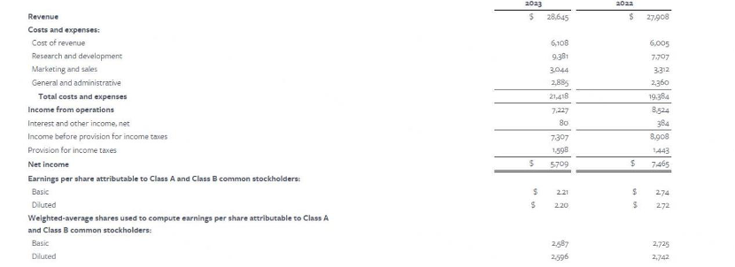
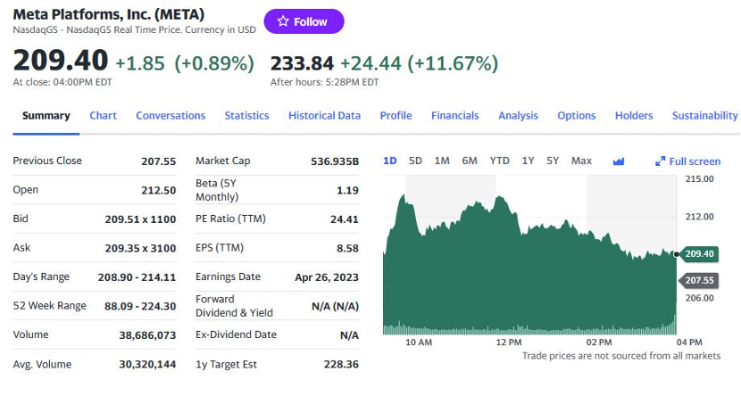

# Meta第一季度业绩超预期 但元宇宙部门仍巨亏40亿美元

**划重点**

  * _1_ Meta第一季度营收为286.45亿美元，同比增长3%；净利润57.09亿美元，同比下滑24%，但其营收和净利润均高于分析师平均预期。
  * _2_ Meta第一季度现实实验室(RL)收入3.39亿美元，低于去年同期的6.95亿美元；当季运营亏损39.92亿美元，相比之下上年同期的运营亏损为29.6亿美元。
  * _3_ Meta预计，2023年全年的总支出将在860亿至900亿美元之间，资本支出将在300亿至330亿美元之间，与之前的估计持平。
  * _4_ Meta预计2023年第二季度的总收入将在295亿至320亿美元之间，而分析师普遍预计为295亿美元。

腾讯科技讯
4月27日消息，美国当地时间周三，Facebook母公司Meta在美股盘后发布了截至3月31日的2023年第一季度财报。财报显示，Meta第一季度营收286.45亿美元，同比增长3%；净利润57.09亿美元，同比下降24%；摊薄后每股收益为2.2美元，同比下降19%。财报发布后，Meta股价在盘后交易中飙升了11%以上。

一、Meta第一季度财报业绩

**1、营收、净利润均高于预期**

Meta第一季度营收为286.45亿美元，与去年同期的279.08亿美元相比增长3%，高于分析师平均预期的276.5亿美元；

Meta第一季度净利润57.09亿美元，与去年同期的74.65亿美元相比下降24%，高于分析师平均预期的52亿美元；

Meta第一季度每股收益为2.2美元，与去年同期的2.72美元相比下降19%，高于分析师平均预期的2.03美元；

Meta第一季度毛利率为25%，低于去年同期的31%；

Meta第一季度运营利润为72.27亿美元，与去年同期的85.24亿美元相比下降15%；

**2、按业务划分**

Meta第一季度广告收入为281亿美元，而去年同期为270亿美元，低于分析师普遍预期的283亿美元；

Meta第一季度应用家族（其中包括Facebook、
Instagram、WhatsApp和Messenger等服务）收入283亿美元，而去年为272亿美元；当季运营利润112.19亿美元，相比比之下上年同期为114.84亿美元；

Meta第一季度现实实验室(RL)收入3.39亿美元，低于去年同期的6.95亿美元；当季运营亏损39.92亿美元，相比之下上年同期的运营亏损为29.6亿美元，高于分析师普遍预期的亏损31.9亿美元；

Meta第一季度应用家族日活跃人数(DAP)平均为30.2亿，与上年同期的28.7亿相比增长5%；月活跃人数(MAP)为38.1亿人，较上年同期的36.4亿增长5%；

Meta第一季度Facebook日活跃用户(DAU)平均为20.4亿，较上年同期的19.6亿增长4%；月活跃用户(MAU)为29.9亿，较上年同期的29.4亿增长2%；

Meta第一季度应用家族提供的广告印象同比增长了26%，而去年同期增幅为15%。同时，每条广告的平均价格同比下降了17%，而去年同期下降了8%；

**3、成本与支出**

Meta第一季度总成本和费用为214.2亿美元，与去年同期的193.84亿美元相比增长10%。其中，与重组相关的费用达11.4亿美元。另外，

——营收成本为61.08亿美元，高于上年同期的60.05亿美元；

——研发开支为93.81亿美元，高于上年同期的77.07亿美元；

——营销和销售开支为30.44亿美元，低于上年同期的33.12亿美元；

——总务与管理支出为28.85亿美元，高于上年同期的23.6亿美元。

**4、其他财报要点**

Meta第一季度资本支出（包括融资租赁本金支付在内）为70.9亿美元，高于去年同期的55.5亿美元；

Meta第一季度回购了价值92.2亿美元的A类普通股，低于去年同期的93.9亿美元。截至2023年3月31日，该公司有417.3亿美元可用于回购股票，而去年同期为294.1亿美元；

截至2023年3月31日，Meta员工人数为77114人，与截至2022年3月31日的77805人相比减少了1%。截至2023年3月31日，几乎所有受2022年11月宣布裁员影响的员工都不再计入员工总数中。此外，受2023年裁员影响的员工将继续计入截至2023年3月31日报告的员工总数中。

**5、现金流**

截至2023年3月31日，Meta的现金、现金等价物以及限制性现金共为124.2亿美元，而截至2022年3月31日为153.53亿美元。其中，现金及现金等价物为115.51亿美元，而截至2022年3月31日为148.86亿美元。

截至2023年3月31日，Meta的自由现金流为69.11亿美元，而截至2022年3月31日为85.28亿美元。

截至2023年3月31日，Meta的现金、现金等价物以及有价证券共为374.4亿美元，长期债务为99.2亿美元。

**6、高管点评**

Meta创始人兼首席执行官马克·扎克伯格表示：“我们第一季度表现不错，我们的社区还在继续增长。我们的人工智能努力正在推动我们的应用和业务取得良好成果。我们也在变得更有效率，这样我们就可以更快地开发出更好的产品，并把自己放在一个更有利的位置上，以实现我们的长期愿景。”

二、重组

在2022年，Meta采取了几项措施来追求更高的效率，并重新调整其业务和战略重点。截至2023年3月31日，Meta已经基本完成了2022年的员工裁员，同时继续评估设施整合和数据中心重组计划。Meta在2023年第一季度产生了6.21亿美元的额外税前重组费用。

在2023年3月，Meta宣布了三轮裁员计划，以进一步缩小公司规模，在应用家族(FoA)和现实实验室(RL)部门裁员约1万人。与这些裁员相关，Meta预计将产生约10亿美元的税前遣散费和相关人员成本，其中5.23亿美元将在2023年第一季度确认，其余费用将在2023年底大量入账。

在2023年第一季度，FoA部门记录的总重组费用为9.34亿美元，RL部门记录的总重组费用为2.1亿美元。扣除这些费用，2023年第一季度，Meta的营业利润率将提高4个百分点，摊薄后每股收益将提高0.44美元。

三、业绩展望

Meta预计2023年第二季度的总收入将在295亿至320亿美元之间，而分析师普遍预计为295亿美元。这份指引假设，基于当前汇率，第二季度的外汇不利因素将使总收入同比增长不到1%。

Meta预计2023年全年的总支出将在860亿至900亿美元之间，这是该公司在3月份所提供预测基础上进行的更新。这一前景包括与设施整合费用、遣散费和其他人事费用有关的重组成本30亿至50亿美元。Meta还预计，到2023年，现实实验室的运营亏损将继续增加。

Meta预计资本支出将在300亿至330亿美元之间，与之前的估计持平。这一前景反映了Meta正在构建支持广告、推荐和Reels的人工智能努力，以及该公司对生成式人工智能（AIGC）计划的投资增加。

如果美国税法没有任何变化，Meta预计2023年全年的税率将在20%左右。

此外，Meta会继续密切关注现行的监管进展，预计爱尔兰数据保护委员会(IDPC)将在5月份就此前披露的有关Facebook跨大西洋数据传输欧盟/欧洲经济区用户数据的调查发布决定，包括暂停此类传输的命令和罚款。Meta在与大西洋两岸的政策制定者进行的磋商继续表明，拟议中的新欧盟-
美国关系将继续保持稳定。数据隐私框架将在暂停此类传输的截止日期之前全面实施，但Meta不排除无法及时完成的可能性。Meta还将评估IDPC的决定是否以及在多大程度上影响其数据处理业务，包括在新的数据隐私框架生效之后。

四、财报解析

Meta第一季度的营收较上年同期的279.1亿美元增长了3%。得益于广告业务持续改善，这是该公司近一年来首次实现营收增长，这也帮助结束了Meta连续三个季度营收同比下滑的局面。

严峻的经济环境、限制个性化广告的法规越来越多，以及苹果公司2021年改变广告追踪功能的影响，都给数字广告市场带来了巨大压力。此外，Meta还面临着来自TikTok日益激烈的竞争，后者今年2月在美国的月活跃用户达到1.5亿。

与Meta在2022年第四季度公布的4.5%营收下滑相比，3%的增长有所改善。Meta在人工智能方面投入了大量资金，以改进其广告定位系统。这些在人工智能领域的努力，以及转向不那么依赖从其平台收集用户数据的广告形式，对该公司的反弹计划至关重要。据悉，Meta在应对苹果隐私改革方面取得了进展，该规定限制了Meta收集用户在其平台外活动信息的能力。

Meta表示，如果没有在3月份宣布的三轮裁员所带来的重组费用，其营业利润率将高出4个百分点。此次裁员将于5月份完成，预计裁员人数将达到1万人。此前，Meta在11月份裁员了1.1万人。

扎克伯格正在通过削减成本缩减公司规模，而他的投资也在不断亏损。其中，负责为元宇宙开发虚拟现实和增强现实技术的现实实验室部门出现了39.9亿美元的运营亏损。该部门在本季度创造了3.39亿美元的收入，对于一家每个季度能带来数百亿美元广告收入的公司来说，这依然是一个微不足道的数字。

这些数据显示，与上季度相比，情况已经有所改善，当时现实实验室的营收为7.27亿美元，运营亏损达42.8亿美元。去年全年，现实实验室的运营亏损为137.2亿美元，营收仅为21.6亿美元，这突显出VR和AR技术尚未成为主流。

研究公司NPD
Group的数据显示，截至去年12月份，美国VR头盔的销量在2022年同比下降了2%，因为假日季节未能引发新的购买热潮。今年3月，Meta下调了其Quest
2 VR头盔以及高端产品Quest Pro的价格。Quest 2现在的售价为430美元，比以前便宜了70美元，而Quest
Pro的价格则从原价下降了500美元，降至1000美元。

泄露的内部文件显示，Meta面向消费者的旗舰级元宇宙产品Horizon
Worlds的业绩也没有达到内部预期。该公司最初设定的目标是，到2022年底，该服务的月活跃用户达到50万人，但去年10月份的数据不到20万。这一数字在1月份上升至略高于20万，当时许多消费者购买了新的Quest头盔。

五、股价飙升逾11%

美国当地时间周三，Meta股票在纳斯达克证券市场常规交易中报收于每股209.4美元，上涨0.89%；但在财报发布后，该股在盘后交易中飙升了11.67%以上，截止本文发稿，Meta每股交易价格为233.84美元。

自扎克伯格2月份宣布2023年将是公司的“效率年”以来，Meta股价一直呈上升趋势，盘后反弹进一步提振了该股。该公司股价在2022年下跌了三分之二，但在财报发布之前，该股今年迄今已经累计上涨了74%。

在过去52周，Meta最高股价为224.3美元，最低股价为88.09美元。按照周三收盘价计算，Meta当前市值约为5369亿美元。（金鹿）

