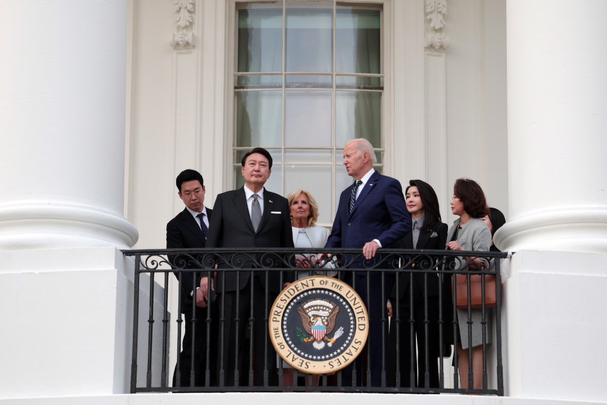
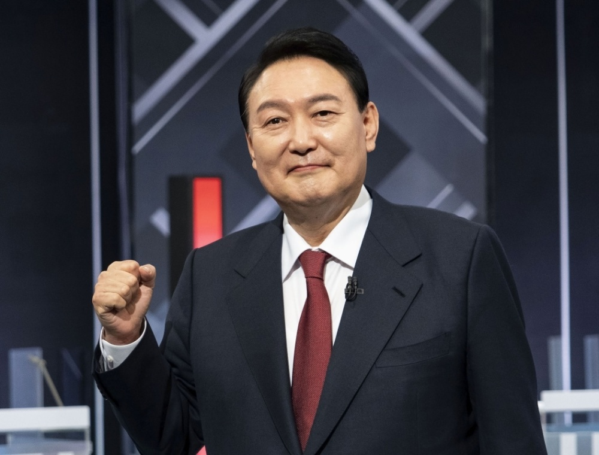

# “史无前例”！美韩新设“核咨商小组”，已双双违反“核不扩散”

_▲当地时间2023年4月25日，美国首都华盛顿，正在美国进行国事访问的韩国总统尹锡悦携其夫人与美国总统拜登和第一夫人吉尔·拜登在白宫阳台上观景。图/IC
photo_

据韩国媒体报道，当地时间4月26日，韩国总统室发言人李度运在华盛顿召开记者会时发布消息称，韩美领导人在当天举行的会谈上发表的《华盛顿宣言》，写入了加强“延伸威慑”，宣言还将写入韩美新设“核咨商小组”的方案，借此覆盖情报共享、共同策划、共同执行的“延伸威慑”机制。

对此，美国《华尔街日报》援引美国官员的话报道称，“美国战略核导弹潜艇几十年来将首次访问韩国”。韩国《朝鲜日报》则报道称，美国为韩国提供“核保护伞”明文化，“这是史无前例的事”，体现了“美国保护韩国的强烈意志”。

这似乎意味着，韩国拿到了美国“核保护伞”的书面承诺。尤其是，韩媒和美媒均报道认为，美韩“核咨商小组”与北约核计划小组有很多相似之处。而“延伸威慑”“核咨商小组”“北约”，这一系列关键词，听着就充满了危险，需要警惕。

那么，美韩两国这次“史无前例”地搞的这个新机制，到底是怎么出台的，里面又装着些什么东西呢？

新机制是“延伸威慑”的枢纽

所谓“延伸威慑”，是2006年朝鲜进行第一次核试验后，美国向韩国作出的新安全承诺，但当时只是提出了这么一个概念。

美国之所以提出这么一个概念，是因为当时美国对韩国没有核保护方面的机制安排，无论是核保护伞还是北约式的核共享。

在1978年至1990年期间，美国曾承诺对韩国提供“核保护伞”，并一度在韩国部署了大量战术核武器，但在1990年后分批全部撤走。

一直到2016年，美国以朝鲜进行第五次核试验为由，终于将“延伸威慑”实体化。当年美韩设立了“延伸威慑战略磋商机制”，美韩两国的外交部、国防部副部长参加了这个机制。

不过，美韩的“延伸威慑战略磋商机制”只存活了不到两年——2018年，在文在寅任内，韩朝关系一度大幅改善。5个月之内，文在寅就与朝鲜最高领导人金正恩分别在板门店韩方一侧、朝方一侧和平壤举行了三次会晤，
“延伸威慑”就没人再提了。

_▲2022年3月2日，尹锡悦在韩国首尔参加总统竞选电视辩论。图/新华社_

在尹锡悦担任韩国总统后，对朝鲜改持强硬立场。今年1月，尹锡悦首次提出，如果朝鲜核危机进一步加剧，韩国应该“自主拥核”。

“自主拥核”论提出后，在韩国社会得到了部分民众的支持——盖洛普3月17日至3月22日的最新民调显示，韩国受访者赞成韩国拥核或北约式核共享的人都超过了50%。

不过，尹锡悦的“自主拥核”论没有得到拜登政府的响应。拜登政府认为，韩国不可“自主拥核”，作为替代方案，“延伸威慑”再次复活。

而韩美新设立的“核咨商小组”，显然是重新复活的“延伸威慑”战略的新枢纽。此前，美国为日本和北约成员等30多个国家提供“核保护伞”，却从未通过单独文件，也因此《华盛顿宣言》被韩媒称为“史无前例”。

与北约“核计划小组”不一样

对于韩美这个“核咨商小组”，韩媒和美媒都认为，其与北约1966年成立的“核计划小组”有许多相似之处。不过，美国政府高官4月26日又特意强调两者并不一样。

北约“核计划小组”是北约核共享政策的产物。北约核共享的核心，是参与该机制的北约成员国，接受美国在其领土上部署、储存核武器，并由自己的武装部队在战时负责运送这些核武器。

北约“核计划小组”的任务，是就核武器相关运作进行磋商，共同维护运载核武器所需的设备，特别是兼具核常双重打击能力的飞机（DCA）。

_▲当地时间2023年4月24日，美国首都华盛顿白宫，美国总统拜登在一场活动上讲话。图/新华社_

目前，拜登政府不同意韩国“自主拥核”，作为替代方案，在这次尹锡悦访美期间的4月26日，宣布了“拟向韩国派遣部署包括弹道导弹核潜艇在内的强大军事技术”。

这意味着，韩美 “核咨商小组”的重要职能，很可能是共同协商维护核潜艇。这与北约“核计划小组”共同维护DCA的职能其实一样，只不过一个是在海底，一个是在天上。

与北约“核计划小组”最大的不同是，韩美“核咨商小组”中的韩方权重，大概比“核计划小组”中的北约非核成员国低。

北约非核成员国有权与美国共同讨论核武相关政策，而美方官员明确指出，韩方不能够干预美方的核武使用决策。这也意味着，新机制虽然有利于韩美磋商，但韩国话语权依然有限，美国的相关承诺也因此仅具象征意义。

美韩已双双违反“核不扩散”

可以肯定，美韩两方此次在核武方面的新动作，双双违反了《不扩散核武器条约》。

韩国是《不扩散核武器条约》的无核武器缔约国，而条约规定无核缔约国不能接受有核国家部署核武器，现在韩国同意美国在朝鲜半岛部署核潜艇，形同违约。

至于美国，推出北约式核共享这么多年以来，就一直有批评认为违反了《不扩散核武器条约》的规定义务。

就算不寻章摘句讲道理，一个很容易明白的事实是，与美国核共享的国家，很可能都降低了自身的安全。因为，用美国核武瞄准、威慑他国，一定会被他国特别是有核国家瞄准。

此外，用核武这样的手段加大威慑，也违反了国际社会曾经普遍接受的“安全不可分割原则”，即你自己的安全，不能建立在加剧了他国不安全感的基础上。

自上世纪80年代以来，美国再没有在朝鲜半岛派遣部署核潜艇；自上世纪90年以来，美国再没有把“延伸威慑”战略发展到恢复对韩国提供“核保护伞”的地步。而今天，这一切正在“史无前例”地发生。

与此同时，日本也在积极讨论与美国核共享。朝鲜半岛乃至东北亚的安全风险，都会因此骤然升高。韩国此次在核议题上的积极动作，是强化还是会弱化了自身安全，时间终会给出答案。

撰稿 / 徐立凡（专栏作家）

编辑 / 何睿

校对 / 赵琳

