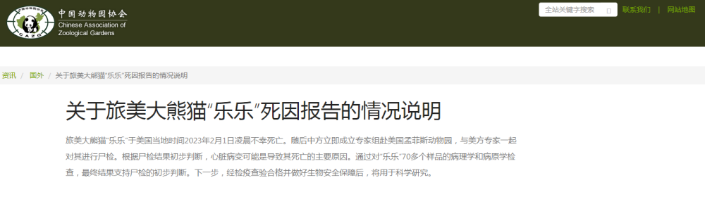

# 中国动物园协会发布关于旅美大熊猫“乐乐”死因报告的情况说明

来源：中国动物园协会

旅美大熊猫“乐乐”于美国当地时间2023年2月1日凌晨不幸死亡。随后中方立即成立专家组赴美国孟菲斯动物园，与美方专家一起对其进行尸检。根据尸检结果初步判断，心脏病变可能是导致其死亡的主要原因。通过对“乐乐”70多个样品的病理学和病原学检查，最终结果支持尸检的初步判断。下一步，经检疫查验合格并做好生物安全保障后，将用于科学研究。

