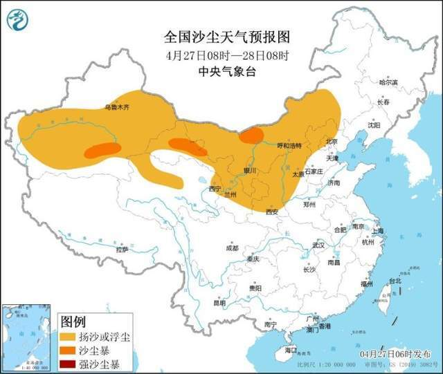
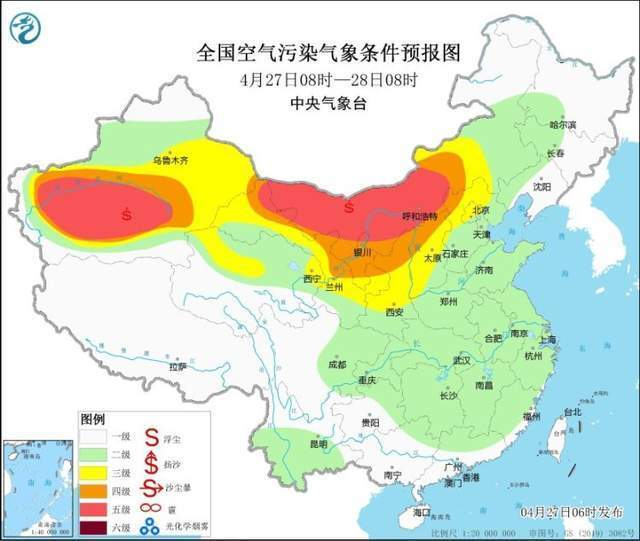
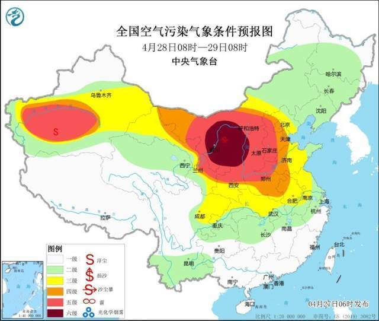
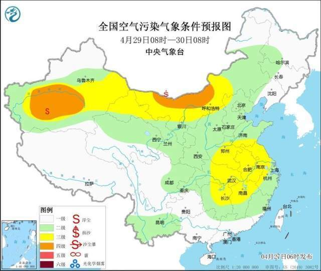

# 中央气象台：27日起三天北方地区多沙尘天气，京津冀有扬沙

受冷空气大风影响，27日新疆、青海柴达木盆地、内蒙古中西部、宁夏、甘肃西部、陕西中北部、山西北部、河北北部等地有扬沙或浮尘天气，28日，受另一股冷空气影响，内蒙古中西部、甘肃北部和中东部、宁夏、陕西、四川盆地北部、山西、河北中北部、北京、天津等地有扬沙或浮尘天气，其中，内蒙古中西部、甘肃河西、新疆南疆盆地局地有沙尘暴天气。29日受沙尘传输，华北南部、黄淮、江淮等地有扬沙或浮尘天气。

**具体预报如下：**

**京津冀及周边区域**

27日，受上游传输影响，区域中北部部分地区有扬沙或浮尘天气，28日，受另一股冷空气影响，区域有扬沙或浮尘天气，29日，区域中南部等地受传输影响，有扬沙或浮尘天气。

**长三角区域**

未来一周，区域大气扩散和湿清除条件较好，无明显霾天气。仅29日部分时段，区域中北部受沙尘传输影响。

**汾渭平原区域**

未来一周，区域大气扩散和湿清除条件较好，无明显霾天气。27日至28日，区域大部有扬沙或浮尘天气。

**珠三角区域**

未来一周，区域大气扩散和湿清除条件较好，无明显霾天气。

**华中区域**

未来一周，区域大气扩散和湿清除条件较好，无明显霾天气。

**西南区域**

未来一周，区域大部大气扩散和湿清除条件较好，部分地区有间歇性霾天气。但是，28日部分时段，四川北部部分地区受沙尘天气影响。

**东北区域**

未来一周，区域大部大气扩散和湿清除条件较好，无明显霾天气。

**西北区域**

未来一周，区域部分地区多沙尘天气。受冷空气大风影响，27日新疆、青海柴达木盆地、内蒙古中西部、宁夏、甘肃西部等地有扬沙或浮尘天气，28日，受另一股冷空气影响，内蒙古中西部、甘肃北部和中东部、宁夏等地有扬沙或浮尘天气，其中，内蒙古中西部、甘肃河西、新疆南疆盆地局地有沙尘暴天气。

来源 中央气象台

编辑 高珊珊

流程编辑 严圣淼

