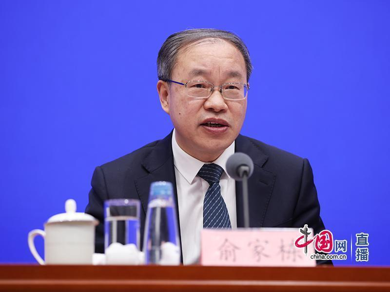

# 人社部：企业招用登记失业的16-24岁青年，签1年以上合同可获补贴

4月27日，国务院新闻办公室举行国务院政策例行吹风会，介绍“优化调整稳就业政策措施
全力促发展惠民生”有关情况。会上，人力资源和社会保障部副部长俞家栋介绍稳就业文件的有关情况时表示，鼓励企业吸纳就业，对企业招用毕业年度或离校2年内未就业高校毕业生、登记失业的16-24岁青年，签订1年以上劳动合同的，发放一次性吸纳就业补贴。

_↑人力资源和社会保障部副部长俞家栋_

4月14日，国务院常务会议审议了优化调整稳就业政策措施汇报；4月19日，国办印发《关于优化调整稳就业政策措施全力促发展惠民生的通知》。俞家栋表示，此次优化调整稳就业政策措施，既是贯彻中央关于稳就业决策部署的具体体现，也是适应形势稳定就业大局的现实需要。国办稳就业文件立足外部环境变化和就业形势需要，兼顾政策稳定性和可持续性，聚焦就业领域重点和难点，围绕“扩、促、兜”综合施策，打出今年稳就业政策组合拳。

**扩，就是多方位扩大就业容量。**
重点包括：对就业带动能力强的企业，配备就业服务专员，一揽子提供用工、培训、政策等扶持，支持金融机构开展稳岗扩岗金融服务和贷款业务。对不裁员少裁员的参保企业，继续发放一定比例的失业保险稳岗返还。对创业企业，加大创业担保贷款及贴息政策落实力度，创业担保贷款借款人因自然灾害、重特大突发事件影响流动性遇到暂时困难的，可申请展期还款。

**促，就是多渠道促进高校毕业生等青年就业创业。**
重点包括：鼓励企业吸纳就业，对企业招用毕业年度或离校2年内未就业高校毕业生、登记失业的16-24岁青年，签订1年以上劳动合同的，发放一次性吸纳就业补贴。鼓励引导基层就业，实施好基层服务项目，落实学费补偿和国家助学贷款代偿、高定工资等支持。支持国有企业扩大招聘规模，对工资总额难以满足扩招毕业生需求的国有企业，可给予一次性增人增资。稳定机关事业单位岗位规模，合理确定招考招录时间。实施2023年百万就业见习岗位募集计划，落实见习补贴，对见习期未满与见习人员签订劳动合同的，给予剩余期限见习补贴。

**兜，就是多层次兜牢民生底线。**
重点包括：对就业困难人员，及时提供就业援助，对企业招用登记失业半年以上人员，签订1年以上劳动合同的，可发放一次性吸纳就业补贴。对失业人员，及时兑现失业保险待遇。对出现生活困难的，纳入最低生活保障、临时救助等社会救助范围。

俞家栋表示，今年以来，疫情防控平稳转段，经济企稳向好，就业形势稳中有升，主要就业指标逐月回稳，困难群体就业得到相应保障。各地抢抓发展机遇，落实惠企利民政策，
**一季度支出就业补助资金共265亿元、失业保险基金349亿元**
；掀起“春风行动”热潮，举办招聘活动近6万场，发布岗位3800万个，市场热度回升，就业工作开局应该说是好的。
**前3个月城镇新增就业297万人，同比增加了12万人；3月份城镇调查失业率5.3%；3月末脱贫人口务工规模3074万人。**

俞家栋强调，外部环境复杂多变，就业形势稳中承压、稳中有忧，高校毕业生等青年就业压力依然较大，部分高技能人才、复合型创新型人才短缺，劳动者在就业领域还面临一些难题。

据介绍，做好下一步就业工作，主要有五个方面。

一是稳定就业基本盘。加快细化实化优化调整的政策举措，加大宣传解读力度，加速释放红利。

二是拓展就业增长点。强化重点行业拉动支持，建立岗位收集、技能培训、送工上岗联动机制，加大带动就业能力强的行业企业扩岗激励。强化创业带动支持，深入实施重点群体创业推进行动，组织创业就业服务展示交流活动。强化灵活就业支持，提升零工市场规范化建设水平，落实新就业形态劳动者权益保障政策。

三是保障重点群体。抓紧实施高校毕业生等青年就业创业推进计划，组织好公共就业服务进校园等十项行动，稳定毕业生就业水平。深入推进防止返贫就业攻坚行动，加大培训、服务、维权力度，稳住脱贫人口务工规模和收入水平。强化困难人员就业帮扶，健全跟踪帮扶机制，兜牢困难人员民生底线。

四是促进供需匹配。推动就业服务增效，火热搞好民营企业服务月、百日千万招聘等服务活动，加快就业信息化建设步伐，推动服务下沉、效率提升。推动职业培训提质，继续大规模开展职业技能培训，加快技工学校、技师学院转型升级，发挥各类培训主体的聚合效应，提升劳动者技能水平。

五是提升就业质量。开展全国和谐劳动关系创建工作先进集体和先进个人表彰，持续抓好社会保险参保扩面。开展好清理整顿人力资源市场秩序专项行动，严厉打击黑中介、虚假招聘等违法违规行为，保障劳动者合法权益。

红星新闻记者 王辰元 吴阳 北京报道

责编 任志江 编辑 潘莉

发布会其他要点

人社部：对不裁员少裁员的参保企业，继续发放一定比例的失业保险稳岗返还

人力资源社会保障部副部长俞家栋在新闻发布会上表示，今年以来，在疫情防控较快平稳转段、稳经济政策效果持续显现的有力支撑下，就业形势逐步恢复，保持总体稳定。但稳的基础仍不牢固，就业工作也面临新的困难问题。国办稳就业文件立足外部环境变化和就业形势需要，兼顾政策稳定性和可持续性，聚焦就业领域重点和难点，围绕“扩、促、兜”综合施策，打出今年稳就业政策组合拳。

其中，扩，就是多方位扩大就业容量。聚焦吸纳就业能力强的产业企业扩岗支持，加强政策激励，提振市场信心，培育就业新增长点。重点包括：对就业带动能力强的企业，配备就业服务专员，一揽子提供用工、培训、政策等扶持，支持金融机构开展稳岗扩岗金融服务和贷款业务。对不裁员少裁员的参保企业，继续发放一定比例的失业保险稳岗返还。对创业企业，加大创业担保贷款及贴息政策落实力度，创业担保贷款借款人因自然灾害、重特大突发事件影响流动性遇到暂时困难的，可申请展期还款。

人社部：全年计划组织开展补贴性职业技能培训1500万人次以上

人力资源和社会保障部职业能力建设司负责人王晓君在今日发布会上表示，将进一步健全覆盖城乡全体劳动者、贯穿劳动者学习工作终身、适应就业创业和人才成长需要以及经济社会发展需求的终身职业技能培训制度，充分利用好就业补助资金、失业保险基金、职业技能提升行动专账资金、企业职工教育经费等资金，全年计划组织开展补贴性职业技能培训1500万人次以上。

人社部：开展好清理整顿人力资源市场秩序专项行动，严厉打击黑中介、虚假招聘等

人力资源社会保障部副部长俞家栋表示，将提升就业质量。开展全国和谐劳动关系创建工作先进集体和先进个人表彰，持续抓好社会保险参保扩面。开展好清理整顿人力资源市场秩序专项行动，严厉打击黑中介、虚假招聘等违法违规行为，保障劳动者合法权益。

人社部：提升零工市场规范化建设水平 落实新就业形态劳动者权益保障政策

人力资源社会保障部副部长俞家栋表示，将强化重点行业拉动支持，建立岗位收集、技能培训、送工上岗联动机制，加大带动就业能力强的行业企业扩岗激励。强化创业带动支持，深入实施重点群体创业推进行动，组织创业就业服务展示交流活动。强化灵活就业支持，提升零工市场规范化建设水平，落实新就业形态劳动者权益保障政策。

