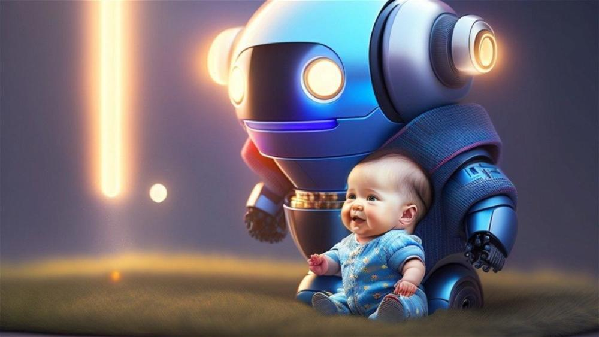
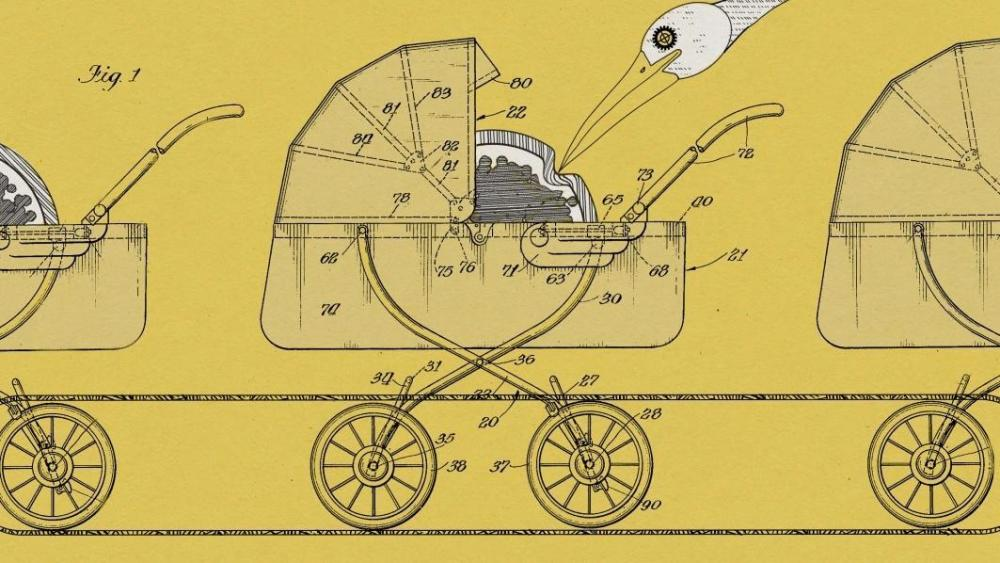

# 全球首批机器受精试管婴儿出生，以后辅助生育更便宜

近日，两名利用精子注射机器人完成受精的女婴诞生了，这也是全球首批机器人成功“孕育”婴儿的案例。

**取代精细化人工操作**

**非专业背景人员也可用游戏机手柄完成**

据报道，通常人类进行试管婴儿最为关键的环节就是将精子注入卵子内（受精过程），这项操作此前都是由人工完成，胚胎技术人员需要使用超薄空心针在显微镜下精细处理精子和卵子。而现在，西班牙初创公司Overture
Life的精子注射机器人可以取代人工完成这一精细的步骤。

值得注意的是，Overture Life制造的精子注射机器人可以通过索尼游戏机PlayStation
5的手柄进行控制操作，且没有生育医学领域实际工作经验的人也可以操作。

_↑该机器人可通过索尼游戏机PlayStation
5的手柄进行控制操作_

去年春天，巴塞罗那的工程师们把他们设计的精子注射机器人打包，快递到纽约。在纽约市新希望生育中心，他们将所有仪器组装起来：一个显微镜、一个机械针头、一个微型培养皿和一台笔记本电脑。

然后，一名没有生育医学实际操作经验的工程师使用索尼PlayStation
5控制器定位机械化的体外受精针头。通过摄像头观察一个人类卵子，然后它（机器人）自己向前移动，穿透卵子并释放出一个精子细胞。在整个过程中，机器人总共为十多个卵子进行了受精。

研究人员称，他们得到了健康的胚胎，今年春天已有两名女婴成功诞生，并表示这是全球首批通过“机器人受精”诞生的人类。Overture
Life表示，他们的设备是实现体外授精（IVF）自动化的第一步，或将使人工受孕比现在更便宜、更普遍。

**实现自动化**

**可大幅降低试管婴儿成本**

目前，建造一家人工受孕诊所需要投入数百万美元，并且需要聘用专业胚胎学家和辅助生育的医生组成团队。仅负责受精过程的胚胎技术人员每年收入超过12.5万美元。在美国，普通人每次尝试人工受精的费用至少需要2万美元。而精子注射机器人的目标是通过越来越多的自动化过程，大大降低成本，还能让制备受精卵更加简便和精准。

_↑实现自动化可大幅降低试管婴儿成本_

据报道，Overture
Life还提交了一份专利申请，阐述了一种用于试管婴儿实验室的微型“生物芯片”，其中包含储存生长液体的隐藏储存器，以及供精子通过的微小通道。

“想象如同一个小盒子，把精子和卵子放进去，五天后就可以取出胚胎了。”该公司首席遗传学家圣地亚哥·穆内说，如果试管婴儿可以在一体化的台式设备中进行，患者的卵子可以直接被送入妇科医生办公室的自动生育系统，病人甚至不需要专门去诊所就诊。

而试管婴儿自动化的主要目标很简单，那就是孕育更多的生命。据报道，如今全球每年约有50万名婴儿通过试管受精出生，但大多数需要帮助的人无法获得生育药物或支付不起费用。曾是生育医生的投资基金管理人大卫·塞布尔表示，如果体外受精一直像手工定制一样，是无法从每年50万婴儿增加到3000万的。

目前，虽然一体化设备还没有出现，但整个过程的自动化，如注射精子、冷冻卵子或培育胚胎，也可以降低体外受精的成本，并进一步支持更多创新的出现。

不过，也有医生对机器人是否能够或应该取代胚胎学家持怀疑态度。哥伦比亚大学生育诊所主任泽夫·威廉姆斯表示：“你需要拿起一个精子，把它放在一个卵子里，以最小的创伤，尽可能小心。但目前，人类比机器要好得多。”

红星新闻记者 徐缓

编辑 张莉 责任编辑 魏孔明

