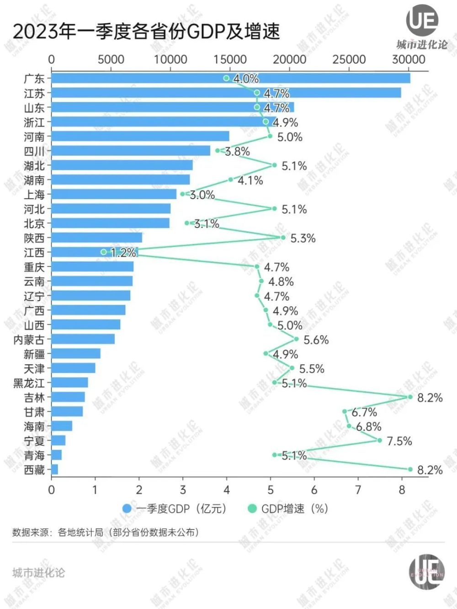
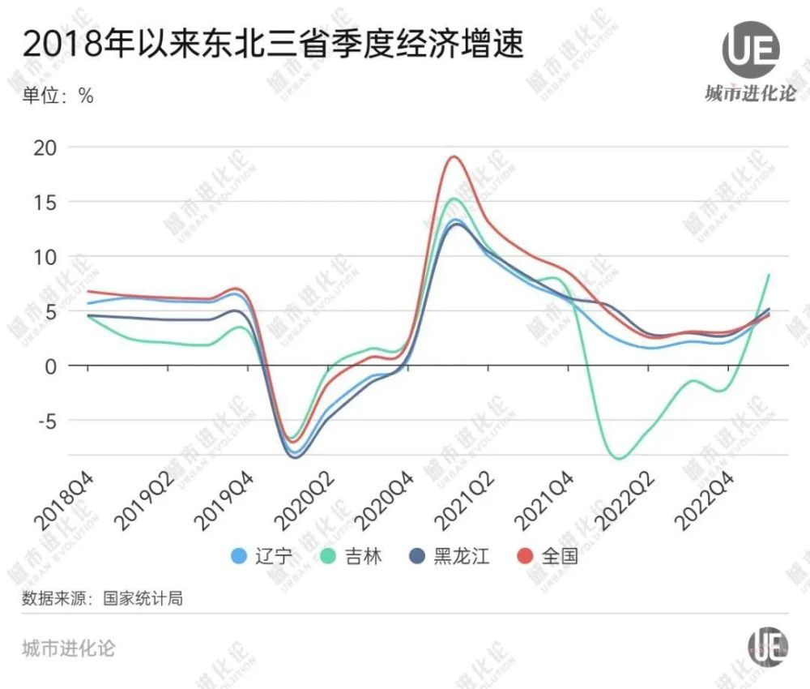

# 各省GDP陆续公布，吉林增速8.2%与西藏并列居首，东三省跑赢全国

近日，各个省份陆续公布今年一季度的经济数据。

截至目前，在已公布一季度经济数据的28个省份中，吉林增速与西藏并列居首。

值得注意的是，江西一季度GDP为7320.7亿元，同比增长1.2%，比全国（4.5%）低3.3个百分点，排名垫底。

另外，吉林省一季度GDP以8.2%的增速领跑，黑龙江为同比增长5.1%，辽宁则为4.7%。这意味着，今年一季度，东三省经济增速均跑赢全国平均（4.5％）。

**江西二产拖后腿**

据不完全统计，在已公布数据的28个省份中，江西一季度GDP为7320.7亿元，同比增长1.2%，比全国（4.5%）低3.3个百分点，排名垫底。

而对比去年同期，江西还是31个省份中的增速“优等生”。2022年一季度，江西GDP为7320.5亿元，同比增长6.9%，增速居全国第二、中部第一。其中，二产增加值为3302.9亿元，同比增长8.0%，拉动GDP增长3.4个百分点。

对比去年同期GDP数据，江西一季度几乎为原地踏步，名义增速“零增长”。“优等生”为何突然踩下“急刹车”？

分产业看，今年一季度，江西一产增加值381.1亿元，增长3.0%；二产增加值3177.0亿元，下降2.4%；三产增加值3762.6亿元，增长4.0%。也就是说，“拖后腿”的主要因素是二产。

江西省统计局数据还显示，受上年同期基数较高及需求不足导致部分行业不景气影响，江西一季度工业增速回落，全省规上工业增加值同比下降2.8%，其中医药制造业、非金属矿物制品业、农副食品加工业降幅最大，分别下降9.6%、9.7%、17.7%。

江西突然“失速”，也令其在与“老对手”陕西的位次之争中显得更加被动。

2022年全年，江西GDP增长4.7%，与福建并列全国第一，一度引发外界对其能否超越陕西的猜测。不过最终，陕西GDP达到32772.68亿元，同期江西则为32074.7亿元，二者差距从上一年200亿元进一步扩大至700亿元左右。

而陕西一季度GDP同比增长5.3%。根据年初设定的目标，江西今年GDP增速预期增长7%左右，陕西则预期增长5.5%左右。

**跑赢全国，东北全面回暖了？**

梳理东北三省经济增速，能够同时跑赢全国平均水平，这在近年来十分罕见。

东北经济总量最高的辽宁，多年来经济增速一直慢于全国，今年一季度经济增速超出全国0.2个百分点，是其自2014年以来首次高于全国平均水平。

黑龙江2022年一季度以5.4%的经济增速位列全国第11位，比上年同期大幅前进19位，自2013年三季度以来季度增速首次超过全国平均水平。不过，这一趋势仅延续到去年上半年，2022年全年黑龙江GDP增速为2.7%，未能达到3.0%的全国平均线。

吉林2020年曾连续四个季度跑赢全国平均水平，不过去年受疫情影响较大，GDP增速始终未能回正，去年全年以-1.9%在全国31个省份中排名垫底。今年一季度，吉林以8.2%的经济增速领跑全国，一方面有去年同期基数较低的原因，另一方面也显示出经济全面回暖的势头。

具体来看，今年一季度，吉林固定资产投资同比增长28.1%，高于全国平均水平23.0个百分点；同时，吉林消费市场恢复步伐加快，一季度社会消费品零售总额增长14.0%，高于全国8.2个百分点；外贸方面，吉林一季度进出口增长6.8%，同样高于全国2.0个百分点。

值得注意的是，东北经济全面回暖，在重点城市表现尤为明显。

正在冲刺东北第一个“万亿GDP城市”的大连，一季度GDP为2032.9亿元，同比增长5.7%，不仅连续6个季度跑赢全国，且GDP占辽宁全省比重达到30.5%，经济分量进一步提升。按照官方说法，“全市经济运行企稳回升、整体向好，主要经济指标增速高于全国，创近年来最好水平，实现良好开局。”

其中，全市规上工业增加值增长12%，高于全国9个百分点。从产品产量看，汽车、电子元件、锂离子电池、橡胶轮胎外胎、发电量、发动机、PTA产量同比分别增长69.1倍、3.1倍、25.3%、14.6%、9.2%、8.8%、1.5%。

瞄准创建国家中心城市的沈阳，一季度GDP达到1744.7亿元，同比增长5.9%。其工业表现同样亮眼，一季度全市规上工业增加值同比增长18.0%，其中，汽车制造业增加值增长39.0%，专用设备制造业增加值增长22.8%，通用设备制造业增加值增长8.7%。

**编辑|** 何小桃 杜波

**校对|** 王月龙

封面图片来源：视觉中国

