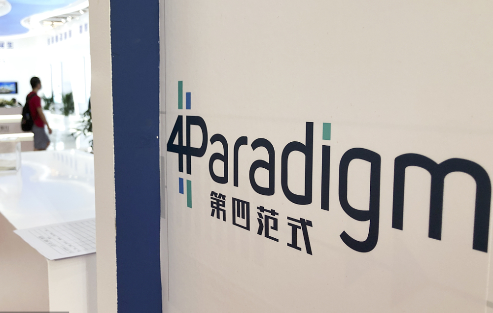

# 对话第四范式戴文渊：大模型是生产力，影响将超越iPhone｜深网

_来源：视觉中国_

作者丨叶蓁

编辑丨康晓

出品丨深网·腾讯新闻小满工作室

“现在不是泡沫的问题。虽然资本市场已经很热了，热到使得很多人担心泡沫问题，但我觉得还是太冷，大家还没有意识到大模型有多么厉害。”第四范式创始人兼CEO戴文渊表示，GPT是一个生产力级别的产品，会带来全社会效率的提升。

4月26日，第四范式对外展示其大模型产品「式说3.0」，并首次提出 **AIGS战略（AI-Generated
Software）：以生成式AI重构企业软件** 。式说定位为基于多模态大模型的新型开发平台，提升企业软件的体验和开发效率，实现「AIGS」。

戴文渊表示，C端产品已经逼近用户体验的上限，而B端的企业级软件往往是个十分复杂的执行系统，堆砌十几层菜单和成千上万功能也不算多。戴文渊认为，目前这些B端软件极为复杂的交互体验，以及复杂性带来的极低开发效率，为生成式AI留下足够大的重构和改造空间。

“过去很难通过人类语言（自然语言）的方式去调用企业软件的功能，现在当我们有更强的语义理解和生成能力，再加上GPT任务翻译、任务分发和推理的能力，就可以通过更好的
**「对话框式」交互方式** 实现功能的调用，不再需要找到某个位于十几级的菜单目录之下的功能。”

在戴文渊看来，要做到AIGS，大模型未必需要是知识广博、十项全能冠军的通才，更重要的在于模型具备Copilot（副驾舱），和思维链CoT（chain of
thoughts，多步推理）的能力。

以下是戴文渊接受《深网》等媒体专访实录：

**媒体：第四范式什么时候开始关注投入GPT和大模型？**

戴文渊：在BERT出来的时候，范式研究院就开始关注并投入在这个技术领域，GPT3出来以后更加明确了要朝这个方向。不过相比今年的投入，过去几年肯定还是有差距的。ChatGPT对我们最大的帮助，就是整个市场的信心一下从0调满了，确定性的投入更大了，再往后就是变成产品、变成商业化的路线往市场去推。

**媒体：是否跟同行产品做过对比？**

戴文渊：中国目前还没有像OpenAI那样在大模型上绝对领先的公司，也会有更多的大模型。大模型是新的生产力，大家都得有大模型作为底座，所以入局的门槛确实是变高了。

但是在达到这个门槛之后，重点在于如何选择方向。比如培养了一个大学生后，到公司再接受专业的训练，在某一个领域积累专业的能力，这是很重要的。但不具备一定的素质有很多事就干不了，所以底层的大模型也很重要。

第四范式认为比较大的机会在于改造整个的企业软件行业，也就是AIGS这个方向。发力的大模型技术方向是Copilot可控（执行可控、知错能改），和思维链COT（（chain
of thoughts，多步推理、复杂任务拆分）的能力，形成数据飞轮（比如将某垂直领域的数据和流程投入大模型，很快可以形成模型在该领域的思维链）。

**媒体：思维链为什么这么重要？**

戴文渊：这个也不是特别难理解，因为Chat这种能力只是用于Chat，其实能力到一定的水平也就差不多了，不是需要进一步提升，只要能沟通就行。比如大语言模型为什么还要进一步追求，其实追求的已经不是Chat本身的能力，而是思维的能力。比方我写一个剧本，其实追求的不是语言的问题，而是追求怎么构思这件事情，这个是更重要的。真正的对于商业端有用的其实是具体的任务，这种任务小到执行一个功能，大到真的完成一个复杂任务，我们任务如果将来复杂到要把整个飞机拼起来，思维链就复杂了，现在做不到。

**媒体：怎么提高思维链的能力？**

戴文渊：有两个方面，一方面让模型变得越来越聪明，像OpenAI的CTO，你要让下一个词写得更加准，就要想更多的事，如果下一个词只要50%的准确率，不用思考，胡说就能到50%。如果到90%，稍微想想，到99.99%，可能想了无数的事，才写了一个字。这个想的过程，为了追求下一个字写得更精准，思考深度就会越来越深。我思考那么深，最重要的不是为了写下一个字，而是拥有了思考的非常深的能力。这是其一。

其二，往具体的领域去用，你见的多了，两者的辩证关系是什么，越聪明的人教他越快，一个聪明的人随便看两个例子他会了，一个笨一点的人得多花一些时间，勤能补拙。所以两方面都是需要的。

**媒体：整个行业研发成本非常之高，包括算力的成本，计算的成本，还有后续标注成本都非常之高。长期来看，如何达到盈亏平衡？**

戴文渊：大模型是可以去摊销的，大模型是训练一次能够复制到不同的场景，甚至比原来决策类模型更好，决策类模型单个模型它训练是有成本的，训练完在这个场景下，我们要算一个投入产出比，过去我们经常会谈的叫做我们要去找AI所合适的场景，为什么要寻找？绝大多数的场景拿来AI都合适，但是算投入产出不一定，决策AI的时代我们会谈AI落地的门槛，AI落地的成本。为什么？你把门槛降低，把成本降低，就会有越来越多的场景适合用AI去解决。生成式AI会把编辑成本进一步降低，更多的去覆盖，这种编辑成本做一次以几乎零成本去复制的模式，不存在最后赚不回来的问题，只是最后谁能在这个市场中获胜。

**媒体：因为现在ChatGPT带动大量AI创业，大模型这块不投十亿八亿美金，基本上扔进去连响都听不到。在你看来，行业存在泡沫吗？**

戴文渊：现在不是泡沫的问题，虽然资本市场已经很热了，热到使得很多人担心泡沫问题，但我觉得还是太冷，大家还没有意识到这件事有多么厉害。

**媒体：ChatGPT的诞生是不是相当于iPhone诞生一样，会引发AI带来的新时代？**

戴文渊：我们可能比这个还要乐观，甚至我们现在觉得GPT有点像一台计算机，你想象成一个AI计算机，在GPT上面可以去开发出各种各样的应用跑在一个AI的底座上，甚至有可能这个机会级别是超过iPhone的级别，有可能跟计算机级别一样大。

**媒体：简单描述一下你看得见的未来吗？**

戴文渊：它相当于是一个生产力，iPhone从某种角度来说，但是绝对没有到计算机级别的水平，可能是一个，就像开启了移动互联网的时代。GPT我觉得它是一个生产力级别的东西，带来全社会效率的提升。

