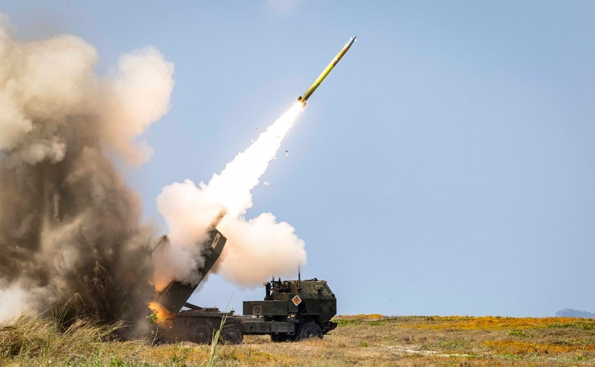
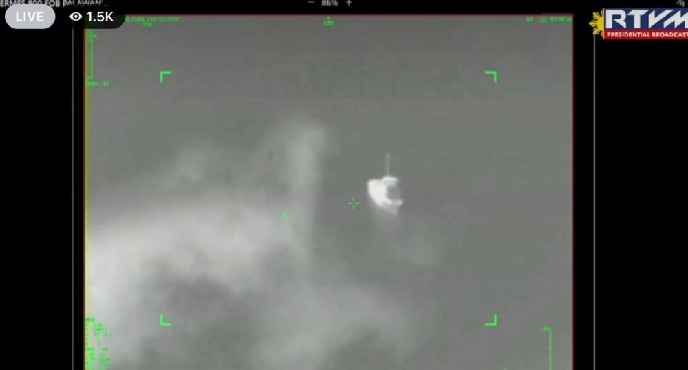
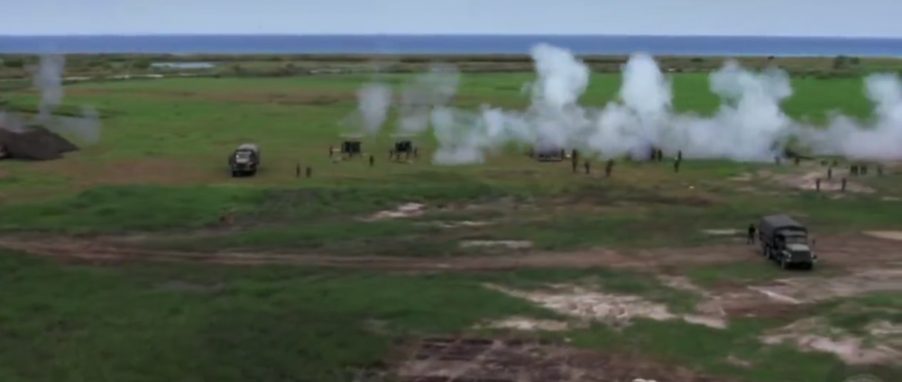

# 尴尬！当着菲律宾总统和美国大使的面，美军海马斯火箭炮六发不中

【文/观察者网 王世纯】美菲联合演习中出现了一次“小意外”。

综合星条旗报、华尔街日报4月26日报道，在4月25日美菲“肩并肩2023”联合军演中，美菲两军出动各种武器实弹射击一艘菲律宾退役护卫舰。结果，美军一辆“海马斯”火箭炮发射的6枚火箭弹全部脱靶。

这尴尬的一幕发生时，菲律宾总统马科斯、美国驻菲律宾大使玫琳凯·卡尔森就在现场。

_星条旗报报道截图_

_美军向靶船射击海马斯 图源：社交媒体_

_F-35B攻击无动力靶船
图源：RTVM电视台_

菲律宾与美国2023年度的“肩并肩”联合军事演习4月11日上午在菲律宾武装部队总部举行开幕式。此次演习将持续到4月28日。演习预计将有5400名菲士兵和12200名美军参演，人员规模为历年来最大一次。演习除菲美军队外，澳大利亚也将派出100多名士兵参演，包括日本在内的12个国家也将派出观察员参与演习。

此次演习的重头戏就是用美菲军队实弹攻击一艘无动力漂浮的靶船。演习中，菲律宾出动一艘退役的邦加西南号轻型护卫舰（PS-31），这是一艘二战时期美国海军PCE-842级巡逻艇。该舰代表“敌舰”从海上接近菲律宾领土。一架美国空军MQ-9“死神”无人机飞临目标上空，将信息回传给美非部队。

美菲随后出动多型战机和火炮对其进行攻击，包括双方装备的105毫米和155毫米榴弹炮、“海马斯”火箭炮、AH-64武装直升机、FA-50战斗攻击机、F-16、F-35B以及AC-130H等战机。最后由美海军陆战队一架F-35B投放一枚激光制导炸弹将这艘“敌舰”击沉。

_上图美军运送海马斯火箭炮发射车上岸，下图为菲律宾105毫米美制榴弹炮射击靶船
图源：美军_

发射“海马斯”的部队是美国陆军第3野战炮兵团第5营，该营还下辖一个“陆基远程高超音速导弹”（LRHW）连。在演练中，美军出动一艘登陆艇搭载 “海马斯”
在菲律宾巴斯科岛海岸附近登陆。

对于射击失败的原因，美国海军陆战队太平洋部队发言人尼克·曼韦勒中校表示，岸基火力攻击船只“异常困难”。但他还表示，“海马斯”火箭炮未能击中海上船只并不是什么大事。他说，这次训练测试了部队探测船只的能力，部队成功将目标信息传递给美国和菲律宾使用的武器平台。这次训练“为今后开展更富有成效的工作奠定了条件”。

值得一提的是，“海马斯”火箭弹射击之时菲律宾总统马科斯和美国驻菲律宾大使玫琳凯·卡尔森等美菲高官就在现场。对此，“肩并肩”联演联合指挥训练中心主任、菲律宾陆军上校洛吉科（Mike
Logico）对记者说，马科斯了解大规模双边演习会遇到的挑战。他说：“我们展示的是海马斯的能力，也可能是它的局限性。”

虽然有炮兵武器未能命中靶标，但不妨碍美媒趁机解读。《华尔街日报》宣称“这向台湾以南航行的中国军舰发出了强烈信号”。美国有线电视新闻网（CNN）称，此次军演的背景是面对“
更加自信的中国 ”，马科斯寻求与华盛顿发展 “ 更密切的关系”。

对于美菲联合军演一事，中国外交部发言人毛宁4月26日表示，中方一贯认为国家间的防务安全合作应当有利于维护地区的和平稳定，不应当加剧紧张局势，不应当破坏地区国家间的互信，更不应当针对任何第三方。

**本文系观察者网独家稿件，未经授权，不得转载。**

