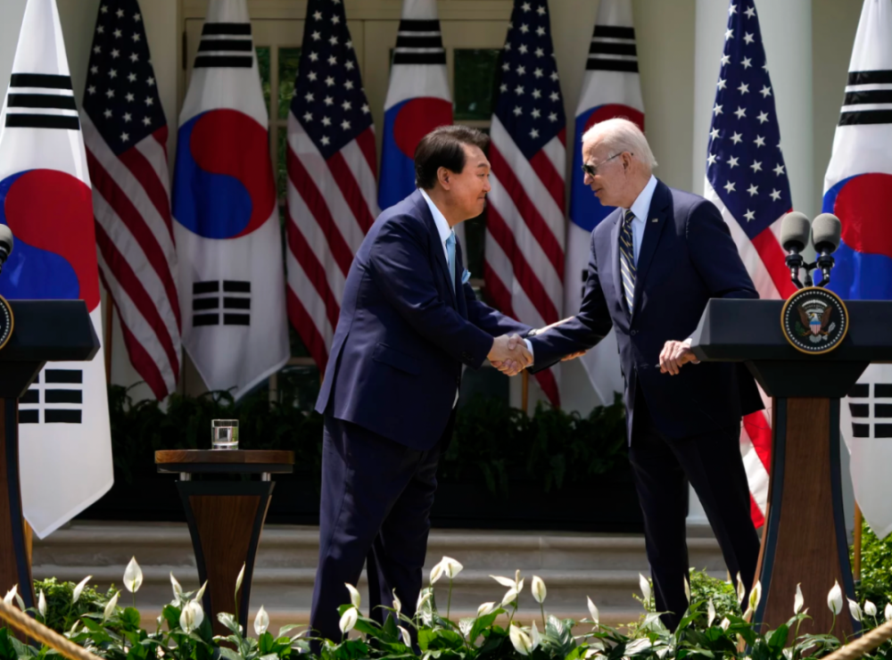
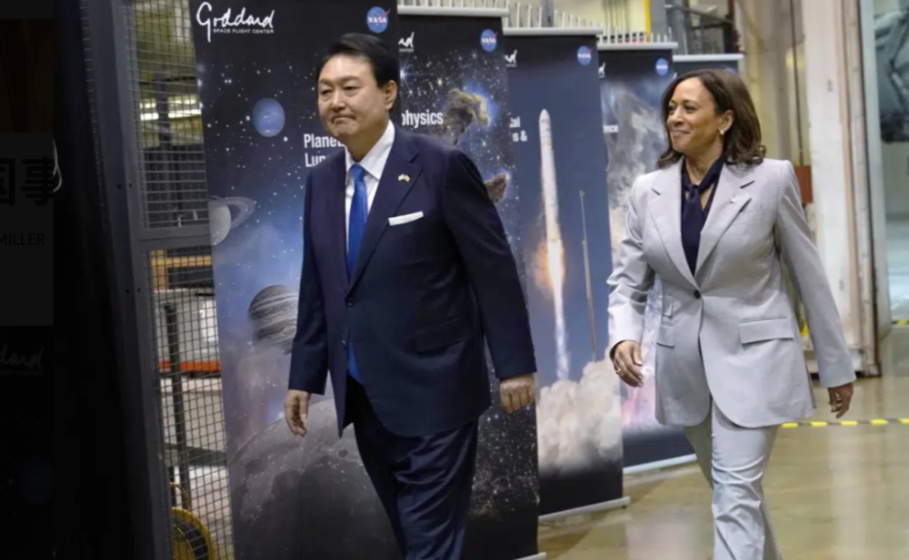

# 尹锡悦终于见到了拜登，但期待和回报落差不小

**美国答应向韩国提供所谓“安全保障”，给韩国及其周边地区带来更多的安全风险。**

伴随一路争议声，韩国总统尹锡悦终于见到了美国总统拜登。当地时间26日，韩美首脑在白宫举行会晤并发表联合声明，强调在深化战略同盟、扩大印太协作、加强双边合作三大领域加强协同。

值得注意的是，在双方发表的《华盛顿宣言》中，包含了“新设核协商小组”“美国将派遣战略核潜艇停靠韩国”等内容。有分析认为，这项宣言象征性地显示了美国对韩国的支持，实际效果或许有限。

**《华盛顿宣言》是折中的结果？**

正在对美国进行国事访问的尹锡悦，迎来了自己此访的“重头戏”——在白宫与拜登举行会晤。

_尹锡悦（左）和拜登在美国白宫举行的新闻发布会上握手。图源：NPR_

在约80分钟的交谈中，尹锡悦表示，所谓的韩美同盟不是“利尽则散”的同盟，而是“价值观同盟”。拜登则强调，美韩同盟是所谓的“让双方战胜所有挑战的伙伴关系”，并对尹锡悦的对日外交决策表达了感谢。

会晤结束后，两国首脑举行联合记者会，并发表了阐明加强“延伸威慑”的《华盛顿宣言》。

根据白宫官网信息，在这项宣言中，韩美两国承诺就“核威慑问题”进行更深入的合作，两国宣布新设核协商小组，以加强“延伸威慑”，讨论核战略规划。而“美国战略核潜艇几十年来将首次停靠韩国”等内容也被写入宣言。

有媒体认为，这一宣言的发表意味着美国为韩国提供“核保护伞”的“明文化”。但另有媒体指出，韩美之间所达成的协议是希望与美共享核武器的韩国政府与对此持否定态度的美国政府之间折中的结果。

**辽宁大学国际经济政治学院副教授李家成**
表示，韩国一直希望美国能为韩提供更多安全保障，美国此前也做过相关承诺。《华盛顿宣言》的发表可看作美国对韩国诉求的回应。但美国所谓的“派遣核潜艇”与常驻的方式还是有所差距。可以说，尽管韩国希望美加强对韩的战略安全保障，但美国能够给予韩国的比较有限。

**拜登模糊回应韩相关诉求**

除了在加强“延伸威慑”方面达成了所谓共识，韩美也就太空、经济等领域的合作展开了磋商。

25日，尹锡悦在美国副总统哈里斯的陪同下访问美国航空航天局（NASA）。在记者会上，尹锡悦表示，希望韩美同盟将合作领域从地球拓展至太空，在双方结盟70周年之际，结成太空同盟。韩国科技部和NASA当天还签署联合声明，韩国总统办公室表示，韩国将以此为契机正式参与美国主导的“阿尔忒弥斯”登月计划。

_尹锡悦（左）在哈里斯陪同下访问NASA。图源：AP_

此外，韩美两国企业代表还签署了23份合作谅解备忘录，涉及电池、生物、无人驾驶、氢能、核电等尖端技术领域和清洁能源领域。

李家成指出，在探索太空领域的过程中，韩国有过多次失败经历。鉴于韩国对太空军事和太空经济的重视，希望能搭上美国的快车，借美国之力快速发展自身实力。而在其他经济领域，韩国对美也是诉求明显。

但李家成提醒，对于韩国方面格外关切的《通胀削减法案》和《芯片与科学法案》等相关议题，美国方面只做了所谓“加强磋商”等模糊回应，没有做出实质性的让步。

“韩国在经济领域的关切没有实质性突破，而尽管这些年韩国不断扩大对美投资，但尹锡悦此次访美期间，韩媒似乎只对美国流媒体巨头网飞将向韩国娱乐业投资25亿美元一事有所报道。”李家成说，“总体而言，韩国方面对于尹锡悦此次访美期待颇高，但从实际情况看，预期与回报之间有巨大落差。”

李家成认为，韩国一味对美示好、不惜牺牲与其他国家的关系，实则得不偿失。即便美国答应向韩国提供所谓“安全保障”，但这样的行为只会给韩国及其周边地区带来更多的安全风险。到头来，吃亏的还是韩国自己。

**出品 深海区工作室**

**撰稿 王若弦**

**编辑 深海獭**

