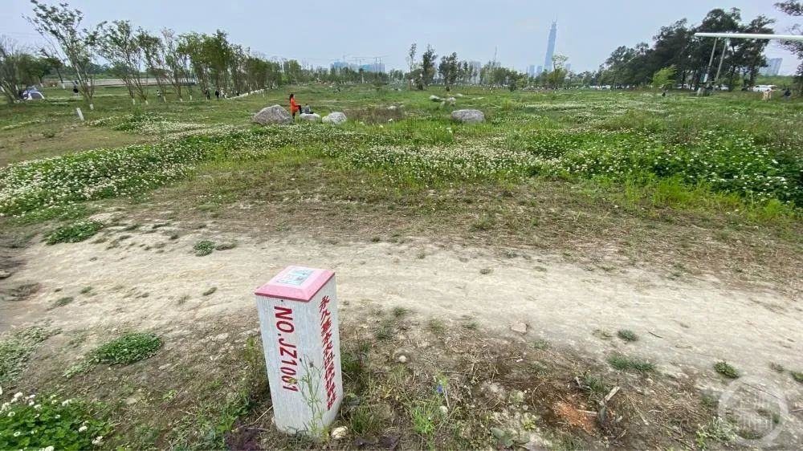

# 成都多处“拆绿还耕”，网红绿道边种上10万亩农作物？官方回应争议

3月底以来，多位四川成都市民在当地问政平台等地反映情况称，自己所在小区附近的绿地以及当地花费重金打造的“环城绿道”拆除了绿化植物，种上了小麦、玉米等农作物，“修好的绿地景观花费了不少钱，用都没用几天就拆了，完全是浪费公帑。”

记者从多个部门获悉，相关市民反映的“拆绿还耕”现象确实存在，但均属于按照政策要求推动复耕，不存在违规之处。

今年3月28日，负责成都“网红点位”成都绕城绿道建设的成都天府绿道建设投资集团有限公司发布新闻稿披露，成都兴城集团纪委书记孙泽晖、副总经理张航一行调研了成都环城生态区十万亩粮油产业带建设工作，召开耕地保护田长调度会，会上强调要切实采取“长牙齿”的硬措施保护耕地，共同守好成都平原这片“产粮宝地”。孙泽晖还提出，绿道团队推动环城生态区逐步转变为城市产粮区“成绩有目共睹”“坚决完成10.1万亩耕地复垦复耕任务”。

_2022年4月，成都环城生态区范围内的基本农田保护界桩。‍_

4月19日，记者在成都环城绿道周边的走访也发现，当地已经将曾经打造的许多绿化景观拆除，恢复为农业种植区域，种植了包括玉米、小麦等在内的农作物。

记者查阅成都天府绿道建设投资集团有限公司官网“项目展示”栏目了解到，成都环城生态公园项目位于中心城区绕城高速两侧各500米范围及周边7大楔形地块，跨经12个区，涉及生态用地133平方公里，是天府绿道体系“三环”中的重要一环。按照总体规划，环城生态公园项目将建成“5421”体系，即打造500公里绿道、4级配套服务体系、2万亩水体及10万亩粮油产业带。

针对部分市民对于已经建成的环城生态区拆除绿化、改种农作物是否涉及资源浪费等问题，成都当地相关知情人士表示，成都环城生态区建设中部分地块为基本农田保护区，其使用严格限制在了粮食生产的范畴，“不仅不能作为绿化景观用地，连非粮化都是被严格禁止的，最近这一年整个环城生态区都在推动恢复种植。”该人士表示，已经建成的自行车道、步行道路等属于道路的范畴，在相关整改中并不会拆除，“10万亩”的概念范畴是绿道之外的环形区域和耕地，属于绿道建设工作目标之中的“10万亩粮油产业带”，“有些要达到农业景观要求，有些则是纯生态用地。”

该知情人士进一步称，涉及整改项目的土地并不涉及土地性质改变的问题，“从一开始都是耕地，复耕复垦里面的复字就是恢复的意思，并不涉及土地性质的改变。”

除了绕城绿道，成都城区内多地也在推动“复耕复产”工作。成都市双流区黄水镇居民向上游新闻记者反映，双流区黄水镇罗家堰路北侧空地原本规划的是公园和商业综合体，但近期被用于农业种植，“还以为种植的是草坪，结果是苞谷”，周边购房业主质疑开发商虚假宣传，欺骗购房者。对于相关投诉，双流区黄水镇政府直接回复称，该地块属于“按照要求对耕地进行复耕种植。”

四川省国土资源系统的相关知情人士对记者表示，坚守耕地底线是当前自然资源系统内一项重大工作，目前各地对于已经建成的公共设施进行“纠偏”拆除，是保护耕地工作的具体执行。

