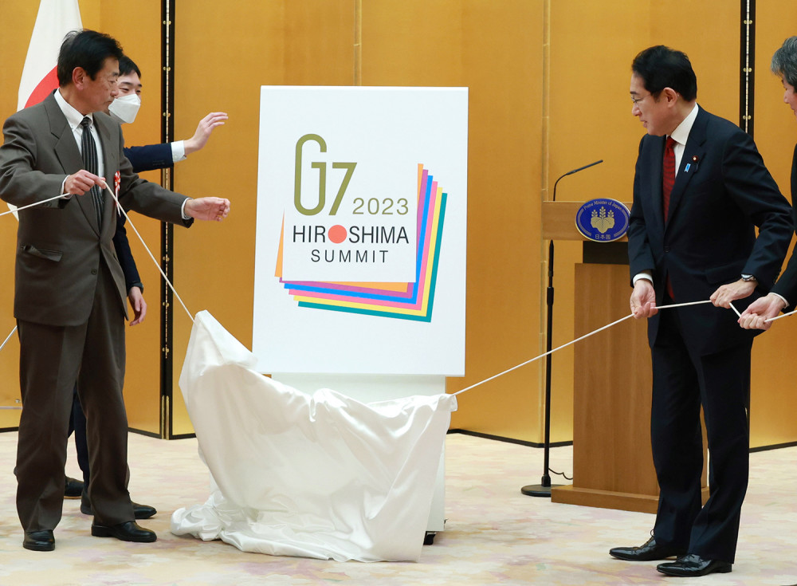

# 日本政府被曝想让G7领导人首次向广岛核爆慰灵碑献花：还在和美国商量

（观察者网讯）随着G7峰会的临近，日媒曝出了东道主日本政府的更多打算。

4月26日，日本共同社援引外交消息人士独家报道称，日本政府拟在七国集团首脑会议（G7广岛峰会）第一天，也就是5月19日，安排各国首脑向广岛市和平纪念公园的核爆慰灵碑献花，并已就此展开协调。

报道介绍，届时，首相岸田文雄将在和平纪念公园迎接各国首脑，然后视察核爆资料馆，并按照设想在留言簿上写下关于和平的留言及献花。这一安排意在为实现岸田提倡的“无核武世界”渲染气氛。而关于与核爆受害者会面以及资料馆的视察内容，日方正在与美国进行最后阶段的磋商。

日媒援引相关人士称，峰会第一天访问资料馆和献花的日程已得到各国同意。资料馆的常设展示包括原子弹投下前后的广岛市街景，以及展示核爆威胁和受害实际情况的图片等。但关于视察的范围和是否对外发布，则仍在协调。

外交消息人士还说，在奥巴马成为首位在任内访问广岛的美国总统后，当过奥巴马副总统的拜登对访问资料馆表示理解。不过，由于美国是投下原子弹的当事国，据称需要慎重观察国内舆论。

岸田文雄曾称自己将核裁军作为“毕生事业”，此前就向外界流露过在家乡广岛举办G7峰会的意愿。2016年G7外长会议时，岸田在广岛以外相身份和各国外长一同视察过资料馆并献花，但与G7首脑尚属首次。

_2022年12月21日，日本东京，日本首相岸田文雄出席G7首脑广岛峰会标志发布会。图自IC
Photo_

日媒称，日本政府把核裁军与核不扩散作为此次峰会的主要议题。除了汇总应对俄乌冲突、中国等国际政治课题的共同文件之外，还拟发表展现核裁军与核不扩散决心的文件。

然而，据日本广播协会（NHK）2月报道，日本广岛市教育委员会宣布，日本著名反战漫画《赤脚阿元》将被删除出小学教材，理由是这部漫画“很难向孩子们传达原子弹爆炸的真实情况”，而且其中一些情节会对小学生造成不良影响。

《赤脚阿元》是日本漫画家中泽启治基于自己广岛原子弹幸存者经历所创作的反战漫画，于1975年至1985年在日本著名漫画刊物《周刊少年Jump》上连载。它在日本国内畅销40余年，发行总量超过1000万册，曾被评为日本父母最希望带着儿女共读的漫画，还多次被改编为真人电影、动画电影和电视剧。此外，这部反战漫画还被翻译成多种语言版本，行销海外20多个国家，被誉为全球最具影响力的经典反战作品之一。

《赤脚阿元》将被删除一事引发巨大争议，众多日本民众批评此举“愚蠢透顶”“让人寒心”；还有人猜测此举是岸田政府在“揣度美国人”，因为今年5月的G7峰会将在广岛举行。

4月18日，对于G7外长发表联合声明，关切中国扩张核武库等说法，外交部发言人汪文斌重申，中国始终坚定奉行自卫防御的核战略，恪守不首先使用核武器政策，始终将核力量维持在国家安全需要的最低水平。七国集团罔顾事实，企图操弄话术、混淆视听，不能代表国际社会的共同声音。

发言人指出，作为七国集团轮值主席国的日本，在军控领域的政策立场极其虚伪。日方长期以核爆受害国自居，宣扬建立无核武器世界，实际上却享受美国的“核保护伞”，反对和阻挠美国放弃首先使用核武器政策，一些日方政客甚至鼓噪与美国实施“核共享”。日本政府还置国际公共利益于不顾，执意推进向海洋排放福岛核污染水，将不可预测的核污染风险强加给全世界人民。

中方再次敦促七国集团停止对他国诬蔑抹黑，停止煽动对立对抗，对自己的战略安全政策反躬自省，切实履行相关国际军控义务，为维护世界和平与安全承担应尽的责任。

**本文系观察者网独家稿件，未经授权，不得转载。**

