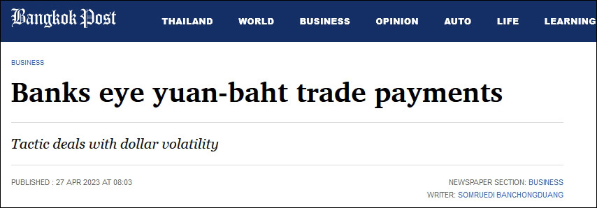
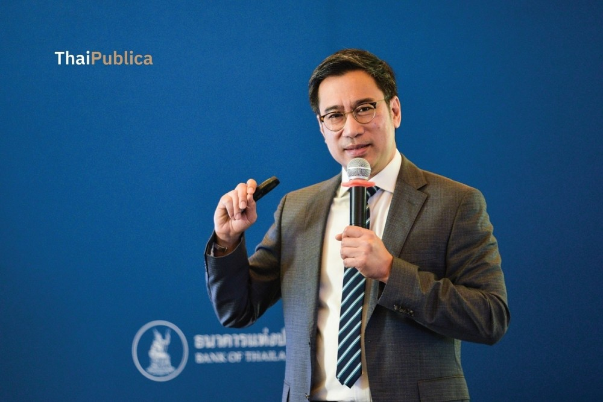

# 泰国央行行长：泰中讨论扩大本币结算，规避美元风险

（观察者网讯）泰国《曼谷邮报》27日援引泰国央行行长的话报道称，在美元持续波动的情况下，泰国央行正与中国央行讨论使用人民币-泰铢结算，以减少外汇风险。

据报道，泰国央行行长社他布·素提瓦纳吕布表示，泰国银行和中国人民银行已进一步举行了一系列磋商，以鼓励企业在两国贸易中使用本币结算。据悉，两国央行代表计划5月再次会面，讨论有关事宜。

此前，中国人民银行与泰国银行于2021年初披露已续签双边本币互换协议，互换规模为700亿元人民币/3700亿泰铢，协议有效期五年，经双方同意可以展期。人民银行表示，这将有助于加强两国金融合作，扩大中泰间本币使用，促进双方贸易和投资便利化。

_《曼谷邮报》报道截图_

关于本币结算框架，报道还提到，泰国央行此前已与日本财务省、马来西亚国家银行（央行）和印度尼西亚银行（央行）合作，支持在亚洲内部的贸易和投资以及个人支付中使用地区货币。

社他布解释称，受美联储货币政策影响，近期泰铢对美元汇率一直在波动。泰国央行数据显示，泰铢对美元汇率跌至37.78泰铢兑换1美元，创下16年来新低。他表示，在全球不确定性上升的情况下，预计这种波动可能会持续下去。

社他布还说，中国重新开放带动经济复苏，但对泰国而言，来自外部因素的风险更高，尤其是全球经济不确定性和美国经济放缓，给泰国出口造成了损失。报道援引泰国央行预测数据称，2023年上半年泰国出口值将同比下降7.1%，下半年将增长4.2%。

_泰国央行行长社他布·素提瓦纳吕布（资料图）
图片来源：ThaiPublica_

进入2023年，多国“去美元化”的进程驶入快车道。1月，沙特阿拉伯48年来首次对美元以外的货币交易表现出开放态度，该国财政大臣接受美媒采访时暗示，愿意考虑以非美元货币结算石油贸易。同期的拉美和加勒比国家共同体第七届峰会期间，巴西与阿根廷两国总统联合宣布，两国正研究发起南美洲共同货币，以提高应对外部冲击的能力。

2月，巴西政府宣布直接用本币与中国结算，巴西称期待此举能够降低成本，促进更大的双边贸易并推动扩大投资。巴西央行发布的数据显示，2022年人民币已超过欧元，成为该国第二大国际储备货币。

3月，中国进出口银行与沙特阿拉伯国家银行达成首笔人民币贷款合作，中法能源集团也完成首单以人民币结算的LNG交易。该月底的东盟财长和央行行长会议上，东盟各成员国同意在地区内加强本地货币使用，并减少在跨境贸易和投资中对当前国际主要货币的依赖，以更好应对全球性危机。

到了4月，马来西亚总理安瓦尔透露其访华时已建议成立“亚洲货币基金组织”，印度和马来西亚也同意用印度卢比进行贸易结算，印媒评价这一决定是向“去美元化”迈出的具有决定性意义的一步。俄罗斯副总理亚历山大·诺瓦克上周也表示，俄罗斯在能源结算中正在使用本国货币，该国计划在未来放弃使用美元和欧元，而人民币和卢布则尤其重要。

对此，欧洲央行行长克里斯蒂娜·拉加德17日出席活动时指出，随着更多国家倾向于增持人民币作为储备，对美元和欧元的依赖有所下降，不应再将美元和欧元的国际货币地位视为“理所当然”。她还称，中美竞争“加剧紧张局势”将动摇美元“统治地位”。

“制裁行动当然会使俄罗斯和伊朗等国想要找一种替代货币。”美国财长耶伦16日接受美国有线电视新闻网（CNN）采访时也承认，美国对俄罗斯、伊朗等国使用与美元角色有关联的金融制裁措施存在风险，“经过一段时间之后，这可能会破坏美元的主导地位”。

这波浪潮也在学界引发讨论。美国外交关系协会（CFR）日前发文称，许多专家一致认为，美元的主要外汇储备货币地位不会在短期内被取代，更有可能在未来逐渐与其他货币“分享影响力”。但美国滥用经济制裁和美国“全球领导地位”减弱将会加速这一进程。

美国无党派智库彼得森国际经济研究所（PIIE）高级研究员、美国知名经济学家弗雷德·伯格斯滕（C. Fred
Bergsten）表示，美元的强势地位鼓励了美国的挥霍，助长了2008年的全球金融危机。他认为，“美国应该接受多样化货币制度，还应该积极鼓励这种趋势，以重新调整自身的国际经济地位”。

**本文系观察者网独家稿件，未经授权，不得转载。**

