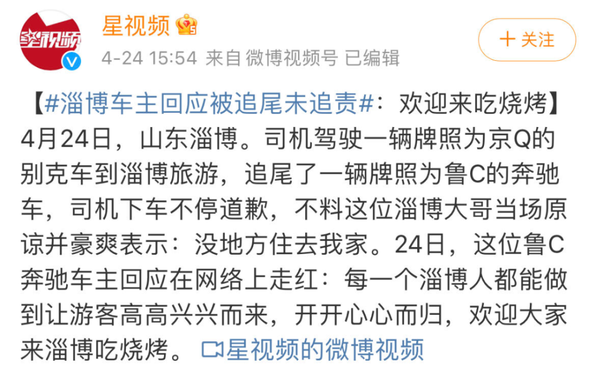
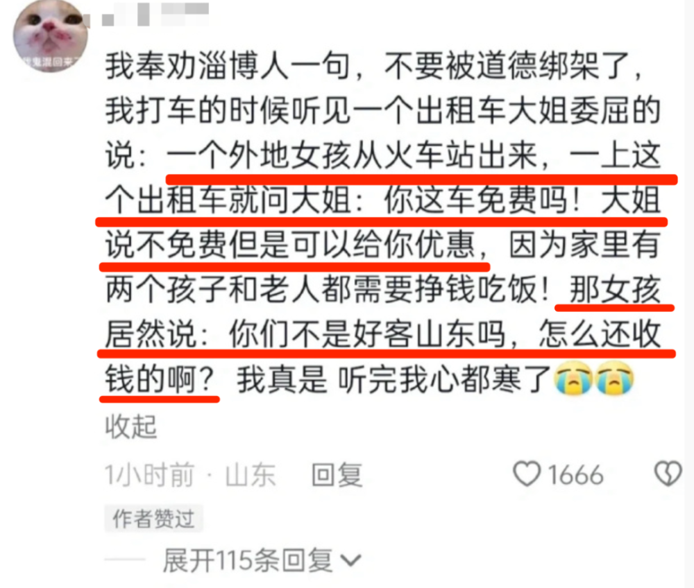
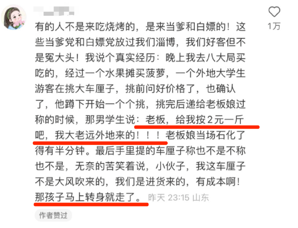
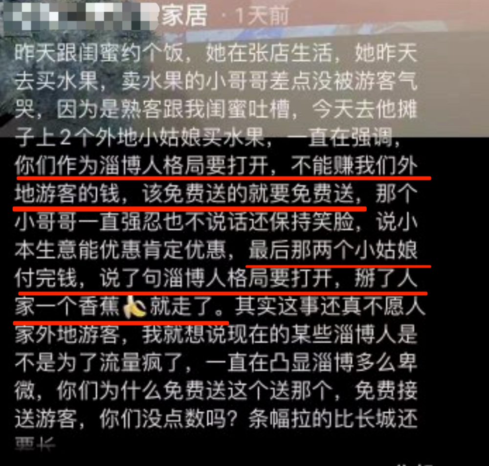
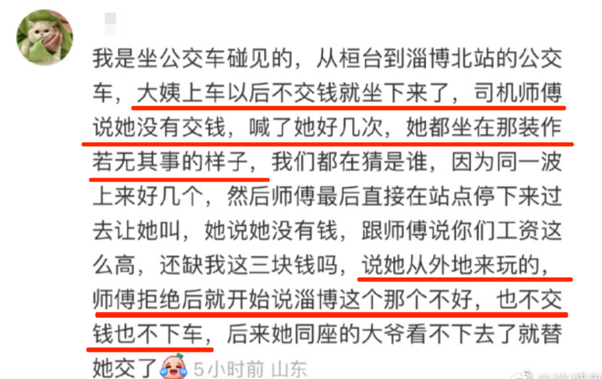
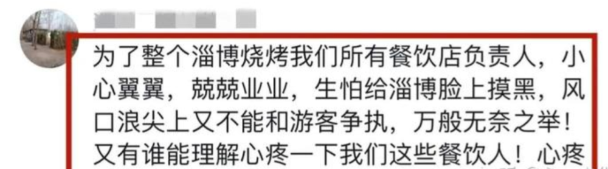
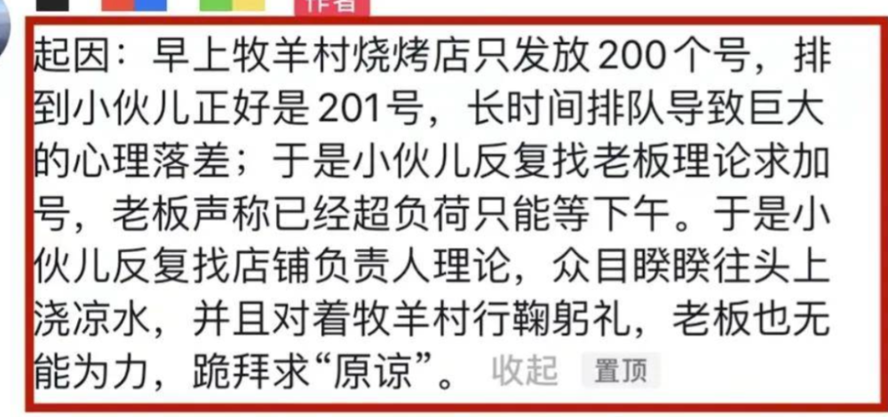
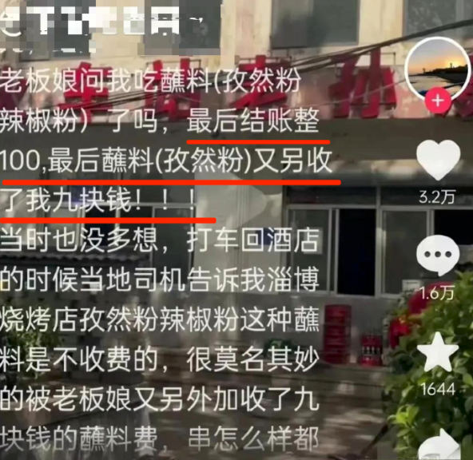
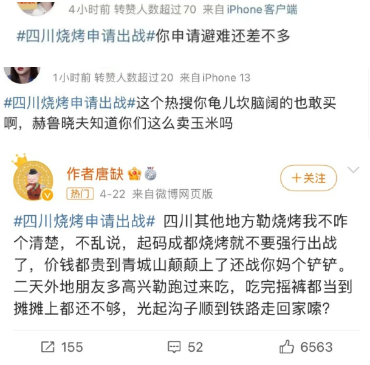

# 淄博人好客，但不代表要请客

这个月打开互联网，琳琅满目就三件事：淄博烧烤，淄博烧烤，还有淄博烧烤。

小葱小饼卷小串，已经成了烧烤2023版本的唯一答案。

五一旅游的主要矛盾，是人民群众去淄博的需求同淄博承受能力不足之间的矛盾。

好吃只能维持一时的热度，淄博成为烤串界的耶路撒冷，最大原因还是当地无微不至的服务，每一条都能刷爆好感度。

好客山东，好客中的好客，淄博。

淄博人的热情肉眼可见，有人拍了在淄博的不好的体验，下面一水的都是淄博人在道歉、店在哪里我去砸。

被来旅游的外地车追尾？没事，多吃点烧烤就够了。

大哥的好客和大度让人动容。

但看到满屏的类似新闻时，小白我心中隐隐担忧，会有游客视之为理所当然。

别人对你好是情分，不是本分。

并不是所有淄博人，都应该无条件答应旅客的所有、乃至不合理的需求。

做生意求利润天经地义，以好客之名要求对方放弃，何尝不是一种道德绑架。

好客，不代表要请客。

不合理的需求被拒绝，就开始和你扯宏大话题：

“格局要打开，不能赚我们外地游客的钱，该免费送就送。”

“格局打开”=“让我白嫖”，这个逻辑不对吧。

但某些人不管，你不让我白嫖，就是你这里的人，乃至这个城市有问题。

原本的赞美转变成抱怨，当初捧的有多用力，现在踩的就有多狠。

我不止一次刷到当地烧烤店老板说自己压力到了极点，有客流量突然加大的原因，也有“生怕给淄博抹黑”。

架的太高，不一定是件好事。

山东作为孔孟之乡，诞生过一个典故“子贡赎人”。

当年鲁国有一道法律：如果鲁国人在外国见到同胞沦落为奴隶，只要把这些人赎回来，就可以从国家那获得补偿和奖励。

孔子的学生子贡，把鲁国人从外国赎回来后拒绝了国家的补偿，本以为能得到孔子的赞赏，结果孔子痛骂了他一顿，感叹今后鲁国人不会从别国赎回奴隶了。

因为子贡把原本人人都能达到的道德标准，拔高到了大多数人难以企及的高度以后，谁还好意思去找国家要回赎金呢？

把道德的标准无限拔高，或者把个人的私德当作公德，会让道德更尴尬。

店老板做生意卖烧烤，只要合法合规不偷工减料，我不认为要再给他们加上其他的道德枷锁。

压力到临界点是会崩溃的。

26日淄博就发生了一件事，小伙因为排了一上午队没吃上烧烤，激动地找老板大闹。

没想到老板的情绪比他还激动，不顾众人阻拦当街下跪，恳求兄弟别再闹了。

店员介绍，老板和他们已经超负荷工作了一个月，每天只能睡4小时，之前挂牌说要休息三天，因慕名而来的食客不满投诉只休息了一天。

现在淄博在风口浪尖，他们不敢和顾客起争执，怕被人断章取义，破坏了淄博的形象。

当然，你也可以说烧烤店老板挣钱挣到手软，受点委屈有什么。

问题是，这样是可持续的么？

互联网时代，造神到毁神只在一瞬之间，今天众星捧月明天千夫所指。

像本是淄博烧烤代名词之一的“老孙烧烤”，前几天就突然“塌房”了。

有外地游客发视频抱怨，说这家店结账时反向抹零，多收了她9块钱。

好家伙，一下就炸了，店家每天接到上千个骚扰电话，短视频账号被谩骂淹没，官方要求停业接受调查，损失在十万元以上。

老板娘受不了录视频回击，她给出了店里的菜单价格，还直接给出了当时监控视频，小姑娘点了91块的东西没错，但中间她自己又去冰箱里拿了5块钱的饮料和3块钱的小饼，加上1块钱餐具费，正好就是100元。

小姑娘拿饮料的时候没有说，但结账的时候老板娘看了下餐桌就给她加上了。

随着五一的到来，可以想见类似的争端会只多不少。

每日涌进淄博的游客以百万级计算，什么人都不缺，相当可能继续出现往淄博朋友的热情上泼冷水的人。

超负荷的烧烤店，又能维持多久“量大良心热情服务态度好”的形象？

真的很希望淄博烧烤能走出其兴也勃焉、其亡也忽焉的怪圈。

更希望淄博的朋友心态放稳，不要被道德绑架，不得不去迎合无理需求。

我看四川人的心态就很好，就是有点太好了。

