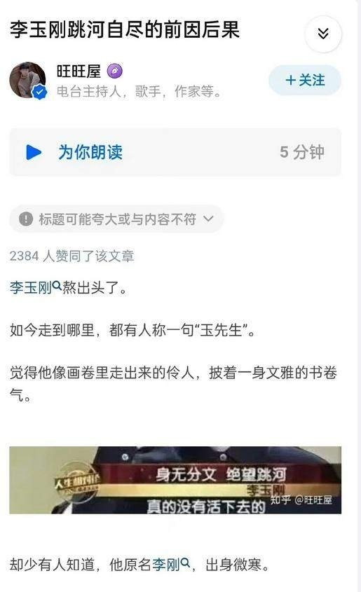

# 知乎回应推送“李玉刚跳河自尽”：将反馈给相关部门，进行核实处理

据九派新闻视频报道，4月27日，有不少网友反映收到知乎名为“李玉刚跳河自尽的前因后果”的推文。随后，李玉刚晒电影开机图回应：“电影尚未杀青，还没到宣传期呢？心直跳，冷静。看来以后内心得承得住。”

对此，记者致电知乎客服及举报投诉电话，工作人员称，将反馈给相关部门核实处理。

4月27日，不少网友晒出手机上收到的知乎推送截图，“李玉刚跳河自尽的前因后果”的标题十分醒目。

_知乎推送截图_

_内文截图_

推送截图在网上曝光后引发热议，相关话题火速登顶热搜榜，不少网友直呼“标题党真无语”。

4月27日中午，李玉刚本人发文回应：心直跳，冷静。看来以后内心得承得住。

公开资料显示，李玉刚1978年7月23日出生于吉林省长春市公主岭市，中国内地男歌手、艺术家，中国歌剧舞剧院国家一级演员，代表作有《新贵妃醉酒》《刚好遇见你》《万疆》等。

**【来源：九派新闻综合九派新闻视频、当事人账号等】**

