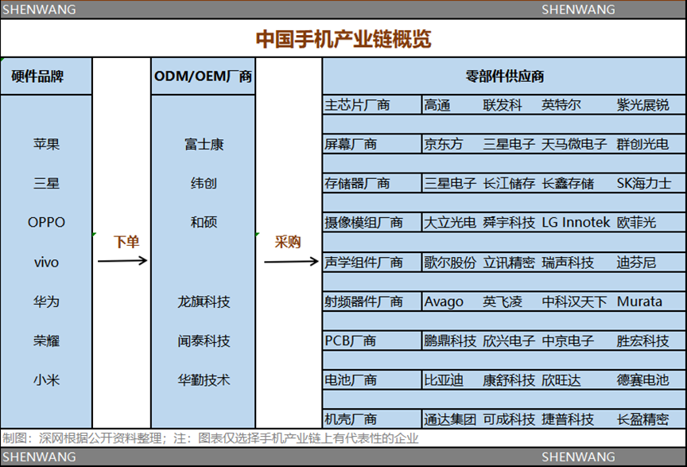
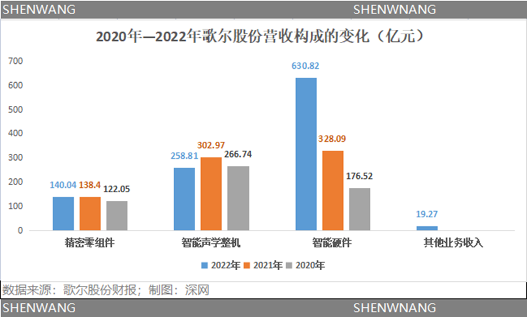
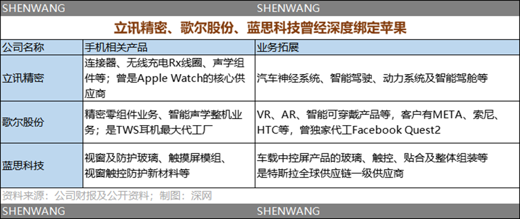
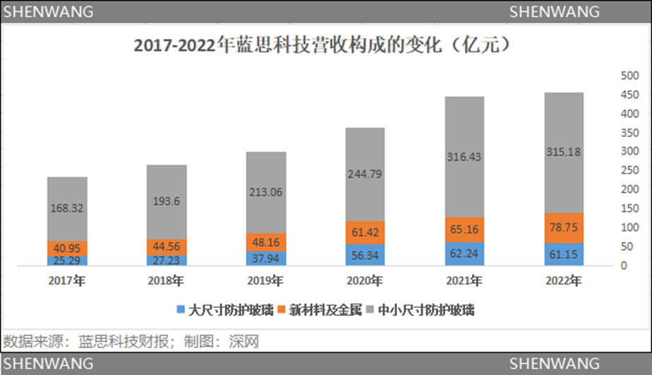
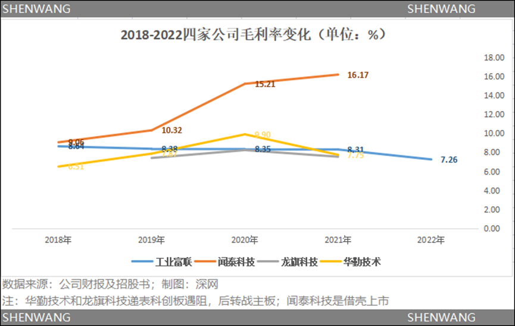

# 苹果代工厂停工停产，中国手机产业链谷底求生｜深网

_来源：视觉中国_

作者丨张睿

编辑丨康晓

出品丨深网·腾讯新闻小满工作室

在经历了近两年手机厂商去库存及砍单潮的重创后，国内代工厂和元器件厂商举步维艰。

4月26日，纬创通资（泰州）有限公司（以下简称纬创泰州）正式停工停产，昔日熙熙攘攘的厂区和宿舍生活区空无一人。一个月后，纬创泰州将和未转移至纬创昆山厂区的员工解除劳动合约，并支付补偿金。

纬创资通是苹果公司三大代工厂之一，纬创泰州此次的经营困境与苹果手机逐渐抛弃LCD屏幕、改用OLED屏有关。

在技术更迭频繁的消费电子行业，如果代工厂不能根据下游手机厂商的需求及时研发工艺、更新材料，就面临被淘汰的风险。

未能满足大客户的工艺需求仅是压倒纬创泰州的最后一根稻草。消费电子行业上下游产业链环环相扣，品牌厂商打一个“喷嚏”就能引起中上游供应链的“重感冒”。

由于手机产业链上下游存在时间差，供应链的备货周期一般比下游手机厂商提前3-6个月。这意味着，当手机卖不动时，供应链厂商的存货已经堆积，此时，降价处理或计提资产减值准备就成了唯一的办法。

这些动作反应在财报中，主要表现为营收、净利下滑及毛利率走低。

3月下旬至4月底，手机产业链相关企业陆续公布了2022年全年及2023年第一季度财报。从业绩上看，头部手机供应链企业都陷入“增收不增利”的泥潭，即便是“抱上苹果大腿”的“果链”也没能逃过净利润大幅下滑的窘境。

**“砍单”后遗症**

手机厂商的发展和供应链高度相关，一部手机囊括了几十家甚至上百家公司的产品。例如，高通、联发科的主芯片，三星、长江储存的储存卡，京东方的屏幕，舜宇科技的摄像模块，歌尔股份、立讯精密的声学组件等。

有供应链人士推算，安卓手机硬件成本是售价的50%-60%，其中，主芯片、显示屏、摄像头模组、声学组件占大头。

在这四个领域中，高通、京东方、舜宇科技、歌尔股份具有代表性。受手机厂商库存调整的影响，四家公司业绩跌至低谷。

在芯片领域，占了高端SoC芯片大半份额的高通也没能顶住手机寒冬的侵蚀。2023财年第一财季，高通手机芯片业务营收为57.54亿美元，同比下降18%。这直接导致高通半导体业务营收同比减少11%，税前利润同比下降30%。

高通将业绩下滑归因于终端手机需求低迷及下游手机厂商库存的调整，并预期库存调整期可能延续到今年上半年。

芯片之外，提供显示屏、摄像头模组、声学组件的核心供应链企业去年的业绩也不好看，普遍面临“增收不增利”的困境。

受手机厂商库存堆积、显示屏需求急剧下降的影响，京东方去年亏损17.37亿元。由于品牌端面板采购呈保守姿态，京东方2022年计提各项资产减值准备合计115.3亿元，减值损失共影响利润总额为-30.34亿元。

为手机厂商提供摄像模组的舜宇光学日子同样不好过。舜宇光学手机业务营收占比高达 70%，公司业绩严重依赖手机行业的周期表现。

去年一整年，安卓手机市场需求整体疲软，舜宇光学手机镜头和摄像模组出货量同比下降 17.2%和23.3%，这直接导致其2022年营收和净利润双双下滑。

“2023年一季度，镜头和摄像模组的出货量依然处于下滑状态，没有人知道市场转折点何时到来，国内一些光学厂商开始拓展汽车、VR/AR
等产品线以提升公司抗风险能力。”有供应链人士对《深网》透露。

第二增长曲线的长成需要时间，中短期内，智能手机行业的兴衰依然会左右核心供应链企业的业绩。

**苹果依赖症**

安卓手机市场疲软拖累上游供应链企业业绩，和苹果深度绑定的“果链”们同样踩了“大客户依赖症”的地雷。

歌尔股份以苹果耳机代工厂出名，智能声学整机业务主要承接了Airpods
系列产品。受苹果去年11月“砍单”的影响，歌尔股份去年智能声学整机业务营收为259亿元，同比2021年的303亿元，较少了44亿元。

去年11月，歌尔股份公告称，收到境外某大客户暂停生产其一款智能声学整机产品的通知，该款产品预计在2022年度内无法恢复正常生产发货。受此影响，歌尔股份相关存货部分出现呆滞，不得不大幅度低价卖出。另外，公司拟增加计提资产减值准备，损失预计约11-15亿元，其中存货跌价损失约7-9亿元，固定资产减值损失约4-6亿元。

据最新消息称，歌尔股份智能声学整机产品在2023年一季度仍未复产。与此同时，歌尔股份近期发生工商变更，新增虚拟现实设备制造业务。

铁打的苹果，流水的果链。为了分散供应链过于集中带来的风险，苹果不会任由一家供应商长期做大。虽然歌尔股份还在积极推动和苹果的合作，但2020年被移出“果链”的欧菲光已经为其发展提供了教训。

自2016年进入苹果供应链，到手机镜头模组出货量行业第一，欧菲光仅用了3年。2020年3月，欧菲光被移出“果链”，此后业绩一路下滑。2020年至2022年前三季度，欧菲光合计巨亏78亿元，2022年全年预亏41亿元至53亿元。

欧菲光的前车之鉴让“果链”们慢慢形成一个共识：他们在享受苹果高增长带来的红利的同时，也要承受苹果“砍单”带来的业绩下滑风险。

**为缓解“苹果依赖症”，不少“果链”企业未雨绸缪，开拓消费电子业务之外的第二增长曲线，曾以“果链”知名的立讯精密及蓝思科技的业务拓展已经略有成效。**

立讯精密于2011年切入苹果产业链，承接苹果手机的连接方案。3年后，立讯精密围绕Apple
Watch展开无线充电业务，成为后者的核心供应商。2018年，立讯精密进军声学领域，渗透苹果的Mac、iPad和iPhone产品。

在跟随苹果进行技术迭代的同时，立讯精密于2011年布局汽车电子业务，提供汽车线束、连接器等产品。2021年，立讯精密汽车互联产品及精密组件营收41.43亿元，位于消费电子（1346.38亿元）和电脑互联产品及精密组件（78.57亿元）之后。在消费电子行业萎靡的大背景下，立讯精密定下了成为全球汽车零部件Tier
1领导厂商的中长期目标。

靠绑定苹果成为“手机玻璃大王”的蓝思科技，很早就明白依赖苹果可能带来的风险。其多次在财报中提及“客户高度集中或给公司业绩带来不利影响”。

2015年，蓝思科技开始布局新能源汽车市场，为汽车厂商提供“大尺寸防护玻璃”相关产品。六年间，该业务营收翻了近3倍，从2017年的25.29亿元上升至2022年的61.15亿元。目前，蓝思科技是特斯拉一级供应商，并与保时捷、奔驰、现代、蔚来等20多家汽车品牌建立合作关系。

此外，蓝思科技也在探索金属、蓝宝石、陶瓷等新材料在汽车电子领域的应用。2017年，蓝思科技新材料及金属营收40.95亿元，2022年上升为78.75亿元，成为公司第二大收入来源。

**减少对苹果等大客户的依赖、探索第二条增长曲线，已经成为供应链企业突破消费电子业务天花板的标准路径，而夹在上游供应商和下游手机品牌之间的代工厂们却转型艰难，在手机存量时代踽踽前行。**

**转型艰难的代工厂**

在技术更迭频繁的消费电子行业，代工厂不仅要根据下游手机厂商的需求及时研发工艺、更新材料，还要忍受低毛利率、赚钱难的问题。

代工厂（涵盖ODM、OEM）的商业模式可以简单拆解为三步：收到下游品牌订单——采购芯片、镜头等元器件——在规定的时间内组装生产成整机。

虽然苹果等手机厂商会把部分零部件的谈判权和定价权交给了富士康等代工厂，但由于组装的技术壁垒低，ODM 厂商在整个手机产业链中并没有太多的话语权。

对比四大代工企业近5年的毛利率可以看出，除闻泰科技外，剩余3家公司的毛利率都为个位数。2021年，工业富联（富士康的上市主体）、闻泰科技、华勤技术、龙旗科技的毛利率分别为8.31%、16.17%、7.55%、7.75%。

需要指出的是，闻泰科技的毛利率从2019年开始攀升，是因为其2018年收购了安世半导体，从而带来公司综合毛利率的提升。2021年，闻泰科技整体的毛利率为16.17%，其中，半导体业务毛利率37.17%，ODM业务毛利率仅为8.71%。

代工厂的毛利率也受大客户毛利率的影响。华为之后，国内高端手机市场主要被苹果把持，龙旗科技等代工的手机多以400美元以下的中低端机为主，由于中低端手机利润空间小于高端机，这些代工厂赚的都是辛苦钱。

以龙旗科技为例。龙旗科技很大一部分订单来自小米。据其招股书显示，2019
至2022年上半年，小米为其贡献的营收占比分别为12.52%、41.96%、57.66%和 49.20%，而公司向小米销售的综合毛利率分别为
7.38%、8.24%、7.10%和6.18%。如果未来龙旗科技向小米销售的毛利率显著下降，那么公司整体毛利率水平将受到不利影响。

需要指出的是，毛利率低、公司业绩波动性较大也是龙旗科技、华勤技术折戟科创板的原因之一。目前，消费电子市场萎靡，再叠加部分大客户压价打价格战，龙旗科技、华勤技术能否在主板成功上市还存在诸多变数。

当然另一方面，随着手机市场逐渐跌至谷底，也出现了反弹的迹象。进入二季度后，闻泰科技拿到“大单”的消息，让身处消费电子寒冬的手机供应链厂商感到一丝暖意。

4月5日，闻泰科技在官方公众号中确认，公司成功拿下三星2023年度手机及平板产品的ODM订单。虽然闻泰科技并没有透露订单的详细数量，但这也间接证实了半个月前传出的闻泰科技与三星签订4500万部（2500万部手机+2000万部平板电脑）ODM产品订单的消息。

作为链接下游手机厂商及上游供应链的中间环节，ODM厂商的兴衰是智能手机行业景气度的晴雨表。闻泰科技拿下三星订单向市场释放了一个信号，经历去年下游手机厂商去库存及“砍单潮”后，手机产业链出现回暖迹象。

“在去年手机厂商相继砍单后，三星释放的这个大订单对ODM产业来说确实是利好消息。但目前手机市场总体需求依然疲软，缺少订单仍然是不少供应链企业面临的困境。”一位手机供应链从业者对《深网》表示。

