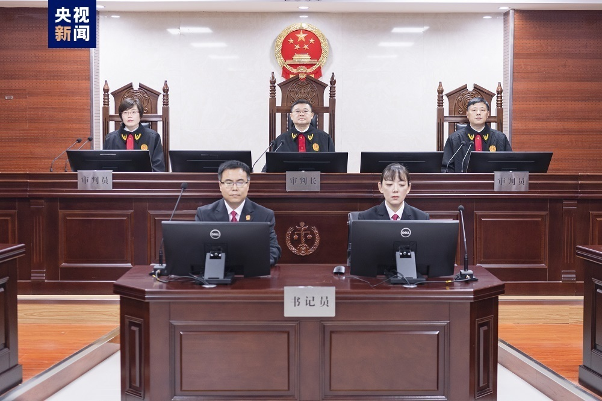
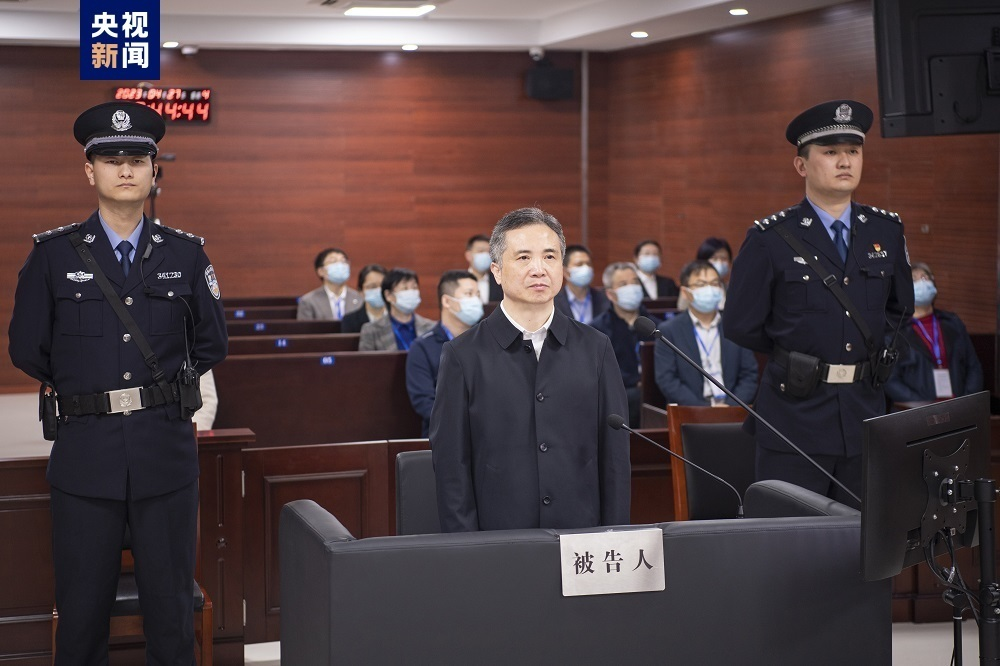
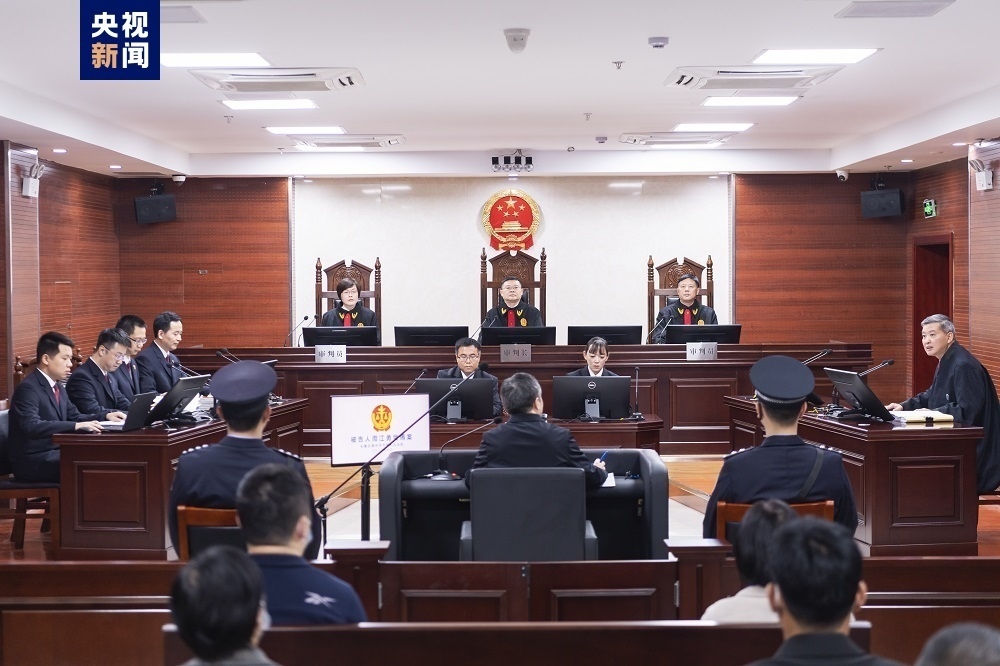

# 被控受贿1.93亿余元！杭州市委原书记周江勇受贿案一审开庭

2023年4月27日，安徽省滁州市中级人民法院一审公开开庭审理了浙江省委原常委、杭州市委原书记周江勇受贿一案。

安徽省滁州市人民检察院指控：2001年至2021年，被告人周江勇利用担任浙江省鄞县副县长，象山县县长、县委书记，宁波市委常委、宁波杭州湾新区开发建设管委会党工委书记，舟山市市长、市委书记，浙江省委常委、温州市委书记，浙江省委常委、杭州市委书记等职务上的便利以及职权、地位形成的便利条件，为相关单位和个人在工程建设、项目承揽、土地获取等事项上提供帮助，直接或者通过其亲属非法收受他人财物，共计折合人民币1.93亿余元。检察机关提请以受贿罪追究周江勇的刑事责任。

庭审中，检察机关出示了相关证据，被告人周江勇及其辩护人进行了质证，控辩双方在法庭主持下充分发表了辩论意见，周江勇进行了最后陈述并当庭表示认罪悔罪。庭审最后，法庭宣布休庭，择期宣判。

人大代表、政协委员、新闻记者和各界群众30余人旁听了庭审。

（央视）

