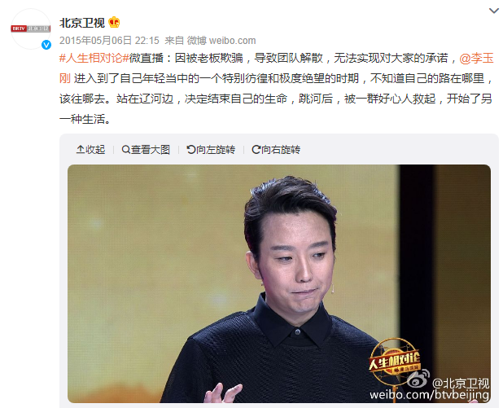
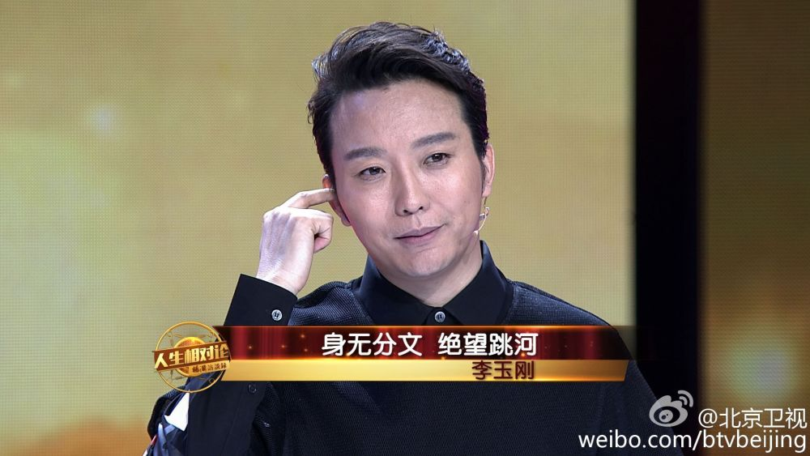

# 被推送“跳河自尽前因后果”，李玉刚：电影尚未杀青，心在跳，冷静

今（27）日上午，有网友晒出一张手机APP推送截图：“李玉刚跳河自尽的前因后果”，引发一众网友热议：李玉刚出事了？啥事让他想不开？

然而，点开推送文章一看，里面说的却是李玉刚在出道前，曾因失业贫困看不到生活的希望，而选择跳河。但幸运的是，他被一群好心人救了起来。之后，李玉刚重新站了起来，开启了新的人生。

这段经历，李玉刚早在2015年北京卫视《人生相对论》的采访中就分享过了。

对此“标题党”，有网友表示，“估计李玉刚一觉醒来，都得被自己的新闻吓醒。”“我早上也被推送了这个，吓我一大跳……”“这年头没有一个奇葩的标题就蹭不到流量是吧？”

刚刚，李玉刚通过微博回应称，“突然热搜第一！电影尚未杀青，还没到宣传期呢？心直跳，冷静。看来以后内心得承得住。”

编辑 李洁

