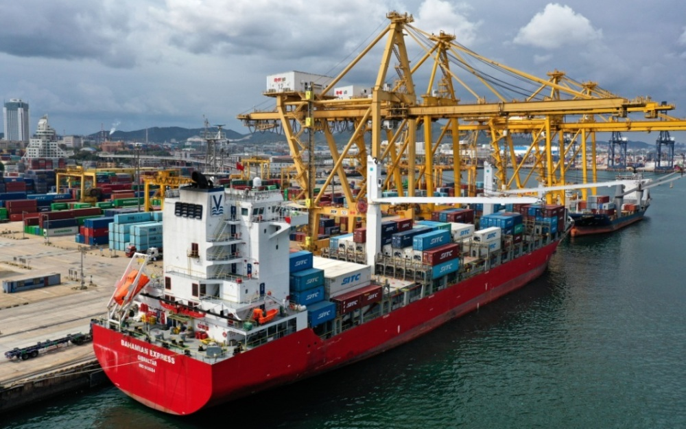
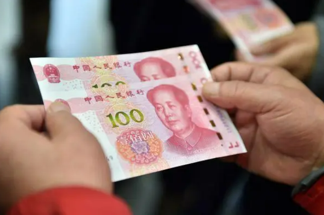

# 阿根廷官宣人民币结算，一种大变局正在发生

_▲资料图。图/新华社_

4月26日，阿根廷经济部长马萨在新闻发布会上宣布，阿根廷在中国进口商品贸易中将使用人民币结算，阿根廷4月自中国进口的价值10.4亿美元商品将改用人民币支付。此外，预计5月进口的价值7.9亿美元的商品也将使用人民币支付。

近来，除了阿根廷，巴西、俄罗斯、沙特、法国等多个国家都宣布了用人民币结算的相关消息，目前全球启用人民币结算的国家已上升到了30个。人民币近期为何如此火爆？

双重驱动的结果

近期人民币火爆的背后，是双重因素共同作的结果。

第一重驱动因素是中国经济顺利开始修复性复苏，增加了人民币的国际信用。尽管一些宏观数据仍存隐忧，但一季度中国GDP同比增长4.5%，超出此前预期的4%，显示出迅速企稳回升的势头。

国际机构为此纷纷调高了对中国经济增长的预期。世界银行预计中国今年的经济增速将达到5.1%，高于年初预计的4.1%，国际货币基金组织的预计是5.2%，摩根士丹利的预计是5.7%，德意志银行的预计是6%。

对于中国经济前景的乐观估计不止于今年。国际货币基金组织最新发布的《世界经济展望》认为，在未来五年（2023年至2028年），中国对全球GDP增量的贡献预计将达到22.6%，两倍于美国。

而一季度中国经济的表现，也远远好过排名在人民币之前的国际主要货币发行国，这进一步支撑起了人民币的国际信用。

第二重驱动，是中国近来主动加大了跨境贸易中使用人民币结算的力度。据彭博社4月26日报道，今年3月，人民币在中国跨境贸易中所占份额上升到创纪录的48%，首次超越了美元（美元为47%）。

而在2010年时，中国跨境贸易中人民币的使用近乎为零，美元所占份额高达83%。

可以肯定，阿根廷等国在中国进口贸易中启用人民币结算，将进一步扩大中国跨境贸易中人民币使用的比例。

_▲人民币。图/新华社_

美元武器化助推人民币国际化

往前追溯，从去年出现的去美元化浪潮也成为人民币国际化的重要助力。

去美元化浪潮的兴起是美国将美元武器化的结果。标志性事件有两个。

一是去年2月俄乌冲突发生后，美国将俄罗斯驱逐出环球银行间金融通信协会（SWIFT）系统，冻结了俄罗斯6000亿美元的外汇储备，令全球不少国家感到震惊。

为了市场操作便利，许多国家的外汇储备存放于美国，多数国家外汇储备配置大量美债，而美债只能在美国交易，这让美国能够随意冻结他国资产。

冻结俄罗斯外汇储备之举令不少国家考虑改变外储结构。今年以来，全球至少有16个国家大量出售美国国债。其中除了中国、沙特外，不乏德国、法国、以色列、日本这样美国的传统盟友，这些都是各国在美国将美元政治化后作出的反应。

二是美元从大规模放水改为暴力升息，开启了利用“美元潮汐”收割其他国家资产财富的又一个周期。

“美元潮汐”对于国际经济造成的冲击是全方位的。特别是对国际贸易体系、资本完全开放国、生产国和资源国造成的冲击尤其巨大。

美元对国际贸易体系的冲击好理解。通常都不是当期结算，美元大幅升值或贬值必定会给国际贸易中的一方带来巨大的汇率风险。

美元对于资本完全开放国的冲击过程是，当美元降息时，大量美元流入资本完全开放国炒高资产价格，美国坐收渔利。

美元暴力升值后，大量美元回流，导致资本开放国金融市场崩溃，资产价格暴跌，美元再回头收割廉价优质资产。

至于生产国和资源国，通常是有能力获得大量美元的国家，自然也是 “美元潮汐”紧盯的对象。

所以不难理解，近期启用人民币结算的国家，大多是资源国。资源国和中国这个全球最大制造国，在追求国际货币多元化方面可以说是天然盟友。

_▲印尼采购商朱丽娅·哈桑（中）在第133届广交会二期孕婴童展区了解婴儿装产品。图/新华社_

对美元霸权说“不”

一些评论认为，去美元化浪潮的兴起和人民币的火爆意味着取代美元的一天终将到来。

从历史数据看，美元确实是在衰败当中。美元鼎盛时期出现在1950年代和1980年代。1950年代美元占各国央行外汇储备的比例高达80%以上，如今降到了58%；1980年代时，美元在全球支付中的占比也曾高达80%以上，而根据SWIFT系统2023年2月的月报数据，在SWIFT系统中，美元的占比是41.1%。

虽然美元衰落的趋势逐渐在显现，但客观来说，解构美元霸权还是一个长期的过程。近期出现的去美元化浪潮，准确地说也不是要取代美元，而是大家集体在对美元霸权说“不”。

伴随中国经济的增长，人民币现在也初步具备了一定的国际地位。

在储备货币方面，截至2022年第四季度，人民币在全球外汇储备中的占比约为2.7%，排名第五；在支付货币方面，环球银行间金融通信协会（SWIFT）数据显示，2023年2月人民币国际支付份额约为2.19%，也排名全球第五大支付货币。

在双边货币互换方面，截至2021年末，中国已经与40个国家和地区签署了双边本币互换协议，总金额超过4万亿元。双边本币互换正是激活人民币结算的重要一环。

在可见的未来，人民币的目标也不是取代美元，而是成为国际货币多元化中的重要一极。

最近，金砖国家在讨论建立金砖储备货币R5（金砖国家货币名称都以R开头），马来西亚总理安瓦尔建议成立“亚洲货币基金组织”，东盟国家提出要推行本币结算。

在人民币不可自由兑换的现实条件下，推动人民币结算、推动建立区域性的非美货币体系，是人民币现在和今后相当长一段时间可以做且能做好的事。

撰稿/徐秦（专栏作家）

编辑/迟道华

校对/吴兴发

