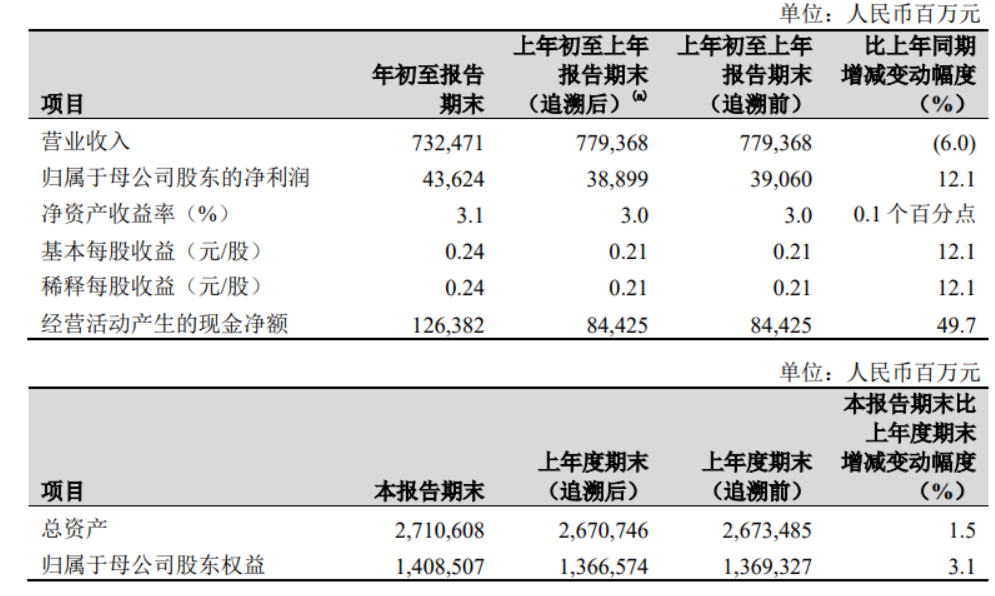
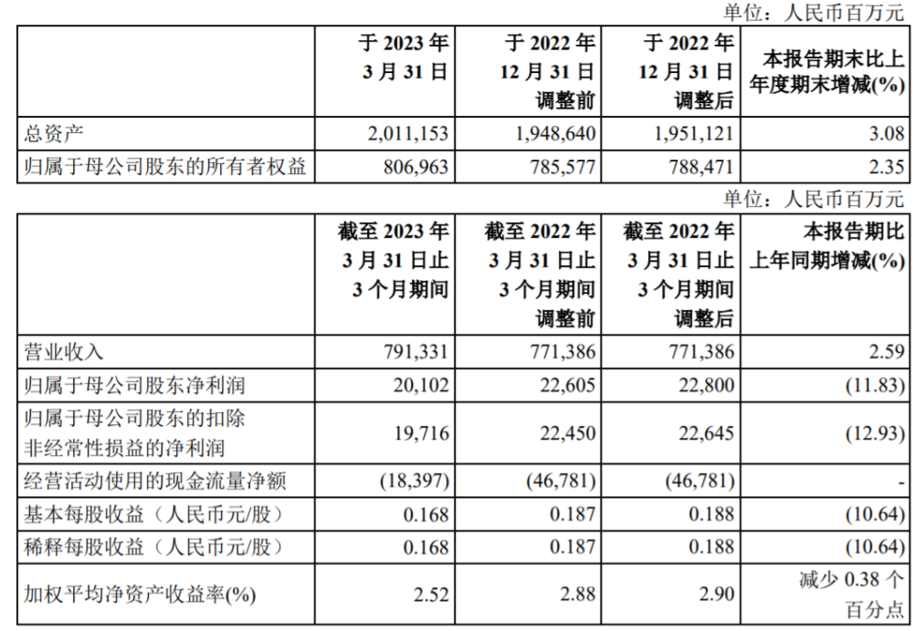
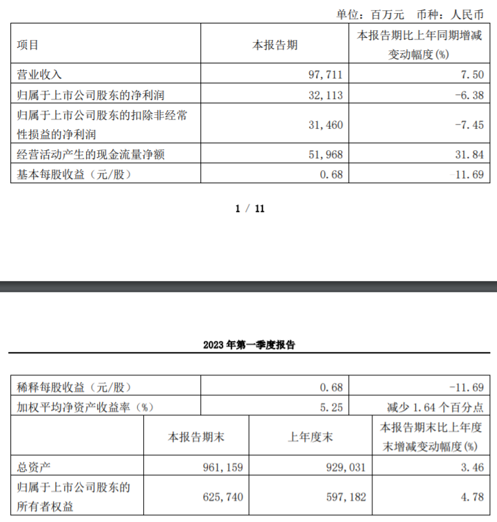

# “三桶油”一季度成绩单：中石油净利增长12％，中石化中海油净利下滑

4月28日，中国石油发布2023年第一季度业绩报告。值得注意的是，昨日晚间，中国石化和中国海油也相继发布了2023年第一季度业绩报告。至此，“三桶油”均交出了一季度成绩单。

中国石油公告披露，一季度实现营业收入7324.71亿元，同比下降6.0%；归属于母公司股东的净利润436.24亿元，同比增长12.1%。

中国石油表示，公司在国际油价同比下降的情况下，经营业绩保持增长，财务状况健康良好。主要由于主要油气产品国内销量增加以及集团提质增效工作持续深入开展。

中国石化披露，一季度实现营业收入7913.31亿元，同比增长2.59%；归属于母公司股东的净利润201.02亿元，同比下降11.83%。

中国海油公告，一季度实现营收977.11亿元，同比增长7.50%；归属于上市公司股东的净利润321.13亿元，同比下降6.38%。

