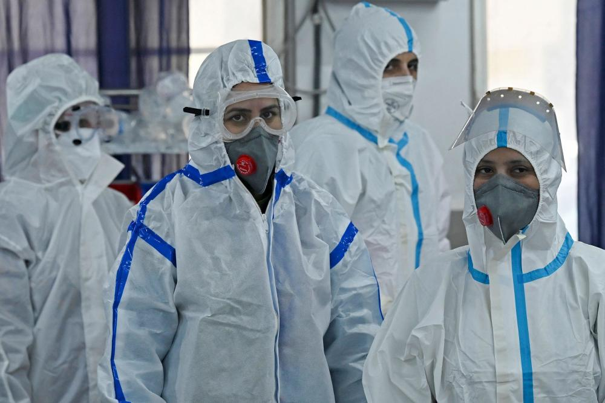

# 专家：下一场大流行或比新冠更糟糕 奥密克戎或演变成更具杀伤力毒株

参考消息网4月27日报道据美国《财富》杂志网站4月26日报道，专家警告说，与新冠相比，下一场疾病大流行可能“具有同等传染性，但致命性强得多”，令新冠看起来像小菜一碟。

一名专家25日在加利福尼亚州马里纳德尔雷举行的《财富》健康头脑风暴会议上警告说，下一场大流行可能会让新冠看起来像小菜一碟。

加利福尼亚大学旧金山分校医学系主任罗伯特·瓦赫特博士指出，新冠肺炎是一种“非常糟糕的大流行”，迄今为止仅在美国就造成110多万人死亡。

在谈到下一场大流行时，瓦赫特说他“非常担心”，它可能比新冠肺炎更糟糕。

瓦赫特并非唯一持这种看法的专家。

专家们警告说，具有超级传播能力的 **奥密克戎** 毒株有可能演变为更具杀伤力的毒株，尽管无法确定这种可能性有多大，或者这种演变何时可能发生。

引发下一场大流行的病原体可能根本不是冠状病毒。鉴于 **禽流感**
在哺乳动物中传播的情况越来越多，而且最近在世界不同地区出现了数例人类感染病例，专家们正在密切关注多种禽流感病毒。

出现一种全新病原体也是完全有可能的。世卫组织公布的有可能引发疫情和大流行的“首选病原体”名单就包括代表未知威胁的“疾病X”。

这份名单上还包括克里米亚－刚果出血热、埃博拉和马尔堡病毒、拉沙热、非典、中东呼吸综合征和新冠、亨尼帕病毒和裂谷热。根据世卫组织的说法，这份名单上一次更新是在2019年，修订后的名单将于今年公布。（编译/涂颀）

（来源：参考消息网）

