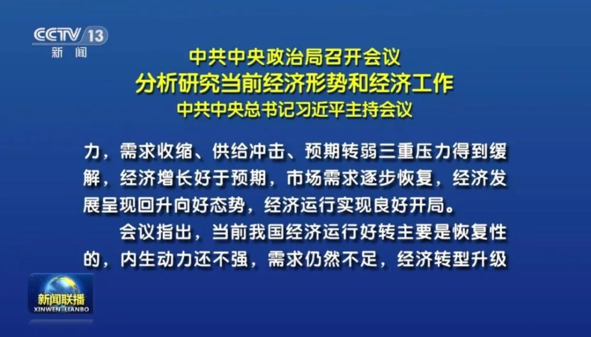
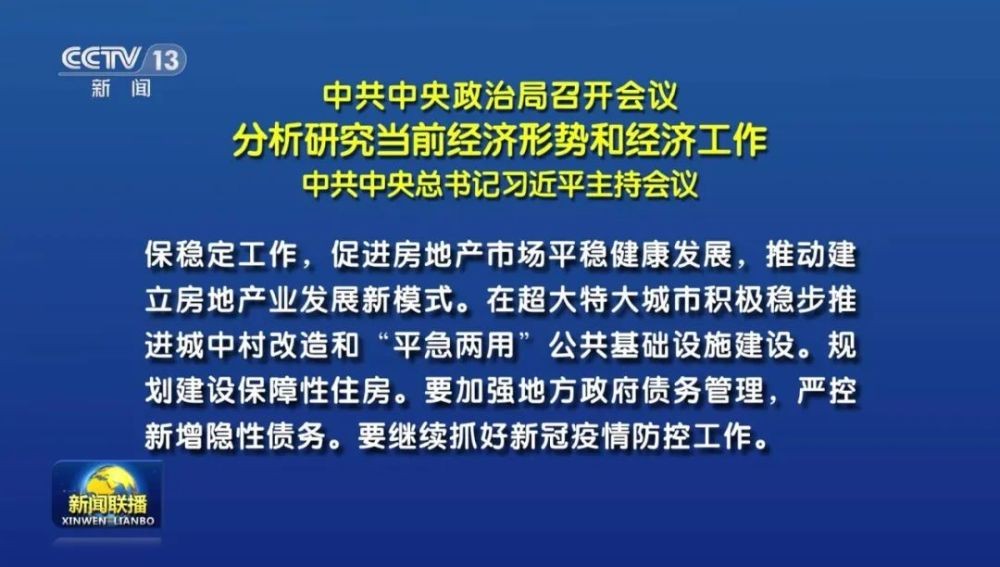

# 中央政治局重磅会议，对形势的判断措辞有变

**撰文 | 蔡迩一**

据新华社报道，4月28日，中共中央政治局召开会议，分析研究当前经济形势和经济工作。中共中央总书记习近平主持会议。

按照惯例，每年4月的中央政治局会议，是全国两会之后中央层面讨论经济工作的重要会议，被外界视为是市场理解政策走向的重要窗口。

这次的政治局会议提出，三重压力得到缓解、经济增长好于预期，但同时强调需求和内生动力不足。

**措辞变化**

本次会议，对当前的经济形势作了最新判断。

会议提到，我国疫情防控取得重大决定性胜利，经济社会全面恢复常态化运行，宏观政策靠前协同发力， **需求收缩、供给冲击、预期转弱三重压力得到缓解**
，经济增长 **好于预期** ，市场需求 **逐步恢复** ，经济发展呈现 **回升向好** 态势，经济运行实现 **良好开局** 。

划重点，需求收缩、供给冲击、预期转弱三重压力得到缓解。

与去年底的中央经济工作会议相比，本次会议对经济形势的判断措辞有了明显变化。

2022年12月15日至16日，中央经济工作会议在北京举行。那次会议提到，当前我国经济恢复的基础尚不牢固，
**需求收缩、供给冲击、预期转弱三重压力仍然较大。**

措辞变化的背后有数据支撑。

今年4月18日，国家统计局新闻发言人、国民经济综合统计司司长付凌晖在发布会上在提到一季度经济运行情况时，用了“开局良好”四个字。

他说，一季度国内生产总值284997亿元，按不变价格计算，同比增长4.5%，比上年四季度环比增长2.2%。

4月19日，在谈到当前宏观经济运行的特点时，国家发改委新闻发言人孟玮概括为 **“需求扩大、供给恢复、预期改善”。**

虽然三重压力得到缓解，但当前经济仍然存在阻力。

4月28日的政治局会议指出：

当前我国经济运行好转主要是 **恢复性的** ，内生动力还不强， **需求仍然不足** ，经济转型升级面临 **新的阻力**
，推动高质量发展仍需要克服不少困难挑战。

**“平急两用”**

这次会议再度强调了“房住不炒”。

会议指出：

要坚持房子是用来住的、不是用来炒的定位，因城施策， **支持刚性和改善性住房需求** ，做好保交楼、保民生、保稳定工作，促进房地产市场平稳健康发展，
**推动建立房地产业发展新模式。**

在超大特大城市积极稳步推进城中村改造和 **“平急两用”公共基础设施建设** 。

规划建设保障性住房。

其一，“确保房地产市场平稳发展”一直是住建部方面的重点工作。

今年1月，住建部党组书记、部长倪虹在接受媒体采访时说，当前，房地产市场 **已经从解决“有没有”转向解决“好不好”的发展阶段**
，提升住房品质、让老百姓住上更好的房子，是房地产市场高质量发展的必然要求。

他还提到，“对购买第一套住房的，要大力支持。首付比例、首套利率该降的，都要降下来。对购买第二套住房的，要合理支持。以旧换新、以小换大、生育多子女家庭都要给予政策支持。对购买三套以上住房，原则上不支持，
**就是不给投机炒房者重新入市留有空间** 。”

同时，他提到，以“慢撒气”的方式，稳妥化解房企资金链断裂风险。重点是增加房企开发贷、并购贷和购房人的按揭贷，满足合理融资需求。

第二，这次会议还提到，在超大特大城市积极稳步推进城中村改造和“平急两用”公共基础设施建设。

这是中央层面的会议首次提到“平急两用”公共基础设施建设。

今年4月，国家发展改革委“平急两用”设施建设现场会在北京市平谷区举办。

据国家发改委披露，当时，农业农村部、国家疾控局等7个部门，国家开发银行， **广州、成都、西安等21个超大特大城市及所在省份相关负责人参加**
，有关城市作经验交流。

那次现场会提到，“平急两用”型设施，平时用作旅游、康养等，重大公共事件突发时立即转换为隔离收治设施。建设改造一批“平急两用”的民宿和酒店、储备一批单体大型方舱医院、升级一批应急医疗服务点。

上述现场会还特别提到， **严防资本无序渗透** ，严禁破坏生态环境。

**促消费、稳就业**

促消费、稳就业是本次政治局会议经济工作部署重点领域。

4月19日，国家发改委新闻发言人孟玮透露， **国家发改委正在抓紧研究起草关于恢复和扩大消费的政策文件。**

孟玮说，“主要是围绕 **稳定大宗消费、提升服务消费、拓展农村消费**
等重点领域，根据不同收入群体、不同消费品类的需求制定有针对性的政策举措，推动消费平稳增长。”

会议还提到，恢复和扩大需求是当前经济持续回升向好的关键所在。 **积极的财政政策要加力提效，稳健的货币政策要精准有力，形成扩大需求的合力。**

本次政治局会议提到了不少针对性的措施，比如：

要多渠道增加城乡居民收入，改善消费环境， **促进文化旅游等服务消费** 。

要发挥好政府投资和政策激励的引导作用， **有效带动激发民间投资** 。

要强化 **就业优先** 导向，扩大高校毕业生就业渠道，稳定农民工等重点群体就业。

另外，政知君还注意到，4月以来，连续两场国常会重点部署稳就业工作。

4月7日召开的国常会强调，目前高校毕业生就业已进入关键阶段，要不断优化完善相关稳就业政策，加大对吸纳高校毕业生数量多的企业的政策、资金支持，深入实施“三支一扶”等计划，推动应届毕业生多渠道就业。

4月14日召开的国常会听取了“当前就业形势和优化调整稳就业政策措施的汇报”。会议指出，在保持稳就业政策总体稳定的同时，有针对性优化调整阶段性政策并加大薄弱环节支持力度，确保就业大局稳定。

**积极表态**

除了上述几点之外，本次会议在扩大内需、新能源、平台企业等领域有积极的表态：

要加快建设以 **实体经济为支撑** 的现代化产业体系，既要逆势而上，在短板领域加快突破，也要顺势而为，在优势领域做大做强。

要巩固和扩大 **新能源汽车** 发展优势，加快推进充电桩、储能等设施建设和配套电网改造。

要重视 **通用人工智能** 发展，营造创新生态，重视防范风险。

持续 **提振经营主体信心** ，帮助企业恢复元气。

要下决心从根本上 **解决企业账款拖欠问题** 。

要推动平台企业规范健康发展， **鼓励头部平台企业探索创新。**

要支持有条件的自贸试验区和自由贸易港对接国际高标准经贸规则，开展改革开放先行先试。

会议还明确，各级领导干部要带头大兴调查研究，奔着问题去，切实帮助企业和基层解决困难。

**资料 ｜ 新华社 人民网 央视等**

**【版权声明】本文著作权归政知新媒体独家所有，未经授权，不得转载。**

