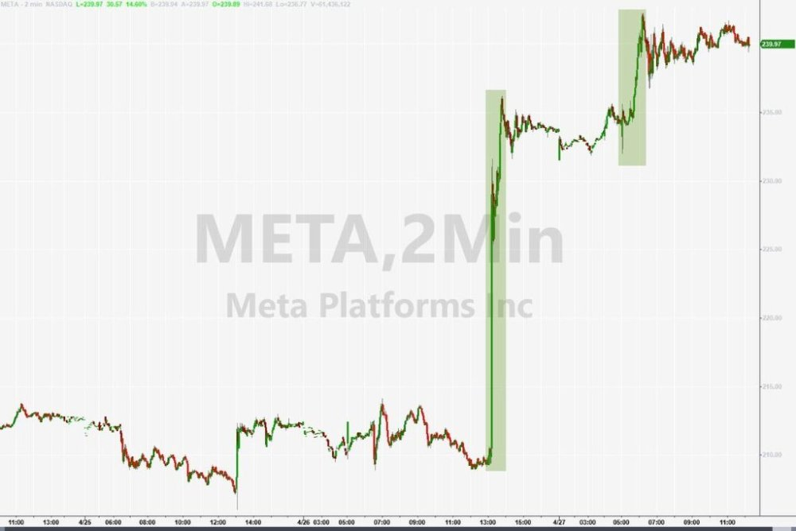
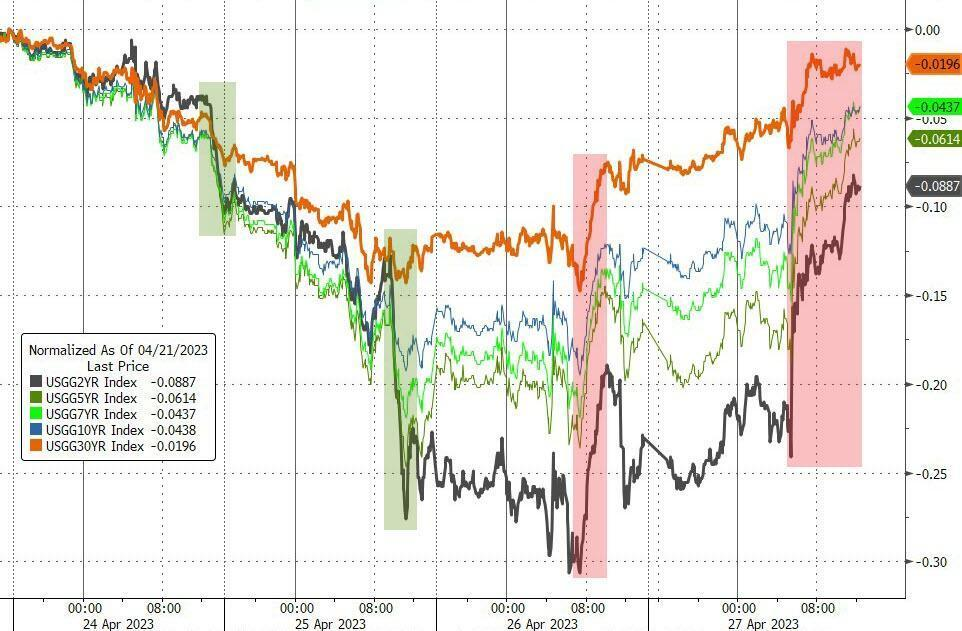
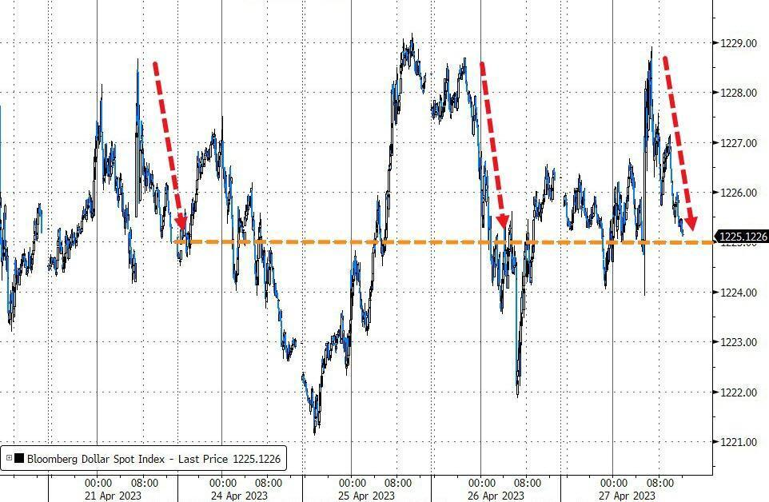
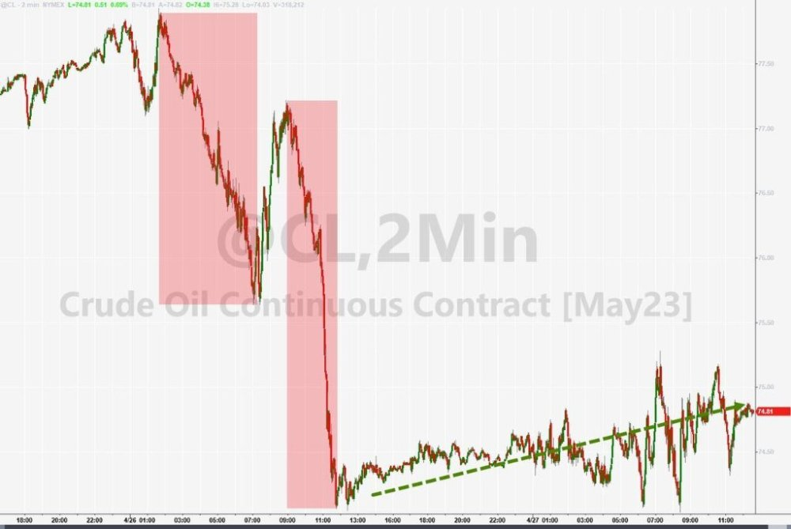
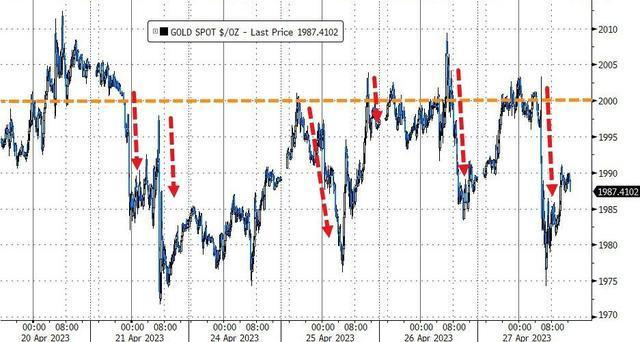

# 季报压倒滞胀担忧，美股大涨，纳指涨超2％，Meta狂飙14％

新近公布的经济数据喜忧参半，但向好的企业财报暂时影响更胜一筹，美股周四高开高走，标普和道指均创年初公布12月非农就业薪资增长超预期放缓以来最大日涨幅，纳指一个多月来首次一日涨超2%。

周四公布的美国一季度GDP年化增长1.1%，超预期放缓，暗示美联储紧缩周期可能接近尾声。虽然消费者支出创近两年来最强劲表现，但企业投资不愠不火和库存回落拖累了GDP增长。

同时，美联储高度关注的通胀指标核心个人消费支出（PCE）物价指数一季度环比增长4.9%，为一年来最高增速，连续五个季度较预期强劲。通胀和消费者支出数据可能令美联储保持继续加息25个基点的步伐。有评论称，经济增长下滑，通胀保持高位，这是最坏的结果，令人开始担心滞胀成真。

不过，本周公布财报的科技巨头大多表现不错，成为周四美股走高的最大推手。继谷歌和微软一季度业绩优于预期之后，Meta周三盘后和亚马逊周四盘后公布的一季度收入和利润双双优于预期，Meta一季度营收不降反增、扭转三个季度连降势头，二季度指引也高于预期，亚马逊云和广告业务均较预期强劲。

评论称，企业开始收获提前注重成本效益的成果，科技业的反应最为明显，在投资者情绪仍脆弱之际，财报能看到企业总体的健康状况，这是他们急需的可见性。还有评论称，以往经济衰退时，劳动力市场会随着GDP崩溃，可目前并非如此，今年二季度的确可能衰退，但还是要看数据的情况。

超预期强劲的美国核心PCE物价指数公布后，美元指数迅速抹平跌幅转涨，摆脱跌向周三所创一年低位的危险；美国国债价格加速回落、收益率盘中拉升，对利率前景敏感度的2年期美债收益率盘中升幅扩大到10个基点以上，远离周三所创的两周多来低位。

大宗商品中，美国GDP和PCE指数公布后，黄金盘中转跌，虽然纽约期金最终收涨，但未能收复2000美元整数位心理关口。评论认为，对衰退的担忧可能挫伤贵金属的需求，下周美联储会议以前，黄金可能主要倾向盘整，不过，银行业的问题将限制金价的跌势。周三因银行业担忧大跌的原油反弹，评论称，即使周三公布的上周美国EIA原油库存降幅远超预期，也没能助油价盘中转涨，这确认了，对经济前景的担忧继续主导油市。

标普道指创三个多月最大涨幅，Meta创近三个月最大涨幅 所在板块领涨 第一共和银行大反弹

三大美国股指周四总体高开高走，盘中至少涨超1%。纳斯达克综合指数盘初即涨超1%，午盘刷新日高时，纳指涨超2.5%，标普500指数涨幅略超过2%，道琼斯工业平均指数涨近560点、涨近1.7%。最终，三大指数本周首度集体收涨，标普和道指结束两日连跌，纳指连涨两日。

纳指收涨2.43%，创3月16日以来最大涨幅，报12142.24点，创4月19日上周三以来收盘新高。标普收涨1.96%，报4135.35点，走出截至周三连续两日所创的3月30日以来收盘低位。截至周三连跌两日至3月31日以来低位的道指收涨524.29点，涨幅1.57%，报33826.16点，和标普均创1月6日公布12月美国非农就业报告当天以来最大涨幅，均接近抹平本周前三日所有跌幅。

科技股为重的纳斯达克100指数收涨2.76%，创1月20日以来最大涨幅，连涨两日至3月31日以来高位，连续两日跑赢大盘。价值股为主的小盘股指罗素2000收涨1.2%，告别连跌三日所创的3月23日以来低位。

_主要美股指周四走势_

标普500各大板块全线收涨，除了涨超0.4%的能源和涨0.5%的医疗外，其他板块至少涨逾1%。Meta所在的通信服务板块涨5.5%，涨幅遥遥领先其他板块，亚马逊所在的非必需消费品板块涨近2.8%，房产和微软所在的IT板块都涨超2%。

龙头科技股盘中至少涨近2%。周三连跌三日至1月25日以来低位的特斯拉收涨4.2%，抹平周三多数跌幅。FAANMG六大科技股中，在周三公布一季度业绩优于预期且扎克伯格强调AI推动业绩、AI是主要抓手之一后，Facebook母公司Meta跳空高开逾14%，盘中曾涨超15%，收涨约14%，创2月2日四季度财报公布次日以来最大涨幅，创去年2月2日以来收盘新高；亚马逊收涨4.6%，盘后公布财报后，盘后先加速上涨，涨幅曾超过10%，后逐步回落，目前转跌；
连跌两日、一再刷新3月31日以来低位的谷歌母公司Alphabet收涨3.7%，涨至4月14日以来高位；公布一季报后周三大涨逾7%的微软收涨3.2%，创去年4月初以来新高；周三大致收平的苹果收涨2.8%，涨至去年8月以来高位；周三连跌两日、刷新3月23日以来低位的奈飞涨近1.5%。

_Meta周三盘后公布财报后周四大涨_

芯片股在总体连跌五日后连涨两日，但未能继续跑赢大盘。费城半导体指数和半导体行业ETF
SOXX分别收涨0.6和0.4%。标普500的IT板块成份股中，AMD、美光科技、应用材料收涨逾1%，英伟达收涨1%，而安森美收跌逾2%，高通跌0.2%，收涨2.8%的英特尔盘后公布一季度亏损低于预期、仍创史上最大亏损、营收连续五个季度下滑，英特尔盘后先曾涨超4%，后迅速转跌，一度跌近3%。

银行股总体反弹。银行业指标KBW银行指数（BKX）盘中涨超1%，势将终结五日连跌、脱离五周低位；地区银行指数KBW Nasdaq Regional
Banking Index（KRX）和地区银行股ETF
SPDR标普地区银行ETF（KRE）盘中涨近2%，将在连跌四日后连涨两日，继续脱离2020年11月以来低谷。

大银行中，摩根士丹利涨超2%，高盛、美国银行、摩根大通涨超1%，富国银行涨0.5%，花旗涨近0.4%。资管巨头嘉信理财（SCHW）张超2%。地区银行中，周二和周三分别收跌近50%和30%的第一共和银行（FRC）周四盘中涨超10%，收涨8.8%，结束连日创历史新低的势头；而周三大涨逾7%的西太平洋合众银行（PACW）跌超2%。

公布财报的个股中，收涨6.3%的社交媒体Snap（Snap）盘后公布一季度营收低于预期，盘后股价曾跌近20%；收涨2.5%的另一社交媒体Pinterest（PINS）盘后公布的一季度业绩优于预期，但二季度营收增长指引令人失望，盘后跌超10%；收涨近0.7%的光伏股First
Solar（FSLR）盘后公布一季度收入和利润低于预期，盘后曾跌近8%；收涨0.1%的Cloudfare（NET）盘后公布一季度营收低于预期、二季度和全年指引疲软，盘后跌超20%；收涨1.1%的移动运营商T-
Mobile US（TMUS）盘后公布的营收逊于预期，盘后跌超2%。

热门中概股总体连涨两日。纳斯达克金龙中国指数（HXC）收涨1.7%。中概ETF
KWEB和CQQQ分别收涨约1.5%和1%。个股中，小鹏汽车涨约6%，唯品会涨超4%，蔚来汽车、理想汽车、网易、微博涨超3%，虎牙涨超2%，阿里巴巴涨约2%，百度、京东、拼多多涨超1%，B站涨近1%，腾讯粉单涨近0.7%，而爱奇艺跌2%，新东方、金山云跌超1%。

欧股方面，部分企业业绩向好，支持泛欧股指止步三日连跌。欧洲斯托克600指数告别周三所创的4月12日以来收盘低位。主要欧洲国家股指多数上涨，连跌三日的法股和意股以及周三回落的德股反弹，西班牙股指在连跌四日后连涨两日，而英股连跌四日。

各板块中，工业板块涨1.3%，得益于季度收入高于预期且订单创纪录的瑞典工程企业Atlas
Copco大涨14.4%；银行板块涨1.1%，主要源于一季度税前利润超预期猛增16%的巴克莱收涨5.3%，以及因利息收入增长而一季度净利润不降反增逾9%的德意志银行涨2.5%；而传媒板块跌1.7%，受累于营收优于预期但音乐流服务订阅增长逊于预期的环球音乐集团（UMG）跌6.6%；油气板块跌约1%。

美债收益率盘中拉升 两年期收益率升逾10个基点 远离两周多来低位

周三盘中转升的美国国债收益率继续回升，美国一季度PCE物价指数公布后收益率加速上行。

美国10年期基准国债收益率在亚市早盘下破3.44%刷新日低，美股早盘升破3.50%，午盘一度靠近3.54%，回到4月24日周一盘中水平，抹平前两日降幅，远离周三下破3.38%至3.3733%所刷新的4月13日上上周四以来低位，到债市尾盘时约为3.52%，日内升约7个基点。

对利率前景更敏感的2年期美债收益率在亚市早盘刷新日低下测3.92%，午盘曾接近4.11%刷新日高，回到4月24日以来盘中水平，日内升逾17个基点，远离周三下破3.87%所刷新的4月7日以来低位，日内升个基点，到债市尾盘时约为4.07%，日内升约13个基点。

_各期限美债收益率本周四日走势_

在周五德国公布4月CPI通胀前，周四欧债追随美债收益率盘中加速上升。

英国10年期基准国债收益率收报3.79%，日内升6个基点，美股盘中刷新日高时升破3.80%，远离周三下破3.65%所创的4月14日以来低位；基准10年期德国国债收益率收报2.45%，日内升6个基点，美股盘中升至2.46%，脱离周三接近2.31%所刷新的4月12日以来低位，在周三盘中转升后连升两日。

美元指数盘中跳涨 未继续靠近一年低谷

追踪美元兑欧元等六种主要货币一篮子汇价的ICE美元指数（DXY）周四盘中转涨，在亚市盘中、欧股盘前曾跌破101.30，日内跌近0.2%，靠近周三逼近101.00而连续三日所创的去年4月22日以来盘中低位，美国GDP和PCE指数公布后，盘中跳涨，美股盘前迅速涨破101.60，早盘曾涨破101.80刷新日高，日内涨超0.3%，后逐步回吐多数涨幅。

到周四美股收盘时，美元指数略低于101.50，日内微涨，继扭转三日连跌的周二之后本周第二日上涨；追踪美元兑其他十种货币汇率的彭博美元现货指数因午盘转跌而微跌，连跌两日，最近六个交易日内第五日下跌。

_彭博美元指数最近五个交易日走势_

美元盘中反弹的同时，欧元兑美元盘中转跌，美股盘初曾下测1.1000刷新日低，日内跌超0.4%，美股收盘时处于1.1020上方，日内跌约0.1%，脱离周三逼近逼1.1100所创的创去年3月27日以来的13个月高位。

离岸人民币（CNH）兑美元在欧股盘前刷新日高至6.9211，日内涨202点，后逐步回吐涨幅，美股盘初小幅转跌，此后转涨并保持涨势。北京时间4月28日5点59分，离岸人民币兑美元报6.9301元，较周三纽约尾盘涨112点，在连跌三日后连涨两日，继续脱离周二盘中跌破6.95所创的3月10日以来盘中低位。

高风险的加密货币追随美股大涨，未重演周三冲高回落之势。比特币（BTC）在美股盘前曾跌破2.76万美元刷新日低，美国GDP公布后持续回升，美股午盘曾逼近2.99万美元，较日低涨超2000美元、涨超8%，美股收盘时处于2.96万美元上方，最近24小时涨超4%，远离周一盘中跌破2.70万美元所创的3月28日以来盘中低位。

原油走出四周低位 但未能重上80美元

连跌两日的国际原油期货周四反弹，欧美交易时段不止一次短线转跌，但全天多数时间保持涨势。美股盘中刷新日高时，美国WTI原油涨至75.28美元，日内涨1.3%。布伦特原油涨至78.61美元，日内涨近1.2%。

最终，原油走出连日所创的3月末以来收盘低位，但未能抹平周三所创的3月15日以来最大日跌幅。

周三收跌约3.6%的WTI
6月原油期货收涨0.46美元，涨幅0.62%，报74.76美元/桶，连续七个交易日收于80美元下方。周三收跌3.8%的布伦特6月原油期货收涨0.68美元，涨幅0.87%，报78.37美元/桶，在周三自3月31日以来首次收盘跌穿80美元，继续收于80美元下方。

_美国WTI原油周三到周四走势_

美国汽油和天然气期货涨跌互见。NYMEX
5月汽油期货收跌近0.7%，报2.5328美元/加仑，连跌三日，连续两日创3月21日报2.5063美元以来新低；NYMEX
6月天然气期货收涨2.17%，报2.3550美元/百万英热单位，脱离周三大幅回落跌超8%所创的4月14日上上周五报2.114美元以来低位。

伦铜继续走出一个月低位 伦铝六连跌再创两周新低 黄金反弹 未能收复2000美元

伦敦基本金属期货周四涨跌不一。领涨的伦镍涨近2%，和伦锡分别继续脱离周二大幅回落所创的两周多和一周多来低位。伦铜在连跌五日后连涨两日，继续走出一个月来低位。而伦铝连跌六日，伦铅连跌四日，均连续三日创两周新低。周三刚止步五日连跌的伦锌重回跌势，靠近周二所创的2021年2月以来低谷。

纽约黄金期货在周四欧市盘初刷新日高至2013.3美元，日内涨近0.9%，美国GDP和PCE指数公布后迅速转跌，并跌穿2000美元，美股盘初刷新日低至1982美元，日内跌0.7%，美股午盘转涨。

最终，COMEX
6月黄金期货收涨0.15%，报1999.0美元/盎司，在周三止步两连阳后反弹，未继续靠近上周五跌穿2000美元所创的3月31日以来收盘低位，但连续两日、最近五个交易日内第四日收于2000美元下方。

_现货黄金周四盘中也跌破2000美元_

