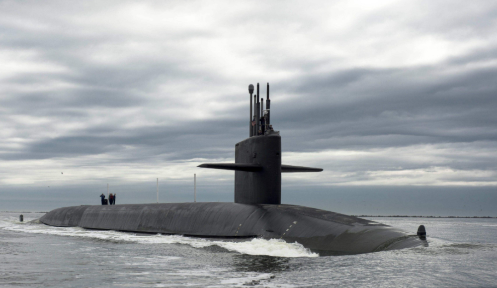
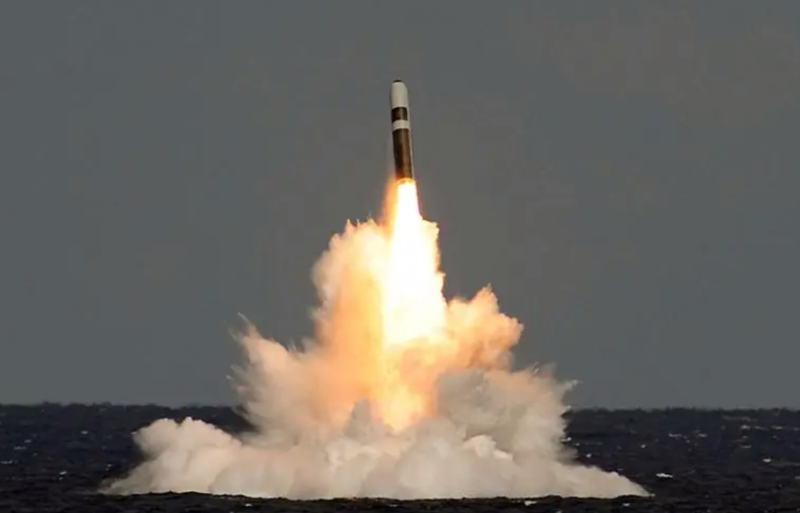
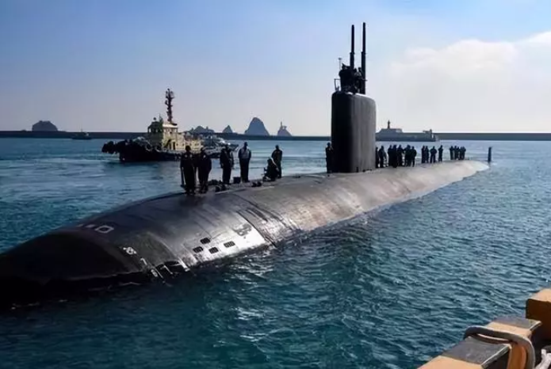
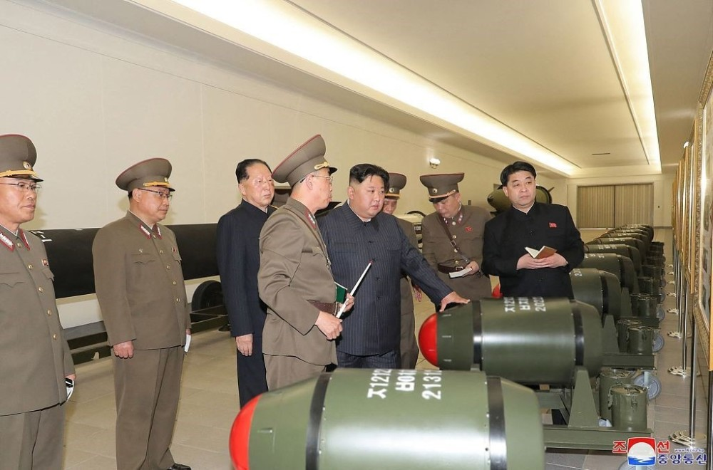

# 美将派战略导弹核潜艇访韩，系40年来首次，朝鲜半岛核对抗加剧

美国海军“俄亥俄”级战略导弹核潜艇将访问韩国，系四十年来首次。

当地时间4月26日，美国白宫官网发布题为《华盛顿宣言》的文件说，美国总统拜登当天与到访的韩国总统尹锡悦举行会晤以纪念美韩结盟70周年，两国领导人宣布成立一个新的核磋商小组（NCG），以加强延伸威慑、讨论核以及战略规划。拜登表示，美国将派遣战略导弹核潜艇至韩国。

_目前，美国海军共装备了14艘“俄亥俄”级核潜艇_

**美近期频繁在朝鲜半岛秀“核肌肉”**

美国军事网站“战争地带”（The War Zone）26日刊文称，美国将派遣至韩国访问的核潜艇是“俄亥俄”级战略导弹核潜艇。

“俄亥俄”级核潜艇最多可搭载24枚“三叉戟”IID5型潜射弹道导弹，是世界上携带导弹数量最多的战略导弹核潜艇。“三叉戟”II
D5型导弹可以携带6-14个核弹头，导弹射程最远可达1.2万千米，总打击当量超过1亿吨，远超二战各国释放火力的总和。

目前，美国海军共装备了14艘“俄亥俄”级核潜艇，其中太平洋舰队拥有8艘。在2040年之前，美国将陆续建造12艘“哥伦比亚”级核潜艇替代逐渐退役的“俄亥俄”级，维持美国海军海基核力量的威慑力。

作为美国海基核力量的核心，“俄亥俄”级核潜艇的行踪通常是高度保密的信息，核动力意味着这些舰艇可以持续在水下航行数月，其续航能力只受到150多名艇员生活物资补给的限制。

海军专家王云飞接受澎湃新闻（www.thepaper.cn）采访时表示，“俄亥俄”级属于战略核潜艇，携带的核导弹射程超过1.2万千米，不需要到韩国，甚至在夏威夷就可以完成对核打击任务，因此派遣核潜艇的政治目的高于军事目的。

_“三叉戟”II
D5型导弹可以携带6-14个核弹头，具备很强的核打击能力_

“美国的这种做法其实就是一种武力炫耀，一方面是向朝鲜展示这种核打击平台，威慑朝鲜；另一方面是向韩国传递信号，美国会履行延伸核威慑的承诺，核保护伞依然有效。”王云飞表示。

今年以来，美国更加依靠核潜艇访韩对朝施压，在“俄亥俄”之前，美国攻击型核潜艇曾在2月现身韩国。2月25日，美国海军太平洋舰队发文称，美国海军“洛杉矶”级攻击型核动力潜艇“斯普林菲尔德”号已经驶入釜山作战基地，并公开多张照片。

“斯普林菲尔德”号排水量超过6000吨，配备“战斧”巡航导弹，并搭载用于攻击舰艇的“鱼叉”导弹和鱼雷。这是美国海军核潜艇部队时隔5年多再次公开访问釜山港。美国海军上一次在韩国部署核潜艇还是在2017年10月，当时可搭载150多枚“战斧”导弹的“俄亥俄”级“密歇根”号核潜艇，驶入韩国釜山港，进行例行部署。

除了派遣核潜艇，从开年至今，美国多次派遣B-1B轰炸机、核动力航母等战略武器现身朝鲜半岛周边。

_“斯普林菲尔德”号核潜艇现身韩国_

**“派遣核潜艇或无法达到美国想要的效果”**

韩国总统尹锡悦和美国总统拜登26日在白宫举行首脑会谈，就全新理念的对朝延伸威慑措施达成一致。据韩联社报道，尹锡悦表示，韩美商定，在朝鲜进行核攻击时，两国领导人随即进行协商沟通，并承诺依照宣言动用包括美国核武器在内的所有同盟军力，迅速采取压倒性的决定性应对措施。

尹锡悦表示，韩美两国将共享应对朝鲜威胁的核与战略武器的运作计划信息，双方将定期进行协商，讨论共同规划并落实把韩国尖端常规战斗力和美国核战力相结合的共同作战方案。其结果将报告两国总统。对于《华盛顿宣言》内容相关提问，尹锡悦回答说，延伸威慑的强化与落实方案将与以往不同，据此，国民对朝核的忧虑有望大大缓解。

对于《华盛顿宣言》，拜登表示，该宣言旨在为应对日益加剧的朝鲜核威胁而在延伸威慑方面采取进一步措施。拜登虽然重申将不在韩半岛重新部署核武器，但强调将扩大核潜艇等（战略武器）的调遣规模。

朝韩问题专家、吉林大学国际政治系教授王生向澎湃新闻分析认为，美国时隔四十年派遣战略导弹核潜艇访问韩国是美韩加强延伸威慑计划的一部分，是一个防御性的动作，而之前派遣攻击型核潜艇是一个进攻性的动作，因为相对于战略导弹核潜艇，攻击型核潜艇使用上更灵活。

_朝鲜首次试射“火星炮”-18导弹_

“这次韩美强化延伸威慑更强调核武器，这将推高朝鲜半岛的核对抗，因为朝鲜在常规军力方面无法与韩美对抗，只能依靠核导这种非对称手段进行抗衡。”王生说。

近期，韩美多次举行大规模联合演习，美国战略武器频繁也现身朝鲜半岛，秉持“超强硬回应强硬”原则的朝鲜也通过展示核导战力进行回应。

据朝中社4月14日报道，朝鲜13日成功试射使用固体燃料的弹道导弹，导弹被命名为“火星炮”-18，采用固体火箭发动机。这是朝鲜首次试射新型固体洲际弹道。朝中社称，根据国家核力量建设展望计划，朝鲜战略部队将装备和运用这种新型洲际弹道导弹，作为维护国家安全最强大的核心主力手段。除了“火星炮”-18，朝鲜在今年还进行了“火星炮”-17和“火星炮”-15两种液体洲际导弹的试射。

分析人士认为，相对于采用液体火箭发动机的洲际导弹，采用固体火箭发动机的洲际导弹反应时间更短、生存能力更强。世界上先进的公路机动洲际导弹大部分采用固体推进方式。

除了新型固体洲际导弹，朝鲜还首次公开“火山”-31型核弹头和核无人潜水攻击艇。上个月27日，朝鲜最高领导人金正恩指导了核武器兵器化工作，首次公开的“火山”-31核弹头引发外界高度关注。从朝中社公开的照片来看，墙上的展板介绍了可装载该核弹头的投掷工具，包括600毫米超大型多管火箭炮、“火星”-11弹道导弹、“箭矢-2”巡航导弹等，照片中出现了10枚“火山”-31型核弹头。

_朝鲜首次公开“火山”-31核弹头_

核无人潜水攻击艇被认为是朝鲜海基核力量的新作战方式。朝鲜在上个月21日至23日进行一系列军事训练活动，包括新型水下攻击武器系统试验，动用了名为“海啸”的核无人潜水攻击艇。朝中社称，该武器的使命是隐秘潜航到作战水域，进行水下爆炸造成超强力放射性海啸，破坏消灭敌人的军舰编队和主要作战港口。

王生认为，美国战略核潜艇访问韩国目的是威慑朝鲜，履行强化延伸威慑的承诺，但此举无法达到美国想要的效果，反而会刺激朝鲜加强核遏制力，并且朝鲜还可能通过核试验进行回应。

朝鲜从2006年至2017年共进行了六次核试验。

此外，发射侦察卫星也可能成为朝鲜的回应方式之一。4月18日，金正恩视察了朝鲜国家宇宙开发局。金正恩表示，要按计划发射已经完成的军事侦察卫星一号。2012年12月，朝鲜在西海卫星发射中心成功用“银河”-3运载火箭发射了“光明星”-3号卫星，朝鲜成为世界上第十个成功独立发射卫星的国家。

