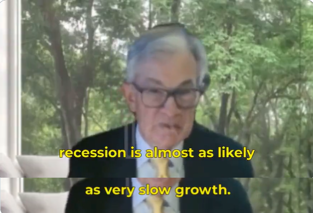
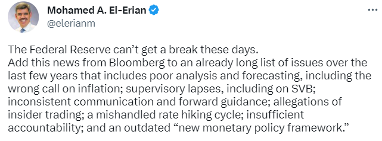

# 美联储主席与冒牌泽连斯基通电话，美媒：或致美联储安全性遭质疑

（观察者网讯）在美联储是否再次加息引发市场关注之际，美联储主席杰罗姆·鲍威尔被曝成了俄罗斯政治恶作剧二人组“沃万和雷克萨斯”（弗拉基米尔·库兹涅佐夫和阿列克谢·斯托利亚洛夫）的最新上钩者。

综合彭博社和《纽约邮报》4月27日报道，事件发生在今年1月，鲍威尔以为自己在与乌克兰总统泽连斯基通话，回答了从通胀前景到俄罗斯央行行长表现的一系列问题，预测美联储大幅加息一定程度上将放缓今年经济增长，甚至可能导致经济衰退，当时还预告美联储会加息两次。

虽然美联储27日称相关视频“似乎被剪辑过”，但承认鲍威尔的确接了这通电话。彭博社称，此事可能会引发人们对美联储安全性的质疑。

_网传视频截图_

4月27日起，相关录像在推特走红。视频中，70岁的鲍威尔对着镜头认真分析经济前景的样子，引发热议。

他以为电话的那一端是泽连斯基，实际上对方是捉弄了众多西方政客和知名人物的俄罗斯政治恶作剧二人组，网传视频片段累计时长超过15分钟。

彭博社称，俄罗斯媒体放出了这些视频。据英国广播公司（BBC）报道，鲍威尔在电话中称赞了俄罗斯央行行长纳比乌琳娜在西方制裁下调控俄罗斯经济的能力，还阐述了美国经济增长放缓的情况。

鲍威尔在这通年初的对话中，对2023年经济的预期是：“经济衰退的可能性几乎与经济增长非常缓慢的可能性一样大。”他承认出现这一情况一定程度上是因为美联储大幅加息，但称加息是降低通胀、让市场降温的必要条件。

财经网站“Investing.com”称，其中一段视频显示，鲍威尔当时称，美联储将再加息两次。

相关舆论发酵后，当地时间4月27日，美联储发言人回应称：“鲍威尔主席今年1月与某人进行了一次对话，对方冒充乌克兰总统。这是一次友好的对话。”

该发言人称，这次对话“没有涉及敏感或机密信息”，网传视频似乎经过了“剪辑”，无法证实其准确性，此事已移交相关执法部门处理。

这位发言人不愿谈论这通电话是否表明美联储存在安全漏洞或美联储今后将采取何种措施防止此事再次发生。

彭博社称，鲍威尔接到这个电话的事实，可能会引发人们对美联储安全性的质疑。

由于鲍威尔发表的经济观点经常影响金融市场，他如此轻易地在一通恶作剧电话里输出观点引发外界担忧。

“美联储这段时间不能休息了。”美国经济学家、英国《金融时报》特约撰稿人穆罕默德·阿里·埃尔-
埃利安发文称，加上这条新闻，美联储近几年已经累积了一系列问题：对通胀的错误预测、监管失误（包括硅谷银行破产事件）、沟通和前瞻性指导前后矛盾、面临内幕交易指控、加息周期处理不当、问责不足以及过时的“新货币政策框架”。

美国金融分析师杰西·科恩也认为，此事对美联储来说是一个“尴尬时刻”。

**本文系观察者网独家稿件，未经授权，不得转载。**

