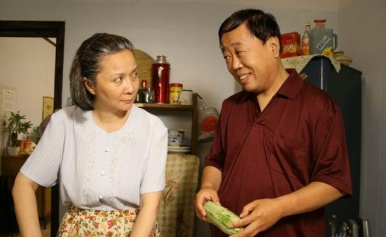

# 著名相声演员李建华去世 曾出演《闲人马大姐》中的马大姐夫

4月28日晚，相声演员苗阜在社交媒体发布了著名相声演员李建华去世的消息，并悼念道：“建华老师走好”。

李建华1956年8月10日出生于北京市，中国广播艺术团相声演员、影视演员，师承著名相声表演艺术家唐杰忠，与李金斗先生搭档演出多年，曾因出演《闲人马大姐》中的马大姐夫被广大观众熟识。

文/北京青年报记者 张恩杰

编辑/乔颖

