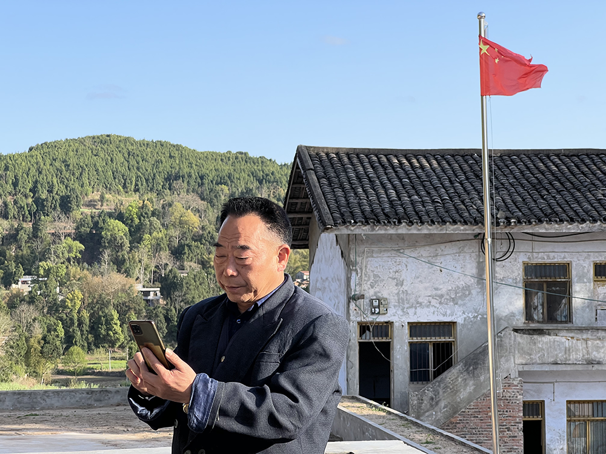
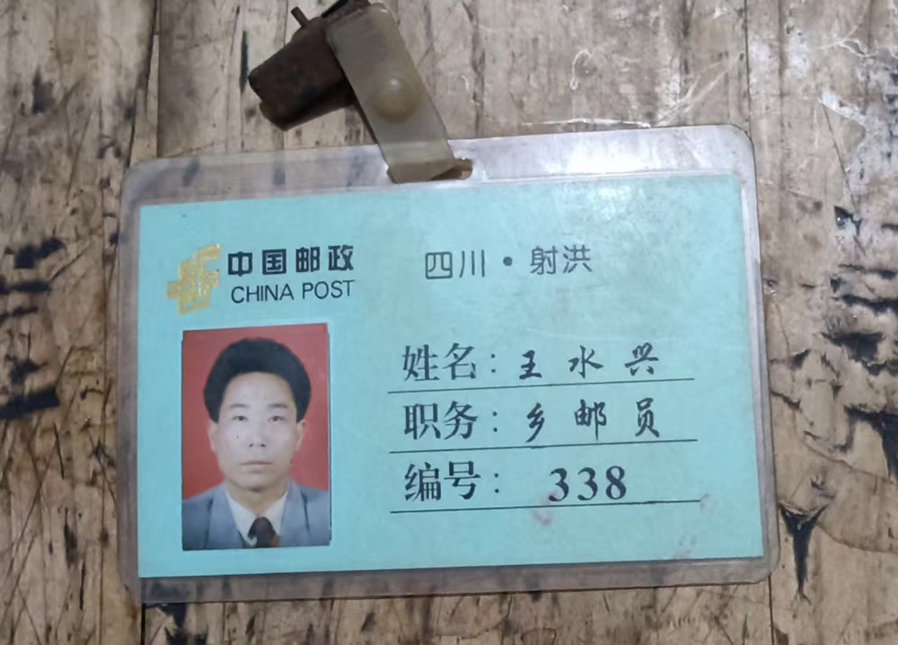
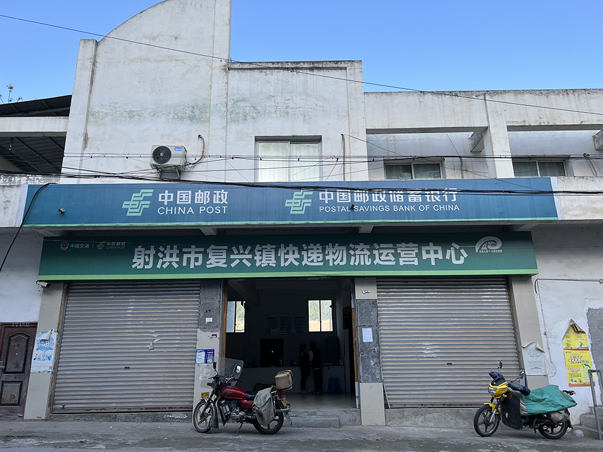
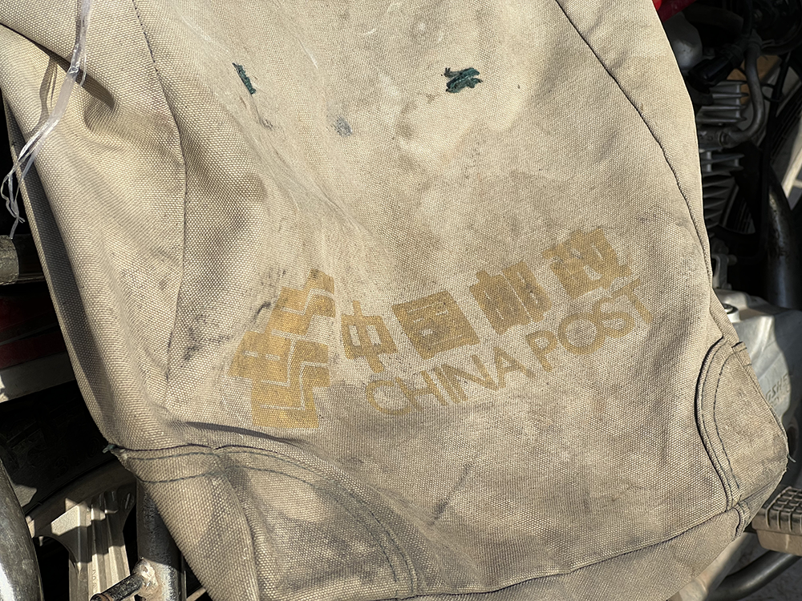
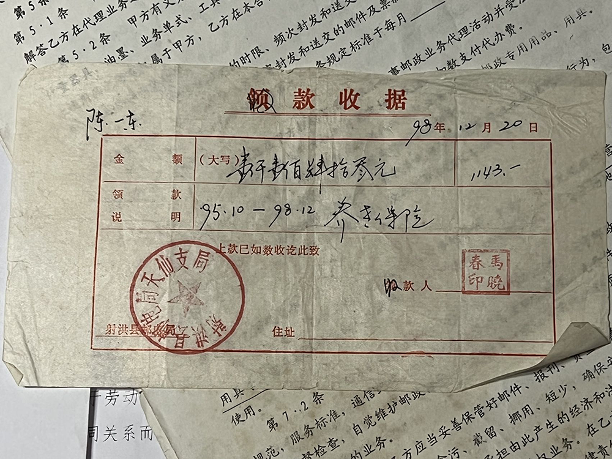
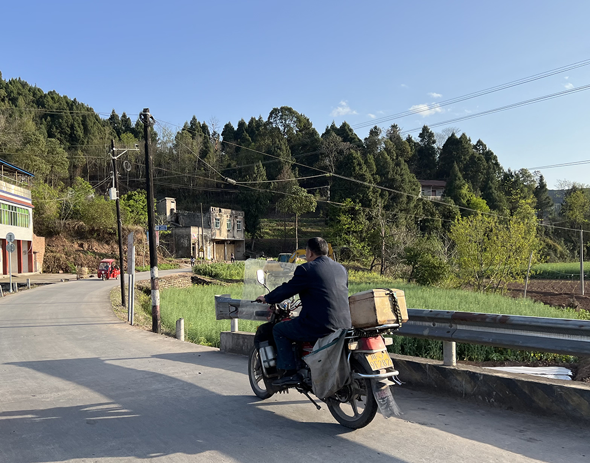
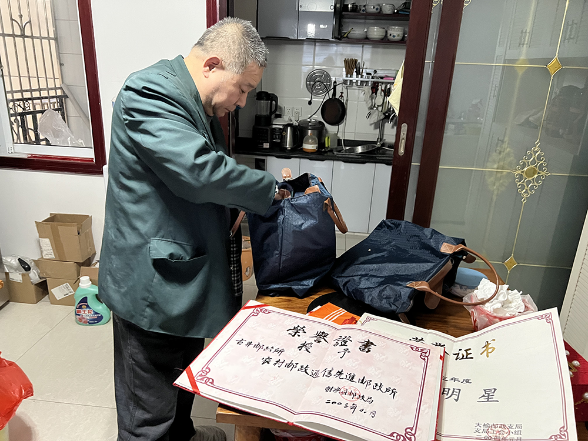

# 钱去哪了？老年乡邮员退休拿不到养老金，当年交的养老保险金不知去向

63岁的王水兴还“赖”在四川遂宁射洪市（县级）乡邮员岗位上。截至2023年，他已经在这个岗位上工作40年了；由于当地邮政部门没为其正常缴纳养老保险，他至今没有退休。

王水兴说，养老金的钱他是交到邮政部门的，但很多年以后才发现，邮政部门并未交到社保局去。如今该退休了，社保局却没有他的名字。他只能厚着脸皮“赖”在岗位上，继续工作。没有养老金，意味着离岗即失去生活来源，不然“我吃什么？”。

据四川电视台此前报道：射洪市目前没有养老金的乡邮政员有110多人，其中9人已经离世。还有几人身患绝症，正面临老无所养，病无所医的窘况。大多数人则是“到点（男60岁、女55岁）”离岗，没了工资又没退休金，在应该养老的年纪另谋生路。

4月26日，中国邮政集团有限公司四川省射洪分公司相关负责人向澎湃新闻（www.thepaper.cn
）表示，该公司已经对相关问题进行调研，并向当地政府进行了汇报，公司和政府都在想办法解决这一问题。

从2004年开始，射洪乡邮员养老金问题多次被提上桌面，都没能彻底解决。这一次王水兴心里还是没底，但仍充满期待。

_王水兴将邮包报刊杂志送到村社并定点打卡_

**不愿离岗的乡邮员**

2023年3月20日，王水兴终于领工资了。王水兴领的工资，既非现金，也不是银行转账，而是其上级白拥军以微信转账的形式发放的。这种领钱的方式，极像一个“钟时工”。实际上，他这笔工资既不是日结，也不是按周、按月结算，而是三个月前的工资。

3月20日，王水兴领的是2022年12月的工资，而2023年1月至3月的工资至今未见，即使过年的时候，他也没领到一分钱。在这个岗位上工作了40年，他时不时对自己对身份产生疑惑：钟时工、临时工，临聘人员，还是合同工？都像，又都不是。

澎湃新闻注意到，王水兴2022年12月的工资是1450元，扣除增值税14.5元、个人所得税31.9元，其他再没任何扣除事项，这一个月他总共到手1403.6元。

王水兴说，如果单纯算对社会的贡献，他的工龄至少应该是45年了。1978年他是拿到任用证的民办教师，按照后来国家政策，1981年之前入职，获得正式任用的民办教师可以直接转公办。民办教师期间也是计算工龄的。

但命运似乎和他开了一个玩笑。1983年，在一位乡领导的鼓励下，王水兴走下讲台，来到乡村邮递员岗位上。当时他有一点犹豫，但乡领导一句话打动了他：邮递员是国家工作人员！那时民办教师一月工资18元，但邮递员可以拿到45元。

_乡邮员王水兴曾经的证件_

因此，经乡里推荐，邮政局录用，王水兴开始背上邮包，每天走村入户，送报刊到村社、送信上门、收件、汇款。1993年实行全国公务员考试之前，很多人对临聘人员、合同工、正式工身份没多大概念，只要领上工资、吃上财政饭，就是非常让人羡慕的。

那时候，邮递员、放映员、售货员在农村都是热门的岗位，相比“靠天吃饭”的农民，这是充满确定性的营生，且收入可观。

1986年，当时的射洪县邮政储蓄开办，邮电局为人民银行代理业务，乡邮员在从事传统业务的同时，又成为邮电局储蓄代办员，1998年，乡邮员又按要求，给保险公司代办保险业务。邮政部门当时的所有业务，都是通过乡邮员向乡村发展的。

_射洪市（县级）复兴邮政快递中心_

_跟随王水兴多年的工作袋_

**养老保险金不知去向**

随着社会经济的进步，金融、通信运输领域的发展，新的物流公司、互联网企业、银行、保险公司不断涌现，邮政业务在市场竞争中逐渐失去优势，即使在乡村，乡邮员也不再是让人羡慕的职业了。但很多人在这个行业工作多年，甚至临近退休，没人再想转行，大多数人选择坚持下去，就图退休有保障。

20多年前缴了养老保险金，如今退休，身患重症的陈一东却没有养老金。

澎湃新闻注意到，每个乡邮员都曾按月缴纳，或从收入里扣除几十、几百元不等的养老保险费。有人至今保留着当年交钱的收据凭证。乡邮员陈一东收藏的收据单显示：1998年12月20日，他缴纳1995年10月至1998年12月养老保险金1143元。收据上盖着“射洪县邮政局天仙支局”印章，收款人为马晓春。

还有人虽然没有收据，但当年的业务报账单上注明了扣除养老保险事项。王水兴说，他当时在复兴支局，养老保险由支局长统一收取，最初每个月收取200元。2000年之后，开始每个月交300元，后来最高缴到500元一月。不过，养老保险费具体是从哪一年开始收的、又哪一年停收的，他自己也不知道。

这些钱，按支局领导的解释，都被交到原射洪县邮政局了。然而，王水兴到60岁要退休的时候才发现，他缴的养老保险钱根本没交到社保局，甚至这些钱最终去了哪里也没人能说清。这意味着他享受不到邮政系统的退休待遇。

后来他才发现，许多乡邮员都是这样的情况，甚至有人在2004年就已经发现这个问题，并提起过劳动仲裁。

澎湃新闻获取的一份原射洪县劳动争议仲裁委员会作出的仲裁裁决书显示：原射洪县邮政局广兴片区乡村投递员杨凤琴申请劳动仲裁，要求射洪县邮政局支付社会保险费、补偿金、超时工作工资。

杨凤琴在申诉中称，1985年12月，她被原射洪县邮政局聘为广兴邮政所投递员，具体从事邮件分发、投递、存取款、代办人寿保险、收揽报刊、杂志订送等工作。1991年开始，邮政支局分别开始从其工资中直接代扣养老、医疗保险费135元。

_王水兴去接收快递包裹_

**想找回不被承认的工龄**

王水兴、杨凤琴遭遇的问题在四川射洪并非个例。

据四川电视台此前报道：射洪市没有养老金的乡邮政员有110多人，其中9人现在已经离世，另有20多名乡邮员已经转正，能享受到邮政正式职工退休养老待遇。

_在邮政系统工作几十年的朱昶理_

不过，这20多名转正的乡邮员中，仍然有人拒绝退休。射洪邮政分公司大榆镇邮政所原主任朱昶理便是其中一员。据他介绍，2007年，原射洪县20名乡邮政员转成了劳务派遣工，算是正式承认了他们的劳务关系，几年后，邮政公司正式为这20多人缴纳养老保险，算是正式承认了他们的邮政职工身份。

朱昶理分析，他们这20多人能转正，应该和他们均曾担任乡镇邮政所所长（支局长）职务有关。

他现在拒绝办理退休手续的原因是，正式成为邮政系统职工之前，做乡邮员时的工龄未被承认，这影响到他的退休金额度。

朱昶理2014年转为射洪邮政系统正式职工，邮政公司正常为其缴纳了社保。他提供的资料显示：2008年，他才开始购买社保，但是以劳务派遣工的形式，由遂宁市新阳光人力资源服务有限公司（邮政局）缴纳养老保险；一直到2014年，才由中国邮政集团有限公司四川省射洪市分公司为其缴纳养老保险。

退休的时候，朱昶理发现他只能领取1400元退休工资，因为他的退休工龄是从2014年开始统计的。

但他从1982年就进入到邮政部门，成为乡邮员，一直到2014年转正成为邮政部门正式职工，这32年的工龄被忽略掉了，他不能接受。“我前面几十年也是在为邮政部门工作啊。”朱昶理说，因此，现在他也和王水兴等人一样，拒绝办理退休手续。

比起王水兴，后来转正的20余名所主任（支局长）是幸运的。据王水兴介绍，剩余的110余名乡邮员，在毫不知情的情况下被邮政部门办理了工商营业执照，变成了个体工商户。这些营业执照一直保留在邮政局，未发放到他们手里过。

_邮政设到村社的快递物流站_

**邮政局：与乡邮员无劳动关系**

按朱昶理等人的理解，邮政部门瞒着乡邮政员为他们办理工商营业执照，就是为了将乡邮员变为代办关系，规避为他们缴纳社保的责任。

澎湃新闻注意到，原射洪县邮政局在杨凤琴当年的劳动仲裁申诉中的解释是：1987年3月，邮政部门将代办所移交给乡镇府经营，由乡政府指定专人统收统支，统一建帐管理。邮电所人员的工资福利，一律由乡政府决定，在所收专投费和业务酬金中列支。邮电所人员的聘用或辞退权属乡政府，年终按“八大员”同等考核、奖惩。

此后，国家邮政局明确，邮政业务委代办是指邮政企业委托有关单位或个人代办邮政业务，并按规定给付相应代办费的一种经营方式。由邮政企业与代办单位签订代办邮政业务的经济合同，合同中应明确代办单位和个人应自行办理社会保险，邮政企业不得以任何形式为代办员办理社会保险。文件中还明确指出，邮政企业与代办人员不存在劳动关系。

因此，2004年12月31日，原射洪县劳动争议仲裁委员会作出裁决，认可邮政局的辩解，认为杨凤琴与邮政部门系经济委托关系，而非劳动关系。杨凤琴不属于邮政企业职工，不属于劳动法调整范围。同时，杨凤琴2002年已经离开邮政企业，超过申述时效，最终驳回了杨凤琴的申述请求。

朱昶理等人不认可这一解释，因为1994年遂宁市乡办邮政有偿投递收费管理办法上写到：一般将收入的2/3作为乡邮员的劳动报酬，1/3用于发展基金和乡邮员的养老保险基金、福利基金。也就是说，按要求邮政部门从这时起就应当给员工购买养老保险基金。然而，让他们想不到的是，邮政部门不仅没有为他们购买养老保险，甚至连当初他们自己缴纳的那部分养老保险费也没了踪影。这些钱当年究竟去了哪里？

4月26日，中国邮政集团有限公司四川省射洪分公司副总经理刘静告诉澎湃新闻，目前该公司正在核实相关情况，同时向射洪市政府进行了汇报。这位负责人承认，射洪邮政部门在1990年代曾收取过乡邮员的养老金，当时邮政部门以个体工商户的名义给他们购买了“三项基金”，其中包含了养老基金、发展基金、管理基金。

刘静表示，可能会参考当年各地解决乡镇“七大员（放映员、农技员、卫生员等）”类似问题的办法，但当时各个地方解决相关问题的方式也不一样，目前公司和政府正在进行相关的调研。

