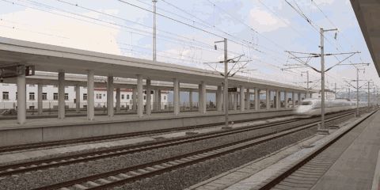
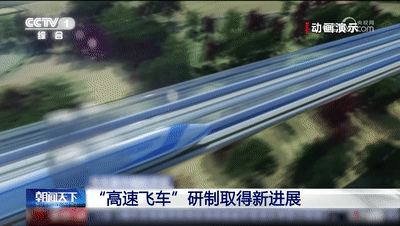

# 15分钟从杭州到上海？时速1000公里的超级高铁要来了？别误读了

从杭州到上海有多远？

最快需要多长时间？

近日，有关“15分钟从杭州到上海？”、“时速1000公里！第一条超级高铁要来了？”的文章在网络上爆火。不少网友已经开始想象这种 **飞速的感觉** 了！

但记者采访梳理发现，目前这只是人们的美好展望。 **“超级高铁”技术从诞生到成熟，需经过较长一段时间，而真正落地还要考虑更多现实问题。**

此次人们对“超级高铁”的关注，起因是航天科工集团举办了“高速飞车”主题科普展，并透露正在研制的“高速飞车”取得新进展，近期完成了国内首次全尺寸超导航行试验。据相关负责人介绍，高速飞车将磁浮技术与低真空技术相结合，可实现超高速运行。此前，试验团队已在非真空条件下完成了超高速磁浮与电磁推进试验，速度达到了
**每小时623公里** 。接下来团队将在试验线上开展更多试验，未来目标是希望“高速飞车”能实现 **每小时1000公里** 的速度。

有媒体表示，有中国工程和铁路研究人员称， **在上海和杭州之间建造第一条“超级高铁”线路最有可能性**
，这条150公里长的真空隧道将允许磁浮列车以高达每小时1000公里的速度行驶。

**经过网络的放大，不少人误认为沪杭“超级高铁”真的要来了。** 记者采访了同济大学交通运输规划领域相关教授，他表示：
**研究人员探讨技术落地的可能性时，并不意味着技术很快就会落地。**

磁浮技术与真空轨道结合，理论上可以跑出每小时1000公里的速度，但现在试验线上列车的速度尚未达到每小时1000公里。同时，短距离的试验线也不能等同于上百公里的真实轨道。

“试验线上成功了，还要建设示范线对技术经济的可行性进行进一步论证。做项目规划，都要先通过可行性研究、精细可行性研究、初步设计等过程，不仅要验证技术是否成熟，还要考虑环保、经济性等各种现实问题，只有全部通过才可能真正建造。”

**磁浮列车与“超级高铁”**

磁浮列车是一种靠磁浮力来推动的列车，由于其轨道的磁力使列车悬浮在空中，运行时不需接触地面，只受空气阻力影响，大大减少了车轮与轨道间的摩擦力，因此高速磁浮列车的速度可达每小时400公里以上。

早在1922年，德国工程师就提出了电磁悬浮理论，并于1934年申请了磁浮列车专利。20世纪70年代后，德国、日本等国相继开始对磁浮运输系统进行开发。

世界上第一条商业运营的高速磁浮列车线路就在上海建设运行，不过一开始使用的是德国的技术和车辆。2003年，上海磁浮列车示范运营线开始运行，到了2006年，正式投入商业运营。这条线路总长30公里，单程行驶8分钟。

“超级高铁”的概念最早由美国SpaceX公司的创始人埃隆·马斯克提出，以“真空管道运输”为理论基础，集成磁浮+低真空等技术，列车时速可达600公里至1200公里。2020年11月8日，马斯克的合作企业维珍超级环公司首次对旗下的超级高铁进行了载人测试。当天的测试在一段500米长的管道中进行，时速最高达到了172公里，测试用时15秒。

**磁浮技术的发展和短期阻碍**

不论是高速磁浮列车，还是“超级高铁”项目，国内外都在加快探索。业内人士介绍，根据技术原理不同，磁浮可以分为
**永磁悬浮、电磁悬浮、电动悬浮、钉扎磁浮（即高温超导磁浮）** ，其中电动磁浮又包括低温超导电动悬浮和永磁电动悬浮。在我国，
**目前形成了三种高速磁浮技术路线**
，分别是以中车四方和同济大学为代表的常导技术，以西南交大为代表的高温超导技术，以及以中车长客、航天科工为代表的高温超导电动技术。

2019年，中车四方牵头研制的时速600公里样车下线，成为 **世界上首套设计时速达600公里的高速磁浮交通系统**
。2021年7月20日，其整车在青岛下线，标志着我国掌握了高速磁浮成套技术和工程化能力。

2021年1月13日，由西南交通大学研发的高速磁浮工程样车在成都下线，这是中国研发的第二款高速磁浮列车，也是
**世界上首款采用高温超导技术的1:1磁浮工程样车** 。

2023年3月31日，由中车长客自主研制的 **国内首套高温超导电动悬浮全要素试验系统** 完成首次悬浮运行，该系统同样可以实现自悬浮、自导向、自稳定。

记者了解到，已经下线的高速磁浮列车均为样车或者试验车，需要在实际路段进行试验和验证，不断完善技术。而目前，已有的试验线路包括西南交大在九里校区建设的165米高速磁浮样车验证段、中车长客建设的200米全要素高温超导磁浮交通试验线、航天科工三院在山西大同建设的210米的低真空管道磁浮试验线，以及同济大学当初为支持上海高速磁浮示范线而建设的1.5公里的试验线。这些试验线均比较短，无法进行长距离试验。

据悉，2020年中车四方的高速磁浮列车曾在同济大学进行试验，当时列车的最高时速也仅为55公里。中车四方副总工程师丁叁叁曾表示，由于试验线只有1.5公里，磁浮列车无法在如此短距离内加速到几百公里的时速。正式的试验线至少需要50公里。缺乏长距离的试验线，也成为短期内磁浮技术发展的阻碍。

**磁浮线纳入多地规划研究**

**“超级高铁”将率先在沪杭落地缺乏依据**

中国是比较重视磁浮技术研究与应用的国家。2019年9月，中共中央、国务院印发 **《交通强国建设纲要》**
，明确提出合理统筹安排时速600公里级高速磁浮系统、低真空管（隧）道高速列车等技术储备研发。参与编写纲要的交通运输部人士曾对媒体表示，时速600公里磁浮项目放在了纲要的“科技创新”条目下，对其定位是未来发展方向、科技创新研究，不一定大规模应用，但要进行技术储备。

2019年12月 **《长三角洲区域一体化发展纲要》** 发布，其中交通项目中表示，长三角将积极审慎地开展沪杭磁浮项目规划研究。

2019年11月，深圳市发改委发布 **《广深高速磁悬浮城际铁路规划研究》**
招标公告。该《规划研究》透露，速度达每小时600公里的高速磁浮列车或将应用到广深第二高铁。深圳市政府称，广深高速磁浮目前仅处于“前期研究”阶段，还未立项。

2020年4月，浙江省发布的 **《省综合立体交通网规划（2021—2050年）征求意见稿》**
提出了包括沿海高铁、沪杭磁浮等十大千亿工程。该《意见稿》同时强调，沪杭磁浮是至2050年的远期展望，属于研究谋划类项目，没有给出具体实施时间。

2021年2月，中共中央、国务院印发了 **《国家综合立体交通网规划纲要》**
。其中提出，我国将建设4大国际性综合交通枢纽集群：分别是京津冀、长三角、粤港澳大湾区和成渝地区双城经济圈。与此同时，文件还提到要“研究推进超大城市间高速磁浮通道布局和试验线路建设”。

同年3月，交通运输部发布 **《关于下达2021年交通运输战略规划政策项目计划的通知》** ，其中也明确提出“计划开展京沪磁浮高速铁路工程研究”。

除了已经列举的这些外，还有成渝、海南、云南、安徽等地区也发布了相关规划。各地政府都希望第一条时速600公里的磁浮列车能够落地家门口，但实际上，这些规划均没有实质进展，仍停留在研究论证阶段。

**因此，说“超级高铁”将率先在沪杭落地缺乏依据。**

**落地须考虑现实问题**

业内专家认为，新技术想要真正落地，还必须考虑运营的安全性和经济性等诸多现实问题。

磁浮列车在超高速运行的状态下，一旦设备发生故障，如何救援必须有可靠的预案，并经过实验和试验。

此外，现在国内高铁网络十分发达，正在建设中的新线还有很多，在此基础上再建设磁浮项目，必须考虑是否有足够多的旅客需要新的交通方式和新的线路去运输。

当然，现实归现实，但即便短期内无法落地，中国也不能在前沿科技的探索上落后于人，需要进行技术储备。“对于星辰大海的探索不宜过于功利，可以看长远一点，
**未来如果“高级高铁”速度真的能够超过每小时1000公里，那可能就不再对标高铁，而是对标飞机，甚至开拓洲际旅行的新模式。** ”一位学界专家表示。

**解放日报·上观新闻原创稿件，未经允许严禁转载**

作者：王力

微信编辑：安通

校对：Wing

