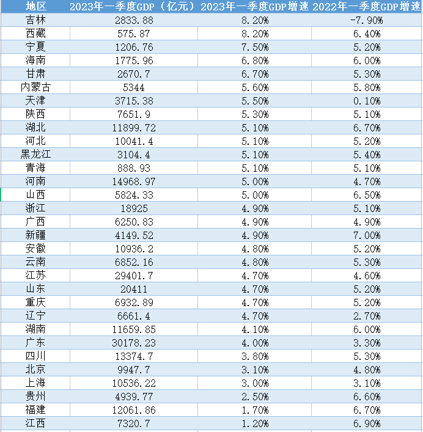

# 31省份一季度GDP成绩单出炉：东三省数据亮眼，江西福建等为何失速

4月28日，福建省统计局发布一季度地区生产总值初步核算结果：一季度福建GDP为12061.86亿元，比上年同期增长1.7%。至此，全国31个省份一季度经济数据全部出炉。

31个省份中有23个省份GDP增速超过全国4.5%的平均增长水平，另外8个省份低于全国水平。其中，吉林、西藏同比增长8.2%，并列增速第一；江西和福建分别增长1.2%和1.7%。

**东北三省数据亮眼**

梳理各省份一季度的数据，在几大板块中，此前经济增速在全国排名靠后的东北三省，今年一季度的经济数据表现亮眼。吉林增长8.2%、黑龙江增长5.1%、辽宁增长4.7%，除了吉林位居第一外，黑龙江和辽宁也高于全国水平甚至位居前列。

吉林大学东北亚区域研究中心教授衣保中向第一财经表示，主要原因是去年基数低，去年一季度东北疫情暴发冲击经济，尤其是吉林出现了负增长。今年疫情防控政策调整之后，在双循环格局下，吉林的汽车等产业发展也不错。

今年一季度，吉林省实现GDP2833.88亿元，同比增长8.2%，高于全国平均水平3.7个百分点。而2022年一季度，吉林省GDP2576.23亿元，同比下降7.9%，同比增量下降195亿元，是全国唯一一个经济负增长省份。

作为老工业基地和汽车产业重镇，一季度吉林规模以上工业增加值同比增长7.6%，增速比1—2月份大幅提高13.7个百分点，实现由负转正，高于全国平均水平4.6个百分点；其中3月份同比增长41.1%。

从重点产业看，汽车产业增加值同比增长7.8%；装备制造业同比增长25.3%；医药产业同比增长13.4%；冶金建材产业同比增长11.9%；纺织工业同比增长7.9%；食品产业同比增长6.2%；电力生产行业同比增长1.7%。

尤其是在疫情防控政策调整之后，吉林的服务消费快速恢复。一季度，吉林省服务业(第三产业)增加值同比增长8.9%；高于全国平均水平3.5个百分点；对经济增长的贡献率为65.6%，拉动全省经济增长5.4个百分点。

而作为拉动经济“三驾马车”中投资大幅增长。一季度固定资产投资同比增长28.1%，增速比1—2月提高23.9个百分点，高于全国平均水平23.0个百分点。其中，制造业投资同比增长42.3%，基础设施投资同比增长38.1%，房地产开发投资同比增长32.5%。

辽宁省社科院副院长梁启东也向第一财经表示，虽然辽宁一季度增速4.7%不如吉林，但是也可以说实现了“开门红”。其中，工业是辽宁经济的底盘，规上工业增加值增长7.5%，比全国水平要高，尤其是投资增长很快，一举扭转了多年来投资下滑的颓势。

今年一季度，辽宁省固定资产投资同比增长11.9%。分领域看，基础设施投资增长18.6%，制造业投资增长8.8%，房地产开发投资下降7.9%。梁启东表示，其中，工业投资上升符合扩大有效投资的要求，也增强了经济发展后劲。

衣保中表示，东北领先增长的态势是暂时的，过段时间会恢复到常态。但是，东北的基础工业比较好，在双循环格局下，东北的老工业仍然发挥着很重要的作用，能源、机械、石化等行业在全国起到稳定器的作用。另外，东北与俄罗斯的经贸合作也越来越密切。

最近一直在基层调研的梁启东明显感受到各级抓经济的劲头。他说，中央要求“十四五”东北振兴要实现新突破，现在只有三年了，因此，今年年初辽宁出台了《辽宁全面振兴新突破三年行动方案(2023—2025)》，要求大干三年。现在全省上下无论是招商引资还是推动项目进展措施都很硬，都干劲十足加快发展。

**这些省份为何失速：去年高基数？**

去年同期增速靠后的省份一跃成为今年领涨地区，而去年增速位居前列的一些省份今年一季度增速却大幅下滑，尤其是去年全年以4.7%的增速并列全国第一的江西和福建，今年一季度却只增长了1.2%和1.7%。

基数是导致去年和今年增速反差较大的重要原因。与吉林等省份因去年基础较低今年实现高增长一样，这些省份增速较低的的一个原因，却是去年基数较高。

第一财经梳理对比，一季度GDP增速低于全国水平的8个省份有湖南、广东、四川、北京、上海、贵州、福建和江西。其中，江西、福建、贵州、湖南和四川去年一季度GDP分别增长6.9%、6.7%、6.6%、6.0%和5.3%，增速分别位居全国第二、三、四、七和十位。

贵州省统计局新闻发言人王朝晖就表示，一季度贵州GDP增长2.5%，这个速度是在去年一季度高基数的基础上实现的。去年一季度全省GDP增长6.6%，比全国高1.8个百分点，是去年的最高点，如果按照两年平均计算，全省地区生产总值两年平均增速为4.5%。

江西省统计局解读认为，“一季度全省经济呈现持续恢复、总体平稳的态势。”福建省统计局也解读认为，“一季度全省经济逐渐走出疫情影响，先行指标恢复向好，积极因素逐渐增多，经济运行开局总体平稳。”

不过，除了基数之外，这些省份本身的一些因素也影响着今年一季度的表现。

今年一季度，福建省规模以上工业增加值同比下降4.9%。分三大门类看，采矿业增长0.8%，制造业下降5.1%，电力热力燃气及水生产和供应业下降1.6%。江西省规模以上工业增加值同比下降2.8%。分行业看，38个大类行业中有14个行业增加值实现增长，增长面为36.8%。

福建省统计局分析工业增速下滑的原因，是“受市场需求不足、企业运行成本上升和我省疫情压峰转段时间比全国晚等因素影响”。而江西省统计局分析认为，“一季度，受上年同期基数较高及需求不足导致部分行业不景气影响，工业增速出现回落”。

在投资方面，一季度，福建省固定资产投资4680.15亿元，同比增长0.5%。福建省统计局分析认为“全省投资平稳开局”，增速放缓的原因是“受房地产市场和我省疫情压峰转段时间比全国晚等因素影响”。

江西省统计局在解读固定投资运行情况的材料没有公布一季度全省固定资产投资的总额和增速，认为“一季度，全省内涵效益型投资保持平稳，社会领域投入继续加大，部分行业发展态势良好。”

事实上，去年基数较高的省份中，仍有部分省份今年一季度增速继续位居前列。第一财经梳理，在今年一季度GDP增速位居前十位的省份中，有西藏、海南、甘肃、内蒙古、湖北、黑龙江、山西和新疆等8个省份去年一季度增速也位居全国前十位。

对比来看，去年基数较低的省份今年高增长，反映了经济的恢复性增长；而去年基数较高的省份今年一季度增速有所下滑，则反映目前经济在恢复运行中面临的压力。前述8个省份中以能源大省为主，如江西福建以制造业支撑去年高增长的省份今年面临压力。

这在其他省份也有明显反映。比如，一季度，四川规模以上工业增加值同比增长0.4%，低于全国平均3%的增长水平；41个大类行业中只有17个行业增加值保持增长。汽车、微型计算机设备和白酒三大支柱产业产量分别下降了11.1%、32.6%和30.3%。

重庆综合经济研究院原院长、研究员易小光向第一财经表示，一季度经济恢复表现良好，为今年全年回升打下比较好的基础。二季度的经济工作需要在一季度的良好态势下要巩固回升，虽然“三重压力”有所减弱，但是还是存在，而且潜在的压力不可小视。

4月28日召开的中央政治局会议指出，需求收缩、供给冲击、预期转弱三重压力得到缓解，经济增长好于预期，市场需求逐步恢复，经济发展呈现回升向好态势，经济运行实现良好开局。但是，会议还指出，当前我国经济运行好转主要是恢复性的，内生动力还不强，需求仍然不足，经济转型升级面临新的阻力，推动高质量发展仍需要克服不少困难挑战。

