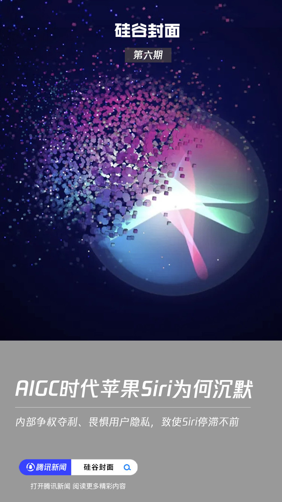

# AIGC爆火，Siri却“失声”，揭秘苹果公司内幕故事｜硅谷封面

**划重点：**

  * _1_ AIGC火了，但在最近这波竞争浪潮里，苹果早些年推出的主打语音智能的Siri，处境却并不理想。
  * _2_ Siri团队面临的问题，除了底层数据库的问题，还有产品设计分歧、内部权力斗争、人才流失严重等情况。
  * _3_ 虽然人工智能专家詹南德雷亚如同救星般从谷歌跳槽到苹果，但Siri的发展仍受制于内部地盘之争。
  * _4_ 苹果比任何公司都注重维护自己的形象和品牌，AI语音助手的设计可能涉及到用户的隐私数据问题，这让苹果在开发中一直畏手畏脚，未能赶上谷歌和微软。

_「硅谷封面」系列聚焦硅谷科技大公司动态、科技大咖访谈、重磅研究报告等，旨在为科技资讯爱好者提供全球最前沿的深度好文。本期聚焦苹果为何在AIGC的竞争浪潮中“停滞不前”。_

最近几个月，以语音交互为首的AIGC火了，各家科技巨头公司都在争先恐后纷纷推出自家的大模型产品。而提到AI语音交互应用，多年前在iPhone手机中便推出了智能语音助手Siri，在这波竞争浪潮里似乎“落单”了。对此，甚至有行业人士和媒体喊话：“嘿苹果，你的聊天机器人在哪里？”

对于苹果在AI竞争中可能会面临掉队的危机，近日，有国外媒体撰文指出了苹果公司内部存在的一些问题：
**苹果在Siri和人工智能方面的工作内部存在混乱和缺乏雄心，导致了苹果在改进Siri和其背后的技术方面落后于主要竞争对手谷歌和微软。**

**01 苹果的“进退两难”**

在去年11月，OpenAI推出聊天机器人ChatGPT之后，就一直吸引着公众的目光。此后不久，曾帮助苹果改进搜索技术的三名工程师便开始着手研究ChatGPT背后的技术类型。但对苹果而言，还存在着一个关键问题：这三名工程师已不在公司任职。离职之后，他们转投谷歌从事被称为大型语言模型的技术开发。

据知情人士透露，这三位工程师是斯里尼瓦桑·文卡查里（Srinivasan Venkatachary）、史蒂文·贝克（Steven
Baker）和阿南德·舒克拉（Anand
Shukla），他们去年秋季离开了苹果，部分原因是他们认为谷歌是研究能够理解语言并产生类似人类反应的大型语言模型的更好企业。

无论是苹果还是谷歌都对上述三人青睐有加。

据两位与文卡查里谈论此事的人透露，谷歌非常希望他们加盟，公司首席执行官桑德尔·皮查伊（Sundar
Pichai）甚至亲自向他们示好；而苹果首席执行官蒂姆·库克（Tim
Cook）也曾试图说服他们留在公司。知情人士称，他们现在正在努力降低谷歌的训练成本，提高大型语言模型和基于这些模型的产品的准确性。

文卡查里等三人的离职对苹果人工智能高管约翰·詹南德雷亚（John
Giannandrea）是又一次打击。詹南德雷亚2018年从谷歌跳槽到苹果，帮助苹果成为人工智能领域的重要参与者。

在外媒对三十多名曾在苹果人工智能和机器学习团队工作的前苹果员工的采访中，由于核心骨干离职，该部门面临组织功能障碍和团队信心缺失。这些问题引发了人们的疑问，随着ChatGPT等更复杂的人工智能技术的起飞，苹果的产品会有多大竞争力?

多名前Siri员工表示，在苹果内部，自詹南德雷亚接手以来，Siri仍因一些未解决的功能障碍和进展缓慢问题而受到嘲笑。有不少员工嘲笑Siri“过于笨拙”，甚至有团队想要直接放弃Siri。知情人士透露：包括苹果混合现实头显负责人迈克·洛克威尔（Mike
Rockwell）在内的项目开发团队，都对Siri团队展示语音助手如何控制头显的演示感到失望。知情人士称，洛克威尔的团队一度考虑建立替代方法，用语音命令控制头显（该团队最终放弃了这个想法）。

截至目前，在人工智能研发和创新上缺乏进展似乎还没有严重伤害到苹果。这家公司仍然是全球市值最高的公司，市值达到了2.6万亿美元。但是，像ChatGPT这种使用大型语言模型的产品的出现，可能代表着技术上的分水岭，这将从根本上改变人们与网络世界的互动方式，并创造出电影、计算机程序、PPT等一切产品。产品中不采用该技术的公司可能会在竞争中处于劣势之中。“未来最有用的设备将使用大型语言模型，”人工智能搜索引擎You.com的首席执行官理查德·索彻（Richard
Socher）说，“对自然语言的深刻理解将成为设备的一个卖点。”

尽管苹果的主要竞争对手，包括微软、谷歌、亚马逊和Meta，都宣布了基于大型语言模型的产品计划，但iPhone制造商苹果仍保持沉默。但这种情况可能会在不远的将来发生改变，据知情人士透露，苹果工程师提议对依赖大型语言模型的Siri进行一系列改进，他们希望这些改进能为明年iPhone操作系统的重大发布做好准备。

在拥抱最新的人工智能技术的态度方面，苹果可能会比其竞争对手更加谨慎。没有任何一家公司比苹果更注重维护自己的形象和品牌。谷歌和微软的聊天机器人表现出的怪异、有时甚至是敌意的行为和错误，在苹果看来是绝对不能容忍的事情。

谷歌首席执行官Sundar Pichai在去年的一次公司活动中，演示语音助手的功能进展

苹果前员工表示，出于这个原因，与目前各大巨头推出的语音助手不同，为避免一些语音助手回答失实等“尴尬事件”的发生，Siri的大多数回答都是由人工编写、审核或编辑的。据参与Siri开发工作的人士透露，苹果高管过去曾否决过投资让Siri拥有长时间来回对话能力的提议，认为这种功能很花哨，难以控制。

此外，苹果面临的另一个挑战是该公司在隐私问题上不妥协的立场。在过去十年中，库克一直把隐私作为苹果设备的一个重要标签和名片。比如苹果在过去几年里一直在取消和限定许多Siri功能，如音量控制、打开应用、闹钟设置和听写笔记等，因此用户必须在苹果设备上手动完成，这限制了使用Siri的频次。目前，大型语言模型
--尤其是那些支持ChatGPT等复杂服务的大型语言模型--都在云端运行，如果能让Siri支持这些功能，短期内是很难实现的。

如果苹果想要实现在语音助手方面的飞跃提升，用户隐私数据可能将面临难以得到有效的保护，对于苹果来说，这是一个“进退两难”的选择题。关于机器学习的书籍《大师算法》（The
Master Algorithm）的作者、华盛顿大学计算机科学教授佩德罗·多明戈斯（Pedro
Domingos）对此表示，“苹果的劣势将变得越来越明显。为与其他公司更好地竞争，苹果将不得不使用更多的私人数据。”

**02 苹果设计Siri的难处**

不过，至少苹果公司目前还能在这波浪潮变革下“处乱不惊”。ChatGPT的出现让其他大型科技公司更加不安，尤其是谷歌。这家公司如今正匆忙应对着ChatGPT越来越受欢迎的局面。如果苹果愿意，它有硬件专业知识和资源来训练复杂的大型语言模型。

但是，对于AI语音助手的使用能力，苹果是极为谨慎和担忧的。苹果高层因为担心出现负面新闻，因此对Siri在回答问题时出现重大失误较为保守，这直接影响了相关功能的开发进度。2019年初，印第安纳州一名13岁的男孩被警方逮捕，主要原因是他他曾告诉苹果语音助手：“我要在学校扫射”，并且在网上晒出了一张Siri推荐附近学校列表的截图。

一名前Siri员工说，“尽管警方后来确定该男孩无意枪击一所学校，但这一消息引起了苹果高层的注意，他们要求Siri小组立即解决问题”。该员工表示，对于这件事，团队很快在助手的软件中硬编码了新规则，以防止Siri将来对这样的提示做出反应。这次印第安纳州事件带来恐慌，并不是包括首席执行官库克在内的苹果高管第一次亲自要求Siri团队修复产品问题的回应。前员工表示，他们不断收到苹果高管的通知，指出Siri的错误或需要纠正的问题。

基于过去几个月ChatGPT和类似服务出现的尴尬事件，苹果高层显然不希望同样的问题也出现在苹果，这些事件也使得苹果人工智能团队的许多前员工都怀疑该公司能否成功开发出下一波基于大型语言模型的人工智能产品。前Siri员工说：“这种敏感性解释了为什么大约20名作家要创作或审查许多Siri的回答，且每个季度都花大量时间给出新的答案。苹果前员工表示，与亚马逊的Alexa或谷歌助手等其他语音助手相比，Siri的反应在更大程度上依赖于人类的参与。”
并且，苹果对Siri的互动进行了“限制性的回答”：例如，询问iPhone价格的用户会被导向一系列网站，包括苹果自己的网站，而不是给出价格。

另外，对于Siri的回答内容，在苹果内部也产生了不少分歧。例如Siri设计团队希望该功能的答案近乎完美，而工程团队则希望准确率接近80%。据四位熟悉Siri功能的人士透露，工程师们还花了几个月时间说服Siri的设计者，并不是它的每一个答案都需要人工验证，这一限制将使Siri无法扩展到回答用户提出的大量问题。一年后，设计团队放弃了这条规则。

前Siri员工说，设计团队的高标准让苹果的一些机器学习工程师感到沮丧，他们认为他们的模型注定会出错，改善它们的唯一方法是将它们放归自然，并逐渐调整。这与苹果设计团队的文化背道而驰，众所周知，他们告诉工程师要等几年时间来完善产品，然后再发布。

在一次全体会议上，苹果人工智能和机器学习团队的领导人谈到了这种紧张局势，他们一致认为错误是必然会发生的，而他们的工作是教育苹果的高管如何改进机器学习模型。据一名前Siri员工说，詹南德雷亚和文卡查里领导的搜索团队最终能够与Siri设计团队达成妥协——通过创建一个按钮，允许用户报告对Siri答案内容的担忧或问题。根据另一位员工补充“其实Siri的设计团队曾拒绝这一功能，部分原因是他们想保持Siri无所不知的形象。”

**03 来自谷歌的“高管救星”难化危机**

可以看出，对于Siri的设计，在苹果内部存在了诸多意见。而苹果的内部争权夺利也给Siri的推进带来了阻碍。对此，我们来回顾苹果近十年Siri内部的斗争：

在2011年，当苹果将Siri作为其iPhone操作系统的一项功能推出时，这似乎标志着人工智能的一个转折点。苹果通过收购初创公司Siri获得了这款产品，让快速增长的数亿iPhone用户可以随时使用它，完成如设置日历提醒和使用语音命令编写短信等简单的任务。

但当人工智能高管詹南德雷亚在2018年加入苹果时，高层领导之间进行过了“小规模的权力争斗”，并对语音助手发展方向的激烈争论，使得Siri团队很早就陷入混乱之中。据当时在该部门工作的人说，苹果高管当时认识到了问题所在，并试图通过聘用詹南德雷亚来扭转局面。

从谷歌挖来詹南德雷亚被视为“苹果的妙招”。多年来，苹果一直难以吸引人工智能领域的顶级人才，而鉴于谷歌在长期研究方面的投资，大多数人工智能顶级人才更喜欢谷歌。詹南德雷亚在谷歌一路晋升，成为该公司的高管之一，负责监管人工智能和搜索等业务。他的到来当时曾令苹果员工感到兴奋，因为许多人希望他能像救世主一样改变现状，帮助Siri赶上竞争对手。

从领导风格到政策转变，当时詹南德雷亚的到来，很快为苹果带来了变化。与58岁的詹南德雷亚一起工作的人形容他——“虽然说话温和，但很有魅力，并且在业余时间喜欢修修补补(知情人士透露，他的爱好是拆卸原子钟)”。

前Siri员工说，詹南德雷亚--
被同事们亲切称为J.G.（名字的首字母缩写），借以区分他与苹果高管层中普遍存在的A型人格（A型人格者总愿意从事高强度的竞争活动，不断驱动自己要在最短的时间里干最多的事，并对阻碍自己努力的其他人或其他事进行攻击。）

在苹果公司，高层经常会在开会时批评谴责普通员工。

据一名前员工称，虽然苹果高管希望Siri团队在使用机器学习的功能方面取得显著进步，但詹南德雷亚降低了这些期望。例如在会议上，他经常使用“爬山算法”这个短语来描述他解决人工智能问题的方法。据多位与他一起工作的人说，这涉及到频繁的微小变化，随着时间的推移，这些变化会累积起来。

在某些方面，詹南德雷亚也试图让苹果更像他的老东家谷歌，目的是招募和留住人才。据知情人士透露，詹南德雷亚给下属更多工作上的自由，让他们可以去做自己感兴趣的事情，而不需要证明自己的工作是正确的。他为苹果公司的研究人员创建了一个正式的发表论文的流程
--过去，苹果高管并不赞成员工这样做。包括一名招聘人员在内的多名谷歌前员工表示，他还大幅提高了团队中一直低于竞争对手的薪资，并带来了许多与他在谷歌共事的人。

在詹南德雷亚履新后不久，他成功地以1.55亿美元收购了Laserlike，这是一家由文卡查里、贝克和舒克拉创办的初创公司，詹南德雷亚与他们之前在谷歌工作时就认识。詹南德雷亚与文卡查里的私交不错，并亲自前往Laserlike的办公室，听取该公司内部的交易公告。据一位在场的人称，那天他宣布，这家初创公司将帮助苹果显著提高Siri的搜索能力。

文卡查里加盟后成为苹果搜索部门的负责人。多名前Siri员工表示，作为代号为“Pegasus”的项目负责人，苹果给了他很大的自由，让他摈弃苹果的旧搜索技术，从头开始重写。该团队是苹果首批使用Transformer模型的团队之一。（Transformer模型是由谷歌首创的一种深度学习，可以更好地理解单词之间的上下文联系。）

在2019年，苹果发布了Laserlike团队的新Siri功能，该功能通过合成网络信息来回答用户的问题。不过，四名接受采访的前雇员说，这项功能已经在谷歌的搜索结果中存在多年了，它几乎没有影响Siri的使用。

在詹南德雷亚的领导下，苹果还收购了其他人工智能初创公司，以便在内部引入更多专业知识。然而，这些创业公司的创始人和员工在一些情况下最终离开了苹果，就像Laserlike创始人一样。其中一些人在采访中表示，他们离开的另一个因素是苹果在决策方面太慢，或者对新的人工智能技术(如大型语言模型)的态度太保守。

在某些情况下，詹南德雷亚的新员工遇到了似乎难以逾越的“官僚障碍”等内部斗争问题。例如，他在2019年招募了另一位密友亚瑟·范霍夫（Arthur van
Hoff），探索从头重写Siri的项目。

根据一位Siri员工表示，这项代号为“黑鸟”（Blackbird）的工作包括创建一个轻量级版本的Siri，将更多功能的创建委托给应用开发人员。这个应用在iPhone上运行，而不是在云端运行，提高了Siri的速度和性能，同时增强用户隐私。因为它的响应速度很快，黑鸟的演示让Siri团队的员工感到兴奋。

但是，黑鸟与Siri的两位长期高级领导者的工作展开了竞争：亚历克斯·阿塞罗(Alex Acero)和罗比·沃克(Robby
Walker)，他们分别负责帮助Siri理解和回应查询的两个重要团队。阿塞罗和沃克的项目代号为“Siri
X”，旨在出于用户隐私原因等将Siri处理软件移动到设备上。

知情人士表示，Siri
X的目标只是复制Siri的现有功能，而没有黑鸟更雄心勃勃的目标。不过最终，阿塞罗和沃克还是赢了。他们指派了数百人参与他们的工作，从而控制并消灭了黑鸟。因此黑鸟项目也告一段落。

当詹南德雷亚加入苹果时，他的目标之一似乎很简单：改善苹果对数据的使用，目标是让其人工智能产品变得更好。由于为了保护用户的数据隐私问题，使得苹果收集的Siri指标面临很多缺口，许多Siri工程师对一些用户的基本数据细节一无所知，比如有多少人在使用Siri，以及他们使用的频率，也因为Siri的领导层不想投资建立测量和分析Siri使用情况所需的内部工具。

在詹南德雷亚到任后，他批准了预算，大幅增加苹果雇佣的承包商数量，从而对用户查询和Siri的回应进行评级。在这个过程中，承包商每天要梳理成千上万个查询，以确定用户的意思，然后按照1到5的等级对Siri理解他们的语音并作出回应的成功程度进行评级。这些数据可以被输入机器学习模型，用来训练和改善服务。在詹南德雷亚的监督下，负责评分的数据科学和工程团队从几个人发展到一百多人。

然而，这种安排在2019年年中成为一个问题。此前有报道称，苹果承包商在Siri用户不知情的情况下收听他们的录音。詹南德雷亚密切参与了对丑闻的回应。苹果暂停所有评分工作三个月后，该公司用全职员工取代了承包商，并修改了内部政策，让员工更难听到Siri录音。

但是，据Siri的前员工表示，评分工作被员工看作为“浪费时间和金钱”。Siri几乎没有人使用数据科学和工程团队的评分，负责自然语言、搜索和语音识别的Siri团队更喜欢使用他们自己的评分员，他们可以根据自己的需求专门定制他们的工作。

对于ChatGPT带来的这波冲击，Siri并不是唯一陷入困境的语音助手。

比如，去年11月有报道称，亚马逊Alexa部门当年运营亏损已超过30亿美元，目前只是在维系存在感。显而易见的是，如果苹果想化解这场危机，不论从技术还是内部问题上，公司都面临着很大的挑战。

编辑：海伦、无忌

**往期回顾：**

第五期：马斯克脑机接口公司计划“人体试验”，如果大脑连接芯片会发生什么？

第四期：硅谷又一位印度裔CEO上任，能否解救正在困于危情的Youtube？

第三期：两万条推文告诉你，马斯克的“疯狂文学”是如何养成的

第二期：寒气传到硅谷！三年上千家公司裁员超20万，大厂精英们告别“黄金时代”

第一期：8年烧光30亿美元，贾跃亭和他的法拉第未来还是一地鸡毛

