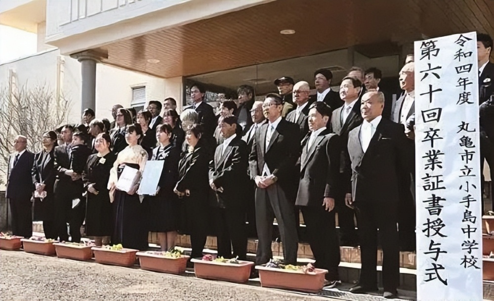

# 出生人口首次跌破80万，日本“催生”艰难：发钱不够花，给假不敢休

**发钱、给假……效果有多大？**

日本香川县小手岛中学日前为全校唯一的学生、六年级的今中章乃举行了一个人的毕业典礼，同时学校也将不可避免地关闭。

这样的例子近年来在出生率持续走低的日本并不少见。上世纪90年代起日本就实施了一系列打造育儿友好型社会的举措，但新生儿数量依然在下跌。7年前，奈良县川上村诞生了25年来第一个新生儿，被村民视为奇迹。2022年日本新出生人口为799728人，是自1899年有记录以来最低，也是首次跌破80万。首相岸田文雄警告，解决人口危机刻不容缓，日本已“处于无法维持社会功能的边缘”。

_小手岛中学举行一个人的毕业典礼。图源：GJ（下同）_

**发钱？或许不够花**

生娃“烧钱”，发钱或许是最直接的措施。据日媒报道，日本政府计划为每个新生儿提供10万日元福利，女性一次性生育补助也从42万日元增加至50万日元。

地方层面也纷纷跟进。东京都政府在破纪录的2023财年预算中，拨款1.65万亿日元用于扶持家庭育儿，较之前增加15%，计划采取的“催生”措施涵盖结婚、怀孕、儿童保育和教育各个阶段。其中最重要的是，每个18岁及以下的孩子每月可获得5000日元补贴，2岁以下的二胎宝宝可免费获得儿童保育服务。

岐阜县计划为第二个及以后的孩子提供10万日元现金作为生育福利。秋田县则准备为2022年4月及以后出生的孩子每人送上2万日元，县政府官员说：“我们的目标是将秋田打造成一个可以无忧无虑抚养孩子的地方。”

生娃就发钱，听上去不错，效果能有多大？《今日日本》的分析有点扎心。该网站文章指出，尽管女性一次性生育补助从42万提高到50万日元，但日本平均分娩费用高达47.3万日元，也就是说，当父母带着娃从医院回到家时，这笔补助已不足3万。文章半开玩笑地说，这比朝日啤酒厂假日发给员工的外出就餐费还少。

自上世纪90年代初以来，日本经济就陷入停滞，这意味着令人失望的低工资和几乎没有增加的趋势。据日本厚生劳动省数据，日本家庭平均年收入从1995年的659万日元下降到2020年的564万日元。

与此同时，育儿开销却在不断上升。金融机构杰富瑞集团研究显示，2022年日本是世界上抚养孩子最昂贵的地方之一。生娃补贴能否追上育儿消费？从日本人的态度看，并不乐观。

日本乐敦制药公司近日发布的2022年版《备孕白皮书》显示，18到29岁的400名未婚男女中，回答“未来不想要孩子”的比例高达49.4%，为该调查开展3年来的最高，“育儿太费钱”等经济问题是不少人给出的理由。而根据日本国立社会保障和人口问题研究所的一项研究，低收入者不想要孩子的比例更高。

26岁的嘉纳利木6月将与女友喜结连理。他表示，高昂的生活成本是他最担心的问题之一。

嘉纳在东京市中心一家大型企业担任工程师，自认为收入相对较高。目前他和父母居住在横滨，婚后将搬出父母家，但由于东京租房很贵，他还会在横滨居住。

计划婚后生育两个孩子的嘉纳坦言：“我觉得我负担不起两个以上的孩子。对经济上不够安全的人来说，一个以上的孩子都无法承受。”

_横堀健太郎（中）是川上村25年来第一个新生儿_

**给假？可能不敢休**

除了金钱之外，时间和精力也是育儿中的大投入。在日本家庭，母亲的养娃担子格外重，很多女性不得不兼顾家庭和工作。那么，爸爸去哪儿了？

十年来，日本致力于推广“育儿爸爸”概念，特别是敦促爸爸们休育儿假。日本议会2021年通过法案，日本男性有权享受为期四周的灵活育儿假，最多可获得80%工资。然而根据卫生部门数据，这一年只有不到14%的新手爸爸休了育儿假，四分之一的人休了不足五天。

日本首相岸田文雄上月发出誓言，到2025年要将休育儿假的男性比例从目前的14%提高到50%，到2030年提高到85%。

然而，要实现这一目标并不容易，究其原因，既有日本社会性别分工传统的根深蒂固，也有工作生活难以平衡的无可奈何。

“过去我觉得自己会在25岁之前结婚，并在27岁之前成为母亲。但看到生了一个女儿的我大姐的情形，我就害怕生孩子了。”东京大学生岩井直人说，“在日本，有了孩子父亲会继续工作，很多母亲则会辞职带娃。而无论在经济上、心理上还是身体上，抚养孩子都很艰辛。”

日本女子大学教授大泽美子在一个致力于平衡工作与生活的政府委员会担任职务。她坦言，虽然政府鼓励男性休育儿假，但日本社会关于劳动分工的传统观念依然很强。“所有抚养孩子的责任几乎都由女性承担，只要这种情况持续，生育率就很难提高。”

另一方面，爸爸们也有苦衷。

工会成员岩桥诚表示，许多日本男性害怕休育儿假，尽管有法律规定，他们仍然担心休假会影响晋升前景，“对育儿假的小幅调整并不会显著改变出生率的下降”。

东京明治大学经济学教授加藤久作认为，不少小公司担心育儿假会引发工人短缺，给想休假的年轻父亲带来了压力。

据支持小企业发展的日本工商会去年9月的一项调查，52%受访公司表示，公司内部缺乏“可替代员工”是执行男性育儿假面临的挑战。

41岁的黑田隆史在一家拥有约150名员工的IT公司上班，当他提出申请休育儿假时，老板很惊讶地说：“没人能取代你。”后来终于获得休假的黑田叹气道：“我想我的公司雇不起另一个员工来顶替我了。”

不过，正面例子也在萌芽。

人力资源公司员工莲沼贯刚刚休完第三个孩子的育儿假，这几年来他明显感受到企业对育儿假态度的转变。2020年，当他为二胎宝宝申请六个月育儿假时，老板说：“我不会阻止你，因为这是你的权利，但你真的要休吗？”而后来，当他为三娃申请更长时间的育儿假时，老板鼓励他“去吧”，没有不情愿的迹象。

_莲沼贯用奶瓶给孩子喂奶_

日本每日新闻网指出，企业立场改变的背后，是双收入家庭数量的增加以及政府推动育儿假的努力。通过更新育儿假法、延长育儿假期限和提高育儿假期间福利，政府正逐渐满足在职父亲的需求。

本月起，员工人数超过1000人的日本公司将被要求公布休育儿假的男性员工比例，这种可视化的举措也促进了企业意识的改变。岸田文雄还承诺，将为提供育儿假的中小企业提供补贴，具体细节将在6月公布。

**生娃？观念在改变**

育儿成本考量之外，日本人的观念也在发生改变。《日本经济新闻》2月开展了一项读者问卷调查，通过数千条开放式回答，更为具体地了解日本人不生孩子的理由。

一名20多岁已婚男子写道，日本将进入经济衰退期，这个阶段出生的孩子会很可怜。还有人坦言：“我连自己的生活都担忧。”

一名50多岁已婚女子说：“我母亲抱有‘本来很想进入社会得到认可，但还是成了全职主妇’的遗憾，我在长大的过程中总感觉‘养育孩子就会牺牲自己’。”

相比大部分无奈和悲观，偶尔也有一些积极的表述。一名30多岁已婚女子写道：“无论有没有孩子，都有信心度过快乐的人生。”

引人注意的是，现在的年轻人相比前辈有更多人生选择，生孩子不再是必选项。一名30多岁未婚男性“希望人生不要以成家为前提”，同龄的一名已婚女性期望“可以按照自己的意愿生活”，一名40多岁已婚男性表示“希望最优先保证二人世界的时间”。甚至有受访者直言，因为有人不需要孩子，所以不必要总是强调育儿友好型社会。

23岁的桥本千香刚刚大学毕业，她不反对组建家庭，但也不会刻意去抓住这个机会，“完成事业，享受自由，远比结婚生子重要”。她认为，经济问题是她和许多其他年轻女性不再以家庭生活为中心的主要原因，“对日本女性来说，要在事业和家庭之间取得平衡并不容易”。

据日本厚生劳动省数据，2021年日本生育第一个孩子的母亲的平均年龄增至30.9岁，为1950年有记录以来最高，日本“职场妈妈”比例也达到有史以来最高水平——在有18岁以下孩子的家庭中，76%的母亲参加工作，比2004年高出近20个百分点。然而，37%的母亲从事临时工作，往往没有相应福利。

《日本经济新闻》结合问卷调查指出，诸如“应该生孩子”“女性应该照看孩子”等传统规则束缚了人们的生活方式，因此产生了“因为做不到”而决定不结婚、不生孩子的想法。此外，在医疗护理等社会保障方面，需要建立不管有没有孩子都能放心生活的机制。

**出品 深海区工作室**

**撰稿 浦城**

**编辑 深海贝**

