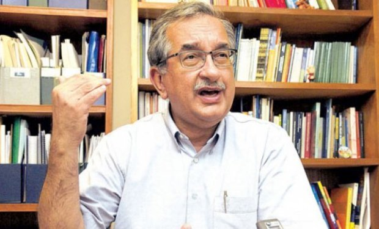
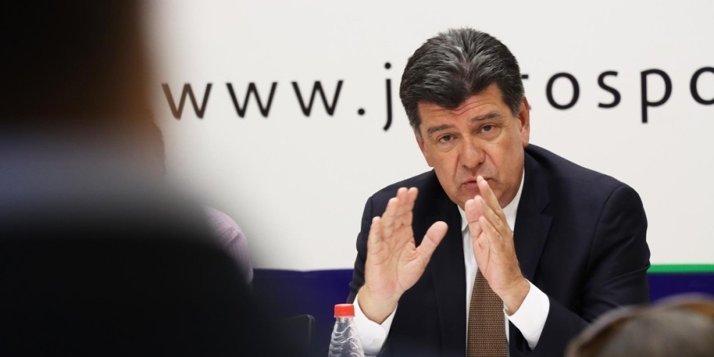

# 巴拉圭大选在即，巴学者：无论谁赢，我们迟早会与中国建交

（观察者网讯）即将于4月30日举行的巴拉圭总统大选，已经进入不到48小时的最后冲刺阶段。早前，有多名总统候选人宣称若成功当选将同台湾当局“断交”，并与中国建交。这让对台关系再度成为巴拉圭大选的热门话题之一。

综合英国广播公司世界电视台（BBC
World）、美媒《基督科学箴言报》等外媒28日报道，曾任巴拉圭财政部与工商部首席顾问的学者费尔南多·马西（Fernando
Masi）周五在美国智库大西洋理事会举办的一场线上讨论会上表示，无论谁赢得本届总统大选，巴拉圭迟早会与北京建交，因为巴拉圭需要中国市场。

_费尔南多·马西 资料图_

巴拉圭是台当局在南美洲唯一的所谓“邦交国”，也是台仅剩的13个“邦交国”之中面积最大的。

自3月底洪都拉斯正式宣布与台湾当局断绝所谓的“外交关系”，岛内便开始担忧与巴拉圭的关系也将岌岌可危。此后美国政府更加强与巴拉圭互动，还派中情局副局长罕见访问了这个南美国家。

据路透社报道，随着大选之日将近，选民们关注的竞选核心话题集中在严峻的国内经济形势、政府腐败问题，紧接着就是对台关系。

最新当地民调显示，已经执政近75年的红党候选人圣地亚哥·培尼亚，和主要反对派真正激进自由党（蓝党）候选人埃弗拉因·阿莱格雷的支持率几乎不相上下。另一名将自己定义为“民族主义”共和党派候选人的库巴斯位列第三。

后两者均在竞选宣言中称，若成功当选，将与中国建交。1月9日，我外交部发言人汪文斌曾回应称，坚持一个中国原则是国际大义，人心所向、大势所趋，中方相信有关国家迟早会认清国际大势，做出符合历史潮流的正确决定。

_埃弗拉因·阿莱格雷 资料图_

综合《南华早报》《基督科学箴言报》等28日报道，在当天美国智库大西洋理事会一场关于“巴拉圭选举对美中在拉美地区影响”的线上讨论中，巴拉圭国际政治学及经济学教授费尔南多·马西表示，他认为无论周日的选举如何，都不会影响巴拉圭终将与中国建交的结果，一切都只是时间问题。

费尔南多曾任巴拉圭财政部与工商部首席顾问，他表示巴拉圭需要中国的市场和资金，“巴拉圭迟早都会与中国建立外交关系，因为不这么做就像不与欧盟或美国建交一样不明智。中国是一个经济大国，他们（政府）会这么做的。”

在首都亚松森一个嘈杂市场中，大多数接受路透社采访的巴拉圭民众都提及了国内艰难的经济状况。去年巴拉圭政府赤字增长到GDP的3%，过去四年的平均增长率跌至0.7%，绝对贫困率也在上升。一位餐馆老板表示：“我们在倒退，这就是我的感受。在巴拉圭，腐败比工作还多。”

在这种情况下，寻求打开中国市场成为了一个很现实的选项。

BBC提到，人口近740万的巴拉圭，其经济的两大支柱——畜牧业和农业，近来呼吁与中国开放贸易的呼声越加高涨。

巴拉圭是全球十大牛肉和大豆出口国之一，但缺乏官方联系阻碍了这些产品直接对中国销售。反对派总统候选人阿莱格雷此前就曾公开表明与台湾当局维系所谓“邦交”，导致巴拉圭的黄豆与牛肉难以出口至中国大陆。

巴拉圭农村协会主席佩德罗·加利说：“我们是一个粮食生产国，却没有向世界上最大的粮食进口国出售粮食”、“我们在阳台上看别人搞派对”。

总统候选人库巴斯也强调，巴拉圭每年出口数十万吨肉类，急需打通中国这个巨大市场。

_库巴斯宣布支持与中国建立正式外交关系，但希望不切断与中国台湾地区的文教和商业联系_

费尔南多表示，与中国建交将为巴拉圭带来潜在的重大经济收益。巴拉圭不仅能增加出口，还可以出口更高价值的产品，尤其是他们具有竞争优势的商品。

他补充称，这一转变还将为该国的投资多元化创造机会，并为与中国达成区域自由贸易协定扫清道路。“这不仅仅是一个意识形态问题，而是一个基本的经济问题。”

2020年4月，巴反对党议员联署了立刻与中国建交的提案。投票结果是41票中有25票反对、16票赞成。尽管红党主导的众议院予以否决，但9票之差足以表明，巴精英阶层“亲台”的历史惯性已然动摇。

谈及选举对中美在拉美地区影响，费尔南多说，他理解目前中美两国有分歧，也理解中美在拉丁美洲地缘政治的竞争，“不过就巴拉圭而言，我们不是这场竞赛的一部分，我们也不想要像过去那样发生某种冷战，当时拉丁美洲国家的独立性非常有限。”

他进一步表示，巴拉圭与中国发展关系并不是意味着不再是美国的战略盟友，巴拉圭会继续与美国保持战略同盟关系。

对此，《基督科学箴言报》援引了佛罗里达国际大学杰克戈登公共政策研究所专家利兰·拉撒路的一句话，“从很多拉美和加勒比国家的角度来看，经济安全就是国家安全，但美国似乎并不总是明白这一点。政治家需要平衡崇高的民主理想和人民的真实需求。”

另有一名研究人员也补充道，所有国家都希望“能够与多个伙伴一起追求自己的利益”。

另据新华社21日报道，在第二届中国-巴拉圭关系研讨会上，与会巴拉圭专家学者一致认为，巴拉圭需要进一步加强与中国的经贸合作，把握当下机遇推动国内经济转型发展。

费尔南多也参加了此次线上研讨。他表示，深化两国商贸合作是巴拉圭农牧界的长期愿望。此外，中国在制造业、纺织业、可再生能源等领域的技术和投资能够促进巴拉圭国内产业转型，增强其在区域市场的竞争力。

“中国是世界市场最重要的组成部分之一，巴拉圭不能缺席中国市场。”他说。

**本文系观察者网独家稿件，未经授权，不得转载。**

