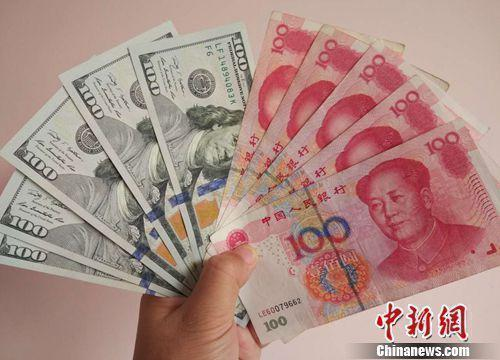

# 更多国家“去美元化”！中国跨境交易中人民币使用首超美元

中新网4月29日电(中新财经 宫宏宇)我国跨境交易“去美元化”创下新纪录！

中国国家外汇管理局近日发布的数据显示，人民币在中国银行代客涉外收付款中的占比从2010年的接近零升至今年3月底创纪录的48%，创十三年来新高。美元同一时期的份额则从83%降至47%。

“人民币在中国跨境交易中的使用首次超过美元，这是中国减少对美元依赖过程中跨过的另一个里程碑。”彭博社对此报道称。

_资料图：人民币和美元。中新财经
李金磊 摄_

**人民币的国际“朋友圈”越来越大**

自2010年来，美元一直在中国跨境收支货币占比中稳居首位。但随着全球多国掀起“去美元化”浪潮，以及中国积极推动双边贸易用人民币结算，减少使用美元正成为中国跨境交易中的新气象。

今年3月以来，多国接连转向人民币结算。4月26日，阿根廷经济部长马萨宣布，阿根廷将停止使用美元来支付从中国进口的商品，转而使用人民币结算。4月初，马来西亚总理安瓦尔表示，马来西亚央行已经开始与中国讨论，令两国贸易可以用林吉特和人民币结算。

更早的3月29日，巴西政府表示，巴西与中国达成协议，不再使用美元作为中间货币，而是使用本币进行贸易。3月28日，中国海油与法企道达尔能源通过上海石油天然气交易中心平台完成国内首单以人民币结算的进口液化天然气(LNG)采购交易。

事实上，截至目前，已有包括印度尼西亚、伊朗、俄罗斯、德国在内的30多个国家正逐渐在贸易结算或投资中转向使用人民币。人民币的国际朋友圈越来越大，人民币在全球特别是新兴经济体的认可度大幅提升。

**人民币为何“炙手可热”？**

“人民币使用的增加是中国开放其资本账户的自然结果，流入中国内地和流出香港的债券正在增加。”彭博行业研究首席亚洲外汇和利率策略师赵志轩在一份简报中写到。

星展银行(香港)经济师梁兆基则对彭博社表示，随着其他国家寻求一种替代性支付货币以分散风险，再加上美联储的信誉也不如以前那么好，人民币的国际化进程正在加速。

当前，全球多国掀起“去美元化”浪潮。中国国际经济交流中心总经济师陈文玲对媒体表示，“去美元化”的背后是对美国和美元的不信任。这既是因为它们对美国信用的质疑和对美元霸权的不满，也是无奈之举，有避险的成分。现在美元已成为世界经济不稳定和不确定性的主要来源。

“乌克兰危机中，美国联合多国制裁俄罗斯，导致俄罗斯出口贸易受到影响，世界各国看到美元的霸道行径。‘去美元化’、货币多元化是大势所趋。”前海开源基金首席经济学家、基金经理杨德龙此前对中新财经表示。

_资料图：人民币。中新财经
宫宏宇 摄_

**跨境交易中超过美元，有何意义？**

“人民币在银行代客涉外收付款中的使用量超过美元，说明在我国跨境交易逐渐做到了以本币为主导。”中国银行研究院高级研究员王有鑫提到。

国家外汇管理局副局长、新闻发言人王春英4月21日在发布会上表示，人民币在跨境使用中的占比不断上升，有助于降低在跨境交易中货币错配风险。

“过去在中国的对外贸易中计价和结算主要使用第三方货币，既增加了企业的外币风险敞口和汇率风险，也增加了国家外汇储备管理和运营的难度，增加了跨境资本流动波动风险。”王有鑫表示。

在王有鑫看来，逐渐推广本币结算后，企业汇兑风险将明显降低，在生产经营中的资产和负债币种错配风险将显著下降，企业可以将更多资源和精力投入到主营业务中去。外币的跨境流动波动性将降低，人民币流动性和资产配置需求增加，汇率稳定性将提升，人民币资产将获得更多国际投资者青睐。

此外，王有鑫提到，人民币在双边贸易中使用增加，将给其他经济体和市场参与者起到示范带动效应，未来人民币跨境结算将在更多场景和更多国家得到推广。

中国国务院4月发布了《关于推动外贸稳规模优结构的意见》，其中提到，鼓励金融机构创新完善外汇衍生品和跨境人民币业务，进一步扩大跨境贸易人民币结算规模。

杨德龙认为，人民币国际化的程度进一步提升，将一定程度上改变美元“一币独霸”的状态，削弱美国操纵全球货币市场的力量，有利于非美国家长远发展。

