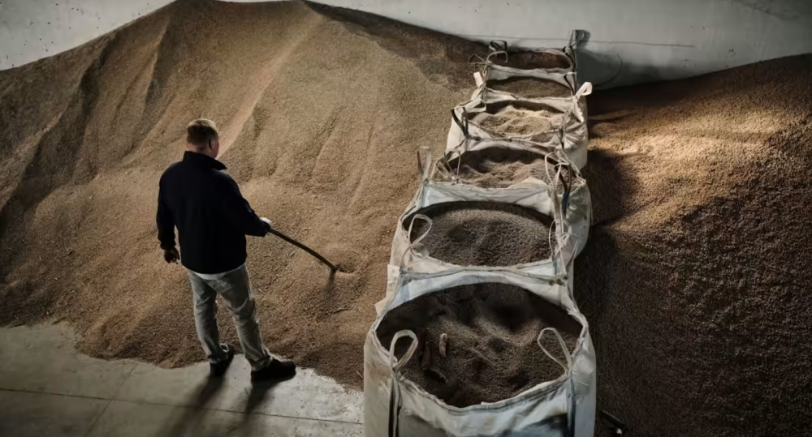

# 欧盟与波兰等五国达成协议：欧盟提供补贴，五国取消乌克兰粮食禁令

（观察者网讯）据英国《金融时报》4月28日报道，欧盟当天与波兰、匈牙利、斯洛伐克、保加利亚和罗马尼亚就乌克兰农产品相关事宜达成协议。欧盟将对小麦、玉米等4种农产品实施“保障措施”，并为五国农民提供1亿欧元补贴，以换取有关国家取消对乌克兰粮食的禁令。

_《金融时报》报道截图_

欧盟委员会执行副主席兼贸易专员东布罗夫斯基斯称，欧盟已经与五国达成一致，“相关国家将撤回其单方面措施。我们有一个解决方案，可以解决东部成员国和乌克兰农民的担忧。”

报道称，由于物流等后续问题未能得到解决，乌克兰出口的大批农产品积压在欧盟东部国家，冲击当地农产品价格，引发波兰等国农民抗议。波兰、匈牙利、斯洛伐克和保加利亚以“保护本国农民”为由，在4月中旬相继出台禁令，禁止从乌克兰进口农产品。

罗马尼亚也对粮食价格下跌表示不满，但该国还没有采取针对乌克兰农产品的单边措施。

为确保乌克兰粮食顺利过境，经过近两周的谈判，欧盟最终与这五个国家在当地时间28日达成协议。这项协议将推动波兰等国撤回对乌克兰农产品的禁令，欧盟则会对小麦、玉米、油菜籽和葵花籽这4种农产品实施“特殊保障措施”，并为受影响的五国农民提供1亿欧元补贴。

“Politico”欧洲版称，东布罗夫斯基斯没有说明“特殊保障措施”的具体细节， **但欧盟外交官透露，这4种农产品只被允许途径五国转运到其他目的地。**
欧盟委员会还承诺，将会继续推进调查，以确定是否要将“特殊保障措施”的范围扩大到其他农产品。

欧盟委员会主席冯德莱恩称，这项协议“既保留了乌克兰的出口能力，使其可以继续为世界供应粮食，也保证了欧盟农民的生计。”

_波兰粮店内堆积着来自乌克兰的低价粮食
图自彭博社_

《金融时报》指出，在俄乌冲突爆发之后，欧盟取消了对乌克兰农产品的关税和进口配额。但由于物流成本高昂，进入欧盟的大部分乌克兰农产品依然滞留在欧盟东部国家。布鲁塞尔已经承诺，将会组织卡车、火车和驳船运输粮食，以确保农产品可以从港口运往有需要的国家。

此外，欧盟成员国28日还同意将与乌克兰的战时贸易制度延长一年，至2024年6月到期。预计修订后的版本会包含“更强力的条款”，从而允许欧盟在未来更快地采取措施“保护”自己的市场。

**本文系观察者网独家稿件，未经授权，不得转载。**

