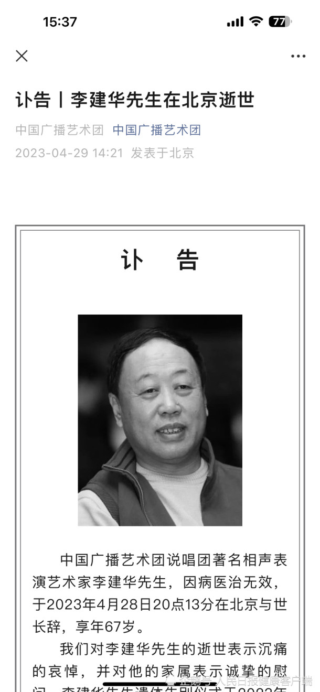

# 相声演员李建华病逝，心脏一旦出问题非常凶险，心肌酶检查很有必要

**人民日报健康客户端记者 张爽**

4月29日下午2点21分，中国广播艺术团发布“李建华先生在北京逝世”的讣告。讣告中表示，著名相声表演艺术家李建华先生，因病医治无效，于2023年4月28日20点13分在北京与世长辞，享年67岁。

虽然关于李建华先生去世的具体原因目前尚未披露，但相声演员李寅飞29日凌晨在某社交平台上透露，自己的父亲是心内科专家，28日李建华先生因身体状态不佳被送往医院，李寅飞将检查结果发给了父亲，他父亲曾叮嘱让李建华先生去补做心肌酶检查。等到下午6点，李寅飞询问该项检查结果时得知，李建华先生的情况已经非常危险了。

为什么心脏一旦出现问题会非常凶险，心肌酶检查又为何如此必要？

北京大学人民医院心内科主任医师张海澄在4月29日接受人民日报健康客户端记者采访时指出，人体的全部机能都要依赖心脏泵血才能够正常运行，因此，一旦心脏出现问题，往往结果比较凶险，留给医生的抢救时间也通常十分有限。以心脏性猝死为例，我国每年有54万的相关案例，即约每一分钟就有1人心脏性猝死，但能够抢救存活的患者仅不到1%。

一旦心脏发生问题，心肌酶检查结果往往是医生判断患者心脏是否出现心梗的主要参考之一。张海澄介绍，作为存在于人体心肌细胞中的一种特有的物质，当人体心肌受到损伤时，心肌酶就会释放出来，通过抽取一定量的血液进行检查，如果发现指标数值有异常，就说明患者可能发生了心肌损害，如心肌梗塞、心肌炎等问题，这时就需要及时采取治疗措施。

“不过，许多患者即使有问题，在早期，心肌酶的检查也可能显示正常，因此我们往往还要结合临床的持续症状观察、心肌酶动态改变、心电图动态演变等才能下最终的诊断。”张海澄表示，“如果发现心脏出现不适症状，一定不能忽视，务必要到医院让专业医生进行诊断。”

