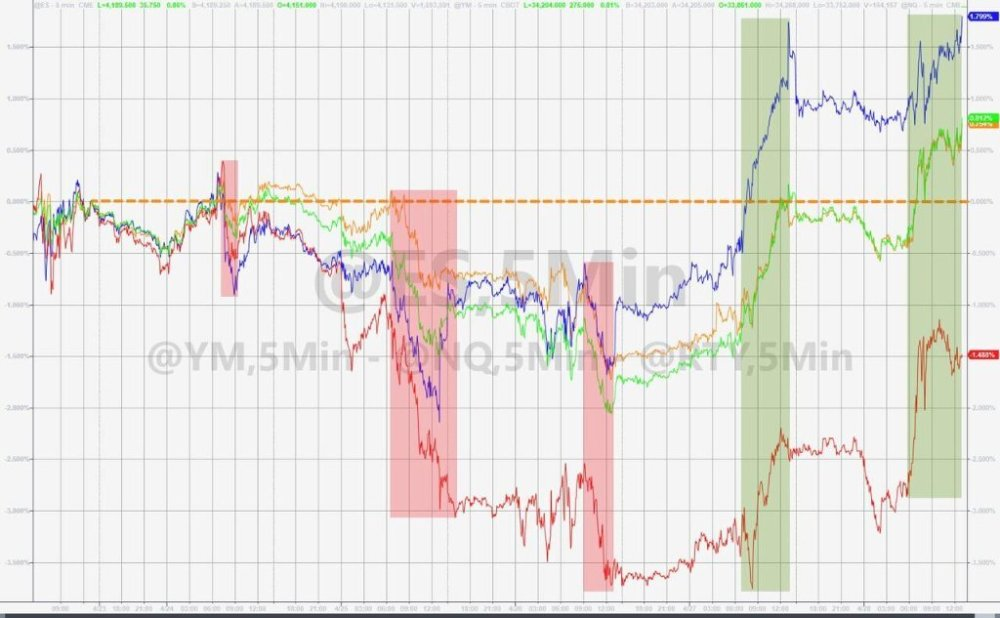
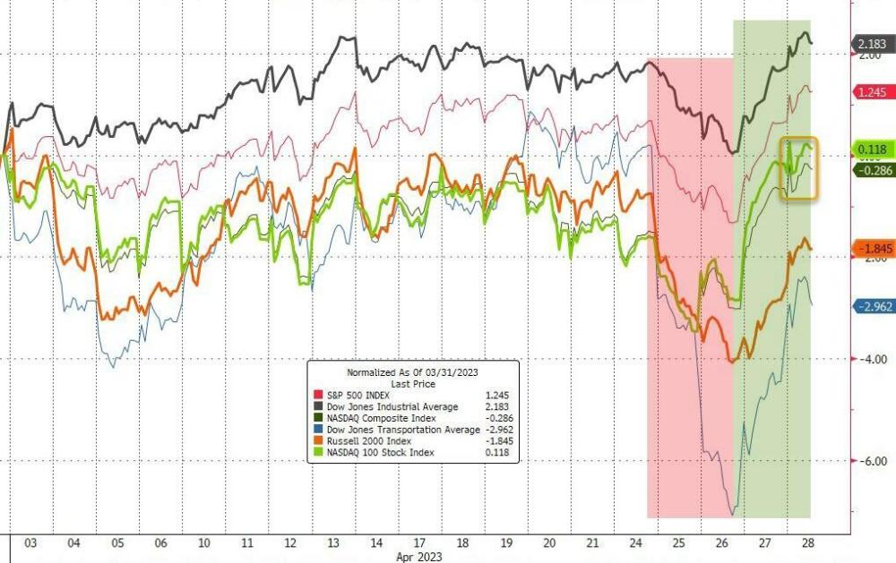
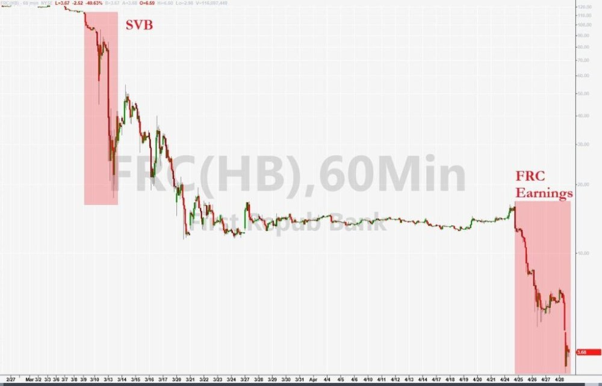
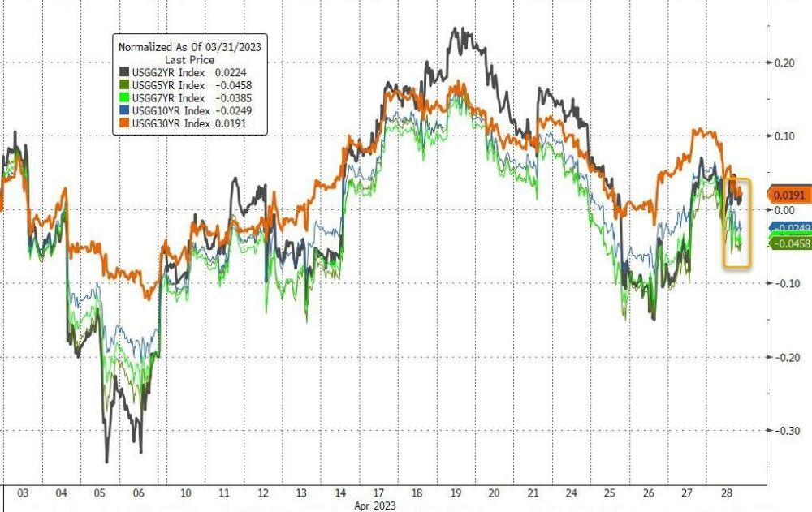
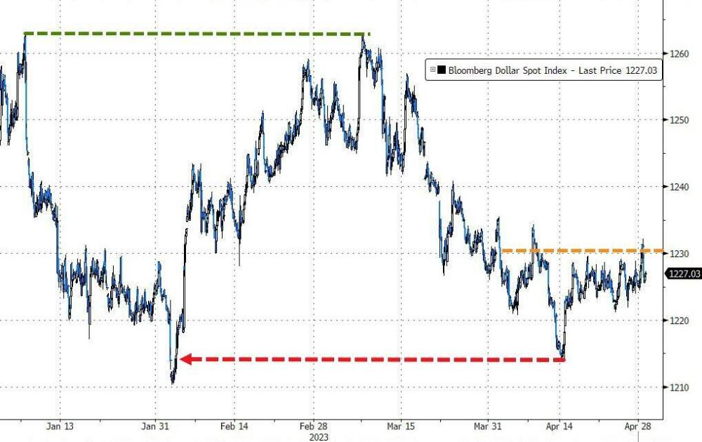

# 美股收盘：纳指创七个月新高，第一共和银行跌超43%，亚马逊跌近4%

美联储高度关注的指标显示通胀居高不下：3月核心PCE物价指数增速符合预期，同比增长4.6%，仍远超联储目标2%，环比增长0.3%，连升两月；衡量薪资关键指标一季度就业成本指数意外加速增长，一季度环比增1.2%，市场预期和四季度均增1.1%。

通胀指标强化了美联储下周将继续加息、6月也可能再加息的预期。数据公布后，美股低开，早盘苹果等部分科技股反弹，油气巨头埃克森美孚和雪佛龙一季度利润高于预期，力挺能源板块带头支持大盘转涨。但在本周前几日微软、谷歌、Meta连续季报向好后，亚马逊给科技巨头的好成绩蒙上阴影。一季度业绩优于预期、但警告最高利润业务云计算的销售增长将进一步放缓后，亚马逊盘初重挫，拖累云计算类股总体回落。

虽然银行股总体继续回涨，但个别地区银行仍挑动市场神经。第一共和银行周四的反弹昙花一现。在媒体称该行最有可能的结局是被监管方美国联邦存款保险公司（FDIC）接管后，该行股价盘中跳水，重拾周二和周三大跌的势头。还有媒体称，该行达成救助协议维持运营的希望变得渺茫。

得益于Meta为首的部分企业业绩向好，美股指本周及4月总体继续上涨。因银行为首的部分板块拖累，本周欧股未能持续一个多月来涨势，但企业业绩抵消了衰退担忧的影响，4月总体抹平了3月爆发银行业危机期间的跌幅。

周四因一季度PCE指数超预期强劲而加速回升后，美国国债收益率周五总体保持回落势头，3月PCE物价指数公布后，收益率下行趋势不改，对利率敏感的两年期美债收益率短线转升，随着第一共和银行暴跌，美债收益率盘中加速回落，基准10年期美债收益率一度降10个基点。评论称，下周美联储再加息25个基点已在预料之中，市场仍对加息的不确定性感到不安，投资者还希望通过政策指引了解高利率会保持多久、何时可能降息。

周五德国公布的4月CPI增速超预期放缓，市场对欧洲央行再度加息50个基点的预期降温，欧债的收益率回落幅度超过美债。德债收益率普遍一日降逾10个基点，但4月总体升势不改。而在周五回落后，美债收益率全周及全月均累计下行。

汇市方面，周五最大的输家当属日元。日本央行新行长植田和男首秀鸽派开场，维持超级宽松不变，同时取消利率前瞻指引，将对政策展开全面评估。会后日元汇率持续下行，日元兑欧元盘中创2008年雷曼兄弟破产以来新低，日元兑美元盘中曾跌近2%。

美国PCE物价指数公布后，美元指数迅速重上102.00，一度涨至一周多来高位，后回吐涨幅。美股早盘公布的美国密歇根大学4月消费者信心终值如预期脱离3月的三个月低位，消费者的未来一年通胀预期持平预期初值4.6%，美元指数一度有所回升，最终未能站稳102上方，全月跌势不改。

大宗商品中，黄金在美国PCE公布后刷新日低，美股盘中勉强转涨，全周和4月保住涨势。4月期间，两周前金价曾突破2050美元，逼近2008年所创的收盘历史高位。评论称，金价围绕2000美元这一心理关口波动，投资者静候美联储下周会议决策，未来金价仍可能创历史新高；面对多种不同的主题，金融市场总体持观望态度，这就是多种资产涨跌起伏的原因。

国际原油周五加速反弹，进一步脱离本月内低位，美油涨超2%，得以抹平4月累计跌幅，在沙特等OPEC+国家4月初意外宣布减产后，止住五个月连跌势头。评论称，周五美国能源部下属能源信息署（EIA）发布的月度报告显示，美国的石油需求创去年11月以来新高，同时产油量降至去年12月以来低位，这给带给油市上行动力。而且，周五公布财报的埃克森美孚CEO预计油价会上涨，称汽油需求看来合理，因此需求疲软的担忧缓和。但第一共和银行救助的消息在遏制油价走高。

纳指创七个月新高 亚马逊所在板块逆市下跌 Meta所在板块全周和全月领涨 第一共和银行一周跌75%

三大美国股指集体低开，道琼斯工业平均指数盘初转涨，午盘涨超200点，标普500指数开盘不到半小时转涨，纳斯达克综合指数开盘约半小时后转涨，尾盘集体刷新日高。三大指数连续两日集体收涨，标普和道指在连跌两日后连涨两日，纳指连涨三日，涨势较周四均明显放缓。

周四收涨近2%的标普收涨0.83%，报4169.48点，创2月2日以来收盘新高。周四收涨近1.6%的道指收涨272点，涨幅0.8%，报34098.16点，收创2月15日以来新高。周四收涨2.4%的纳指收涨0.69%，报12226.58点，收创去年9月12日以来新高。

价值股为主的小盘股指罗素2000收涨1.01%，跑赢大盘，继续脱离3月23日以来低位，但未能抹平此前三日的跌幅。科技股为重的纳斯达克100指数收涨0.65%，连涨三日至去年8月18日以来高位。

凭借周四大涨，
本周主要美股指大多累计上涨。道指涨0.86%，抹平上周结束四周连涨的跌幅。标普累涨0.87%，纳指累涨1.28%，周四收涨近2.8%的纳斯达克100累涨1.89%，均抹平上周回落的跌幅，最近七周内第五周累涨。而连涨两周的罗素2000累跌1.26%，最近六周内第二周累跌。

_主要美股指本周走势_

4月主要股指也多数累计上涨、连涨两月、今年内第三个月累涨。3月涨近1.9%的道指累涨2.48%，为仅次于1月的今年最大月涨幅，3月涨3.5%的标普累涨1.46%，3月涨近7.6%的纳指微涨0.04%，3月涨近9.5%的纳斯达克100涨0.49%，而罗素2000累跌1.86%，连跌三个月。

_主要美股指4月走势_

标普500各大板块中，周五只有两个收跌，公用事业跌近0.2%，亚马逊所在的非必需消费品微跌。能源涨近1.5%领涨。本周共六个板块累涨，Meta所在的通信服务涨约3.8%领涨，微软所在的IT板块涨超2%，房产和必需消费品涨超1%，五个累跌的板块中，公用事业跌约1%，工业和医疗跌0.6%左右，材料和金融跌近0.2%。

4月各板块中只有三个累跌，工业跌超1%，非必需消费品跌约1%，工材料跌近0.2%。通信服务涨近3.6%继续领涨，必需消费品和能源也涨超3%，金融和医疗涨约3%。

龙头科技股多数凭借盘中转涨而收涨。特斯拉收涨约2.6%，连涨两日，但未能抹平本周前四日所有跌幅。FAANMG六大科技股中，奈飞收涨近1.3%，连涨两日至4月18日以来高位；微软收涨0.8%，连涨三日，继续创去年4月初以来新高；苹果收涨近0.8%，连涨两日，继续刷新去年8月以来高位；公布一季报后周四大涨14%的Facebook母公司Meta盘初转跌，凭借尾盘转涨收涨逾0.7%，连涨三日，创约15个月新高；而在周四盘后的业绩电话会上披露，一季度营收增速已创披露业绩以来新低的亚马逊云业务AWS本月增长进一步放缓后，亚马逊盘初一度跌5%，收跌约4%，回吐周四的多数涨幅，跌离周四连涨两日所创的2月2日以来高位；周四大反弹的谷歌母公司Alphabet盘中跌超1%后逐步收窄跌幅，收跌逾0.2%，暂别4月14日以来高位。

这些科技股中，本周只有跌1.4%的亚马逊和跌近0.5%的特斯拉累跌，Meta涨近13%，微软涨7.5%，苹果涨2.8%，Alphabet涨1.8%，奈飞涨0.6%。4月Meta涨超13%继续领跑，微软涨超6%，Alphabet涨超3%，苹果涨近3%，亚马逊涨超2%，而特斯拉跌超20%，奈飞跌4.5%。

银行股总体连涨两日。银行业指标KBW银行指数（BKX）收涨1.5%，在连跌五日后继续脱离五周低位，本周累跌近2%，4月跌0.9%。地区银行指数KBW
Nasdaq Regional Banking Index（KRX）收涨近1.2%，地区银行股ETF
SPDR标普地区银行ETF（KRE）收涨逾1.7%，均连涨三日，继续脱离2020年11月以来低谷，KRX大致持平一周前水平，4月跌超3%，KRE本周跌0.6%，4月跌近3%。

银行股中表现最差的当属第一共和银行（FRC），其盘初曾涨近7%，早盘迅速抹平涨幅转跌，盘中跌幅曾超过50%，收跌43.2%，继周二和周三之后，本周第三日创收盘历史新低，尽管周四反弹、收涨近9%，全周仍累跌75.4%，4月跌近75%。

_第一共和银行股价2月末以来走势_

欧股方面，部分企业业绩优于预期，抵消了银行股下跌的影响，泛欧股指在连跌三日后连涨两日，但未能抹平前三日所有跌幅。欧洲斯托克600指数继续脱离周三所创的4月12日以来收盘低位。主要欧洲国家股指周五多数上涨，德股和法股连涨两日，连跌四日的英股反弹，而连涨两日的西班牙股指回落，意大利股指回吐周四反弹的涨幅，最近五日内第四日收跌。

各板块中，周五只有四个板块收跌，跌超1%的银行领跌，受累于一季度存款流失200亿英镑的英国银行NatWest跌3.7%。收涨的15个板块中，油气涨近2%领涨，房产、金融服务、工程、传媒、保险都涨超1%。个股中，一季度销售收入和高于预期、营业亏损低于预期的瑞典家用电器生产商Electrolux
AB涨15.5%；今年全年核心盈利指引向好、重启股票回购计划的德国化工产品生产商Covestro涨8.5%。

本周斯托克600指数回吐上周所有涨幅，终结五周连涨。各国股指多数累跌，领跌的意大利股指跌超2%，连跌两周，连涨五周的英法西股回落，只有德股小幅累涨，连涨三周。本周共十个板块累涨，九个累跌，房产涨近2%表现最好，银行跌超2%领跌。

4月斯托克600指数涨近2%，抹平3月瑞信等引爆银行业危机期间的跌幅，最近四个月内三个月累涨。各国股指大多累涨，德股和法股连涨四个月，英股和西股在3月止步两月连涨后反弹，而意股连跌两月。4月只有四个板块累跌，矿业股所在的基础资源跌超5%，科技跌超4%，汽车跌超2%，零售跌0.3%。15个累涨的板块中，房产涨超5%，保险和医疗涨超4%，旅游涨4%。

德债收益率降逾10个基点 两年期美债收益率短线转升后迅速回落 十年期收益率降10个基点

周五欧洲国债价格反弹，欧债收益率在德国4月CPI公布后加速回落。英国10年期基准国债收益率收报3.71%，日内降7个基点，刷新日低时下测3.70%，向周三所创的4月14日以来低位靠近。基准10年期德国国债收益率收报2.31%，日内降15个基点，刷新周三所创的4月12日以来低位，回吐周三盘中转升以来所有升幅。

本周欧洲收益率普遍回落，止住两周连升的势头。10年期英债收益率累计降约4个基点；10年期德债收益率累计降约17个基点，最近六周内第二周下降。4月欧债收益率普遍在3月回落后反弹。全月10年期英债收益率累计上升约23个基点，抹平3月约半数降幅；3月降约35个基点的10年期德债收益率升约2个基点，最近九个月内第六个月攀升。

美国10年期基准国债收益率在亚市盘中曾接近3.55%，继续刷新4月24日周一以来高位，3月PCE指数公布后不升反降，下破3.45%，美股午盘曾下测3.42%刷新日低，到债市尾盘时约为3.42%，日内降约10个基点，本周累计降约15个基点，4月降约5个基点。

对利率前景更敏感的2年期美债收益率在亚市盘中曾升破4.10%，刷新4月24日以来高位，后震荡回落，未到欧股开盘已抹平所有升幅，欧股早盘下破4.10%，美国PCE公布短线转升但很快回落，美股尾盘逼近4.00%刷新日低，到债市尾盘时约为4.02%，日内降约5个基点，全周累计降约16个基点，4月累计降约1个基点，和10年期美债的收益率均止步两周连升、且连降两个月。

_各期限美债收益率4月走势_

日元兑欧元创2008年金融危机以来新低 美元指数盘中创逾一周新高 仍连跌两月

日本央行会后，日元汇率加速下跌，欧美交易时段保持跌势。美元兑日元在美股早盘曾涨破136.50、日内涨逾1.9%，创3月10日涨至136.99以来新高。欧元兑日元在美股盘中曾涨破150.50，日内涨约1.9%，创2008年9月雷曼兄弟申请破产以来新高。

追踪美元兑欧元等六种主要货币一篮子汇价的ICE美元指数（DXY）在亚市早盘跌破101.50刷新日低，日内跌不足0.1%，后很快转涨，日元加速下挫的支持下，日内涨幅扩大，美国PCE公布后迅速重上102.00，一度靠近102.20，创4月19日上周三以来新高，日内涨近0.7%，后回吐涨幅，美国密歇根大学消费者通胀预期公布后，美元指数略有回升，曾接近102.00，早盘尾声时短线转跌，午盘重回涨势。

到周五美股收盘时，美元指数处于101.60上方报101.657，日内涨近0.2%，本周微跌，4月跌近0.9%；追踪美元兑其他十种货币汇率的彭博美元现货指数涨约0.1%，本周累涨0.1%，在连跌五周后连涨两周，4月累跌近0.3%，和美元指数均连跌两月。

_彭博美元指数四个月来走势_

比特币（BTC）在美股盘初曾跌破2.9万美元刷新日低，较亚市早盘2.97万美元上方的日内高位跌约800美元、跌超2%，美股收盘时处于2.94万美元下方，最近24小时跌1%左右，最近七日涨超7%，4月涨超3%。

原油两连涨 仍连跌两周 美油终结五个月连跌

国际原油期货周五有惊无险收涨。在欧股盘前刷新日低时，美国WTI原油跌至73.93美元，日内跌1.1%，布伦特原油主力合约7月合约跌至77.51美元，日内跌超0.9%，欧股早盘转涨后美股早盘短线转跌，午盘涨幅均扩大到2%以上，布油重上80美元关口。

最终，原油在连跌两日后连涨两日，继续脱离周二和周三所创的3月末以来收盘低谷。WTI
6月原油期货收涨2.02美元，涨幅2.70%，报76.78美元/桶；布伦特6月原油期货收涨1.17美元，涨幅1.49%，报79.54美元/桶，和美油均在周二和周三分别收创3月31日和3月29日以来收盘新低。

本周美油累跌约1.4%，布油跌约2.6%，均在连涨四周后连跌两周。4月美油累涨约1.5%，终结五个月连跌，继在去年10月之后，最近11个月内第二个月累涨，布油新的即月合约7月合约收涨2.7%，报80.33美元/桶，4月累涨近0.6%，也止住五个月连跌，而布油6月合约累跌约0.3%。

_美国WTI原油2月上旬以来走势_

美国汽油和天然气期货齐涨。连跌三日的NYMEX
5月汽油期货收涨1.8%，报2.58美元/加仑，走出连续两日所创的3月21日以来收盘低位，本周累跌约0.8%，在连涨四周后连跌两周，4月累跌4.5%，回吐3月反弹的所有涨幅；NYMEX
6月天然气期货收跌2.23%，报2.4100美元/百万英热单位，连涨两日，继续脱离周三大幅回落所创的4月14日以来低位，本周微涨0.08%，连涨三周，在3月大幅回落、跌超19%后4月累涨近8.8%。

黄金勉强两连阳 未收复2000美元 但连涨两月 伦铜三连阳仍连跌两周 伦锌4月跌超9%

纽约黄金期货在周五美股盘前刷新日低至1984.4美元，日内跌超0.7%，美股盘中艰难转涨。最终，COMEX
6月黄金期货收涨0.01%，报1999.1美元/盎司，在周三止步两连阳后勉强连涨两日，继续脱离上周五跌穿2000美元至1990.5美元所创的3月31日以来收盘低位，但连续三日、最近六个交易日内第五日收于2000美元下方。

本周期金累涨约0.4%，在连跌两周后反弹，4月累涨近0.7%，连涨两月，但涨幅远不及3月涨超7%所创的2020年7月以来最大涨幅。

_现货黄金4月同样继续累涨，虽然涨幅较小，但4月期间曾上测纪录高位_

纽约期银在连跌两日后连涨两日，COMEX
7月白银期货收涨近0.1%，报25.23美元/盎司，本周累涨0.7%，在上周终结七周连涨后反弹，4月累涨4.4%，连涨两月，涨幅也远逊3月的近15%。

伦敦基本金属期货周五全线上涨。领涨的伦铅涨超2%，在连跌四日后反弹，伦铝终结六日连跌，均止住连续三日创两周新低的势头。伦铜在连跌五日后连涨三日，继续脱离一个月来低位，但连续四日收于8600美元下方，未能抹平本周前两日的跌幅。伦镍和伦锡也三连阳，分别继续脱离周二大幅回落所创的两周多和一周多来低位。伦锌抹平周四回落的跌幅，未再靠近周二所创的2021年2月以来低谷。

本周基本金属集体累跌，领跌的伦锌和伦铜跌超2%，和跌0.6%的伦铅均连跌两周，上涨大涨7%的伦锡跌近2%，伦铝和伦镍跌超1%，均止步两周连涨。

4月基本金属涨跌不一。伦锌跌超9%，连跌三个月，3月反弹的伦铜和伦铝跌超2%，而伦铅涨近2%，伦锡涨近1%，均连涨两月，连跌两月的伦镍涨超1%。

纽约期铜在连跌六日后连涨两日，COMEX
7月期铜收涨0.2%，报3.89美元/磅，继续脱离截至周三连续两日所创的4月12日以来低位，4月跌5%，在3月反弹后回落。

_金银铜油天然气4月走势_

