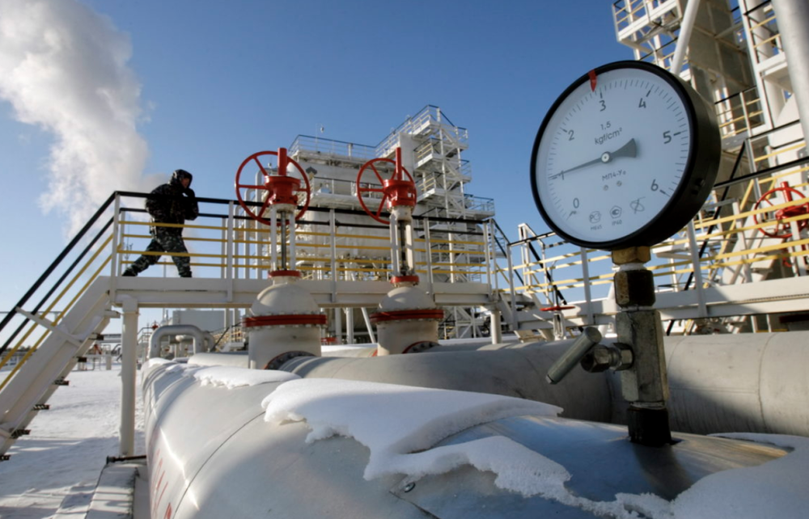

# 西方制裁不管用！俄油出口量回到冲突前水平，沙特抢着“薅羊毛”

本文来源：时代周报 作者：刘沐轩

美国和欧盟国家对俄罗斯能源出口的新制裁在今年2月正式实施，当时还有不少人担心，此后的全球能源市场是否再也买不到俄油。

不到两个月后，俄油的出口量却出人意料地大幅回升，甚至超过了冲突前的水平。

国际能源署（IEA）在月度石油报告中表示，莫斯科3月份原油和石油产品的出口量环比增加60万桶/日至810万桶/日，已经达到2020年4月以来的最高水平。其中，石油产品出口310万桶/日，环比增加45万桶/日。

_欧洲渡过冬天后，俄罗斯石油的出口并未如想象中被完全封死。（图源：社交媒体）_

从买家来看，印度3月对俄罗斯的依赖度达到三成，创俄乌冲突以来最高水平。土耳其、沙特、日本也步印度后尘，成为俄油的新买家。

但对俄罗斯而言，这不完全是好消息。虽然出口增加，使俄罗斯3月通过石油出口获得了127亿美元的收入，出口收入环比增加了约10亿美元，但这一数字同比仍下降43%。

IEA分析称，受到制裁的限制，俄罗斯的出口客户减少了，而且只能相对被动地向这些客户低价出售石油。

限价形同虚设

从2022年12月5日开始，俄罗斯石油出口被以美国为首的七国集团（G7）全面限价。一旦俄罗斯原油以高于60美元/桶的价格出口，俄罗斯石油精炼油产品（如汽油、柴油）以高于100美元/桶的价格出口，则无法获得G7国家所属公司的海运和保险服务。

作为回击，俄罗斯在今年2月宣布，将削减50万桶/日的石油产量，并不再向支持限价的国家供应石油。

但近期的市场统计发现，G7的限价措施似乎“形同虚设”。

基辅经济学院下属研究所KSE
Institute整理了俄罗斯的公开外贸数据以及船运信息发现，今年一季度，几乎所有通过俄罗斯东部主要港口Kozmino出口到亚洲的石油价格都远超60美元的限价，该港口的平均出口油价为73.14美元/桶。

_越来越多运载俄罗斯石油的油轮成为“影子油轮”。（图源：社交媒体）_

自制裁实施以来，这家位于乌克兰的研究所就严格追踪着俄罗斯的原油出口情况。该研究所的分析认为，在Kozmino港口一半以上的船运出口石油都采用了来自G7国家的服务。也就是说，G7国家提供海运和保险服务的企业，也并未全都遵守所谓的制裁措施。

与此同时，俄罗斯似乎也找到了新的出口方式。

大宗商品分析机构Kpler发现，在制裁前，俄罗斯石油货船基本都有明确目的地，但今年3月之后，近四分之一的俄罗斯油轮都没有明确目的地，成为“影子油轮”。

据航运媒体《劳氏日报》报道，在过去一个月内，起码有16艘匿名油轮加入到运输俄罗斯、伊朗和委内瑞拉原油的海运队伍里，“影子油轮”的规模已经达到456艘。

“哄抢”俄油

相比于其他产地的原油，俄油的价格令人心动。

大宗商品分析机构阿格斯4月17日的统计显示，3月从波罗的海出口的俄油均价为44.46美元/桶，从黑海出口的俄油均价为43.8美元/桶，较同期布油均价便宜了近30美元/桶。

作为亚洲第二大石油进口国，4月上旬，印度接收了约七成的俄罗斯海运出口的乌拉尔原油。机构预计，印度从俄罗斯的原油进口量将在4月份创下历史新高。

石油市场分析机构Refinitiv Oil
Research估计，印度4月份预计进口俄罗斯原油194万桶/日，而大宗商品数据供应商Kpler则更为大胆，预计进口量为239万桶/日。

面对质疑，印度政府解释称，这是市场行为而非政府主导。

事实上，印度进口的俄油有超过一半都被Reliance Industries和Nayara
Energy等印度私营企业买走。这些企业下属的炼油厂开足马力，将俄罗斯原油加工为柴油等燃料，然后销往最需要燃料的欧洲。

_印度炼油厂彻夜开工，灯火通明。（图源：社交媒体）_

其中Reliance
Industries预计，在4月份接收的2087万桶俄罗斯原油，约占印度当月石油进口总量的30%。该公司在贾姆纳格尔经营着一个产量为124万桶/日的炼油厂，是印度主要的出口导向型工厂。

Kpler估计，该炼油厂有望在本月出货1023万桶柴油，预计占印度当月柴油出口量的83%；出货494万桶汽油，预计占印度当月汽油出口量的一半。

不仅仅是印度喜欢俄油，就连参与限价制裁的欧盟国家也不例外。

根据能源与清洁空气研究中心（CREA）的统计，在截至今年2月26日的一年内，进口超过100亿美元俄罗斯原油的前几大国家，包括了印度、荷兰、土耳其和德国。

即便是制裁实施后，欧盟也仍然每天进口约1.19亿美元的俄油。

值得注意的事，土耳其是北约成员国，但不是欧盟成员国。有分析认为，这一身份使其无需遵守欧盟的俄罗斯进口禁令，可能在未来超过德国成为全球第三大俄油进口国。

青睐俄油的不止上述几个国家。据《华尔街日报》4月17日报道，传统的中东产油国沙特、阿联酋也在抢购廉价的俄油产品用于消费和炼油。目前俄罗斯每天向沙特运输10万桶石油。

与此同时，有加工和储存原油能力的中东国家，正逐渐成为俄油的主要贸易和储存中心。当地贸易公司从俄罗斯进口石油，混合俄油与其它来源的油品后向外售卖，以此来规避制裁。

此外，日本也加入了抢油行列。仅仅是今年的1月和2月，日本就购买了约74.8万桶俄罗斯石油，总价值约5200万美元，折合每桶接近70美元。

