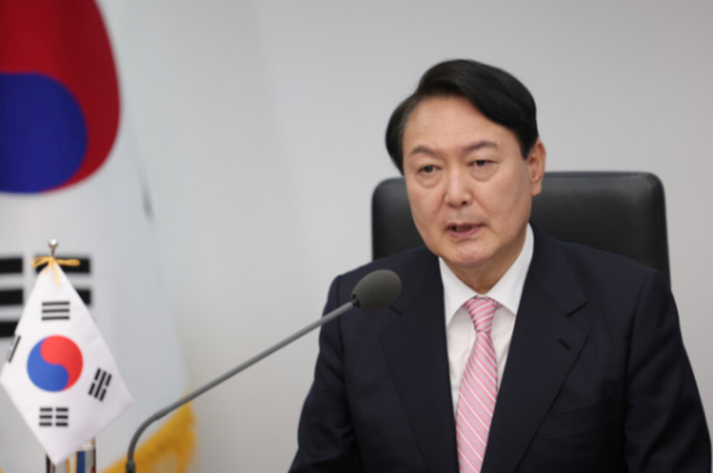

# 韩国放低身段换来日本“白名单”，3年贸易战将告结束？

【环球时报-环球网报道 记者倪浩】以尹锡悦政府主动放低身段为起始条件，历时3年之久的韩日贸易战正在缓慢靠近“终点”。

据韩联社4月28日晚报道，日本经济产业省已启动法律流程，将韩国重新列入出口“白名单”。日本经济产业省表示，将先就修改部分《出口贸易管理令》的政令案展开征求意见程序。韩国产业通商资源部称，欢迎日方开始就修改相关政令征集意见，希望相关程序能够早日结束。而在此之前的4月24日，韩国已率先将日本重新列入享受出口手续简化待遇的“白名单”。

_韩国总统尹锡悦
资料图_

韩国《中央日报》称，与只需修改政府告示即可的韩国不同，日本将韩国重新列入“白名单”的法律程序比较复杂，必须经过内阁会议后才能决定。而为了将韩国重新恢复至“白名单”，日本特地在4月10日-25日与韩国举行出口管理政策对话，就韩国出口管理体制、制度、运作情况及其实效性实施严格的验证评估，确认韩方在该领域具备与日方同等水平的管控实效性后，才做出这一决定。

分析认为，日本决定将韩国重新列入“白名单”，意味着韩日之间3年之久的贸易战将告一段落。

韩联社回顾称，2018年10月，韩国大法院（最高法院）判令日本涉案企业赔偿二战时期被强征的韩籍劳工受害者，引发日本强烈不满，2019年7月宣布限制对韩国出口高纯度氟化氢、氟聚酰亚胺、光致抗蚀剂三种关键半导体材料，同年8月将韩国踢出适用简化出口程序国家“白名单”。对此，韩国政府于同年9月向世界贸易组织（WTO）起诉日本出口限制，同时将日本移出韩国“白名单”，展开反制。韩日贸易战就此拉开序幕。

眼下，韩日结束贸易战主要是韩国主动向日本示好所换来的。3月16日，尹锡悦飞抵东京羽田机场，正式开启对日本为期两天的工作访问，这是韩国总统12年来首次专程访日。随后，日本决定解除限制，向韩出口高纯度氟化氢、含氟聚酰亚胺、光致抗蚀剂三种关键半导体材料的措施。韩国据此撤回之前向WTO提起的诉讼。

韩国向日本靠近，背后是美国在不断鼓动。清华大学国际关系学系教授刘江永在本月初的一篇署名文章中表示，韩日看似迅速走近，但两国间悬而未决的问题依旧很多，结构性矛盾难以轻易解决。首先，日本强征劳工赔偿案能否最终“软着陆”且无反复，尚存在不确定性；其次，韩日两国围绕独岛（日本称“竹岛”）分歧巨大，矛盾难以化解；第三，韩日军事合作同床异梦，缺乏互信。

