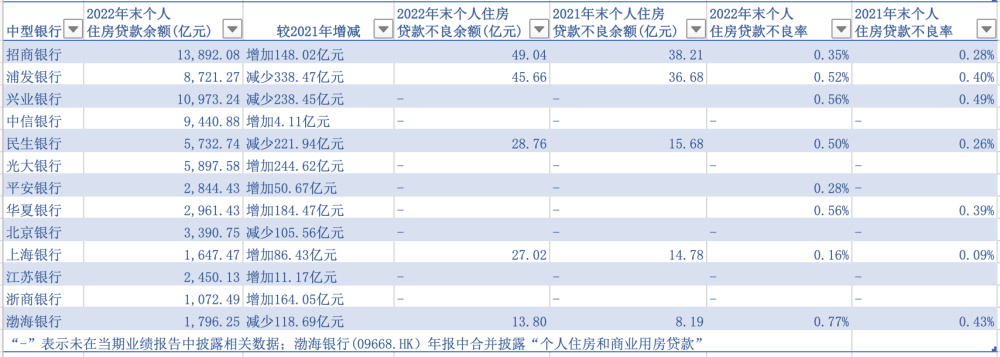

# 提前还房贷冲击：大中型银行中5家房贷余额下降，不良率走高

面对居民排队“提前还房贷”，银行的压力有多大？个人按揭贷款的资产质量如何变化？4月末全部出炉的上市银行2022年年报中披露的个人住房贷款数据或可一窥。

澎湃新闻记者梳理发现，在处于房地产贷款集中度管理制度的第一档和第二档共计19家上市银行中，2022年有5家银行的个人住房贷款余额相较2021年末，出现下降。同时，在披露个人按揭贷款资产质量的上市银行中，不良率全部上升，不过从绝对值看风险可控。

这19家上市银行中，包括第一档中资大型银行中的工行、建行、农行、中行、交行、邮储银行；第二档17家中资中型银行的13家，分别为10家上市的全国性股份制商业银行（招行、浦发、兴业、中信、民生、光大、平安、华夏、渤海、浙商）以及北京银行、上海银行、江苏银行。

国有大行依旧是房贷市场的发放主力军，2022年全年，工、农、中、建、交、邮储银行的个人住房贷款合计增加4049亿元，相比2021年全年24843亿元的合计新增规模，缩水明显。

具体来说，2022年新增个人住房贷款最多的三家国有大行是农行、建行和邮储银行，新增规模都超过了900亿元。

_2022年大型银行个人住房贷款余额及资产质量变动情况一览_

此外，去年下半年，六大行的房贷新增规模陷入停滞，可见的是，国有六大行2022年上半年合计新增房贷规模已经达到4155亿元。

中国农业银行副行长张旭光在该银行202年度业绩发布会上表示，从去年5月份开始，同业都出现了个人按揭提前还款的情况。原因有多种，可能有个人对于自己财务规划的要求，也有去年金融投资中枢下降的情况影响，也可能有存量房地产贷款利率和新发贷款利率倒挂的因素。

他同时表示，目前随着房地产市场的企稳回暖向好，目前整个按揭贷款需求也在转好。

13家上市中型银行中，2022年有5家出现了个人住房贷款余额下降，分别是兴业银行、浦发银行、民生银行、北京银行和渤海银行。

_2022年中型银行个人住房贷款余额及资产质量变动情况一览_

民生银行在年报中解释称，全年投放个人住房贷款700.27亿元，同时面对按揭贷款规模压力，坚持客户至上、以客为尊服务理念，为按揭贷款客户提供便捷还款服
务，报告期内为客户办理提前还款714.22亿元。

兴业银行则是由于此前个人住房贷款占比超过监管红线，因此在2022年降低了个人住房按揭贷款的集中度。

从资产质量上看，在披露了相关数据的银行中，无论是国有大行还是中型银行，个人住房贷款的不良率全部出现了上升。

建设银行行长张金良在该行2022年业绩说明会上表示，大家所关心的个人住房按揭贷款，建行的不良率是0.37%，同比上升了0.17个百分点，这个符合预期，也没有对建设银行整体资产质量的稳定造成冲击。

