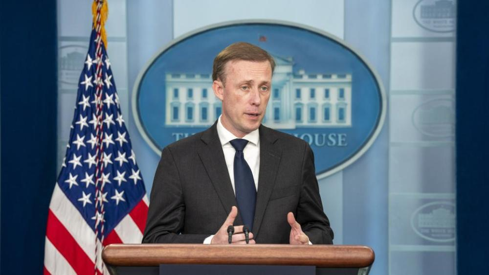

# 美国家安全顾问沙利文：美国不想与中国脱钩

日前，美国国家安全顾问沙利文在发表演讲时说，现任总统拜登政府的政策不是要与中国
“脱钩”，而是要“降低来自中国的风险”。沙利文称，中美政府的产业战略对两国竞争有着关键性的影响。

_美国白宫国家安全顾问沙利文 视觉中国 资料图_

据路透社、彭博社等媒体4月28日报道，沙利文4月27日在位于首都华盛顿的智库布鲁金斯学会演讲。他在演讲中说，所谓的“降低风险”的含义是拥有具备韧性的有效供应链，并确保美国“不会受到其他国家的胁迫”。

沙利文强调，美国不打算与中国经济“脱钩”，不会与中国切断贸易。沙利文称，美国的出口管制只针对可能影响中美军事平衡的技术，不是“技术封锁”和“针对新兴经济体”。

根据美国白宫实录，沙利文演讲的主题是“恢复美国在经济领域的领导地位”。沙利文称，美国在拜登2021年初上任时面临4项基本挑战：工业基础“掏空”，“地缘政治和防务竞争”的新环境，日益加剧的气候危机与对能源转型的迫切需求，“不平等及其对民主制度的破坏”。

沙利文在解释不平等破坏了民主制度这一观点时称，包括大幅削减公共投资、累退性减税政策、镇压美国劳工运动在内的过去几十年的“涓滴经济政策”驱动了经济不平等的产生。他认为这一现象破坏了民主制度的有效运行。

据环球网报道，美国以所谓“国家安全”为由在高科技领域对中国多次采取限制措施。2022年10月，美国商务部在半导体制造和先进计算等领域对华升级出口管制措施，还将31家中国实体列入“未经验证清单”。对此，中国商务部新闻发言人回应说，这是典型的科技霸凌做法，不仅违背双方合作精神、罔顾双方合作事实，而且严重阻碍中美企业间正常经贸往来，严重破坏市场规则和国际经贸秩序，严重威胁全球产业链供应链稳定，中方对此坚决反对。

此前，美国财政部长耶伦4月20日在约翰·霍普金斯大学高级国际研究学院发表讲话时明确表示，美国与中国这两个世界上最大的经济体应当建立“必要的”经济关系。耶伦还称，中美之间建立的经济关系应当是“建设性和公平的”，两国经济“脱钩”将是“灾难性的”。

环球网报道提到，尽管拜登政府几个月来一直强调不想与中国“脱钩”，但美国针对中国经济关键领域采取了一系列行动，更多针对中国经济的行动也在准备中。

