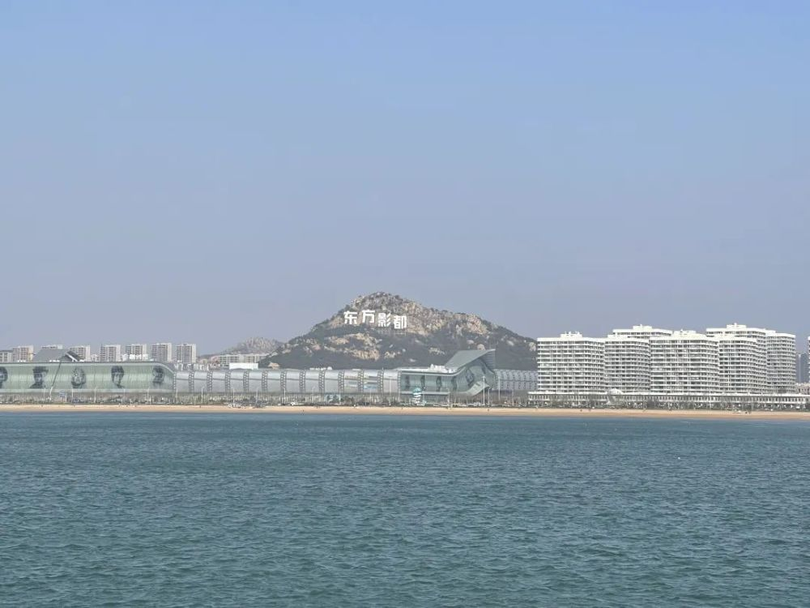
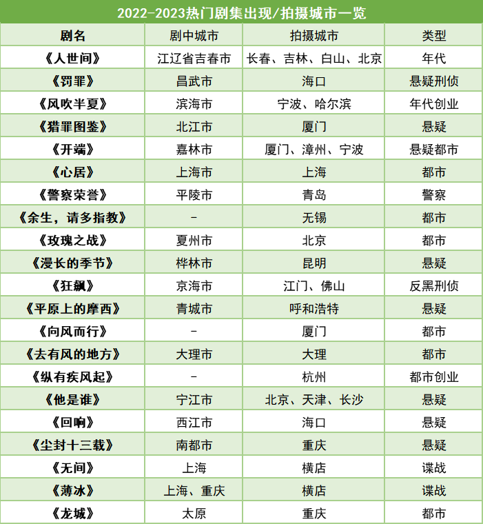
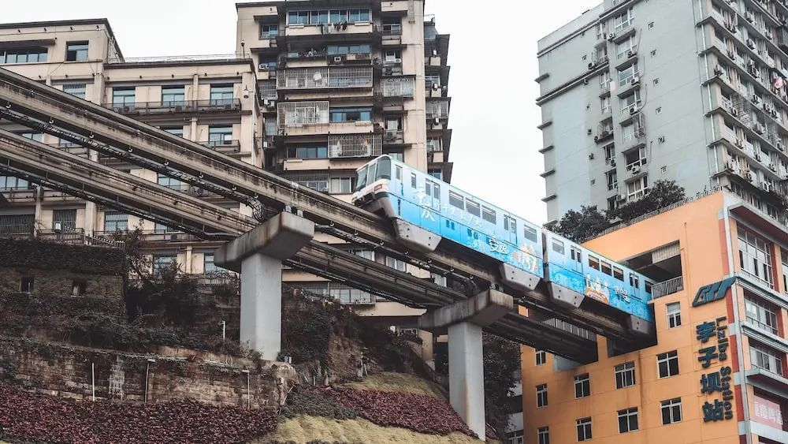
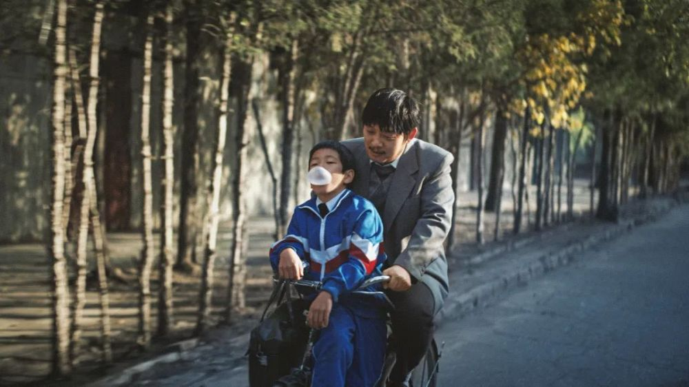
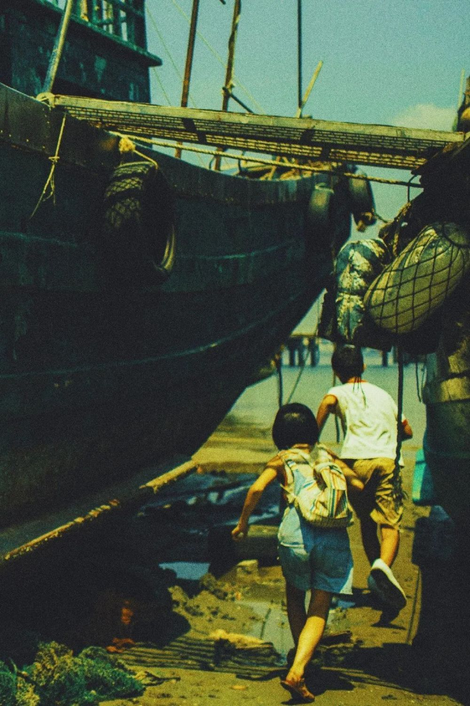
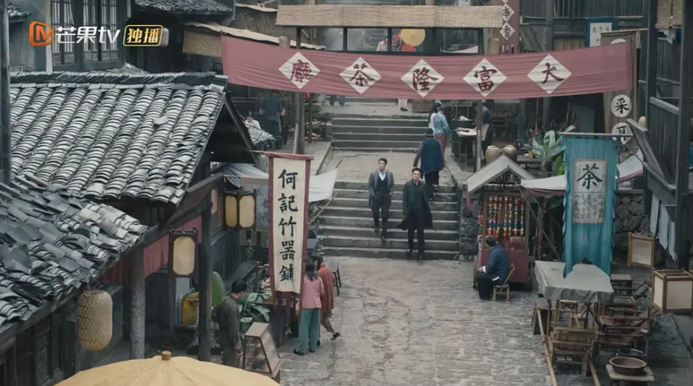

# 这7个因热剧取景而名声大噪的城市，你打卡了吗？

**2023年4月30日刊|总第3221期**

最近，淄博烧烤彻底火了。有报道称，这个五一假期淄博将涌入12万游客。淄博，是一个相对陌生的地名。上一次有印象，还是《人生一串》第三季。再往上数，恐怕就要追溯到那些展现“稷下学宫”的历史剧了。

事实上，比起淄博，惯常在屏幕上代表山东形象的，是青岛。

尤其是西海岸东方影都建成之后，不少热门电影、剧集都选择在东方影都取景。比如，电影《流浪地球2》《独行月球》，刚刚杀青的剧集《南来北往》等等。

当然，放眼全国， **今年荧屏上最“破圈”的城市，还要属大理。**

一部《去有风的地方》，让那个春风和煦的城市，再度映入了大众的视野。得到剧集的加持，这座本就有着“网红”属性的城市，被炒得更热了。

但像《去有风的地方》般直抒胸臆道出拍摄地的作品，仍是少数。为了探寻国产剧的主要拍摄地，影视独舌特意整理了近两年热播剧集的故事发生地和主要拍摄地，得出结论：
**都市剧时尚摩登，悬疑剧南北分野，谍战剧四都定调。**

五一出行，如果不知道去哪里，这七个因影视取景而名声大噪的城市可以就近考虑：江门、重庆、厦门、呼和浩特、海口、长春、大理。寻访剧情遗迹打个卡，不亦乐乎。

**01**

近几年热播的都市剧，往往与爱情、创业挂钩。而这些元素，往往都发生在大城市里。小城里的爱情，不会以都市剧的形式搬上荧屏的。

它要么如《平原上的摩西》中的庄德增（董宝石 饰）和傅东心（海清 饰）一般，被归属到悬疑剧的范畴中；要么像《三十而已》里王漫妮（江疏影 饰）和小张主任（王自健
饰）一般，属于宕开一笔的“闲篇”，归不到主线中。

所以《玫瑰之战》的拍摄地选了北京，《纵有疾风起》的拍摄地选了杭州，《余生，请多指教》的拍摄地选了无锡，《向风而行》的拍摄地选了厦门。

为什么都市剧要在大城市拍？因为只有繁华的地方，才会在白天和黑夜上演不同的故事。贾樟柯电影里小县城的人们，太阳一落山，娱乐方式只剩下上网吧、吃烧烤和洗脚城。被女友商业出卖的故事，是不可能发生在象牙山的。

《去有风的地方》呈现了另一种风格。它面向的受众，恰恰是那些在大城市中待够的人们。 **这不是大理当地出的命题作文，却不由自主地拍成了“宣传片”。**
想拍这样的剧，就得找那些有热度又没那么热门的城市，可遇不可求。正在热映的电影《长沙夜生活》，也有点像长沙的宣传片。这走的是相同的路数。

**02**

《龙城》是另一个例外。播出以来，吐槽这部剧的人不少。有人说马伊琍的造型“非主流”，也有人表示狗血叙事已经过时了。但今天讨论的重点，是它的拍摄地问题。《龙城》在拍摄地的选择上，算得上一个典型的“反面教材”。

读过笛安原著的知道，“龙城三部曲”的故事发生在太原。龙城，也是太原的别称。但剧集将拍摄地选在了重庆。重庆和太原，是两种完全不同的风格。

重庆的味道太丰富了。它的辖区面积有8.24万平方公里；太原的辖区面积只有6988平方公里，如果只算市区，这个数字还要减少到1460平方公里。

6988平方公里是一个什么概念呢？山西一共11个地级市，太原面积倒数第二，比它小的只有辖区面积4451平方公里的阳泉市。山西省的辖区总面积是15.67万平方公里。也就是说，两个重庆的面积加起来，就等于一个山西了。

大有大的妙趣，小有小的规律。地方够小，规矩才能成为规矩。霍去病率军攻打匈奴，如果走的是东胜神州的版图，走到八十岁也做不到饮马瀚海。笛安的“龙城三部曲”不一定非要发生在太原，但一定会发生在一个小地方。只有那些娱乐方式乏味、夜生活匮乏的小地方，私人八卦才会成为人们茶余饭后的嚼头。

就像豆瓣网友所说的那般，“伦理方面的疯疯在哪里？在环境单调，在几乎什么都没有。人没事做，只好互相伤害，换着方法探索人、伤人，使得这几十年稍有滋味。”

**03**

比起偶尔出现真实地名的都市剧，国产悬疑剧的地名虚构更加彻底。2020年，爱奇艺迷雾剧场播出了5部剧，有3部的拍摄地选在了重庆——《沉默的真相》《在劫难逃》《非常目击》，剧中则变成三个名字：江潭市、绿藤市、巫江市。

重庆，曾是国产悬疑剧最爱取景的城市。一方面，如前文所说，它足够大，虽然都拍重庆，都是悬疑剧，但你在巫山，我在奉节，完全是两种不同的景象，即使做不到泾渭分明，观众也能看出差异。

另一方面，重庆的地域特色让它变成了悬疑故事藏身的天然温床，常年多雾，天气阴郁，潮湿多雨，随时随地都透着一股压抑的气息。再加上
**“一楼下来是八楼”的迷宫式地形，成了凶杀案最好的展现窗口。** 更不用说，那些废中见颓的的老城区，和改造到一半的烂尾楼了。

近两年热播的悬疑剧中，取景重庆的作品只有《尘封十三载》一部。

首先，前两年拍了太多的重庆景，不仅观众审美疲劳，估计主创和平台都有点疲惫了。其次，疫情笼罩下拍戏，重点不是去哪儿，而是在哪儿能顺利拍完这部剧。

**04**

**替代重庆成为选址热门的，是海南和厦门。** 《猎罪图鉴》就是在厦门拍的，《开端》的取景地也是厦门；《罚罪》于海口开机，《回响》也全程驻扎在海南。

这两座城市，相似之处在于都靠海，走几步路就能嗅到海风的腥味。或许它们的气质不如重庆诡谲，但海滨城市仍然比内陆多了一种自由与奔放。

如果观众观察仔细，会发现 **大部分国产悬疑剧的拍摄地，都选在了南方。**

原因很简单，因为南方多雨，足够潮湿与氤氲。雨下得多了，太阳不出来，晒不干的衣服上总有一种发霉的味道。水多则交通发达，交通发达往往经济发达，即使是小城市，也会比内陆多一些陌生人。都是熟人，案子居委会就能破。

**05**

也不是没有选址北方的国产悬疑剧，这类作品往往取景于东北。

屏幕上呈现的东北，通常有两副面孔。其一，是由《东北一家人》《马大帅》《乡村爱情》联袂生成的电视剧时代的喜剧风。其二，是电影与网剧时代的冰冷，譬如《白日焰火》《无证之罪》《胆小鬼》等等。虽然面孔不同，但内核其实一致：东北下岗潮。经济下行，生活苦楚，有人走投无路，有人铤而走险。

_《胆小鬼》_

拍东北的悬疑剧，往往会拍出冰天雪地中的残酷。《无证之罪》里，“冰雪”贯穿全剧，颇有美剧《冰血暴》的风味。《胆小鬼》开篇，就是一桩发生在冰天雪地里的抢劫杀人案。暴风雪铺天盖地，所有的罪恶仿佛都能被掩埋。

_《平原上的摩西》_

《平原上的摩西》原著里的故事也发生在东北，但导演张大磊觉得沈阳是个大城市，工业基础、城市规模更大，很难还原小说中的老旧感，所以将拍摄地定在了自己的故乡呼和浩特。从辖区面积上看，呼和浩特明显比沈阳更大，可是从经济发展的视角来说，沈阳比之呼和浩特，无疑是当之无愧的“老大哥”。

**06**

悬疑剧选择取景地，本质上是为了满足观众的城市想象。

都市剧发生在一线大城市，因为观众对他们有奔赴冲动，北漂、沪漂与深漂的日子的确不好过，但大城市所赋予他们的，是一种小县城所无法给予的自由。

悬疑剧也是如此。只有像湛江那般的海滨小城，才会发生《隐秘的角落》的故事。放在北京，再聪明的三个孩子也造不出一台戏。总不能去爬景山吧。

悬疑剧选在小地方拍，本身就带有中心对边缘的他者印记。

_《隐秘的角落》_

一来，这几年热播的悬疑剧，故事多发生在上世纪90年代。过去三十年，中国变化太快。要找一个不用太多改造就能呈现十几二十年前面貌的地理区位，小城市显然更符合这个条件。

二来， **小城市比之大城市，可以提供一种陌生感。它能为剧集带来一种区位加持。**
举个题外话的例子，同样是烧烤，淄博的和本地的又有多少区别？但这个五一假期，外地人还是一窝蜂朝着淄博跑。

**07**

上个月，有《薄冰》和《无间》两部谍战剧同台打擂。国产剧的地理区位图中，谍战剧是最常规也是最无趣的。一般来说，谍战剧的拍摄地只有一个：横店。那里有全国最大的民国景点，剧组连挪窝都不用挪，直接就可以上手用。

_《薄冰》_

谍战剧也是唯一完全展现真实地名的类型剧。

一方面，它本就取材于真实的历史，几乎所有的故事，都发生在那几个热闹的城市——上海、重庆、北平、哈尔滨、南京、香港以及天津。《无间》围绕着上海打转，《薄冰》的故事前期发生在上海，后半段则跟着主角去了重庆。

哈尔滨是远东谍都，上海是当时中国最繁华的都市，天津是重要商埠城市，香港更不消多说，这四座城市是我国近代史上四大“谍战之都”。重庆是抗战期间的陪都，南京是民国故都，北平地位虽然不如前两者，但也有颇多故事。

另一方面，它也不需要有所规避。为什么国产剧中的都市往往会虚拟名称？本质上是为了配套虚构故事。将一个虚构的故事套在真实的城市之中，总会面临或多或少的主观凝视。《去有风的地方》这般展现美景的生活剧还好，像《尘封十三载》《他是谁》这般命案一拖多年的悬疑剧，做太实就有“抹黑”的意味了。

_《狂飙》_

其实，虚构城市没什么大不了。只要把背景做实，把故事讲好，观众会主动充当发掘剧中风景的“自来水”。《狂飙》播爆了，就有不少人去江门打卡肠粉和猪脚饭；《人世间》“破圈”之后，吉林也涌入了不少慕名而来的外地游客。

【文/马二】

