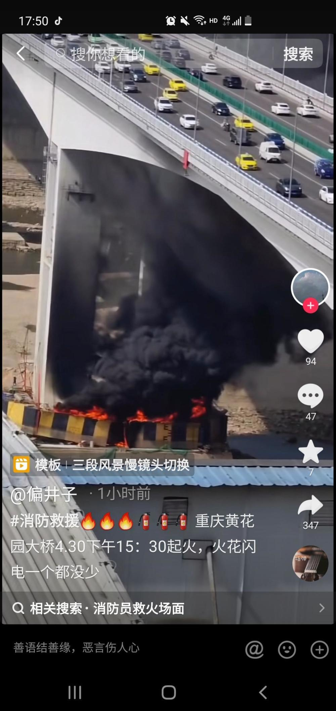
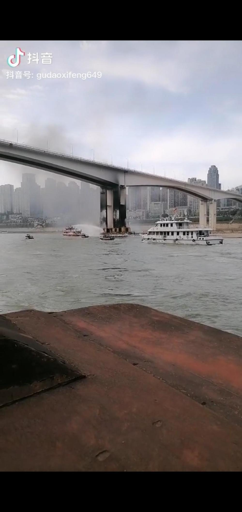

# 重庆黄花园嘉陵江大桥桥墩失火 官方：无人员伤亡，正处置

4月30日下午，多位重庆网友发布视频称，重庆市黄花园嘉陵江大桥突发火情。视频显示，大桥桥墩处冒出滚滚黑烟，有船只正靠近灭火。网友称，系桥墩施工时失火。

_↑重庆黄花园嘉陵江大桥桥墩失火_

红星新闻记者从现场网友的直播看到，经过几小时处置，至17时30分许，大火已被扑灭，桥墩已被熏成黑色。

30日18时许，重庆市应急管理局工作人员向红星新闻记者确认系桥墩失火，现火已被扑灭，无人员伤亡。

重庆市水警总队工作人员称，水警部门正配合消防部门灭火。重庆119热线回应称，正处置火情，具体情况待通报。

_↑大火已被扑灭_

红星新闻记者 李文滔 王语琤

编辑 彭疆 责任编辑 魏孔明

