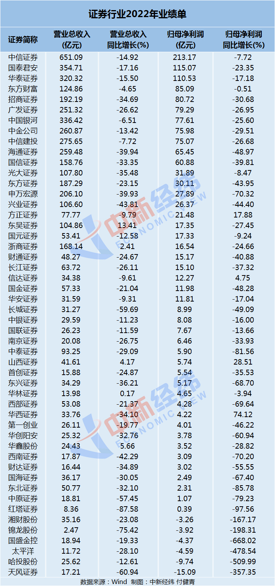

# 一季度业绩暴增！全面注册制下，券商打响了“翻身仗”

中新经纬5月1日电 (付健青)日前，A股50家证券公司业绩全部出炉，超九成2022年净利下滑！

**平均下滑77%**

Wind数据显示，申万证券行业下共有50家公司(包含双主业)，2022年，证券行业整体遭遇业绩滑坡。

按照归母净利润金额来看，证券行业平均下滑达77%。中信证券依旧稳坐“一哥”位置，达213.17亿元；国泰君安、华泰证券分列2、3位，均超百亿元。但“二八分化”仍然明显，有26家证券公司归母净利润不足十亿元，更有6家在2022年录得归母净亏损(以下简称亏损)。

具体来看，湘财股份亏损3.26亿元，锦龙股份亏损3.92亿元，国盛金控亏损4.37亿元，太平洋亏损4.59亿元，哈投股份亏损9.74亿元，天风证券亏损15.09亿元。

中新经纬查询亏损6家证券公司的年报发现，多数由于自营业务。

自营业务是证券公司的主营业务之一，主要涉及股票市场、债券市场、基金市场及衍生品市场的投资。2022年，上证指数累跌15.12%，深证成指累跌25.85%，创业板指累跌29.37%，市场的大幅波动造成了公允价值的大幅下挫。

亏损最多的天风证券就指出，自营业务收入大幅下滑是导致公司出现亏损的重要原因。由于证券市场波动叠加公司自营投资战略判断失误。天风证券2022年度证券自营业务实现营业收入3.82亿元，较2021年同期下降15.86亿元，同比下降80.58%。

巨丰投资首席投资顾问张翠霞对中新经纬表示，相比中小券商来说，大券商受自营业务影响相对较小。基于自身研发实力、运营能力等，中小券商经纪业务和投行业务相对一般，因此在推进自营业务时，收益就容易出现大幅波动。

业绩的不佳也导致了证券行业平均薪酬的降低，Wind数据显示，合并报表下证券公司人均薪酬平均下降约14%，其中，山西证券、长城证券、海通证券、天风证券更是人均薪酬更是大降超40%。

不过，证券公司可谓“败也自营，成也自营”。2023年一季度，各大券商打响了“翻身仗”。

**一季度“王者归来”？**

2023年资本市场全面回暖，证券公司同步披露的一季报多数报喜。

Wind数据显示，一季度有28家证券公司归母净利润增超100%，西部证券、长江证券和太平洋更是增超1000%，分别为2227.12%(扭亏)、1522.01%和1503.35%。

增幅最大的西部证券季报显示，其公允价值变动收益本期金额约3.30亿元，而上期金额约-3.29亿元。

归母净利润增超400%的东吴证券也指出，利润增加主要源于营收增长，而营收增长系利息净收入、公允价值变动收益同比增加等。

今年，资本市场迎来一件里程碑式的大事件。2月17日，证监会发布全面实行股票发行注册制相关制度规则，自公布之日起施行。这对负责保荐的证券公司来说是大利好，当然，注册制改革不会马上带来上市公司数量攀升，而是个循序渐进的过程。

在二级市场上，证券公司也趁势迎来一波股价的反弹。截至4月末，平均涨幅超7%。剔除上市新股后，东方证券涨19.80%居首，华西证券、东北证券、兴业证券、中泰证券、中国银河近20股涨超10%。

东方财富证券总量组负责人、策略分析师曲一平对中新经纬表示，全面注册制的本源是加快首发和再融资速度，并且让新股充分享受资本市场定价。在这一主旨下，券商投行业务有望强者恒强，尤其是引入跟投制度后，对券商资本、投资管理能力、协同要求大幅提升，核心头部券商将持续受益于全面注册制改革红利。而对于行情，目前结构性牛市中最大特征就是局部热点板块轮动加速，很难出现全面放量普涨，回顾2014-2015和2019-2020券商行情都是基于全面牛市的推动。

“2022年由于市场赚钱效应比较差，市场整体是下跌的，所以券商的利润普遍出现了一定的下滑。”前海开源基金首席经济学家杨德龙也指出，在2023年全面实施注册制后，叠加资本市场走出结构性牛市，市场的成交量有望逐步放大，上市公司的业绩应该会比去年要好。而对于投资者来说，一般来说头部券商具有较强的抗风险能力和更强的资金实力，相对更具有投资价值。(中新经纬APP)

**(文中观点仅供参考，不构成投资建议，投资有风险，入市需谨慎。)**

**中新经纬版权所有，未经书面授权，任何单位及个人不得转载、摘编或以其他方式使用。**

