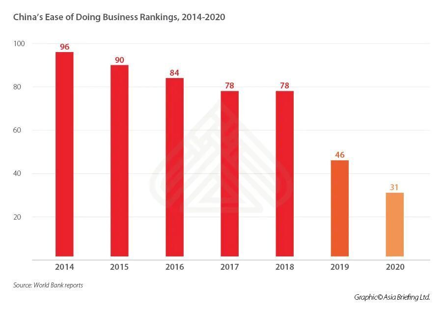
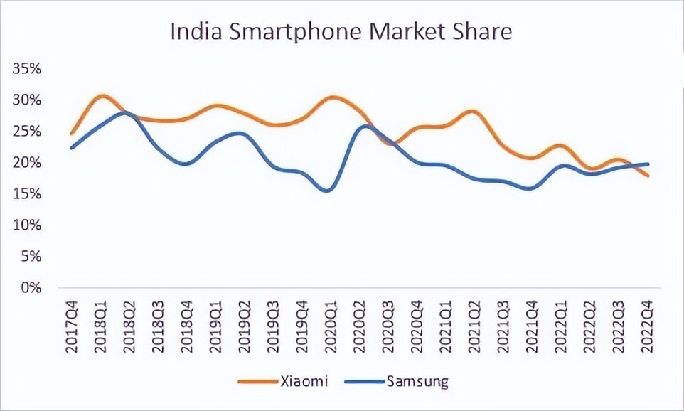
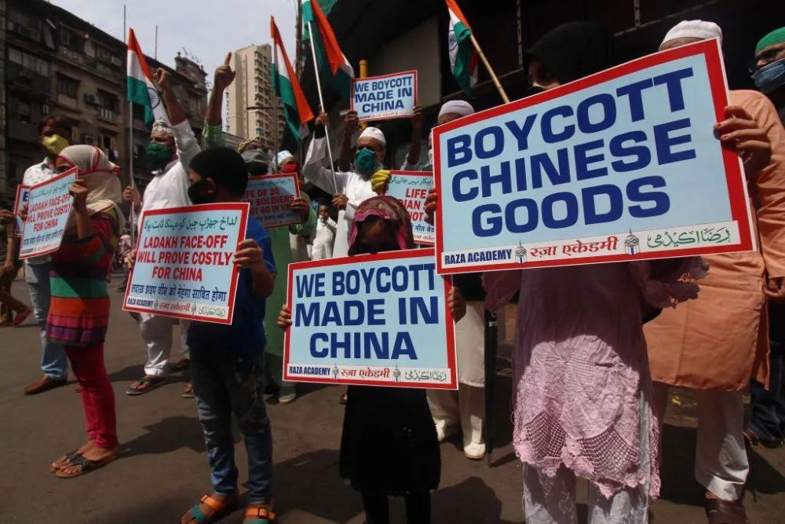

# 中企印度“大冒险”：小米给印度白打了十年工

**当你无法足够深入了解它，就贸然进入到一个陌生的文化环境，那么经济高速发展时扬起的尘土，很有可能遮蔽了你的双眼。**

文 / 巴九灵（微信公众号：吴晓波频道）

**无法预料的印度人：外贸人的噩梦**

在外贸圈里一直流传着一个笑话：“如果你在危险的热带丛林中碰到一个印度人和一条蛇，你先杀死哪一个？” **答案是印度人，因为他们“无法预料”。**

一位做外贸的朋友小K就曾向小巴讲述了一段和印度人打交道的噩梦般经历。

小K的工厂在东莞，员工2000多人。2009年的时候，接了一个印度客户的单子，结果生产完后直接遭遇砍单，工厂的资金链瞬间告急，五年后才缓过来。从此公司规定：“印度的单子能不做就不做；要做，不是全款到账绝对不做。”

像小K这样被坑的外贸人并不算少数，他们甚至还总结了一套印度客户常用的套路：

第一步，装作财大气粗，以长期合作为由，迅速打款30%左右的定金，诱使工厂签订合同。第二步，当生产完毕，趁机压价30%。由于产品高度定制，工厂被迫妥协。第三步，货运到港口，印度客户以各种理由不提货，继续挑刺、压价。工厂要么退运，损失运费，要么承担巨额的滞箱费和超期费，甚至货物还有可能被海关拍卖，钱货两空。

正是印度客户的“无法预料”，如履薄冰的外贸企业不得不区别对待。比如现货必须全款，高定至少70%预付款，走FOB（装船后交货）。总之，在东南沿海的外贸人看来，“印度客户”似乎是一个难以启齿的词。

**恶劣的营商环境：外资企业的坟场**

尽管印度人早年在外贸圈里口碑不佳，但在日益复杂的国际环境下，随着印度劳动力优势凸显和基础设施的逐渐完善，越来越多的中外企业前往印度投资建厂，希望能分得这个新兴国家的发展红利。

不过， **他们却忽略了一个很重要的因素：营商环境。**

外资企业的合法权益能否得到保障，法律是否公平公正，行政效率是否高效，都是衡量一国营商环境的标准。中国的营商环在国际排名中曾一度百名开外，主要是因为地方保护主义和知识产权的问题。

但随着中国在制度上的不断完善，各地都发展出极具特色的营商环境，比如以深圳为代表的“效率优先模式”，以上海为代表的“国际化优先模式”，在一定程度上，消除了外资企业的种种顾虑，
**也让外资企业形成了一种错觉：只要经济发展，营商环境一定会好转。**

_中国营商环境国际排名上升至31位_

结果到了印度，跨国企业们都傻眼了。

首先是极其低效的行政效率。根据世界银行的数据，在印度注册一家公司需要18天，必须经历12道繁杂的手续，申请建筑许可证需要34道手续，整个流程下来大约需要110天，就连接通一个水电都需要8天到3周左右的时间。

行政效率未来还是有可能改善的，但当地税务的铁拳就真的让跨国企业伤筋动骨了。 **最近小米被印度没收555亿卢比（约48亿元人民币）就是血淋淋的教训。**

整起事件并不复杂。小米需要向高通进口芯片，于是小米印度公司以专利授权费为名，向高通等三家外国实体支付了555亿卢比，其中包括了小米中国子公司。然而印度税务局认为，由于这些公司没有提供服务，属于非法汇款，而且没有计入进出口商品的交易价值中，因此构成偷税漏税的行为。

2022年5月，印度执法部门扣押了这555亿卢比，小米不服，上诉。本月，印度卡纳塔克邦高等法庭驳回了小米的诉求。 **这意味着，小米给印度白打了十年工。**

业界认为，这是中资企业进军印度市场的一起标志性的滑铁卢事件。

_小米手机在印市场份额从31%掉至16%_

而小米事件也非孤例。据统计，截至至今已有500家中资企业在印度遭遇税务及合规性普查，手机厂商、设备供应商、基础设施投资商、APP服务商无一幸免。

更令人佩服的是，在坑外资企业这件事上，印度居然能做到一视同仁。微软曾经在2007年被罚款70亿卢比；2013年，诺基亚被罚税3.6亿美元；2014年，三星被罚税2亿美元。从去年开始，由于找不到罚税理由，印度政府甚至考虑对谷歌、推特、亚马逊等互联网大公司征收30%到40%的数字税。

这像极了九转大肠梗中的当代阳谋： **企业不去开拓印度市场，错失机会，增长放缓；企业去开拓，那就等着上当。**

**营商环境的障碍：法律与政体**

如果说，中国的营商环境问题并未触及外资企业的根本利益，那么印度的营商环境属实充满着“明抢”的味道。作为一心想要赶中超美的印度，为什么就不能对自己的营商环境走点心呢？分析下来，有两大触及根本的障碍。

**第一个原因是法制不健全，且具有很强的随意性。** 它表现在：其一，执法部门权力过大；其二，法律模糊，且随意修改法律；其三，人治大于法治。

最让人“津津乐道”的神奇案例是沃达丰事件。沃达丰（Vodafone）是欧洲最大的移动通讯运营商，在2007年从李嘉诚的和电国际手中收购了和记爱莎（印度移动通讯巨头）67%的股权。双方为了避税，通过在开曼群岛的一家套壳公司完成了交易。

然而印度税务局认为，既然涉及到印度公司，就必须向印度缴纳股权转让所得税，于是向沃达丰开出了一张25.2亿美元的税金罚单。沃达丰不服，上诉到最高法院，认为没有法律依据。结果印度最高法院翻了下1961年的《所得税法》，还真没有，最后判沃达丰胜诉。

可接下来的离谱操作直接让沃达丰傻眼了。我们知道，一国制定法律的基本原则之一是“法不溯及既往”，即法律不能追究诞生以前的行为。败诉后的税务局就跑去国会，要求修改《所得税法》。最后国会以“极高”的效率，为沃达丰量量身订制了一套海外公司并购的税法，并可追溯到50年前。而在打官司期间，罚金还在滚利息。一合计，沃达丰需要向印度缴纳约50亿美元的罚款。

所以在印度， **你不仅遵守现在法律，还必须遵守未来的法律。**

和小米事件一样，印度的执法部门和法院都表现出了“人治”的一面：你合法转移利润，合法避税，虽然是合法的，但从道德上来说，明显在钻法律漏洞，所以无论如何都不能放过你。

不仅如此，印度的不少基础法律存在很大的随意解读的空间。比如，印度“外汇管理基本原则”中有一条说的是“除非明文允许，否则所有资本账户交易都是禁止的。”简而言之，只要印度打算“宰”一家外资企业，那么这家公司在印度挣到的钱，甚至包括本钱，一分也别想带回家。

再比如，印度《敌方资产法》规定，任何敌方实体或由敌方管理的资产，印度政府都有权没收。且一旦印度公民移民到中国或巴基斯坦，在印资产全部拍卖。这似乎暗示着，中国企业属于潜在的“敌方实体”。所以每当中印边境产生冲突时，在印中资企业都要抖三抖。

_印度民众抵制中国商品和中资企业_

**第二个原因是印度是联邦制国家，中央和地方博弈非常复杂。**
不同的印度各邦，文字、语言、货币、法律都大不相同，一批商品从一个邦到另一个邦，要缴纳城市管理费、过境税，甚至是“关税”。而且地方党派势力庞大，利益复杂，中央许诺的法律和条款，在当地可能就行不通，这加大了外资企业在印合法经营的变数。

日本人曾因此陷入巨坑。2014年，日本竞得印度高铁项目。当时印度的执政党是“印度人民党”，对高铁项目很积极。然而高铁要途经马哈拉施特拉邦，控制该邦的是“湿婆神军党”。他们认为，高铁载客量低，效率低，不能“挂人”的火车自然就不是好火车。

_显然，“挂票”深受印度人民欢迎_

于是联合当地村民反对“征地”。如今，这条高铁线只修了十多公里，距离完工预计还差254年。

**在印中小企业的噩梦**

有人认为，印度专挑大企业下手，是因为有利可得，而中小企业没啥油水可捞，或许会逃过一劫。如果抱着这样的想法，那真是一厢情愿。大企业都快经不起折腾，中小企业就更折腾不起了。没有做全方位的研究，就贸然去印度设厂，最后极有可能落得和十多年前的中国外贸企业同样的下场。

从商20多年的老李在佛山经营着一家灯饰厂。2019年的时候，他把部分产能转移到劳动力成本更低的印度，在古吉拉特邦的一个园区里投资建厂，专做工程项目。然而，接连的几番打击让他心生退意。

第一记闷棍是发生在招标现场。当时，他参加了一个有政府背景的工程招标，他报价80万，然而现场出现了一个令人难以置信的价格：20万。但经过评议后，实力更强的老李还是中标了。

正当老李美滋滋时，几个官员模样的人走过来告诉他，按照印度的规矩，不管谁中标都要按当天竞标的最低价来，所以这个活只能给他20万。甚至还威胁他，如果不做就是没有契约精神，以后政府和大企业的项目就别想碰了。老李瞬间一片眩晕，但为了拓宽市场，也不想和政府闹僵，他咬咬牙，亏本接下这个工程。后来得知，出价20万的那家公司是个托。

而第二记闷棍差掉要了他的老命。印度政府要求零部件非印度造的都算进口，要征税。然而老李的产品中很难定义哪些算进口零部件。2019年下半年，当地税务局突袭了老李的工厂，以偷税漏税为由罚了老李1500万，然而公司的账上只有2000万流水。最终，执法部门“网开一面”，允许老李可以“分期付款”。

两记闷棍下来，外加第二年新冠疫情的爆发，老李的工厂如今已半死不活。然而，有些中小企业就没有这么幸运了。据虎嗅报道，像手机等重要的供应链领域，
**80%的中国中小企业由于经不起调查的反复折腾和巨额罚款，纷纷退出了印度。**

美国投资家罗杰斯曾经表示：“我在印度没有任何投资，他们根本不懂经济。”

_小米手机在印度的组装工厂_

其实，不管是老李，还是小米，外资企业想进入一个新兴市场，都必须面临利益和营商环境之间的博弈。拥有重工业基础、工业发展均衡、人口众多的印度，是资本眼里的一块肥肉，人人都想争抢。
**然而当你看上了它的“复息”，它却盯上了你的“本钱”。**

很多时候，人性的复杂和群体间的博弈超出想象，当你无法足够深入了解它，就贸然进入到一个陌生的文化环境，那么经济高速发展时扬起的尘土，很有可能遮蔽了你的双眼。

**音频策划** | 徐涛

**音频运营** | 奔奔 | **主编** | 何梦飞

