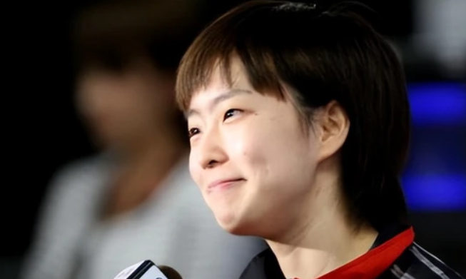
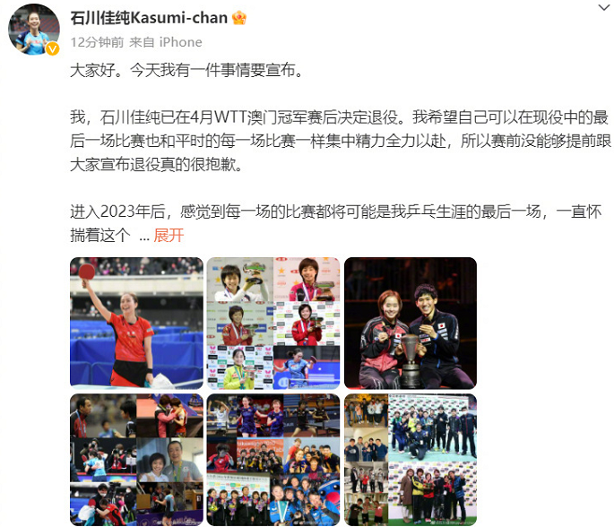
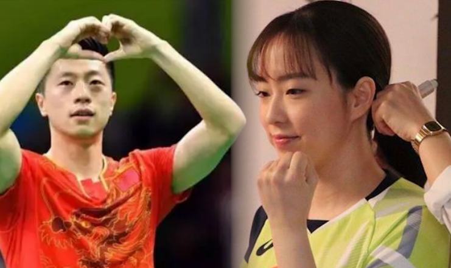
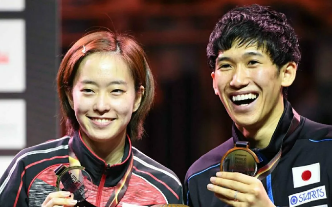
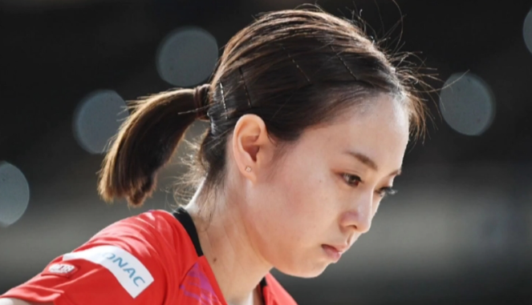
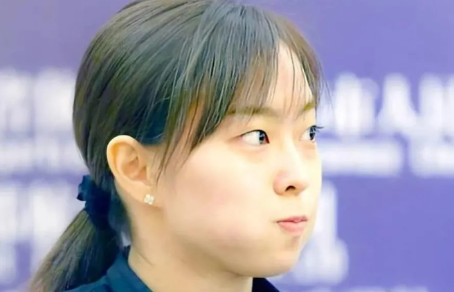
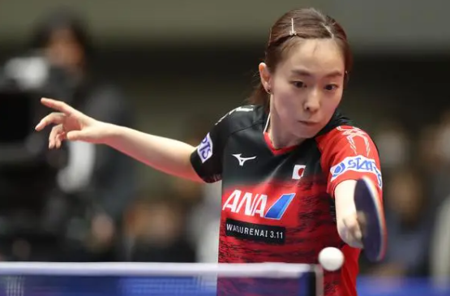

# 官宣！日本乒乓球名将石川佳纯正式退役，是马龙头号迷妹

北京时间5月1日，日本乒乓球名将石川佳纯宣布退役，她在社交媒体上发布长文称自己在澳门冠军赛之前就决定退役了，之所以没有提前宣布是因为想要打好最后一项赛事。后期的日本名将石川佳纯退出WTT曼谷球星挑战赛，如今她正式宣布退役，结束自己的职业生涯。

石川佳纯在社交媒体上感谢队友、教练、队医和对手，以及支持自己的球迷们。14岁开始代表日本队出战世界大赛，一晃已经过去了16年的时间，如今的石川佳纯已经30岁了。石川佳纯感慨：
**“7岁开始学打球，乒乓生涯的23年给我带来了人生中最宝贵的经验。”**

虽然中国的球迷们对于日本球员普遍比较抵触，但石川佳纯是比较特殊的一个，她颜值很高，而且为人谦虚低调，不像张本智和一样嘶吼不断，也不像伊藤美诚一样连续放豪言，石川佳纯给人的感觉就是非常内敛，而且成绩很出色，一度是国乒女队最大的对手。

正如石川佳纯在社交媒体上说的一样，她从伦敦奥运会开始连续三届奥运会获得奖牌，混双拿到了世界冠军，全日本锦标赛单打拿过5次冠军，这是非常傲人的成绩，一度长时间位居日本女乒一姐的位置。

石川佳纯在职业生涯中最后一场比赛定格在澳门冠军赛1-3不敌陈梦，两人交手很多次，也是老对手。石川佳纯最后一场比赛不敌国乒的球员，和她的职业生涯也有一定的呼应，无数次和国乒对抗中失败，但每次都勇敢站起来。

同时石川佳纯还是马龙的头号迷妹，她多次在社交媒体上、采访中表达对于马龙的崇拜，称马龙就是自己的偶像，希望可以和他搭档混双。马龙谈到混双话题的时候，也表示自己很少与女生搭档，如果选择一个人的话，那就选石川佳纯。

最后也祝福石川佳纯，希望她的未来一切顺利。

