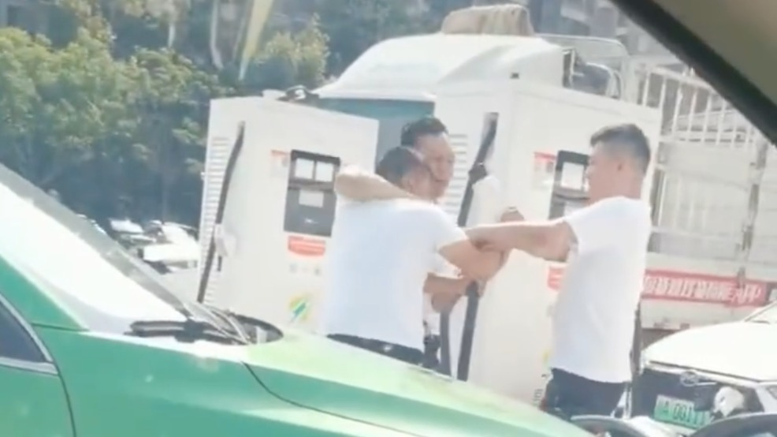
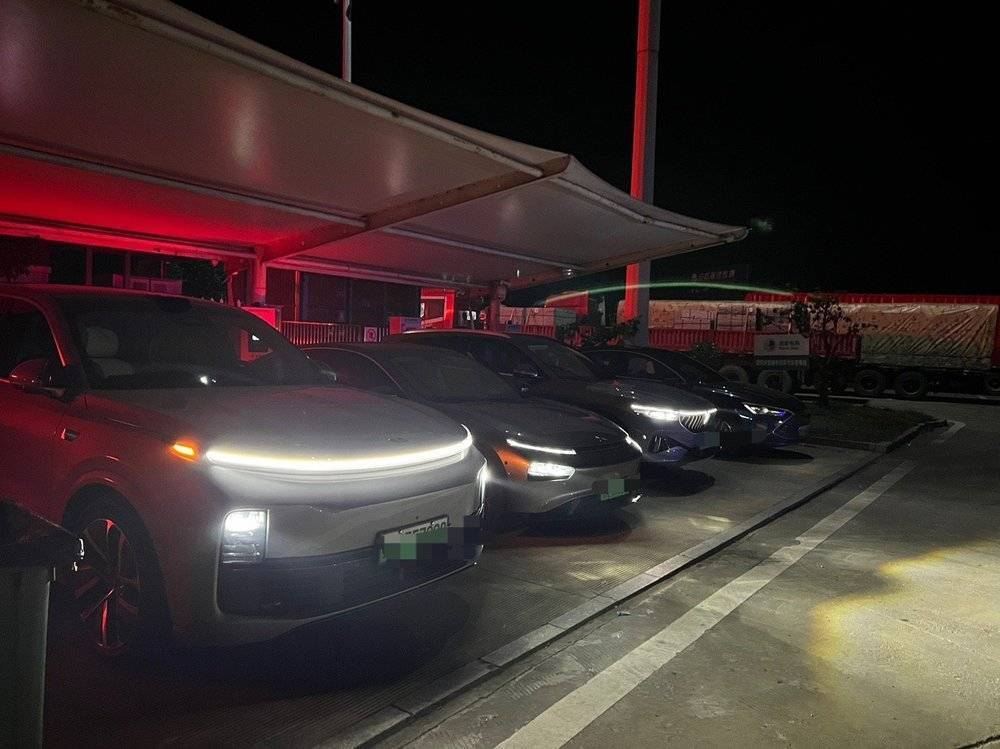
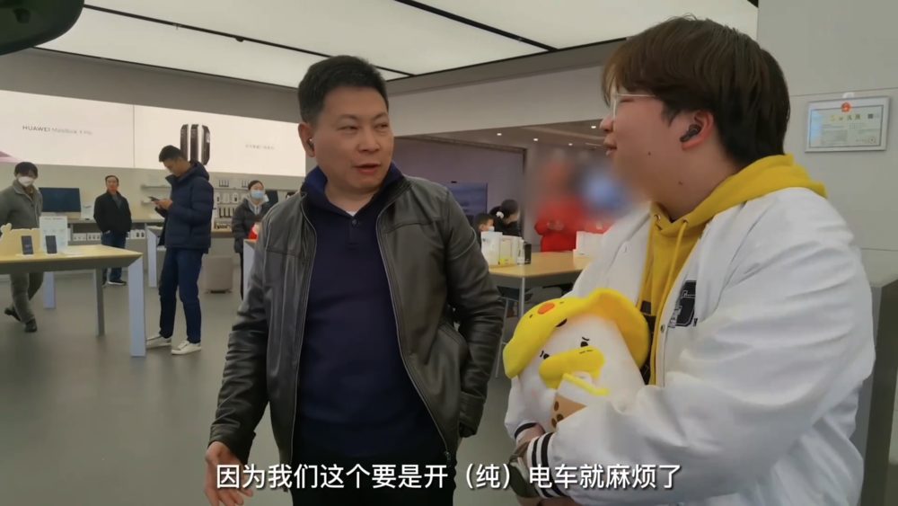
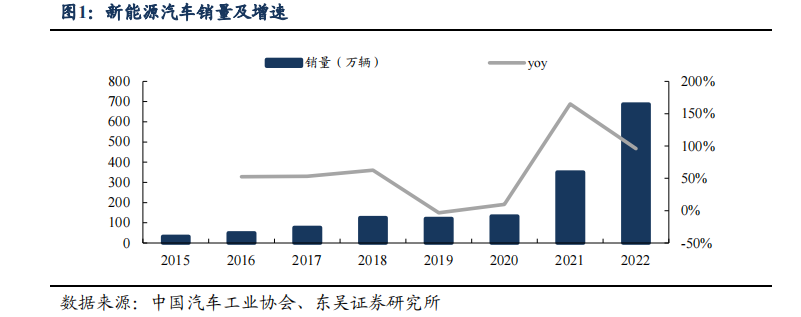
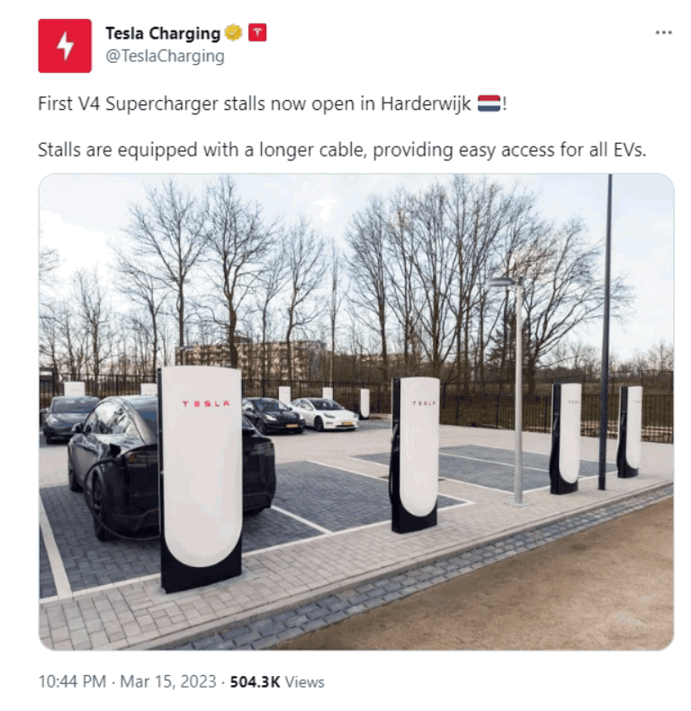
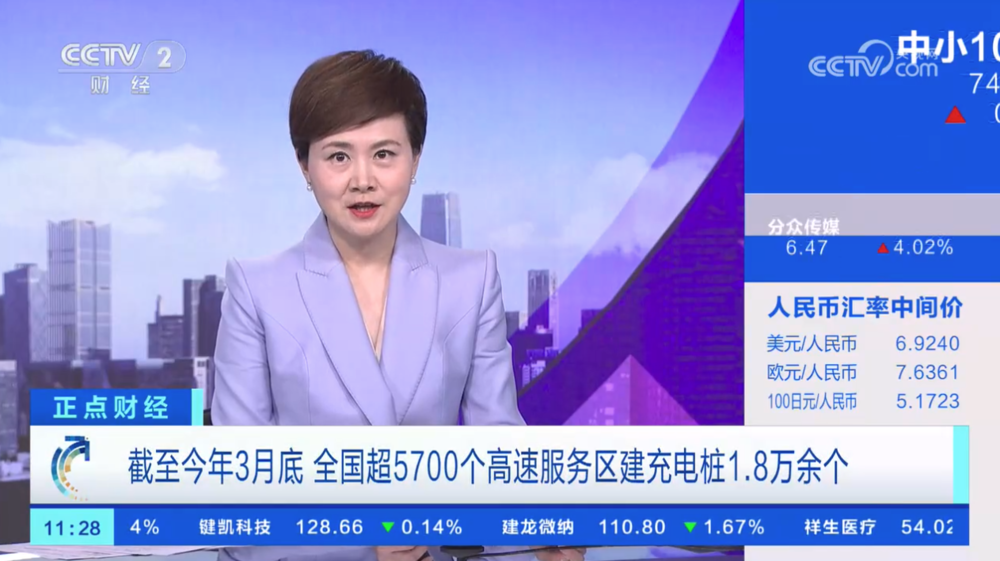
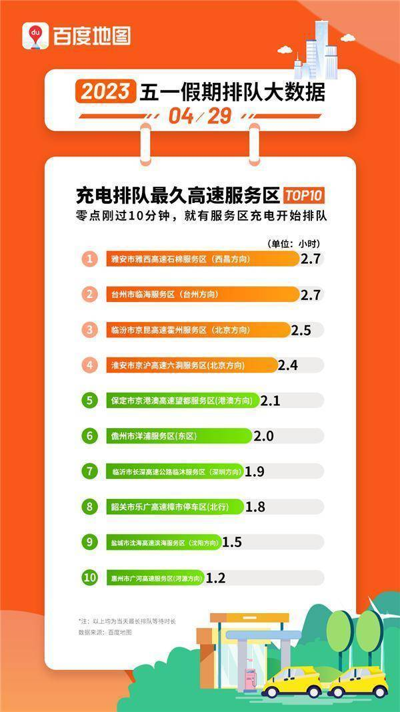

# 新能源车主的假期“内讧”：我靠增程抢的充电桩，凭什么让给纯电

_头图｜纯电车主正在就充电头使用权进行友好磋商_

出品｜虎嗅汽车组

作者｜李文博

**有电就算同林鸟，没电桩前各自飞。**

每到长假，中国新能源车主们就会揭下平时枪口一致对准燃油车的“面具”，在稀缺的高速充电桩前，不厌其烦地展现着“人性本能”：

**内讧。**

今年也不例外。“史上最爆满五一”假期第一天，一位纯电车主在朋友圈开启“骂街”模式：我是真特么无语了， **有钱买车没钱加油吗，**
每个服务区都有个理想在充电桩充电。

_图源：微博_

字里行间的愤怒，让人很难相信他们都是“新能源车”同一阵营内的战友。当然，这不是纯电车主对增程/插电车主“侵占”宝贵的高速充电资源的第一声抱怨，也不会是最后一声。

一位阿维塔车主分享了他刚经历的“充电故事”：在自己车电量不足 20%
的危急关头，他“当机立断”地选择进入下一个服务区补能。结果服务区内的“惨状”让他大惊失色。首先，站内只有三根充电桩；其次，两台纯电车和一台增程车把桩全部占满；第三，这台增程车是理想。

**“他（理想）在这里充电干什么呀？不是可以加油么？”** 阿维塔车主说。

就在这位阿维塔车百思不得其解时，另一位纯电车主开启了他从深圳到湖南的返乡之旅，途中在耒阳服务区进行补能。结果这次 **充电足足耗费了 5 个小时（排队 4
小时，充电 1 小时）** 。800 多公里的旅程，花了 16
个小时才完成。这意味着，油车、插混、增程车主已经在家里吃完了中饭和晚饭，电车车主可能连口热乎的烧烤都赶不上。

尽管在刚结束的上海车展上，中国电车的发展与现状，让全球各路老外惊掉下巴，但那个亘古不变的实际使用困局始终没有得到有效解决：

**长假，到底是开纯电车，还是回家？**

**谁弱谁有理？**

纯电车主“痛斥”理想车主占用高速充电资源，其实是一场无理取闹的巨婴 live show 。

这些纯电车主的不满，主要来源于三点：

第一，买得起理想这样三五十万的车，不应该在乎那百八十块的油钱；

第二，插混、增程车不充电，只烧油，照样能开，所以应该能不充电就不充电；

第三，一旦能源消耗完了，插混、增程车应该首先考虑加油，不考虑充电。

你听听，这说的是哪国语言？

首先， **勤俭节约是中华民族的传统美德，**
充电相比加油，可降低单次出行成本，插混、增程车主充电，既为保护地球作出了贡献，又充分弘扬了传统美德，一举两得；其次，选择用电行驶还是烧油行驶，是可油可电车主的自由；最后，无论是法律，还是充电桩运营方，都没有对前来充电车辆的能源类型做出过任何限制，只要是正常营业时间，任何支持充电的车，都平等地享有使用充电桩的权利。

作为长假出行期间最紧俏的资源， **高速充电并不按闹分配，也不照顾纯电“弱势群体”，** 只遵循最简单直接的“按需分配”原则。

这里的“需”，以个人意志为唯一标准。比如一位理想车主满电出发，纯电行驶 50
公里后，决定去充电，心甘情愿地等几个小时省下几十块钱。一定会有部分纯电车主看不惯，但很可惜的是，没人在乎你的看不惯，来得晚就乖乖后面排队去。

事实上，尽管在舆论场上风生水起，可当下的大部分纯电车，依然不适合长距离出行。就算是一向以大嘴著称的华为余承东，也对纯电车长途出行持怀疑态度，他明确表示：这么长的路，
**要是开（纯）电车，就麻烦了。**

如果非要头铁用纯电车跑长途，不妨复用春节期间一位特斯拉Model Y车主，从青岛回牡丹江全程2000公里的经验。

这部分行程中的大部分场景是低温环境，纯电车续航本身就会大打折扣，再加上不愿委屈自己（空调21℃，两个座椅加热、方向盘加热全开），车主将 **“稳妥补能”**
而不是“最快到达”放在了计划的最高优先级。

其具体操作方法是：当车辆电量剩余20%时开始充电，到85%-90%继续上路。每开200公里左右，就进站补能。最终，这段2000公里的旅程耗费34小时，总计充电14次，总花费699元。充电累计时长6.4小时，其中7次充电时长在20分钟内，5次在40分钟以上，1次60分钟。

外人看起来繁琐又焦心，但车主自己一点都不焦虑，反而享受其中，他认为开特斯拉回东北“没有续航焦虑，空调暖风座椅加热全开，
**所有充电都在计划内，是一件很有意思的事情。”**

我们提炼总结下纯电车完成长途的三要素：第一，降低预期，能到就行，别想太多；第二，顶层设计，合理规划，提前布局，拉通资源；第三，买车时，能换电首选换电，不能换，就选那些有自建充电网络的汽车品牌。

**大风把钱往口袋里刮**

中国新能源车，尤其是纯电车，总让人产生一种“割裂”感：

一方面，是纯电车在先进技术（智能座舱、智能驾驶）和市场渗透率上的“遥遥领先”；另一方面，是补能体系基建进度慢带来充电体验上的“遥遥落后”，节假日期间尤甚。纯电车销量和补能需求之间的匹配准线，似乎从未对齐过。

因为，想让大部分纯电车，能在一年当中的各个时间段，都能获得“来之即充、充一会就走”的体验，实在是太难了。

在电池技术的进步下，纯电车已经可以实现比油车更高的续航里程，一次充电续航 700 公里是常态，1000 公里也不稀奇。但， **补能效率的缓慢提升，
才是限制纯电车用户体验擢升的最大掣肘。**

眼下针对补能的解决方案主要分为三条技术路线：第一，是以特斯拉为代表的大电流快充；第二，是以保时捷为代表的高压快充；第三，是以蔚来为代表的换电。

三种方案各有利弊：大电流快充方案，会大幅增加充电过程中的热量释放，对充电设备的散热性能要求较高。比如特斯拉 V3 超充桩峰值工作电流超过
600A，需要使用直径更粗的线缆和液冷充电枪，许多车企不掌握核心散热技术，无法复用该路径；

_特斯拉超充桩，都发展到
V4 了_

高压快充方案，不会明显增加充电过程中的热量释放，但需要车企在设计新车时，采用 800V 高压平台，由此新增的成本，最终会转嫁到消费者身上；

换电方案的技术壁垒更高，吞金能力也更惊人，只适用于豪华高端车型和大规模营运车辆。

从现有技术形态下的补能效率来看，大功率直流快充带来的 2-4 分钟增加 100
公里续航充电速度相对合理，这需要车、桩、基建三方配合升级才能实现。超充峰值电压 800 V，电流 600 A，电池充电功率
480KW，桩端单枪充电桩功率也要 480KW，如此组合拳打完， **才是真正意义上的“拉满”式补能。**

这当中要克服的障碍太多，比如某个超充桩的充电高峰与周边用电高峰重合，超充启动时的瞬时功率会对运转中的配电网产生额外压力，为几台车快速充电，让渡周边正常用电的权利，几乎是不可能完成的任务。

提升单桩充电能力短时间内铺开不现实，“桩海战术”的合理度相对更高。

2022 年，中国新能源汽车销售量为 687 万台，同比增长 96%，新能源汽车保有量为 1310
万台。中国电动汽车充电基础设施促进联盟公开数据显示，截至2023年1月，全国充电基础设施累计数量为 541.1 万台，按此计算，中国新能源车桩比约为
2.42 : 1 。

这其中，有 357.3 万台为私人充电桩，183.8 万台为公共充电桩，直流快充桩 78.3 万台。按此计算，新能源汽车和公共充电桩的车桩比大约为 7：1
。

这些桩主要有三种运营方式：第一，充电运营商主导模式，以特来电、星星充电为代表，专注于自有资产的运营；第二，车企主导/合作模式，以特斯来、蔚来为代表，为车主提供充电服务；第三，第三方充电服务平台主导模式，以云快充、快电为代表，通过第三方充电网络链接用户及资产型充电运营商。

**据央视财经报道，截至今年 3 月底，全国超 5700 个高速服务区建有充电桩 1.8 万多个。** 相比去年 10 月的 1.67
万个，五个月时间内新建了超过 1000 根高速充电桩。 **按此计算，新能源汽车与高速充电桩的车桩比大约为 728 : 1，紧张程度远超公共充电桩。**

根据百度地图发布的 " 五一假期首日服务区充电站排队时长榜 "，雅安市雅西高速石棉服务区充电站与台州市临海服务区充电站并列第一， **最长排队等待时间
2.7 小时。** 临汾市京昆高速霍州服务区需要 2.5 小时，位居榜单第三，惠州市广河高速服务区作为充电排队等待时间最短的服务区了， **也要等 1.2
小时。**

在节假日这种特定环境下的特定场景，充电长时间排队，无法避免。

不过，纯电车充电难归难，也不是完全没有解决的希望，因为“重赏之下必有勇夫”。

2021 年，中国新能源车保有量只有 784 万台，许多高速服务区内的充电桩在一年中的绝大部分时间内闲置，吃灰长草。

但 2022 年，中国新能源汽车保有量达到 1310
万台，对高速充电桩的需求迅速提升，且这种上升趋势会愈发明显，潜在经济利益巨大。哪家车企、运营公司能大量铺桩，提前抢占有利战略地形，只要熬过初期的亏损，就能在长尾效应里，不停地挣钱。

**只要有钱挣，充电桩就会从一门“让钱被大风刮走”的生意，变成一门“大风把钱往口袋里刮”的生意。**

**写在最后**

每到长假，在高速服务区内充电的增程、插混车型，就成了纯电车主自有逻辑体系下，攻击的第一标靶。

但静下心来想一想，混动车主使用充电桩是本分，让渡充电桩是情分，纯电车主吐槽理想车主非常抠门，在乎小钱，
**但也没见有几位纯电车主自掏腰包，把理想车主的充电费给补齐。** 既然纯电车主认为这些费用是小钱，主动给了不更显得格局大吗？

_图源：《漫长的季节》_

毕竟，使用清洁能源的纯电车主们，可是要拯救地球于水深火热之中的“环保英雄”啊。

