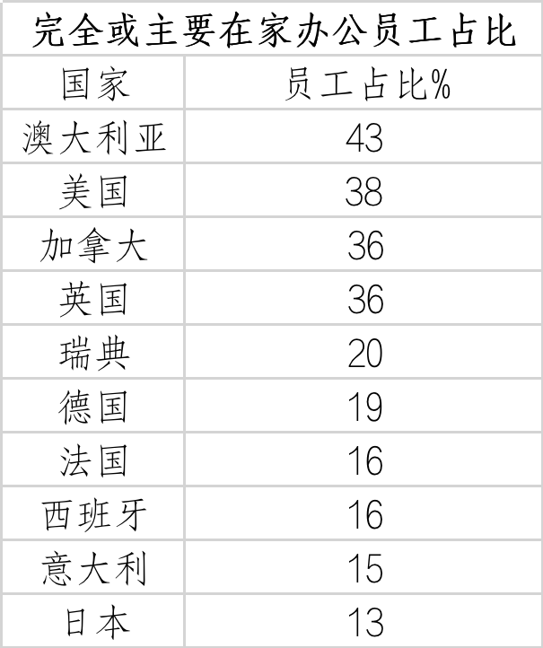
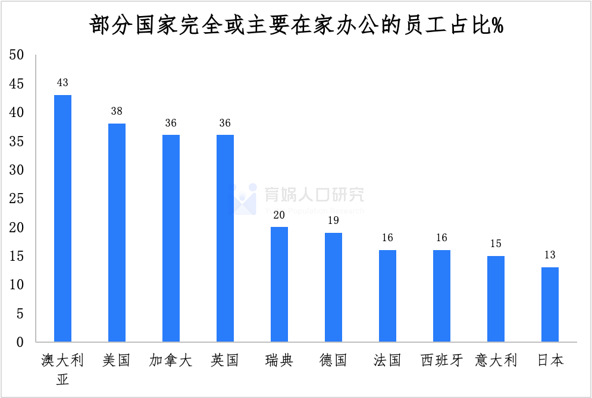

# 梁建章、任泽平等最新报告：推广远程居家办公，有利于提升中国生育率

育娲人口研究

2023/05

专家团队：梁建章，任泽平，黄文政，何亚福

**摘要**

本报告所称的远程办公，包括在家办公、异地办公、移动办公、混合办公等多种办公模式。根据YouGov
Cambridge在2021年8月至9月的调查数据，美国完全或主要在家办公员工占比为38%，英国为36%，日本只有13%。

远程办公的优点是：能够提升工作效率，节省办公室租金，节省通勤时间和费用，缓解交通拥堵、空气污染等城市病，也有助于企业在全国甚至全球范围内招聘合适的人才。从经济上来说，远程办公可以降低企业的部分负担，而为员工省下的费用和时间，终究也会投向消费领域，有助于促进内需。

多项调查结果显示，远程办公能提升员工的工作效率和满意度。携程的居家办公试验显示，居家办公的员工离职率下降了35%，而员工自我报告的工作满意度提升了。

本报告列举了国内外实行远程办公的几家典型公司：携程、脸书、谷歌、微软、Automattic和Spotify，其中前四家公司采用混合办公或不完全的远程办公方式，而Automattic公司采用完全的远程办公，Spotify则允许员工选择工作地点和办公模式。

未来，随着5G、云计算、物联网、工业机器人、人工智能、AR/VR、ChatGPT等技术的发展与普及，还将有大量工作岗位可以采用远程办公。

大量的员工居家办公带来的连锁效应会对城市中心造成巨大影响，城市中心的餐厅、零售业、公共交通以及写字楼的需求可能会降低。为了符合远程办公的新需求，更多近郊的房子会被开发出来。城市中心的人口密度降低，近郊副中心更加繁荣。

在家办公可以节省通勤费用和通勤时间，员工就会有更多的财力养育小孩，以及更多的时间陪伴小孩，也能更好地平衡家庭和工作，既可以在孩子童年的时候给予足够的关怀，不用担心因为工作无法顾及小孩或者占用太多的时间，也不影响个人的职业发展，一举两得。

远程居家办公是生育友好、家庭友好的灵活弹性办公方式，推广远程居家办公，在一定程度上有助于提高生育率，促进人口长期均衡发展。建议政府出台相关政策扶持和鼓励新兴产业的发展，创造出更多可以远程居家办公、灵活就业、弹性就业的工作岗位，并为劳动者提供相应指导和培训，以便他们能适应数字化时代发展下招聘的新趋势、新要求。推行远程办公，可以先从政府部门和国营企业开始。

**目录**

**1、全球远程办公现状**

**2、远程办公的优点和缺点**

**3、远程办公的效率和满意度调查**

**4、国内外实行远程办公的典型公司**

4.1 携程的远程办公实验

4.2 脸书的远程办公实验

4.3 谷歌的远程办公实验

4.4 微软的远程办公实验

4.5 采用完全远程办公的公司Automattic

4.6 允许员工选择工作地点和办公模式的公司Spotify

**5、哪些行业适合远程办公**

**6、远程办公对房价和城市化的影响**

**7、远程办公对生育率的影响**

**8、政策建议**

**正文**

**1、全球远程办公现状**

远程办公，是指通过现代互联网技术，实现非本地办公。本报告所称的远程办公，包括在家办公、异地办公、移动办公、混合办公等多种模式。

随着互联网技术中远程会议、协同工作软件的成熟，远程办公在技术上已经趋向成熟。移动互联网、4G网络和智能手机的普及，让每个人都具备了随时随地工作的能力。在线打卡、在线办公、共享文档、在线会议、在线招聘、视频面试等软件的广泛应用，更是增强了个人参与跨地域、跨时区团队在线协同合作的能力。

2020年新冠疫情的爆发客观上推动了远程居家办公的转型，全球掀起了一股远程办公的潮流。在疫情冲击之下，远程居家办公是经济体稳增长稳就业的重要途径之一。在封城、隔离等疫情防控政策之下，远程居家办公成为非常时期维持工作运转的主要选择，上网课和在线办公成为常态。脸书、微软、谷歌和苹果都把远程工作的模式常态化了，推出了不同的混合办公的制度。

一般来说，大公司比小公司更容易采用远程办公。根据Global Workplace
Analytics（美国一家新工作方式研究和咨询服务的公司）发布的“State of Remote Work
2022”的调查数据，41%的小公司（员工人数为10至50人）要求员工在工作日必须到公司上班；而只有27%的大型公司（员工人数在1万人以上）有这个要求。

表1是主要发达国家完全或主要在家办公（working from home the whole time or most of the
time）员工占比，数据来源：YouGov Cambridge，调查时间是2021年8月至9月。

**表1：主要发达国家完全或主要在家办公员工占比**

**图1：部分国家2021年完全或主要在家办公员工占比**

_资料来源：YouGov
Cambridge，调查时间是2021年8月至9月。_

表2是主要发达国家偶尔在家办公（working from home some of the time）员工占比，数据来源：YouGov
Cambridge，调查时间是2021年8月至9月。

**表2：主要发达国家偶尔在家办公员工占比**

**图2：部分国家2021年偶尔在家办公员工占比**

_数据来源：YouGov
Cambridge，调查时间是2021年8月至9月。_

2023年3月2日，中国互联网络信息中心（CNNIC）发布第51次《中国互联网络发展状况统计报告》显示，截至2022年12月，我国网民规模达10.67亿，互联网普及率达75.6%。2022年我国线上办公市场快速发展，吸引更多网民使用。截至2022年12月，我国线上办公用户规模达5.4亿，较2021年12月增长7078万，占网民整体的50.6%。

**2、远程办公的优点和缺点**

**远程办公能带来如下好处：**

第一，能够提升工作效率。斯坦福大学的Nicholas Bloom和芝加哥大学布斯商学院和胡佛研究所的Steven
J.Davis等人对超过3万名美国雇员的研究结果显示，远程办公使美国的生产率提高5%。斯坦福大学和携程合作进行的远程居家办公实验(Bloom et al.,
2015)也显示，在实验中远程居家办公的携程呼叫中心员工，工作效率提升了，离职率也降低了。

第二，站在企业的角度，如果有大批员工居家办公，那就不需要租用那么大的办公场地， **每年可以节省下一大笔租金以及水电费等支出，降低办公成本。**

第三，从员工的角度来说，居家办公可以节省上下班的通勤费用，这样人们可以保留更多的收入，使得居家办公相当于加薪，而无需公司改变任何人的薪水。

据美国《财富》杂志2021年9月的报道，LendingTree的最新分析显示，美国10大城市的全职上班族每年因为通勤上班平均损失5679美元。研究人员用不同城市的平均时薪乘以通勤所花费的时间，计算出上班族在通勤期间所牺牲的收入潜力。值得注意的是，LendingTree的计算并没有考虑到与通勤有关的直接成本，包括汽油、通行费、停车费和汽车维修维护费用等。

第四，居家办公节省了通勤时间，员工可以有更多的时间陪伴家人。职业女性可以更好地平衡家庭和职业发展，有更多的时间陪伴家人，爸爸也可以有更多的时间分担家务。所以在家办公可以减轻养育小孩的压力，提高生育意愿。

第五，对整个社会来说，远程办公可以降低出行人数，部分缓解交通拥堵、空气污染等都市顽疾。

第六，远程办公通过打破地理距离对工作的限制，赋予劳动者更多工作地点和工作时间上的自由度，也有助于企业在全国甚至全球范围内招聘合适的人才。

从经济上来说，远程办公可以降低企业的部分负担，而为员工省下的费用和时间，终究也会投向消费领域，有助于促进内需。如果每周不是需要5天连续前往办公室，那么员工每年就可以有多次规划“小长假”的机会，这对消费市场会是一个利好。

对宏观经济而言，远程办公为疫情冲击之下稳就业提供了韧性空间，增加了经济体应对负面冲击的能力。远程办公克服了常规通勤对工作的限制，增加了灵活就业、兼职就业、多样化就业的机会。

**远程办公也存在着一些缺点：**

第一，有些员工的家里缺少安静的办公环境（比如与子女或老人同住），缺少电脑等远程办公设备和宽敞的办公空间，在一定程度上影响了工作效率。

第二，居家办公模式模糊了上班与下班的界限，让许多员工处于24小时待命的状态，使员工感到工作压力增大。

第三，由于员工不再集中在一起，对于一些需要共同深入探讨的项目，仅仅依靠语音或者视频聊天，有时会让沟通效果打上一定的折扣，从而影响团队合作。公司文化氛围等团队建设方面的工作，在缺乏线下面对面的交流和聚会的情况下，会显得更加困难。

正因为存在着上述缺点，所以尽管“远程办公”很早就被视为未来的发展方向，全世界已有许多公司尤其是科技公司采用这种办公方式，但在中国，真正对此进行尝试的企业相对来说并不是很多。

另外，经济活动中有大量工作因为工作内容和性质的原因无法进行远程办公，必须在线下进行。例如，家政、保洁、餐饮、建筑业和制造业等行业和职位很难实施远程办公。

**3、远程办公的工作效率和满意度调查**

多项调查结果显示，远程办公能提升员工的工作效率和满意度。下面是一些例子：

2013年，梁建章教授曾与美国斯坦福大学商学院Nicholas Bloom, JohnRoberts, Zhichun Jenny
Ying等专家学者合作在经济学顶尖杂志《经济学季刊》（QJE，The Quarterly Journal of
Economics）上发表《在家办公的可行性：基于中国的试验证据》研究论文，研究结果显示，在家办公的员工业绩有显著的上升，在九个月里业绩增加了13%，其中的9%源于病事假的减少导致工作时间的增加，4%来自安静的工作环境导致工作效率的提高。而其余没有被选中的团队（即留在办公室工作的员工）绩效没有发生变化。另外，参与项目的员工们普遍反映，在家办公能保持更好的工作状态，并提高工作满意度。并且，在家办公员工的离职率下降了50%。

2021年8月起，携程启动“2021混合办公试验”，为期六个月，共有1612名员工参加了这项试验，其中，生日是奇数的员工列入试验组，周三和周五居家办公，其余工作日到公司上班；而生日是偶数的员工列入对照组，按照往常一样每个工作日都要到公司上班。这项试验的调研结果显示，居家办公的员工离职率下降了35%，而员工自我报告的工作满意度提升了。

2022年5月，北京大学国家发展研究院、智联招聘联合发布的《中国远程居家办公发展报告》显示，在经历过远程居家办公的回答者中，有 57%
的人对自己远程居家办公的经历更加满意，只有 5% 的回答者表示对常规上下班更满意，还有 38% 的回答者表示各有利弊。求职者认为远程居家办公好处的前三位是
“工作时间更加弹性灵活(比如可以自行分配工作和休息时间)”(占60%)、“节约了上班通勤成本”(占59%)、和“方便照顾家庭(比如照顾小孩老人，不用与家人两地分居)”(占46%)。

根据美国Buffer公司在2022年发布的调查报告“2022 State Of Remote
Work”，对远程办公的评价，61%的员工给予正面评价，29%的员工给予中性偏正面评价，9%的员工给予中性评价，1%的员工给予负面评价。

根据Global Workplace Analytics发布的“State of Remote Work
2022”的调查数据，在接受调查的各国员工中，愿意选择远程办公的员工占比为42%，愿意选择混合办公的员工占比为36%，只有22%的员工愿意选择每个工作日都去公司上班。

**4、国内外实行远程办公的典型公司**

**4.1 携程的远程办公实验**

携程是中国最大的在线旅游服务公司。早在2010年，携程曾在内部进行过远程办公的实验。研究结果显示，在家办公的员工业绩有显著的上升，在九个月里业绩增加了13%，源于病事假的减少导致有效工作时间的增加，以及安静的工作环境对于工作效率的提升。对于企业来说，全要素生产率因此提高了20%至30%，同时每年在每位在家办公的员工上节省了约1.4万元人民币的成本，包括办公地点租金的节省，以及员工工作效率的提升，还有员工离职率的降低。

实践表明，对于有些岗位来说，远程办公可以基本达到实地办公的水平。比如研发人员，只要居家办公能够满足基本的硬件条件，而且企业能够制定合理的目标作为考核标准，那么单独办公的效率，反而因其不受干扰可能要比实地办公时更出色。对于不需要面对面接待的客服人员比如呼叫中心的员工来说，只要能够稳定连接企业的网络，那么完全可以在家中回答和解决客户提出的各种问题。由于这些工作都有相应的记录，所以企业也就不必担心员工由于在家办公而变得心不在焉。

2022年2月，携程中国公司宣布全公司近3万名员工将实行混合办公制，允许员工每周三和周五在家远程办公。这是中国首家大型公司推出“3+2”的混合工作制。以携程为代表的中国的高科技公司正在积极尝试混合办公模式，取得了很好的效果，即不仅工作效率没有下降，而且还大幅提升了员工满意度。混合办公的社会效应也很明显，不仅减少了通勤的拥堵，还有利于环境保护、家庭和谐、缓解高房价和提高生育率。

之所以采取混合模式是因为有些沟通还是面对面更有效，但是很多工作可以在家里独立完成。所以最佳的方式是一部分时间在家里办公独立工作，另一部分时间在公司里和同事面对面完成，也就是所谓的混合办公模式。

**4.2 脸书的远程办公实验**

脸书（Facebook）是美国最大的社交网站之一，创建于2004年，是美国最早允许员工远程办公的大型科技公司之一。‍

2020年5月，Facebook首席执行官扎克伯格表示，在未来的5-10年，将会有多达一半的员工可以远程工作。扎克伯格称：“就我们这样规模的公司而言，我们将在远程工作领域中成为最超前的公司。”

Facebook还研发了一款名为“Horizon Workrooms” 的VR远程办公软件。在Horizon Workrooms
中，用户可通过VR眼镜使用虚拟形象参加线上会议，操作并分享电脑中的内容，充分模拟线下会议场景，减少远程办公者的孤独感，提高他们的参与感以及高沟通效率。

2021年6 月 10 日，Facebook
首席执行官扎克伯格宣布，如果员工的工作可以远程完成，公司将允许所有全职员工具备申请居家办公的资格。扎克伯格还进一步表示，Facebook
将允许员工跨国远程工作的请求。Facebook 的员工总数约为 6万人。

**4.3 谷歌的远程办公实验**

谷歌（Google）是全球最大的搜索引擎公司。2020年3月起，受新冠疫情影响，谷歌及其母公司Alphabet允许员工在家办公。

2021年5月，谷歌首席执行官桑德尔·皮查伊（Sundar
Pichai）在面向谷歌全体员工的一封电子邮件中表示，谷歌将进行混合工作周，办公室工作和远程办公并行。员工可以申请选择自己心仪的办公室地点或者考虑完全远程工作，报酬将会根据办公位置重新调整，不过申请需要所属主管的评估和批准。

根据谷歌的办公规则，有20%的员工可以申请永久在家工作外，60%的员工将在办公室里“一周工作几天”，另外20%的员工将可转移到该公司的其他地点工作。

谷歌的居家办公大大节省了公司的开支。谷歌发布的一份报告显示，2021年第一季度，谷歌母公司Alphabet在公司宣传、旅行、娱乐等方面的开支比2020年同期减少了2.68亿美元。如果按照年度来测算，谷歌上述费用一年的节省金额超过10亿美元。

**4.4 微软的远程办公实验**

微软（Microsoft）是美国最大的电脑软件公司。2020年10月，微软公司表示，为了给员工办公地点提供更大的灵活性，公司在内部发布了“灵活工作场所”指南。根据这一指南内容，微软公司允许员工每周有不超过一半的工作时间远程办公，在经过公司管理人员批准后，员工还可以选择永久性远程办公。微软表示，有关硬件实验室、数据中心和现场培训的职位仍需要到公司上班。

2022年10月，微软的一项调查发现，在远程工作究竟能否提高效率这个问题上，雇主和员工依然存在分歧。该公司的Work Trends
Study研究报告对11个国家/地区的2万多人进行调查后发现，87%的员工认为远程工作或者远程与办公室相结合的混合工作方式效率更高。与之相反的是，有85%的领导者认为，混合工作方式导致他们难以判断员工是否保持效率。

对此，微软CEO萨提亚·纳德拉（Satya Nadella）表示，企业应当通过数据来判断员工的表现，而不是想当然地认为他们在办公室里的效率一定更高。

2023年2月9日，微软旗下代码托管平台GitHub首席执行官Thomas
Dohmke在给员工的一封电子邮件中表示，GitHub将在未来一个季度裁员10%，并将在租约结束后腾出办公室，完全实现远程办公。

**4.5 采用完全远程办公的公司Automattic**

Automattic是美国的一家软件服务公司，也是 WordPress背后的母公司，该公司成立于2005年，由 WordPress 开源项目的联合创始人之一
Matt Mullenweg 创立。目前公司有2000多名员工，分布在全球近一百个国家和地区。2017 年 6 月，Automattic
关闭了位于旧金山的办公室，这也是这家公司当时唯一的办公室，原因是几乎所有员工都在家办公。从此以后，这家公司一直采用完全远程办公的方式。

在沟通协作上，Automattic 的内部交流都在网上进行，主要是依托于他们自主开发的交流协作工具 P2、视频会议软件 Zoom 以及团队协作工具
Slack。

在 Automattic，公司强调结果导向，理论上并不存在传统的上下级关系，所有的工作依靠项目组来进行。通常，每个项目组为 2-12
人，公司不存在传统的“项目经理”这一固定岗位，鼓励团队尝试新的工作组合、合作方式，以实际产出说话。

Matt Mullenweg 认为，远程办公之所以在 Automattic 能够完美运转，主要原因在于公司扁平的管理架构和 100%
的透明度。所有与工作相关的对话、文件、会议记录以及培训都是对全公司员工可见的，这样可以最大程度上避免远程交流造成的摩擦与误解。

Automattic 每年会组织一次为期一周的“大聚会”，让世界各地的员工聚集到一座城市，来增强凝聚力与协作感。

**4.6 允许员工选择工作地点和办公模式的公司Spotify**

Spotify 是一家在线音乐服务平台，2008 年在瑞典正式上线，目前已成为全球最大的音乐服务商之一。

2021年2月，Spotify
宣布将允许员工选择他们喜欢的工作地点。员工可以选择在办公室工作，抑或是大部分时间在家里或在世界上任何国家远程工作。Spotify 将这项计划称为 “Work
From Anywhere”，称其为 “一种新的合作方式，让 Spotify
员工可以在他们最擅长思考和创造的任何地方工作”，员工重返办公室的频率将由员工与其经理和团队决定。

Spotify实施这项远程办公模式一年后，公司首席人力资源官卡特里娜·伯格告诉《财富》杂志，该政策减少了人才流失，增加了公司的多元化。伯格表示，严格的现场办公规定意味着雇主与员工之间缺乏信任，这可能表明公司文化存在缺陷。“如果你决定信任员工，而且你用很长时间才网罗到优秀人才，你希望给他们好的待遇，他们也愿意一直支持你，那么在哪里办公并不重要。”

**5、哪些行业适合远程办公**

在国外，脸书、微软、谷歌和苹果等互联网公司已经推出了混合办公模式，将远程居家办公的选项变成了常态化机制。在国内，携程已经宣布实行混合办公制，允许员工每周三和周五在家远程居家办公，成为了国内首家推出“3+2”混合办公制度的大公司，为其他有类似条件的企业提供了很好的参照示范。

未来，随着5G、云计算、物联网、工业机器人、人工智能、AR/VR、ChatGPT等技术的发展与普及，还将有大量工作岗位可以采用远程办公。

目前来说，如下行业或职业比较适合远程办公：

程序员：越来越多的软件开发团队允许程序员在家办公，甚至有些团队是完全远程办公。例如，前面介绍的Automattic公司自创办之日起，所有员工都一直采用远程办公。

在线客服：居家客服将传统的客服现场集中办公，转变为可分布式居家办公模式。居家坐席人员只需要有手机和电脑，通过登录呼叫中心系统，便可以受理客户咨询。

文案编辑：像品牌营销、微信公众号、自媒体、新媒体等等，很多内容都和文案有关，只要拥有一台电脑，可以上网查资料，可以打字撰写文章，就可以通过在家办公实现。

视频剪辑：随着短视频的兴起，许多人热衷于刷视频。很多企业也借此宣传自己的品牌，为视频工作者提供了很多工作机会。即使只依靠手机剪辑软件，也能做出好看的视频作品。

此外，网络直播、翻译、设计、原画师等职业也适合采用远程办公方式。

根据智联招聘在2022年发布的《中国远程居家办公发展报告》，教培行业、互联网、数字化、单体化、知识型的行业占据远程居家办公招聘的主力位置。从城市角度来看，北上广深不出意外是远程居家办公招聘职位的主力发布城市。

**6、远程办公对房价和城市化的影响**

过去几十年中，大城市提供了众多的工作岗位，人们也纷纷涌入大城市。但远程办公有可能反转这种迁徙趋势。首先是不需要建那么多的办公楼了。由于城市里办公楼的需求大幅下降，租金也会大幅度下降，长远来说可以把闲置的办公楼改造成酒店、商住楼等其他用途。

城市中心区域的商务人士会减少，相关的一些消费如商务午餐、咖啡、甚至购物的消费会减少，商铺的租金会下降。好处是市中心地区不那么拥挤了，租金成本也会下降，会有更多的空间留给住宅和酒店等设施。市中心旅游和夜生活的需求还是无法被郊区取代的。

另一个直接的效果就是近郊住宅的需求大幅度增加。如果不需要去公司，或者一周内仅有两三天需要去公司，公司职员可能愿意住得远一些，近郊的住宅价格相对于市中心便宜，同样的房价或者租金可以有更宽敞的居住条件。同时远程办公也需要有安静的环境，比如一个独立的书房或者一个宽敞的带书桌的卧室，所以大户型会更受青睐。

如果一个城市平均每天有20%的人员采用远程办公，能够在一定程度上缓解通勤日的交通拥堵，车子少了增加了通勤效率，也会使得人们更愿意住在市郊。长此以往，近郊和市中心的房价总价可能越来越接近。为了符合远程办公的新需求，更多近郊的房子会被开发出来。城市中心的人口密度降低，近郊副中心更加繁荣。

根据麦肯锡全球研究院在2021年发布的报告，2020年，各主要城市办公室的空置率大幅提升：例如，旧金山提升了91%，爱丁堡45%，伦敦32%，柏林27%。与此同时，格拉斯哥和夏洛特等小城市的办公室空置率下降。部分公司正在讨论在小城市开设卫星办公室，一部分也是为了吸引当地人才。其他小城市则出台了激励计划，鼓励远程劳动力迁往当地。

远程办公不仅有利于大城市近郊的发展，可能一些小城市也会受益。如果实现完全远程办公，是否在大城市也就没有那么重要。小城市的员工一样可以在家为总部在大城市的公司工作。尤其是那些离大城市在2小时内高铁可达的小城市，例如一个实行“124”混合办公的上海公司员工，可以住在南通，然后周一和周四坐两个小时高铁到上海去办公就可以了。这可能进一步提高员工的满意度和忠诚度，因为小城市的生活成本尤其是住房成本，要比大城市低很多。

得益最大的是大城市郊的卫星城和大城市周边的小城市，相信会有更多的年轻人在这里成家立业。在这些城市，年轻人可以住得更宽敞，学校和其他公共配套设施也会越来越齐全。这些城市可能会成为在头部公司的员工愿意选择成家立业的居住地。这些小城市有更好的发展前景，有利于缓解大城市的房价和缓解地区间的差异。

中国大城市集中了中国最优秀的大企业，是很多大学生理想的就业地，但是中国大城市的房价却是世界上最高的，给年轻人造成了巨大的生活压力。解决这个困境的一个办法是推广远程办公，利用高速公路和高速铁路连接市中心和郊区以及周边小城市。因为每周也只要去公司两三天，员工可能愿意接受通勤时间在两个小时左右，就可以住在离大城市车程两小时的市郊，甚至是高铁两个小时左右的小城市。

如果在土地政策上，能借此机会加大大城市郊区和周边小城市的住房用地供给，在大城市的附近开发出大量的宽敞和宜居的住宅和与之配套的公共设施，那将带来新一轮的投资和建设，也是拉动经济增长的契机。

**7、远程办公对生育率的影响**

2022年中国的生育率不到1.1，仅相当于更替水平的一半左右。低生育率的最重要的原因是生育成本过高，其中育儿成本不仅是财务成本还有时间成本。远程在家办公对生育率的影响，可以从节省通勤费用和通勤时间来分析。

首先，在家办公可以节省通勤费用， **员工就会有更多的财力养育小孩** 。根据芝加哥大学哈里斯公共政策学院教授丹·布莱克(Dan A.
Black)等人在2013年发表的一篇研究论文，在其他条件同等的情况下，外源性的收入增长10%，会使出生率提高8%。

其次，在家办公可以节省通勤时间，员工就会有更多的时间陪伴小孩，也能更好地平衡家庭和工作，既可以在孩子童年的时候给予足够的关怀，不用担心因为工作无法顾及小孩或者占用太多的时间，也不影响个人的职业发展，一举两得。

2022年7月，由住房和城乡建设部城市交通基础设施监测与治理实验室、中国城市规划设计研究院、百度地图联合发布的《2022年中国主要城市通勤监测报告》显示，2021年，全国承受60分钟以上“极端通勤”的人口超过1400万人，长距离通勤已成为大城市普遍存在的现象。大量时间“耗在路上”，带来的直接影响就是工作日陪宝宝的时间减少。极端通勤带来的另一个影响是让上班族身心俱疲，从而压抑了育龄夫妇的生育意愿。

根据Global Workplace
Analytics在2022年的调查，46%的女性和39%的男性希望采用在家办公模式。女性比男性更愿意选择在家办公，是因为女性在养育孩子以及做家务方面比男性付出更多。

目前中国家庭养育孩子的时间成本和机会成本主要由女性承担，如果每个工作日都要去公司上班，她们就很难在抚养孩子的同时兼顾繁重的职场工作。

由于目前中国3岁以下的托儿服务严重缺乏（国家卫健委2021年的数据显示，0-3岁婴幼儿在我国各类托幼机构的入托率仅为5.5%），若缺少托儿所，夫妻双方很可能需要有一方暂停工作照看孩子，然而，越来越多的家庭需要依靠双份收入才能足够家庭开支。目前中国的社会环境对女性的生育也不够友好，女性生育孩子要付出的时间成本和机会成本过高，有些女性不得不放弃生育孩子，以换取在事业上取得成功的机会。

因此，一方面中国需要大力发展普惠性托幼服务，这将有利于减轻女性养育孩子的时间成本和机会成本；另一方面，对于有条件的企业，可实行弹性办公和在家办公，允许员工灵活地安排工作时间和地点，尤其是孕妇和哺乳期的女性可以在家办公，这样能更好地平衡家庭育儿和工作。另外，在家办公的男性员工也可以有更多的时间在家里陪伴小孩，替妻子分担家务和教育小孩的责任。

如果在家办公或混合办公模式能够在中国得到普遍推广，对于缓解育龄女性的焦虑、减轻压力会有一定的作用，提高育龄女性的生育意愿，有利于提升中国的整体生育率。

**8、政策建议**

2020年7月15日，国家发改委等13部门发布《关于支持新业态新模式健康发展，激活消费市场带动扩大就业的意见》，文件指出，鼓励发展便捷化线上办公，要打造“随时随地”的在线办公环境，在部分行业领域形成对线下模式的常态化补充。推动完善电子合同、电子发票、电子印章、电子签名、电子认证等数字应用的基础设施。

中共中央、国务院在2021年7月发布的文件《关于优化生育政策促进人口长期均衡发展的决定》中指出，“将生育友好作为用人单位承担社会责任的重要方面，鼓励用人单位制定有利于职工平衡工作和家庭关系的措施，依法协商确定有利于照顾婴幼儿的灵活休假和弹性工作方式。”远程居家办公是生育友好、家庭友好的灵活弹性办公方式，推广远程居家办公，在一定程度上有助于提高生育率，促进人口长期均衡发展。

因此，建议政府出台相关政策扶持和鼓励新兴产业的发展，创造出更多可以远程居家办公、灵活就业、弹性就业的工作岗位，并为劳动者提供相应指导和培训，以便他们能适应数字化时代发展下招聘的新趋势、新要求。

远程办公也有助于低碳减排和双碳政策的实现。因此，推行远程办公，可以先从政府部门和国营企业开始。

当然，政府不必强制企业推行远程办公，而且有些行业（例如制造业）并不适合远程办公，但可以对适合远程办公的行业进行引导，比如鼓励发展更多为远程办公提供软硬件服务的产业，又比如对大面积推广远程办公的企业给予优惠政策。

**参考文献：**

[1]
第51次《中国互联网络发展状况统计报告》：https://www.cnii.com.cn/rmydb/202303/t20230314_454596.html

[2] YouGov Cambridge The Globalism
Project：https://docs.cdn.yougov.com/ewgl6ikltk/YouGov%20Cambridge%20-%20Globalism%202021%20-%20OMGLOB131%20WORKING%20FROM%20HOME.pdf

[3] State Of Remote Work 2022：https://globalworkplaceanalytics.com/

[4] Mckinsey Global Institute: The future of work after
COVID-19：https://www.mckinsey.com/featured-insights/future-of-work/the-future-
of-work-after-covid-19

[5] 智联招聘、北大国发院：《中国远程居家办公发展报告》http://www.100ec.cn/index/detail--6613405.html

[6] Nicholas Bloom：How working from home works out

https://siepr.stanford.edu/publications/policy-brief/how-working-home-works-
out

[7] 梁建章.携程率先推广混合办公模式意义重大https://mp.weixin.qq.com/s/sMoPBWrd_USZoEgWpjAePg

[8] Nicholas Bloom, Ruobing Han , James Liang : How Hybrid Working From Home
Works out: http://www.nber.org/papers/w30292

